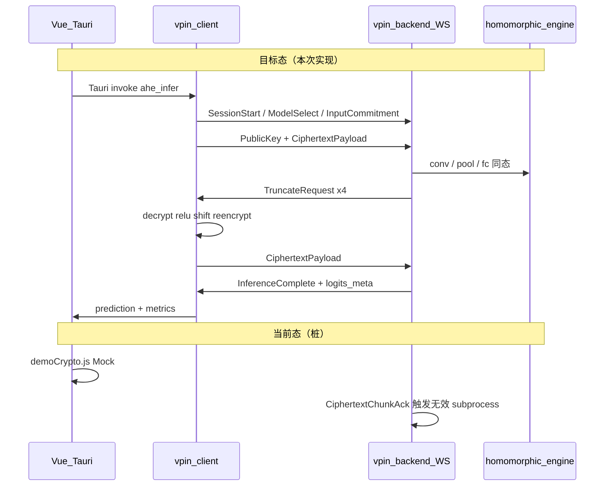
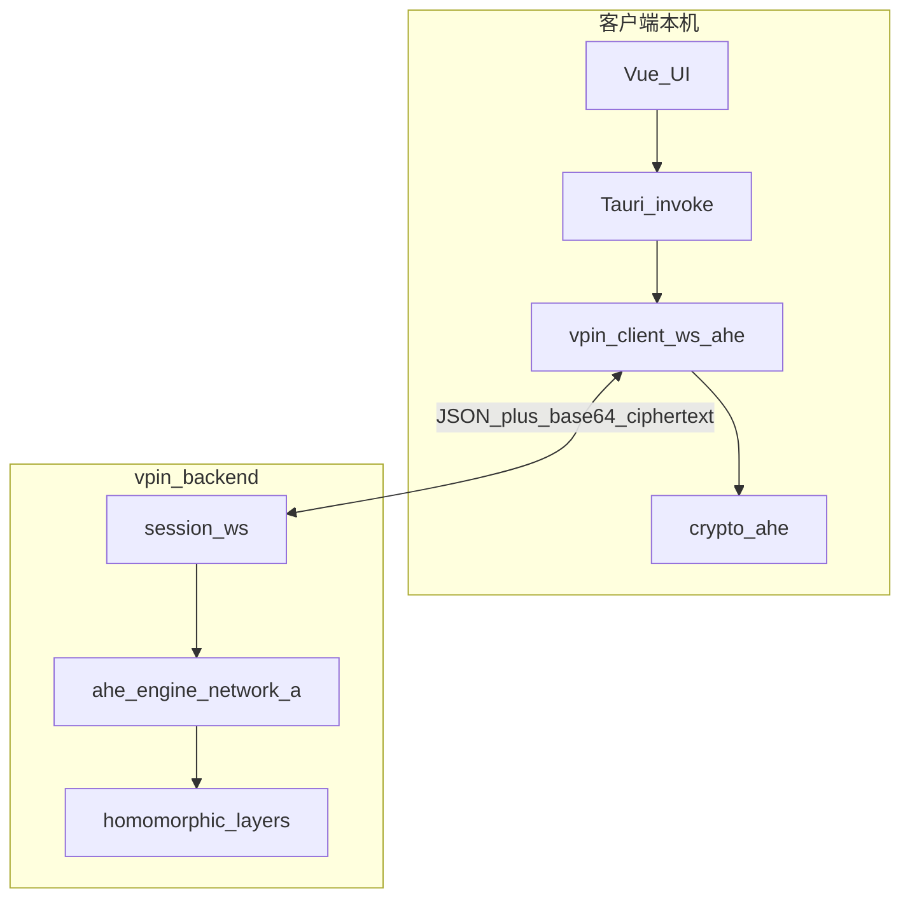

# AHE 客户端-服务端推理全流程实施计划

## 现状与目标差距



| 层级 | 已有 | 缺失 |
|------|------|------|
| AHE 原语 | [`vpin_client/crypto/ahe/`](vpin-client/vpin_client/crypto/ahe/)、[`vpin_backend/crypto/ahe/`](vpin-backend/vpin_backend/crypto/ahe/) | 客户端缺 `decrypt_tensor`；[`topology.py`](vpin-backend/vpin_backend/crypto/ahe/topology.py) **与 legacy Network A 不一致**（池化应为 4×4 stride 4；FC 应为 64→16→10） |
| WS 协议 | [`session.py`](vpin-backend/vpin_backend/api/routes/session.py) P0–P6 骨架 | P3 无密文收发；仅 1 次错误 `TruncateRequest`；[`engine.py`](vpin-backend/vpin_backend/inference/engine.py) 调用 `Server.inferenceCNN(network)` **签名不匹配** |
| 同态 CNN | legacy [`Server.py`](src/cnn_networks/Server.py) 完整 | 未迁入 `vpin_backend/inference/` |
| 前端 | Mock UI | 无 REST/WS；三套 localStorage 未统一 |
| 数据 | 无 `image_mnist_*.npy`；`Pre_trained_model/` 空 | 需下载 MNIST + 从 [`full_weights.json`](src/cp-snark-full/model_exports/A/full_weights.json) 还原权重 npy |

**用户确认范围**：Tauri 调用本地 Python `vpin-client`；仅 **Network A**；**不启用 CP-SNARK**（P4–P6 跳过，但消息类型保留）。

---

## 架构总览



**模块边界（为后续证明接入预留）**：
- `crypto/ahe/` — 仅指数 ElGamal 数学
- `inference/ahe_engine.py` — 同态 CNN 编排（从 `Server.py` 抽取，**不含** `rLCL/rLCR`）
- `protocol/ws_ahe_client.py` — 会话驱动；证明关闭时在 `InferenceComplete` 结束
- `verify/` — 本次不调用；UI 勾选 CP-SNARK 时显示「下一阶段接入」

---

## 阶段 1：数据与模型工件

### 1.1 MNIST 下载与预处理

新增 [`scripts/prepare_mnist_network_a.py`](scripts/prepare_mnist_network_a.py)：

- `torchvision.datasets.MNIST` 下载到 `vpin-backend/data/mnist/raw/`
- 预处理对齐 legacy [`Client.py`](src/cnn_networks/Client.py)：
  - 28×28 → 居中 pad 到 **32×32**（`(1,1,32,32)`）
  - **min-max 缩放**到 `[0.001, 0.9999999]`（非 torchvision Normalize）
  - 定点 `f=16` 导出可选 `.npy` 缓存
- 输出：`vpin-backend/data/mnist/test_images.npy`、`test_labels.npy`、`manifest.json`

### 1.2 Network A 权重还原

仓库内 [`full_weights.json`](src/cp-snark-full/model_exports/A/full_weights.json) 含 1219 维 W*；`Pre_trained_model/*.npy` 当前缺失。

新增 [`scripts/restore_network_a_weights.py`](scripts/restore_network_a_weights.py)：

- 从 `full_weights.json` 拆回：
  - 卷积核 `[[1,0,1],[2,0,2],[1,0,1]]`（固定，不来自 json）
  - `weight_fc1_64_16.npy`、`bias_fc1_16.npy`、`weight_fc2_16_10.npy`、`bias_fc2_10.npy`
- 写入 [`src/cnn_networks/Pre_trained_model/`](src/cnn_networks/Pre_trained_model/)
- 注册到 [`vpin-backend/data/models/registry.json`](vpin-backend/data/models/registry.json)（`server_admin register` 或脚本内 upsert）

### 1.3 准确率评估基准

新增 [`vpin-client/vpin_client/eval/plaintext_reference.py`](vpin-client/vpin_client/eval/plaintext_reference.py)：

- 用相同拓扑 + 权重 + 预处理跑 **明文定点推理**（含 shifting 位宽 26/32）
- 作为 AHE 路径 argmax 对照；期望 **单样本预测一致、测试集准确率合理**（与权重质量相关，通常应显著高于随机 10%）

---

## 阶段 2：服务端同态推理引擎

### 2.1 修正拓扑常量

更新 [`vpin-backend/vpin_backend/crypto/ahe/topology.py`](vpin-backend/vpin_backend/crypto/ahe/topology.py)：

```python
# Network A（version=1）对齐 Server.py KERNEL_STRIDE[1]=(4,4)
pools=(PoolSpec(4, 4, 4),)
fcs=(FcSpec(64, 16), FcSpec(16, 10))
```

补充 `TruncationPlan` 四阶段定义（供 `ModelCommitment` 下发）。

### 2.2 从 Server.py 抽取同态层

新增 [`vpin-backend/vpin_backend/inference/homomorphic_network_a.py`](vpin-backend/vpin_backend/inference/homomorphic_network_a.py)：

- 迁移（保持算法一致，去掉 socket/pickle/`rLCL`/`rLCR`）：
  - `conv2_ciphertext` / `myConv2d`
  - `avgPool_ciphertext` / `flatten`
  - `FC1` / `FC2` / `encryptBias` / `FCLayer`
- 依赖 `vpin_backend.crypto.ahe.*` 做点运算
- 模型加载：`load_network_a_weights()` → `Pre_trained_model/`

### 2.3 会话级推理状态机

新增 [`vpin-backend/vpin_backend/inference/ahe_engine.py`](vpin-backend/vpin_backend/inference/ahe_engine.py)：

```text
状态: INIT → CONV_DONE → POOL_DONE → FC1_DONE → FC2_DONE
每步: 执行同态层 → 发出 TruncateRequest → 等待 CiphertextPayload → 进入下一步
```

四轮 `TruncateRequest`（对齐 legacy）：

| phase_id | 服务端输出后 | client_action | shift_bits | shape |
|----------|-------------|---------------|------------|-------|
| after_conv | Conv | relu | — | [1,1,32,32] |
| after_pool | Pool+Flatten | shift | 26 | [1,64] |
| after_fc1 | FC1 | relu_then_shift | 32 | [1,16] |
| after_fc2 | FC2 | relu_only | — | [1,10] |

### 2.4 扩展协议消息

更新 [`vpin-backend/vpin_backend/protocol/messages.py`](vpin-backend/vpin_backend/protocol/messages.py)（client 同步）：

- `CiphertextPayload`：`phase_id`, `tensor_part`(`c1`|`c2`), `chunk_index`, `total_chunks`, `data_b64`（pickle ndarray of EC Points，保留 30KB 分块思想）
- `TruncateRequest` 增加 `client_action`, `shift_bits`
- `InferenceComplete` 增加 `logits_fixed_hex` 或 `prediction`（可选，供 UI 展示；客户端仍以本地解密为准）
- `SessionStart` 增加 `enable_proof: bool = false`

### 2.5 重写 WebSocket 路由

重构 [`vpin-backend/vpin_backend/api/routes/session.py`](vpin-backend/vpin_backend/api/routes/session.py)：

- `PublicKey`：保存 `h`、曲线参数，初始化 `AheEngine`
- 接收 `CiphertextPayload`：组包 → 驱动引擎当前步
- `enable_proof=false` 时：`InferenceComplete` 后 **不等待** `ClientChallenge`，发送 `SessionEnd` 并关闭
- `enable_proof=true`：保留现有 P4–P6 路径（本次 UI 默认不走）
- **删除**对 [`run_inference_subprocess`](vpin-backend/vpin_backend/inference/engine.py) 的错误依赖（witness 导出可后续由 `VPIN_EXPORT_WITNESS=1` 可选触发）

---

## 阶段 3：客户端 WS + AHE 驱动

### 3.1 补齐密码学能力

- 将 [`decrypt_tensor`](vpin-backend/vpin_backend/crypto/ahe/codec.py) 移植到 [`vpin-client/vpin_client/crypto/ahe/codec.py`](vpin-client/vpin_client/crypto/ahe/codec.py)
- 新增 [`vpin_client/data/preprocess.py`](vpin-client/vpin_client/data/preprocess.py)：`load_image_file` / `prepare_mnist_tensor`
- 新增 [`vpin_client/protocol/ciphertext_wire.py`](vpin-client/vpin_client/protocol/ciphertext_wire.py)：分块 pickle 编解码（与 legacy chunk size 30000 一致）

### 3.2 WS 会话客户端

新增 [`vpin-client/vpin_client/protocol/ws_ahe_client.py`](vpin-client/vpin_client/protocol/ws_ahe_client.py)：

```python
async def run_ahe_session(
    backend_ws: str,
    model_id: str,
    image: np.ndarray,
    *,
    enable_proof: bool = False,
) -> AheSessionResult:
    # key_gen → SessionStart → ModelSelect → InputCommitment(cm_x=hash)
    # → encrypt → PublicKey → 循环处理 TruncateRequest
    # → 本地 decrypt/relu/shifting/re-encrypt → 最终 argmax
```

`InputCommitment.cm_x`：MVP 用 SHA256(定点明文 flatten) 的 Pedersen 占位或 digest 字段（与后续证明对齐）。

### 3.3 CLI 入口（Tauri 调用）

扩展 [`vpin-client/vpin_client/cli.py`](vpin-client/vpin_client/cli.py)：

```bash
python -m vpin_client ahe-infer \
  --backend ws://127.0.0.1:8000/api/v1/session/ws \
  --model cnn-mnist \
  --image path/to.png \
  --no-proof \
  --json-out result.json
```

新增批量评估：

```bash
python -m vpin_client eval-mnist-ahe --limit 100 --backend ...
```

---

## 阶段 4：前端 + Tauri 集成

### 4.1 API 层

新增 [`vpin_frontend/vpin-frontend/src/services/vpinApi.js`](vpin_frontend/vpin-frontend/src/services/vpinApi.js)：

- `GET /api/v1/health`、`GET /api/v1/models`
- `vite.config.js` 增加 dev proxy → `http://127.0.0.1:8000`

### 4.2 统一协议状态

- 扩展 [`useProtocolSession.js`](vpin_frontend/vpin-frontend/src/composables/useProtocolSession.js)：`enableProof`、`aheSessionResult`、`connectionStatus`
- 读取 `data-config.html` 的 `vpinPrivacyProtocols` 或迁移为 Vue 组件 `PrivacyProtocolPanel.vue`（AHE 默认开，CP-SNARK 默认关）

### 4.3 推理向导页

新增/改造 [`AheInferenceWizardView.vue`](vpin_frontend/vpin-frontend/src/views/AheInferenceWizardView.vue)（或增强 `/tasks/new` 流程）：

1. Setup 检查（AHE 就绪、BSGS 表路径提示）
2. 模型选择（`cnn-mnist` ← `GET /models`）
3. 图像上传 / MNIST 样例
4. 隐私协议：☑ AHE / ☐ CP-SNARK
5. 「开始密态推理」→ 调用 Tauri
6. 展示：`ProtocolProgressBar` 阶段、预测数字、耗时、密文摘要

### 4.4 Tauri 桥接

更新 [`src-tauri/src/lib.rs`](vpin_frontend/vpin-frontend/src-tauri/src/lib.rs)：

```rust
#[tauri::command]
async fn run_ahe_inference(opts: AheInferOpts) -> Result<String, String> {
    // 定位 vpin-client venv/python
    // Command::new(python).args(["-m","vpin_client","ahe-infer", ...])
    // 返回 JSON stdout
}
```

`HomeView.vue`：Setup 改为检测 BSGS 表存在性 + 调用 `ahe-infer --self-test`（可新增子命令）替代 Mock 密钥。

---

## 阶段 5：测试与验收

| 测试 | 路径 | 验收标准 |
|------|------|----------|
| AHE 单元 | 现有 `test_ahe.py` | 加解密、同态加、shifting 通过 |
| WS 集成 | `vpin-backend/tests/test_ahe_ws_network_a.py` | 假密文或 headless client 走完 4 轮 |
| CLI E2E | `vpin-client ahe-infer` 单图 | 返回 digit 0–9 |
| 准确率 | `eval-mnist-ahe --limit 100` | AHE argmax 与 plaintext_reference **一致率 ≥99%**；整体准确率 **合理**（若权重为论文预训练，应远高于 10%） |
| UI E2E | Tauri 向导单图推理 | 进度条走完 P3，显示预测结果 |

**阻塞项处理**：若 `table.pickle` 缺失，文档中写明从 `src/Pre_computed_table/` 获取或生成；运行前 `GET /health` 检查。

---

## 阶段 6：完整文档

新增 [`docs/ahe-e2e-实现说明.md`](docs/ahe-e2e-实现说明.md)，包含：

1. **架构图**（UI / Tauri / vpin-client / vpin-backend 职责）
2. **Network A 拓扑与张量形状表**
3. **MNIST 预处理公式**（pad、min-max、定点 f=16）
4. **四轮截断算法**（`shifting(bits)` 与 `activation.py` 对应关系）
5. **WebSocket 消息序列**（含 JSON 字段示例；`enable_proof=false` 短路径）
6. **密文线格式**（分块 pickle、Point 序列化）
7. **部署与运行命令**（backend uvicorn、frontend dev、Tauri、数据准备脚本）
8. **准确率评估方法**（明文对照 + 批量测试）
9. **与 CP-SNARK 的接入点**（P4–P6、`enable_proof` 开关、模块边界）
10. **已知限制**（仅 Network A；`cm_x` MVP 为哈希占位；witness 导出可选）

更新 [`README.md`](README.md) 增加「AHE E2E 快速开始」小节指向该文档。

---

## 实施顺序建议

1. 数据脚本 + 权重还原（无此步无法验证准确率）
2. 服务端 `homomorphic_network_a` + `ahe_engine` + WS 重构
3. 客户端 `ws_ahe_client` + CLI（先 headless 跑通）
4. `eval-mnist-ahe` 批量验证
5. 前端 API + Tauri + 向导 UI
6. 文档定稿

## 关键风险

- **`topology.py` 错误**：必须先修正，否则池化/FC 维度与 legacy 不一致导致推理失败
- **权重缺失**：必须从 `full_weights.json` 还原或提供官方 `Pre_trained_model` 压缩包
- **推理耗时**：单张图全张量逐元素 ElGamal 解密/加密较慢；文档说明预期耗时，批量测试默认 `--limit 100` 可配置
- **BSGS 表体积**：仅客户端需要；Tauri 需配置 `VPIN_BSGS_TABLE` 环境变量

