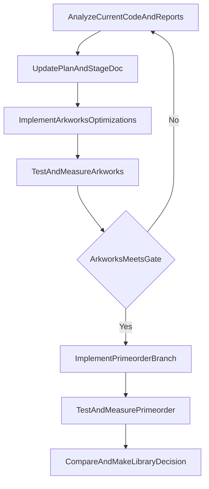

# AHE Rust优化提速计划（先优化 arkworks，再独立 primeorder）

## 1. 目标与硬约束

- 目标顺序固定：**先优化 arkworks 用法**，再做**独立 `elliptic-curve + primeorder` 分线**。
- Python 侧严格只读：不修改 [d:/WorkStation/pythoncode/experiment-reproduction/vPIN-main/vpin-backend](d:/WorkStation/pythoncode/experiment-reproduction/vPIN-main/vpin-backend)、[d:/WorkStation/pythoncode/experiment-reproduction/vPIN-main/vpin-client](d:/WorkStation/pythoncode/experiment-reproduction/vPIN-main/vpin-client)、[d:/WorkStation/pythoncode/experiment-reproduction/vPIN-main/vpin_frontend](d:/WorkStation/pythoncode/experiment-reproduction/vPIN-main/vpin_frontend) 代码与模型数据。
- 所有开发改动仅在 [d:/WorkStation/pythoncode/experiment-reproduction/vpin-platform](d:/WorkStation/pythoncode/experiment-reproduction/vpin-platform)。
- 统一验收口径：单图 `mnist_index=0`；批量 `limit=10, concurrency=4`（另保留 `concurrency=1` 回归对照）。
- 目标性能：在正确性不退化前提下，逐步逼近并超过 Python；单图总时间尽量压到 **10s 内**。

## 2. 基线与度量体系（先做）

- 基线文档与结果统一写入：[d:/WorkStation/pythoncode/experiment-reproduction/vpin-platform/docs/ahe/ahe-rust-迁移加速评估.md](d:/WorkStation/pythoncode/experiment-reproduction/vpin-platform/docs/ahe/ahe-rust-迁移加速评估.md)。
- 报告字段必须覆盖：
  - 单图：`preprocess_ms`、`encrypt_ms`、`decrypt_ms`、`network_ms`、`ws_ms`、`total_ms`
  - 批量：`elapsed_s`、每样本 `crypto_infer_ms`、并发度、吞吐（img/s）
  - 正确性：`acc`、错分样本索引、logits 对照摘要
- 对照报告固定两套：
  - arkworks 优化前后
  - primeorder 分线 vs arkworks

## 3. 双轨工作流

## 4. 阶段 A：arkworks 主线优化（必须先完成）

### A0. 可观测性与基线固化

- 在 [d:/WorkStation/pythoncode/experiment-reproduction/vpin-platform/apps/ahe-cli/src/main.rs](d:/WorkStation/pythoncode/experiment-reproduction/vpin-platform/apps/ahe-cli/src/main.rs) 和 [d:/WorkStation/pythoncode/experiment-reproduction/vpin-platform/crates/ahe-client/src/session.rs](d:/WorkStation/pythoncode/experiment-reproduction/vpin-platform/crates/ahe-client/src/session.rs) 补齐阶段化计时输出。
- 固化 `c=1` 与 `c=4` 两组 Rust 基线报告并入文档。

### A1. P0 高收益修复（先拿量级收益）

- 修复 `run_batch()` 每样本重复加载 BSGS（当前在 [d:/WorkStation/pythoncode/experiment-reproduction/vpin-platform/apps/ahe-cli/src/main.rs](d:/WorkStation/pythoncode/experiment-reproduction/vpin-platform/apps/ahe-cli/src/main.rs)）。
- 改为进程内共享 `BsgsTable`，去除无效重复解析。

### A2. P1 算子级并行与热路径优化

- 在 [d:/WorkStation/pythoncode/experiment-reproduction/vpin-platform/crates/ahe-codec/src/codec.rs](d:/WorkStation/pythoncode/experiment-reproduction/vpin-platform/crates/ahe-codec/src/codec.rs) 为 `encrypt_tensor/decrypt_tensor` 增加 `rayon` 并行路径。
- 在 [d:/WorkStation/pythoncode/experiment-reproduction/vpin-platform/crates/ahe-crypto-e2/src/point.rs](d:/WorkStation/pythoncode/experiment-reproduction/vpin-platform/crates/ahe-crypto-e2/src/point.rs) 优化 `E2Point` 热路径，减少 affine/projective 往返。

### A3. P2 BSGS 热循环与结构优化

- 在 [d:/WorkStation/pythoncode/experiment-reproduction/vpin-platform/crates/ahe-codec/src/bsgs.rs](d:/WorkStation/pythoncode/experiment-reproduction/vpin-platform/crates/ahe-codec/src/bsgs.rs) 优化 `giant_step` 热循环（减少重复计算/拷贝/查表开销）。
- 必要时补充更 cache-friendly 的 lookup 方案（保持语义不变）。

### A4. 主线验收门禁

- 正确性门禁：`cargo test --workspace` 通过；`e2_parity` 通过；`acc` 不低于当前基线。
- 性能门禁：
  - `c=1` 明显优于当前 Rust 基线
  - `c=4` 相比 `c=1` 有可解释的并发收益
  - 单图时间持续向 10s 目标收敛

## 5. 阶段 B：primeorder 独立分线（与主线隔离）

### B1. 分线结构与边界

- 新增独立 crate（建议）：`crates/ahe-crypto-e2-primeorder`。
- 不替换现有 [d:/WorkStation/pythoncode/experiment-reproduction/vpin-platform/crates/ahe-crypto-e2](d:/WorkStation/pythoncode/experiment-reproduction/vpin-platform/crates/ahe-crypto-e2)，不在主线启用 feature 混编。
- 目标是“可并行比较”，不是立即替换。

### B2. 最小闭环里程碑

- M1：点加/标量乘/坐标序列化，对齐 [d:/WorkStation/pythoncode/experiment-reproduction/vpin-platform/tests/fixtures/e2_vectors.json](d:/WorkStation/pythoncode/experiment-reproduction/vpin-platform/tests/fixtures/e2_vectors.json)。
- M2：接入 ElGamal 核心（`encrypt_scalar_with_r/decrypt_pair`）并对齐 parity。
- M3：建立同口径微基准，与 arkworks 优化后版本 A/B。

### B3. 分线风险控制

- 明确验证自定义曲线参数支持、identity 语义、坐标编码一致性。
- 任何分线失败不阻塞 arkworks 主线交付。

## 6. 切库决策规则（最终）

- 仅当满足以下条件才考虑切到 primeorder：
  - arkworks 优化后仍显著不达标；
  - primeorder 在同口径微基准和端到端上稳定优于 arkworks；
  - 正确性与维护成本可接受。
- 否则保留 arkworks 主线，primeorder 分线作为备选参考实现。

## 7. 持续迭代规范（保留你的 loop）

- 每轮固定执行：
  1. 分析代码与最新报告
  2. 引入必要新思路（本地与网络资料，仅用于优化方案）
  3. 更新阶段文档与计划
  4. 实施编码与测试
  5. 对照目标验收并记录
  6. 未达标则进入下一轮
- 所有关键结论必须沉淀进文档，避免会话记忆丢失。

## 8. 执行级任务拆解（按 todo 顺序）

### 8.1 `baseline-and-instrument`（预计 0.5 天）
- 改动文件：
  - [d:/WorkStation/pythoncode/experiment-reproduction/vpin-platform/crates/ahe-client/src/session.rs](d:/WorkStation/pythoncode/experiment-reproduction/vpin-platform/crates/ahe-client/src/session.rs)
  - [d:/WorkStation/pythoncode/experiment-reproduction/vpin-platform/apps/ahe-cli/src/main.rs](d:/WorkStation/pythoncode/experiment-reproduction/vpin-platform/apps/ahe-cli/src/main.rs)
- 交付内容：
  - 单图输出 `preprocess_ms/encrypt_ms/decrypt_ms/network_ms/ws_ms/total_ms`
  - 批量输出 `elapsed_s`、每样本 `crypto_infer_ms`、`img_per_s`
- 验证命令：
  - `cargo test --workspace`
  - `cargo run -p ahe-cli -- infer --model cnn-mnist-trained --mnist-index 0`
  - `cargo run -p ahe-cli -- eval-mnist-ahe --limit 10 --concurrency 1 --progress`
  - `cargo run -p ahe-cli -- eval-mnist-ahe --limit 10 --concurrency 4 --progress`
- 通过条件：
  - 计时字段完整，协议行为与正确率不变。

### 8.2 `ark-p0-bsgs-reuse`（预计 0.5 天）
- 改动文件：
  - [d:/WorkStation/pythoncode/experiment-reproduction/vpin-platform/apps/ahe-cli/src/main.rs](d:/WorkStation/pythoncode/experiment-reproduction/vpin-platform/apps/ahe-cli/src/main.rs)
- 交付内容：
  - 移除每样本 `load_bsgs`，改为批量入口单次加载并共享复用。
- 验证命令：
  - `cargo test --workspace`
  - 批量跑 `c=1`、`c=4` 并确认 `acc` 不退化。
- 通过条件：
  - `acc` 维持基线；批量 `elapsed_s` 显著下降。

### 8.3 `ark-p1-parallel-codec`（预计 1-1.5 天）
- 改动文件：
  - [d:/WorkStation/pythoncode/experiment-reproduction/vpin-platform/crates/ahe-codec/src/codec.rs](d:/WorkStation/pythoncode/experiment-reproduction/vpin-platform/crates/ahe-codec/src/codec.rs)
- 交付内容：
  - 为 `encrypt_tensor/decrypt_tensor` 增加并行路径（带阈值与串行回退）。
- 验证命令：
  - `cargo test --workspace`
  - 单图/批量 `c=1`、`c=4` 回归对照。
- 通过条件：
  - 结果一致；`c=4` 吞吐优于 `c=1`。

### 8.4 `ark-p1-point-hotpath`（预计 1-2 天）
- 改动文件：
  - [d:/WorkStation/pythoncode/experiment-reproduction/vpin-platform/crates/ahe-crypto-e2/src/point.rs](d:/WorkStation/pythoncode/experiment-reproduction/vpin-platform/crates/ahe-crypto-e2/src/point.rs)
  - [d:/WorkStation/pythoncode/experiment-reproduction/vpin-platform/crates/ahe-crypto-e2/src/curve.rs](d:/WorkStation/pythoncode/experiment-reproduction/vpin-platform/crates/ahe-crypto-e2/src/curve.rs)
- 交付内容：
  - 减少热路径 affine/projective/bytes 往返转换开销。
- 验证命令：
  - `cargo test --workspace`
  - `cargo test -p ahe-codec --test e2_parity`
- 通过条件：
  - parity 通过；单图 crypto 时间继续下降。

### 8.5 `ark-p2-bsgs-hotloop`（预计 1 天）
- 改动文件：
  - [d:/WorkStation/pythoncode/experiment-reproduction/vpin-platform/crates/ahe-codec/src/bsgs.rs](d:/WorkStation/pythoncode/experiment-reproduction/vpin-platform/crates/ahe-codec/src/bsgs.rs)
- 交付内容：
  - 优化 `giant_step` 热循环中的重复计算与对象开销。
- 验证命令：
  - `cargo test --workspace`
  - 单图/批量计时对照。
- 通过条件：
  - 解密阶段耗时可量化下降。

### 8.6 `ark-p2-benchmark`（预计 0.5 天）
- 改动文件：
  - `vpin-platform` 下新增 benchmark 或统计脚本
  - [d:/WorkStation/pythoncode/experiment-reproduction/vpin-platform/docs/ahe/ahe-rust-迁移加速评估.md](d:/WorkStation/pythoncode/experiment-reproduction/vpin-platform/docs/ahe/ahe-rust-迁移加速评估.md)
- 交付内容：
  - arkworks 优化前后完整对照报告（单图 + 批量）。
- 通过条件：
  - 报告可复现实验命令与结果。

### 8.7 `primeorder-m1-crate`（预计 1 天）
- 改动文件：
  - 新增 `crates/ahe-crypto-e2-primeorder`
  - [d:/WorkStation/pythoncode/experiment-reproduction/vpin-platform/Cargo.toml](d:/WorkStation/pythoncode/experiment-reproduction/vpin-platform/Cargo.toml)（仅新增 member）
- 交付内容：
  - 分线实现点加/标量乘/坐标序列化，对齐 `e2_vectors`。
- 通过条件：
  - 分线 crate 测试通过，不影响主线编译。

### 8.8 `primeorder-m2-codec`（预计 1 天）
- 改动文件：
  - 分线 crate 内新增 ElGamal 最小闭环代码与测试
- 交付内容：
  - `encrypt_scalar_with_r/decrypt_pair` 对齐 parity + BSGS。
- 通过条件：
  - 分线 parity 全绿，输出与基线一致。

### 8.9 `primeorder-m3-compare`（预计 0.5-1 天）
- 改动文件：
  - 新增同口径对照基准入口（主线不切换）
- 交付内容：
  - arkworks vs primeorder 基准数据与结论草案。
- 通过条件：
  - 数据可复现、结论可解释。

### 8.10 `ab-compare-decision`（预计 0.5 天）
- 交付内容：
  - 最终建议：保留 arkworks / 切换 primeorder / 双栈并存。
  - 依据：性能、正确性、复杂度、维护风险。

## 9. 阶段门禁（逐关推进）

- G0（观测门）：阶段化计时齐全，报告字段完整。
- G1（正确性门）：`cargo test --workspace` 与 `e2_parity` 全绿，`acc >= 9/10`。
- G2（提速门）：每阶段至少改善一个关键指标（单图或批量）。
- G3（并发门）：`c=4` 相比 `c=1` 具有可解释吞吐收益。
- G4（分线门）：primeorder 分线失败不影响 arkworks 主线。

## 10. 成功判定与停止条件

- 成功判定：
  - arkworks 路线达到或超过 Python 对照，或显著逼近目标且有明确下一步收益。
  - 单图总时间持续向 10s 收敛并可复现。
  - primeorder 分线完成最小闭环并产出可执行决策。
- 停止条件：
  - 连续两轮优化增益低于噪声且分线也无明显优势；
  - 或已满足性能目标并通过全部门禁。

