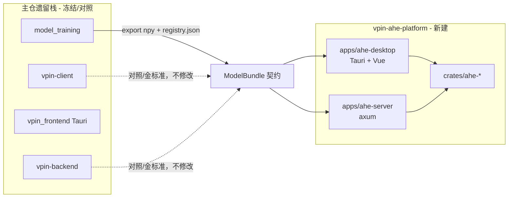

# AHE 全量 Rust 迁移计划（独立子工程）

## 0. 核心决策：与旧栈物理隔离

**不在** [`vpin-client`](vpin-client)、[`vpin-backend`](vpin-backend)、[`vpin_frontend`](vpin_frontend)、[`apps/vpin-server`](apps/vpin-server) 内就地改 AHE 代码。

改为在仓库根新建 **独立 Rust 子工程** `vpin-ahe-platform/`，自成 workspace、自有 Tauri 应用、自有 axum 服务；与主仓仅通过 **文件契约 + 环境变量** 衔接。



| 维度 | 旧栈 | 新子工程 |
|------|------|----------|
| 客户端 | `vpin_client` Python + `vpin_frontend` 调 CLI | `ahe-desktop` Tauri 直调 `ahe-client` crate |
| 服务端 | `vpin-backend` FastAPI `:8000` | `ahe-server` axum **`:8001`**（避免并行开发端口冲突） |
| 代码归属 | `vpin-client/crypto/ahe` 等 | `vpin-ahe-platform/crates/ahe-*` |
| 演进策略 | 标记 **legacy**，仅修阻断性 bug | **主开发线** |
| CP-SNARK | `vpin-server-crypto` 不动 | 后续通过 path 依赖或 git submodule 引用，首期不接 |

---

## 1. 目标与边界

**目标**
- AHE **运行时**全部在新子工程 Rust 实现：codec、BSGS、客户端 ReLU/shift、服务端同态 Network A、P0–P3 WebSocket。
- **独立可运行**：仅 clone 主仓 + 配置 `VPIN_REPO_ROOT`，即可 `cargo run -p ahe-server` + `cargo tauri dev -p ahe-desktop` 完成 E2E。
- 首期模型：**Network A @ MNIST**（`cnn-mnist-trained`）。

**主仓保留 Python（只读/离线）**

| 模块 | 路径 | 角色 |
|------|------|------|
| 训练与导出 | [`model_training/network_a/`](model_training/network_a/) | 产出 npy + `truncation_config.json` |
| 注册 | `register_backend.py` | 写 `registry.json`（新服务只读） |
| HDC 编译 | [`vpin-client/vpin_client/hdc/`](vpin-client/vpin_client/hdc/) | 离线；可选读 `homomorphic_deploy_plan.json` |
| 金标准对照 | `scripts/ahe_e2e_smoke.py`、旧 Python AHE | Phase 0–3 parity，**不删不改** |

---

## 2. 新项目目录结构

```
vpin-ahe-platform/                    # 新建，与 vpin-client 平级
├── Cargo.toml                        # workspace root
├── rust-toolchain.toml               # stable；与 cp-snark nightly 隔离
├── README.md
├── config/
│   └── default.toml                  # repo_root, data_dir, bsgs_table, listen_port
├── crates/
│   ├── ahe-crypto-e2/                # E2 曲线、Point、标量乘
│   ├── ahe-codec/                    # ElGamal、定点、BSGS（mmap table.bin）
│   ├── ahe-protocol/                 # P0–P3 消息、chunk 编解码（兼容旧 JSON wire）
│   ├── ahe-homomorphic/              # Network A conv/pool/fc
│   ├── ahe-engine/                   # 状态机（phase_id / TruncateRequest）
│   ├── ahe-model-bundle/             # registry + npy 加载 + Network A 拓扑
│   └── ahe-client/                   # 异步 WS 会话库（desktop/CLI 共用）
├── apps/
│   ├── ahe-server/                   # axum：health, models, session/ws
│   └── ahe-desktop/                  # 独立 Tauri 2 + Vue 3 薄壳
│       ├── src-tauri/
│       └── ui/                       # 仅 AHE demo：连接、选模型、MNIST 索引、推理结果
├── tools/
│   ├── bsgs-convert/                 # table.pickle → table.bin
│   └── parity-export/                # 从 Python 导出 E2 测试向量 JSON
└── tests/
    └── e2e/                          # Rust smoke：对接主仓 model_training 产物
```

**不复用/不迁入的旧路径**
- 不扩展 [`vpin-backend/Cargo.toml`](vpin-backend/Cargo.toml) workspace。
- 不修改 [`vpin_frontend/.../src-tauri/lib.rs`](vpin_frontend/vpin-frontend/src-tauri/src/lib.rs) 的 Python `ahe-infer` 路径。
- 不替换 [`apps/vpin-server`](apps/vpin-server) 桩代码（该目录可长期废弃或仅作历史参考）。

---

## 3. 与主仓的衔接契约

### 3.1 环境变量（`config/default.toml` 可覆盖）

| 变量 | 默认指向主仓 | 用途 |
|------|--------------|------|
| `VPIN_REPO_ROOT` | `../`（相对 ahe-platform） | 定位训练产物、BSGS 源表 |
| `VPIN_DATA_DIR` | `{REPO}/vpin-backend/data` | 读 `models/registry.json` |
| `VPIN_BSGS_TABLE` | `{REPO}/src/Pre_computed_table/table.bin` | 客户端 mmap |
| `AHE_SERVER_PORT` | `8001` | 与 Python `:8000` 并行 |

### 3.2 ModelBundle（Rust 只读消费）

```
{weights_dir}/                          # registry 中 weights_dir
├── weight_fc1_64_16.npy
├── bias_fc1_16.npy
├── weight_fc2_16_10.npy
├── bias_fc2_10.npy
├── truncation_config.json
└── homomorphic_deploy_plan.json        # 可选；首期 Network A 可内置 Π
```

逻辑移植自 [`weights_bundle.py`](vpin-backend/vpin_backend/models/weights_bundle.py)、[`topology.py`](vpin-backend/vpin_backend/crypto/ahe/topology.py)、[`weights_layout.py`](vpin-client/vpin_client/models/weights_layout.py) — **复制语义到新 crate，不 crate 依赖 Python**。

### 3.3 协议兼容

- Wire 格式与 [`ws_ahe_client.py`](vpin-client/vpin_client/protocol/ws_ahe_client.py) / [`session.py`](vpin-backend/vpin_backend/api/routes/session.py) **字节级兼容**（JSON + base64 chunk）。
- `client_version` 新字符串：`ahe-platform/0.1.0`，便于日志区分新旧栈。

### 3.4 注册流程（仍在主仓 Python 执行）

```bash
# 在主仓根目录
python -m model_training.network_a export --run-dir model_training/outputs/<id>
python -m model_training.network_a register --weights-dir model_training/outputs/<id>
# 新 Rust 服务启动后自动读 registry，无需改注册脚本
```

可选：在 `register_backend.py` **仅追加** 字段 `ahe_runtime: "rust"` / `port: 8001`（非阻塞；Rust 侧不依赖该字段）。

---

## 4. 应用框架选型

### 4.1 `apps/ahe-server`（axum）

```
GET  /api/v1/health
GET  /api/v1/models              # 读 registry.json
GET  /api/v1/models/{id}         # bundle 元信息 + weights_digest
WS   /api/v1/session/ws          # P0–P3 同态会话
```

依赖：`tokio`、`axum`、`axum-extra`（WS）、`tower-http`（CORS/trace）、`serde_json`。

### 4.2 `apps/ahe-desktop`（独立 Tauri）

- **新建** Tauri 2 工程，UI 最小集：服务地址（默认 `ws://127.0.0.1:8001/...`）、`model_id`、MNIST index、推理按钮、timing 展示。
- `src-tauri` 依赖 `ahe-client` + `ahe-model-bundle`（MNIST IDX 预处理可放在 `ahe-client` 或独立 `ahe-data` crate）。
- **不** iframe 加载 `public/vpin/pages`；不与 vPIN 主产品导航耦合。
- 提供 CLI 入口：`cargo run -p ahe-client --bin ahe-infer`（对标 `python -m vpin_client ahe-infer`）。

### 4.3 与 `vpin-server-crypto` 关系

- 首期 **零依赖** CP-SNARK crate，避免 nightly / Spartan 工具链污染 ahe-platform。
- E2 参数与 [`curve.rs`](vpin-backend/crates/vpin-server-crypto/src/curve.rs) **数值复制**到 `ahe-crypto-e2`（单源文档：`vPIN论文与代码对照说明.md` §二）。
- 后续 CP-SNARK 衔接：ahe-platform 以 **optional path dependency** 引用主仓 `vpin-server-crypto`，仍保持目录隔离。

---

## 5. 核心迁移对照（语义来源 → 新 crate）

| 语义来源（主仓 Python，只读对照） | 新实现 |
|-----------------------------------|--------|
| `vpin_client/crypto/ahe/*` | `ahe-crypto-e2` + `ahe-codec` |
| `vpin_client/protocol/ws_ahe_client.py` | `ahe-client` |
| `vpin_backend/inference/homomorphic_network_a.py` | `ahe-homomorphic` |
| `vpin_backend/inference/ahe_engine.py` | `ahe-engine` |
| `vpin_backend/api/routes/session.py` | `apps/ahe-server` |

---

## 6. 分阶段实施

### Phase 0 — 脚手架与契约（1–2 周）

- 创建 `vpin-ahe-platform/` 目录与 workspace `cargo test` 空通过。
- `tools/bsgs-convert`：`table.pickle` → `table.bin`（放主仓 `src/Pre_computed_table/` 或 ahe-platform `assets/`）。
- `tools/parity-export`：导出 Python encrypt/decrypt 向量 → `tests/fixtures/e2_vectors.json`。
- `ahe-crypto-e2` spike：一点加/乘与 Python 一致。
- 文档：[`docs/ahe-platform-readme.md`](docs/ahe-platform-readme.md)（新建）说明与旧栈关系、端口、环境变量。

### Phase 1 — 密码学 + 协议（2–3 周）

- 完成 `ahe-codec`（含 rayon 并行 BSGS）、`ahe-protocol`。
- 验收：crate 内 roundtrip；wire chunk 与 Python golden 帧一致。

### Phase 2 — 同态 + 引擎（3–4 周）

- `ahe-homomorphic` + `ahe-engine`；`ahe-model-bundle` 加载 `cnn-mnist-trained`。
- 验收：库级 session 模拟 vs Python `evaluate._numpy_homomorphic_plain`，`max_diff=0`。

### Phase 3 — ahe-server（2 周）

- 实现 axum WS 全流程；默认 `:8001`。
- 验收：主仓 `scripts/ahe_e2e_smoke.py` **复制为** `vpin-ahe-platform/tests/e2e/smoke.rs` 或 Rust 调用；`logit_max_diff=0`。
- Python 后端 **不关停**，并行对照。

### Phase 4 — ahe-desktop（1–2 周）

- 独立 Tauri 应用跑通 MNIST index 0 E2E。
- 验收：`crypto_infer_ms` 目标 **<20s**（16 核）；相对 Python 基线 ≥2×。

### Phase 5 — 集成与文档（1 周）

- 更新 [`docs/network-a-mnist-ahe-运行报告.md`](docs/network-a-mnist-ahe-运行报告.md) 增加 **Rust 子工程** 章节。
- 主仓 README 增加 `vpin-ahe-platform` 入口说明。
- **不删除** `vpin-client` / `vpin-backend` AHE 代码；在 legacy 目录加 `README_LEGACY_AHE.md` 指向新子工程。

---

## 7. 验收标准

| 项 | 标准 |
|----|------|
| 隔离性 | 新功能 PR 仅触及 `vpin-ahe-platform/**`；主仓 AHE Python 无必需改动 |
| 功能 | Rust E2E prediction 与 Python smoke 一致；`logit_max_diff=0` |
| 模型接入 | 主仓 `register_backend` 后，Rust 服务无需改代码即可加载 |
| 性能 | E2E `crypto_infer_ms` < 20s（目标） |
| 可并行开发 | Python `:8000` 与 Rust `:8001` 同时运行互不影响 |

---

## 8. 风险与缓解

| 风险 | 缓解 |
|------|------|
| 两套客户端/服务端共存混淆 | 固定端口、固定 `client_version`、独立桌面应用名 **vPIN AHE Lab** |
| 主仓路径耦合 | 所有路径经 `VPIN_REPO_ROOT`；CI 在 monorepo 根跑 e2e |
| 重复实现 topology/weights 校验 | 单测对齐 Python golden；禁止运行时 import Python |
| Tauri 双应用维护成本 | `ahe-desktop` 仅 AHE 实验台；主产品 `vpin_frontend` 后续可选跳转链接 |

---

## 9. 后续扩展（架构预留）

- `ahe-model-bundle` 增加 `family: B | lenet_cifar`（仍从主仓 `model_training` 读产物）。
- `ahe-server` 反代或合并主仓 REST（上传/数据 API）— 二期。
- CP-SNARK：ahe-platform 通过 workspace path 依赖 `vpin-server-crypto`，witness 计数对齐 `EcSchedule`。
