# 同态可部署编译器（HDC）— CIFAR-10 LeNet 修订

## 用户约束（本次迭代）

- **禁止**：用现有 `cnn-mnist-trained` / Network A 权重、拓扑或 `network_a.train --dataset cifar10` 处理 CIFAR-10。
- **必须**：在 CIFAR-10 上**从零重训**独立 LeNet 族模型（非 legacy MNIST `src/LeNet/` 1×32×32 路径）。
- **P2 范围**：训练 + 导出 + 注册 + HDC Compile/校准 + **公式预测 vs 实测闭环**；AHE WS E2E 后置 P4+。
- **训练归属**：所有可部署模型的 train / export / register **仅在** [`model_training/`](model_training/) 完成；`train_pytorch.py` 仅作浮点基线，**不**进入 registry / HDC。

---

## §12 模型任务分工（Model Ownership）

各模型职责边界——避免 Network A 处理 CIFAR、避免 `train_pytorch` 误入 AHE 路径：

| 模型族 | `model_id` | 数据集 | 输入 | 训练模块 | 导出注册 | HDC Compile | AHE E2E | 阶段 |
|--------|------------|--------|------|----------|----------|-------------|---------|------|
| **Network A** | `cnn-mnist-trained` | 官方 MNIST | `1×28×28` | [`network_a/`](model_training/network_a/) | `export_weights` + `register_backend` | `ahe_feasibility` | ✅ 已有 | **P0 参考轨** |
| **Network B** | `cnn-mnist-b` | 官方 MNIST | `1×28×28` | [`network_b/`](model_training/network_b/) | 同上 | 待扩展 | 待引擎 | P5 |
| **LeNet-CIFAR** | `lenet-cifar10` | CIFAR-10 | `3×32×32` | **`network_lenet/`（新建）** | 同上模式 | `compile_deploy_plan` | P4+ | **P2 验证轨** |
| SimpleCNN | — | mnist/cifar10 | 可变 | [`train_pytorch.py`](model_training/train_pytorch.py) | ❌ 不注册 | ❌ | ❌ | 教学基线 |
| legacy 权重 | `cnn-mnist` | — | `1×28×28` | —（`Pre_trained_model`） | 脚本恢复 | 只读对照 | ✅ | 不回写 |

**数据—模型硬约束**（session / orchestrator 门控）：

```text
MNIST official/upload  → 仅 network A / B
CIFAR-10               → 仅 lenet_cifar（lenet-cifar10）
跨族请求               → 硬拒（Error: topology/dataset mismatch）
```

**`model_training` 标准流水线**（Network A 已验证，LeNet 镜像）：

```text
train → export_weights → register_backend → verify → evaluate → (HDC compile)
  │         │                  │              │         │
  ▼         ▼                  ▼              ▼         ▼
checkpoint  npy bundle    registry      公式/实测   float vs fixed
.pt         truncation_    upsert        对照        acc + layerwise
            config.json
```

产物目录统一：`model_training/outputs/<timestamp>/`。

**`run.py` 入口扩展**：

```powershell
# 已有
.\.venv\Scripts\python.exe model_training\run.py --task network-a --device cuda
.\.venv\Scripts\python.exe model_training\run.py --task network-b --device cuda
# 新增
.\.venv\Scripts\python.exe model_training\run.py --task network-lenet --dataset cifar10 --device cuda
```

---

## §13 公式预测 vs 实测验证（闭环）

**原则**：§11.4 推导的 \(f\)、\(\Pi\)、\(M_{\mathrm{pre/post}}\)、\(\hat{k}\) **不得**仅停留在纸面；每个 checkpoint 必须与 `forward_fixed_point_layers` 实测对齐后方可写入 `homomorphic_deploy_plan.json`。

### 13.1 三层对照

| 层 | 预测源 | 实测源 | 验收 |
|----|--------|--------|------|
| **尺度** | §3 公式（如 pool \(f=28\)） | `truncation_config.phases[].from_bits` | 逐相位 `assert pred == actual` |
| **幅度界** | §6 静态界 + §7 校准 max | `forward_fixed_point(..., return_bounds=True)` | `M_pre_actual ≤ M_pre_cal`（校准集上） |
| **精度** | §7 \(\mathrm{accuracy\_ok}\) | `evaluate --mode all` | `|Acc_float - Acc_fixed| < τ` |
| **分类** | 明文定点 \(\arg\max\) | 同权重 float forward | 单样本 logit 一致或 \(\ell_\infty\) 容差 |

### 13.2 验证算法

```text
Algorithm VerifyPredictedVsActual(θ, G, Π, D_cal):
  pred ← FormulaScaleTable(G)           // §11.4，from_bits/to_bits per π_k
  for s in D_cal:
    layers, bounds ← ForwardFixedPointTrack(s, θ, Π)
    for π_k in Π:
      assert layers[π_k].f_scale == pred[π_k].from_bits
      record M_pre_actual[π_k, s] = max|layers[π_k]|
  M_pre_cal[π_k] ← max_s M_pre_actual[π_k, s]
  for π_k in shift_nodes:
    M_post_actual ← M_pre_cal[π_k] / 2^(pred[π_k].from_bits - 16)
    assert M_post_actual < 2^31 - 1  else range_ok = false
  report ← { predicted: pred, actual: layers_summary, deltas, range_ok, accuracy_ok }
  write report → outputs/<id>/hdc_validation_report.json
  return report
```

### 13.3 各模型验证命令

**Network A（MNIST，P0 回归）**：

```powershell
.\.venv\Scripts\python.exe -m model_training.network_a.verify
.\.venv\Scripts\python.exe -m model_training.network_a.evaluate --run-dir model_training\outputs\<id> --mode all
```

**LeNet-CIFAR（P2 主验收）**：

```powershell
.\.venv\Scripts\python.exe -m model_training.network_lenet.train --dataset cifar10 --device cuda
.\.venv\Scripts\python.exe -m model_training.network_lenet.export_weights --run-dir model_training\outputs\<id>
.\.venv\Scripts\python.exe -m model_training.network_lenet.register_backend --model-id lenet-cifar10 --weights-dir ...
.\.venv\Scripts\python.exe -m model_training.network_lenet.verify --run-dir model_training\outputs\<id>
.\.venv\Scripts\python.exe -m model_training.network_lenet.evaluate --run-dir model_training\outputs\<id> --mode all
.\.venv\Scripts\python.exe scripts\validate_cifar10_hdc.py --run-dir model_training\outputs\<id>
```

`verify` 失败 → **阻断** `register_backend` 写 `deployable=true`；与 Network A 现有 `ahe_feasibility_report.json` 模式一致。

### 13.4 报告字段（`hdc_validation_report.json`）

```json
{
  "model_id": "lenet-cifar10",
  "formula_pi": [{"id": "after_pool1", "from_bits": 28, "to_bits": 16}],
  "actual_pi":  [{"id": "after_pool1", "from_bits": 28, "to_bits": 16}],
  "pi_match": true,
  "checkpoints": {
    "after_pool1": {"M_pre_cal": 1.2e9, "M_post_cal": 2.9e5, "bsgs_ok": true, "int32_ok": true}
  },
  "accuracy": {"float": 0.62, "fixed": 0.61, "delta": 0.01, "ok": true},
  "deployable": true
}
```

---

## 参考模型（联网对齐）

采用社区标准 **CIFAR-10 LeNet**（非 MNIST LeNet）：

| 来源 | 拓扑要点 |
|------|----------|
| [PyTorch CIFAR10 tutorial](https://github.com/pytorch/tutorials/blob/main/beginner_source/blitz/cifar10_tutorial.py) | `Conv2d(3,6,5)` → pool → `Conv2d(6,16,5)` → pool → `Linear(400,120)` → `Linear(120,84)` → `Linear(84,10)` |
| [kuangliu/pytorch-cifar `lenet.py`](https://github.com/kuangliu/pytorch-cifar/blob/master/models/lenet.py) | 同上，输入 `3×32×32`，10 类 |

**与 legacy `src/LeNet/` 的差异**（须在计划中显式记录，避免误用）：

| 项 | legacy MNIST LeNet | CIFAR LeNet（本轨） |
|----|-------------------|---------------------|
| 输入 | 1×32×32（28 pad） | **3×32×32** RGB |
| 首层 | `Conv2d(1,6,5)` | **`Conv2d(3,6,5)`** |
| Pool | `AvgPool2d(2)` | 训练参考用 **Sum/Avg pool 同态语义**（见下） |
| 权重 | 固定 conv 思路不同 | **conv+fc 全量可训、全量导出** |

**同态对齐改动**（相对公开 MaxPool 版）：池化层在训练栈中使用 **2×2 sum pool + inv_bits 定点倒数**（与 [§3 尺度表](.cursor/plans/ahe_导入与编排_8ab205bc.plan.md) 的 `sum_pool` 规则一致），而非 `MaxPool2d`——否则 HDC 无法给出可部署的 LayerGraph。浮点基线可另跑 MaxPool 对照，但 **Compile 与验收仅以 Avg/Sum pool 变体为准**。

---

## §11 修订：CIFAR-10 验证轨（LeNet）

### 11.1 数据

- 数据集：torchvision CIFAR-10，缓存 [`model_training/data/cifar10/`](model_training/data/cifar10/)
- 原始样本：\(\mathbf{I} \in \mathbb{Z}^{3\times 32\times 32}_{[0,255]}\)

**Adapter \(\mathcal{A}_{\mathrm{cifar_rgb}}\)**（扩展 §1，**非** \(\mathcal{A}_{\mathrm{cifar28}}\)）：

\[
\tilde{x}_{c,i,j} = I_{c,i,j}/255,\quad
x'_{c,i,j} = \mathrm{clip}\!\left(\frac{\tilde{x}_{c,i,j}-\min\tilde{x}}{\max\tilde{x}-\min\tilde{x}},\, \varepsilon_{\min},\, \varepsilon_{\max}\right)
\]

\[
X_{c,i,j} = \lfloor x'_{c,i,j} \cdot 2^F \rfloor,\quad F=16
\]

- **无** resize 到 28×28，**无**灰度化，**无** pad 到 32（原图即 32×32）
- 校准集 \(\mathcal{D}_{\mathrm{cifar}}\)（默认 500 张 train 图），与 MNIST 校准独立

### 11.2 模型（唯一主轨）

新建 [`model_training/network_lenet/`](model_training/network_lenet/)（**完整镜像** [`network_a/`](model_training/network_a/) 模块集）：

| 模块 | 职责 |
|------|------|
| `model.py` | LeNetCIFAR + `forward_float` / `forward_fixed_point` / `forward_fixed_point_layers` |
| `train.py` | CIFAR-10 全参训练 + 定点 QAT |
| `fixed_point.py` | `apply_client_action`（shift / relu_then_shift） |
| `truncation_config.py` | \(\Pi\) 相位；`from_bits` **由 §11.4 公式生成**，非手写 |
| `dataset.py` | CIFAR-10 加载 → `model_training/data/cifar10/` |
| `preprocess.py` | \(\mathcal{A}_{\mathrm{cifar_rgb}}\) |
| `export_weights.py` | conv1/2 + fc1/2/3 npy + `truncation_config.json` |
| `register_backend.py` | `upsert_model` → `lenet-cifar10` |
| `verify.py` | §13 公式 vs 实测；失败则 exit 1 |
| `evaluate.py` | float/fixed/layerwise；写 `evaluation_report.json` |
| `ahe_feasibility.py` | 校准集扫描 → `range_ok` / `accuracy_ok` |

| 项 | 值 |
|----|-----|
| `model_id` | `lenet-cifar10` |
| `network` | `lenet_cifar`（新 family，**≠** registry 中 `lenet-mnist`） |
| 输入 | \(\mathcal{A}_{\mathrm{cifar_rgb}}\)，`3×32×32` |
| 训练 | 全参数 CE；`forwardFixedPointWithTrunc` 对齐 §11.4 \(\Pi\) |
| 导出 | conv+fc 全量 npy + `truncation_config.json` + `metrics.json` |
| 禁止 | 加载 `cnn-mnist-trained`、Network A 拓扑、legacy MNIST LeNet 权重 |

训练命令（计划实现后）：

```powershell
.\.venv\Scripts\python.exe model_training\run.py --task network-lenet --dataset cifar10 --device cuda
.\.venv\Scripts\python.exe -m model_training.network_lenet.export_weights --run-dir model_training\outputs\<id>
.\.venv\Scripts\python.exe -m model_training.network_lenet.register_backend --model-id lenet-cifar10 --weights-dir ...
.\.venv\Scripts\python.exe -m model_training.network_lenet.verify --run-dir model_training\outputs\<id>
```

### 11.3 CIFAR-10 LeNet 拓扑与张量形状（联网参数）

参考 [kuangliu/pytorch-cifar `lenet.py`](https://github.com/kuangliu/pytorch-cifar/blob/master/models/lenet.py)：

| 层 | 算子 | 权重形状 | bias | 参数量 | 输出形状 |
|----|------|----------|------|--------|----------|
| 输入 | — | — | — | — | \(3\times32\times32\) |
| conv1 | `Conv2d(3,6,5)` stride=1 pad=0 | \(6\times3\times5\times5\) | 6 | 456 | \(6\times28\times28\) |
| pool1 | `sum_pool` \(2\times2\) stride=2 | — | — | 0 | \(6\times14\times14\) |
| conv2 | `Conv2d(6,16,5)` | \(16\times6\times5\times5\) | 16 | 2416 | \(16\times10\times10\) |
| pool2 | `sum_pool` \(2\times2\) | — | — | 0 | \(16\times5\times5\) |
| fc1 | `Linear(400,120)` | \(120\times400\) | 120 | 48120 | \(120\) |
| fc2 | `Linear(120,84)` | \(84\times120\) | 84 | 10080 | \(84\) |
| fc3 | `Linear(84,10)` | \(10\times84\) | 10 | 850 | \(10\) |

**总参数量** \(\approx 6.19\times10^4\)（0.062M）。空间维递推：\(32\xrightarrow{-4}28\xrightarrow{/2}14\xrightarrow{-4}10\xrightarrow{/2}5\)，flatten \(16\cdot5\cdot5=400\)。

> **注意**：legacy `src/LeNet/Client.py` 在 pool 后用 `shifting(...,26)` 是针对 **4×4 sum pool**（Network A 尺度 \(16+4+10=26\)）。CIFAR LeNet 为 **2×2 pool**，必须用公式 \(f_{\mathrm{pool}}=28\)，**不得**照搬 26。

---

### 11.4 尺度传播与截断相位 \(\Pi\)（公式推导）

全局常数：\(F=16\)，\(\mathrm{inv\_bits}=10\)，\(k=2\)（pool 窗口），\(\mathrm{inv\_fp}=\lfloor 2^{10}/k^2\rfloor=256\)。

**§3 尺度规则逐层代入**（同态对齐变体：sum pool + 定点倒数，非 MaxPool）：

| 序号 | 节点 | \(f_{\mathrm{in}}\to f_{\mathrm{out}}\) | 推导 |
|------|------|----------------------------------------|------|
| 0 | encrypt | — \(\to F\) | 输入定点化 |
| 1 | conv1+ReLU | \(F\to F\) | §3：conv/ReLU 保尺度 |
| 2 | pool1 | \(F\to F+\log_2 k^2+\mathrm{inv\_bits}\) | \(16\to 16+2+10=28\) |
| 3 | client shift \(\pi_2\) | \(28\to F\) | TReLU 无，纯 shift |
| 4 | conv2+ReLU | \(F\to F\) | |
| 5 | pool2 | \(F\to 28\) | 同上 |
| 6 | client shift \(\pi_4\) | \(28\to F\) | |
| 7 | fc1 | \(F\to F+F=32\) | 权重量化尺度 \(F\) |
| 8 | client relu+shift \(\pi_5\) | \(32\to F\) | |
| 9 | fc2 | \(F\to 32\) | |
| 10 | client relu+shift \(\pi_6\) | \(32\to F\) | |
| 11 | fc3 | \(F\to 32\) | logits，无 ReLU/shift |

**截断算子**（与 `Client.shifting(decrypted, from_bits)` 一致，`from_bits` 为当前尺度）：

\[
\mathrm{shift}(X; f_{\mathrm{in}}\!\to\! f_{\mathrm{out}}):
\quad X' = \left\lfloor \mathrm{real}(X; f_{\mathrm{in}})\cdot 2^{f_{\mathrm{out}}} \right\rfloor
\]

\[
\mathrm{relu\_then\_shift}(X; f_{\mathrm{in}}\!\to\! F):
\quad X' = \left\lfloor \max(\mathrm{real}(X; f_{\mathrm{in}}),0)\cdot 2^{F} \right\rfloor
\]

**shift 后幅度收缩**（用于 §6–§7 界）：

\[
M_{\mathrm{post}} = \frac{M_{\mathrm{pre}}}{2^{\,f_{\mathrm{in}}-F}}
\]

pool 后：\(M_{\mathrm{post}} = M_{\mathrm{pre}} / 2^{12}\)；FC 后 shift：\(M_{\mathrm{post}} = M_{\mathrm{pre}} / 2^{16}\)。

**§10b LeNet-CIFAR checkpoint 表**（\(\Pi=(\pi_1,\ldots,\pi_6)\)）：

| \(\pi_k\) | 位置 | \(f_{\mathrm{in}}\) | \(f_{\mathrm{out}}\) | client op | 张量规模 |
|-----------|------|----------------------|----------------------|-----------|----------|
| \(\pi_1\) | after conv1 | 16 | 16 | ReLU | 6 张 \(28\times28\) |
| \(\pi_2\) | after pool1 | **28** | 16 | shift | 6 张 \(14\times14\) |
| \(\pi_3\) | after conv2 | 16 | 16 | ReLU | 16 张 \(10\times10\) |
| \(\pi_4\) | after pool2 | **28** | 16 | shift | 16 张 \(5\times5\) |
| \(\pi_5\) | after fc1 | **32** | 16 | relu+shift | 120 维 |
| \(\pi_6\) | after fc2 | **32** | 16 | relu+shift | 84 维 |

fc3 输出在 \(f=32\) 上直接 \(\arg\max\)，无客户端回传。

---

### 11.5 明文前向 + 池化（与引擎对齐）

设加密输入 \(X^{(0)}\in\mathbb{Z}^{3\times32\times32}\)，尺度 \(f=F\)。

**conv1+ReLU**（整数卷积，核/偏置 \(\lfloor\cdot\cdot 2^F\rfloor\)）：

\[
X^{(1)}_k = \mathrm{ReLU}\!\big(\mathrm{Conv}_\mathbb{Z}(X^{(0)}; K^{(1)}_k, b^{(1)}_k)\big),\quad k=1..6,\quad f=16
\]

**pool1**（sum pool + 定点倒数，[`myAvgPool2d`](src/LeNet/Server.py) 语义）：

\[
S = \sum_{\mathcal{W}_{2\times2}} X^{(1)},\quad
X^{(2)} = \left\lfloor S \cdot \mathrm{inv\_fp} / k^2 \right\rfloor,\quad f=28
\]

\[
X^{(3)} = \mathrm{shift}(X^{(2)}; 28\to 16)
\]

**conv2+ReLU → pool2 → shift** 同理，得 \(X^{(5)}\in\mathbb{Z}^{16\times5\times5}\)，\(f=16\)。

**FC 链**：

\[
\mathbf{h}_1 = X^{(5)\flat}\,\hat{W}_1 + \hat{b}_1,\ f=32;\quad
\mathbf{h}_1' = \mathrm{relu\_then\_shift}(\mathbf{h}_1; 32\to 16)
\]

\[
\mathbf{h}_2 = \mathbf{h}_1'\,\hat{W}_2 + \hat{b}_2,\ f=32;\quad
\mathbf{h}_2' = \mathrm{relu\_then\_shift}(\mathbf{h}_2; 32\to 16)
\]

\[
\hat{\mathbf{y}} = \mathbf{h}_2'\,\hat{W}_3 + \hat{b}_3,\ f=32;\quad
\hat{k} = \arg\max_c \hat{y}_c
\]

---

### 11.6 客户端—服务端回传编排算法

**同态 WS 一轮交互模式**（每个 \(\pi_k\)：Server 同态层 → Client 解密 → 非线性/shift → 重加密 → 送回）：

```text
Algorithm LeNetCIFAR_Inference(s, θ, P):
  X ← A_cifar_rgb(s)                          // §11.1
  assert M_in(X) < 2^31-1
  assert range_ok(P)

  C: Enc(X) → S
  S: Conv1_hom(X_enc) → C
  C: ∀k∈[1..6]: Dec → ReLU → Enc → S          // π1

  S: Pool1_hom → C
  C: ∀k∈[1..6]: Dec → shift(·,28→16) → Enc → S // π2

  S: Conv2_hom → C
  C: ∀k∈[1..16]: Dec → ReLU → Enc → S         // π3

  S: Pool2_hom → C
  C: ∀k∈[1..16]: Dec → shift(·,28→16) → Enc → S // π4

  S: FC1_hom → C
  C: Dec → relu_then_shift(·,32→16) → Enc → S // π5

  S: FC2_hom → C
  C: Dec → relu_then_shift(·,32→16) → Enc → S // π6

  S: FC3_hom → C
  C: Dec → argmax → ŷ
  return ŷ
```

**HDC Compile 算法**（P2 明文模拟，无 WS）：

```text
Algorithm CompileLeNetCIFAR(θ, D):
  G ← Decompose(θ, family=lenet_cifar)
  Π ← (π1..π6)                                 // §11.4 表，禁止手写 26
  for s in D:
    track forward_plain(s, θ, G, Π)            // §11.5 + 记录每 π_k 的 M_pre, M_post
  M_pre[k] ← max_{s∈D} M_pre[k](s)
  BSGS_k ← M_pre[k] < (3.2×10^6)^2 - 1
  INT32_k ← M_post[k] < 2^31 - 1               // 仅 shift 类 π
  deployable ← ∧_k BSGS_k ∧ ∧_{shift k} INT32_k ∧ accuracy_ok
  return P = (G, Π, bounds, deployable)
```

**静态 FC 界**（§6，\(d_1=400,d_2=120\)）：

\[
B_{\mathrm{fc1}} = d_1\, M^{\mathrm{cal}}_{\mathrm{pool2,post}}\, \max|\hat{W}_1| + \max|\hat{b}_1|,\quad
B_{\mathrm{fc2}} = d_2\, M^{\mathrm{cal}}_{\mathrm{fc1,post}}\, \max|\hat{W}_2| + \max|\hat{b}_2|
\]

---

### 11.7 LayerGraph 示意

```mermaid
flowchart LR
  enc[encrypt_F16] --> c1[conv1_ReLU]
  c1 --> p1[sum_pool_2x2_f28]
  p1 --> sh1[shift_28_to_16]
  sh1 --> c2[conv2_ReLU]
  c2 --> p2[sum_pool_2x2_f28]
  p2 --> sh2[shift_28_to_16]
  sh2 --> fc1[FC1_f32]
  fc1 --> sh3[relu_shift_32_to_16]
  sh3 --> fc2[FC2_f32]
  fc2 --> sh4[relu_shift_32_to_16]
  sh4 --> fc3[FC3_f32_argmax]
```



### 11.8 P2 验收（HDC，非 SOTA）

| 步骤 | 判定 |
|------|------|
| 训练 | `network_lenet.train` 完成；test acc 达合理基线（参考 kuangliu ~60%+） |
| 导出注册 | `export_weights` + `register_backend` 成功；registry 可见 `lenet-cifar10` |
| **§13 闭环** | `verify`：`pi_match=true`；各 \(\pi_k\) 的 `from_bits` 实测 = 公式值（28/32） |
| \(\mathrm{Compile}(\theta, \mathcal{D}_{\mathrm{cifar}})\) | 产出 \(\mathcal{P}\)；\(M^{(k)}_{\mathrm{pre}}\) 与 MNIST **数值独立** |
| \(\mathrm{range\_ok}\) | `hdc_validation_report.json` 中 `bsgs_ok` / `int32_ok` 全 true |
| \(\mathrm{accuracy\_ok}\) | `evaluate`：\(|\mathrm{Acc}_{\mathrm{float}}-\mathrm{Acc}_{\mathrm{fixed}}|<\tau\) |
| 编排 | `validate_cifar10_hdc.py`：preflight + 明文定点模拟 |
| 负例 | `cnn-mnist-trained` + CIFAR adapter → **必须拒** |

**不做（P2）**：`homomorphic_network_lenet.py` port、浏览器 AHE WS 全链路。

### 11.9 后置（P4+）

- Port legacy [`src/LeNet/`](src/LeNet/) 多通道 conv + avg pool 到 `vpin-backend`（或新模块）
- 3 通道加密输入、6+16 路 per-map 回传（\(\pi_1\)–\(\pi_4\)）、FC 单向回传（\(\pi_5\)–\(\pi_6\)）
- `scripts/ahe_e2e_smoke.py --model lenet-cifar10` 可选 E2E

**删除原 §11.4 Track B（Network C）与 Network A@28 轨**——CIFAR 验证不再经过 Network A/C 族。

---

## 实现映射更新

| 职责 | 模块 |
|------|------|
| 训练/导出/注册 | [`model_training/network_a/`](model_training/network_a/)（MNIST）、[`model_training/network_lenet/`](model_training/network_lenet/)（CIFAR） |
| 公式 vs 实测 | `network_*/verify.py` → `hdc_validation_report.json` |
| §1 CIFAR adapter | [`vpin_client/hdc/adapters/cifar10_rgb.py`](vpin_client/hdc/adapters/cifar10_rgb.py) |
| LayerGraph | `vpin_client/hdc/layer_ir.py`（`G_family=lenet_cifar`） |
| §7 校准 Compile | `network_lenet/ahe_feasibility.py` + `compile_deploy_plan()` |
| §8 产物 | `models.py` import 钩子 → `homomorphic_deploy_plan.json` |
| §9 编排 | `pipeline/orchestrator.py`；`session.py` 按 model_id 选族 |
| 端到端验收 | [`scripts/validate_cifar10_hdc.py`](scripts/validate_cifar10_hdc.py) |
| 测试 | `test_pi_formula_matches_actual`；`test_reject_network_a_on_cifar` |

---

## 分期与任务归属

```text
P0  Network A@MNIST — network_a 训练/导出/注册 + verify（参考轨，已有栈）
P1  §8 homomorphic_deploy_plan.json + models.py 导入钩子
P2  LeNet@CIFAR — network_lenet 全栈 + §13 闭环 + validate_cifar10_hdc.py
P3  §9 Orchestrator + session 双族门控
P4  LeNet 同态引擎 port + AHE WS E2E
P5  Network B–E 扩展
```

**并行关系**：P0 与 P2 可并行（不同模型族、不同数据集）；P1 依赖 P0 产物格式；P3 依赖 P1+P2 的 \(\mathcal{P}\)。

---

## Todo 清单（按模型分组）

**共用 HDC 基础设施**：`ir-layer-spec`、`model-decomposer`、`range-engine`、`deploy-plan`、`dtype-adapters`

**Network A（MNIST，P0）**：`ref-network-a` — 维持现有 `network_a/*`，作为 verify/evaluate 模板

**LeNet-CIFAR（P2）**：`network-lenet-stack`、`lenet-layer-graph`、`predict-vs-actual`、`lenet-cifar10-hdc`

**编排与前端（P3）**：`orchestrator`、`session-plan-driven`

**文档测试**：`tests-docs`
