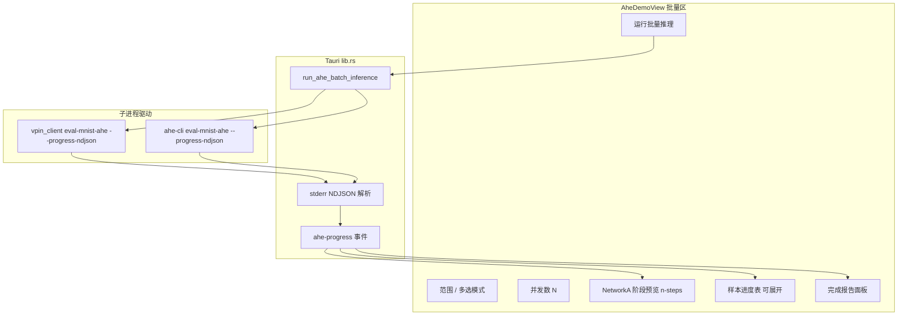

# AHE 批量推理前端 + 客户端接线计划

## 现状与缺口

| 层级 | 已有 | 缺失 |
|------|------|------|
| Python 客户端 | [`vpin-client/vpin_client/pipeline/batch.py`](vpin-client/vpin_client/pipeline/batch.py) 支持 `limit` + `asyncio` 并发；CLI `eval-mnist-ahe` | 固定 **0..limit-1**；无 `start`/自定义 index 列表/上传 job 列表；无 `--progress-ndjson` |
| Rust 客户端 | [`vpin-platform/apps/ahe-cli/src/main.rs`](vpin-platform/apps/ahe-cli/src/main.rs) `eval-mnist-ahe --start --limit --concurrency` | 无上传 batch；无 NDJSON 流式进度 |
| Tauri | [`run_ahe_inference`](vpin_frontend/vpin-frontend/src-tauri/src/lib.rs) 单图 + `ahe-progress` | 无 `run_ahe_batch_inference` |
| 前端 | 单图推理 + [`AheFlowTimeline.vue`](vpin_frontend/vpin-frontend/src/components/demo/AheFlowTimeline.vue) + [`AheTraceDrawer.vue`](vpin_frontend/vpin-frontend/src/components/demo/AheTraceDrawer.vue) | 无批量 UI/多选/报告；时间线仅单 session |

服务端 Python 侧已有 **process pool** 并行同态计算（[`ahe_worker.py`](vpin-backend/vpin_backend/inference/ahe_worker.py)）；客户端侧批量并行应继续用 **asyncio Semaphore**（与现有 batch 一致），UI 文案说明为「并发 WebSocket 会话数」，避免与 server pool 混淆。

---

## 目标架构



---

## 1. 客户端：统一 Batch Job 模型

### 1.1 Python — 扩展 `batch.py`

文件：[`vpin-client/vpin_client/pipeline/batch.py`](vpin-client/vpin_client/pipeline/batch.py)

- 新增 `BatchRequest` dataclass：
  - `jobs: list[InferenceJob]`（**唯一真相**；由 range 或多选样本构造）
  - `concurrency: int`
  - `collect_trace: bool | "focus_only"`（默认 `False`；`concurrency==1` 时可全量 trace）
- 将 `run_mnist_batch(limit=...)` 重构为 `run_ahe_batch(request, on_progress=...)`，保留旧函数作薄包装。
- 进度事件扩展（stderr NDJSON，`kind: progress`）：

| phase | 用途 |
|-------|------|
| `batch_start` | `{total, concurrency, engine, model_id, job_keys[]}` |
| `batch_item_start` | `{slot, job_id, mnist_index?, upload_id?, image_path?}` |
| `trace` | 单图 trace step（带 `job_id`；仅 focus 或 concurrency=1 时发送） |
| `batch_item_done` | `{job_id, prediction, label, correct, timing, error?}` |
| `batch_done` | 完整 `BatchReport`（accuracy、elapsed、avg timing、results 摘要） |

- **并发实现**：保持 `asyncio.Semaphore(concurrency)` + `asyncio.gather`；`concurrency>1` 时共享 keypair（现有 P1+P2 逻辑不变）。
- **focus 策略**：并发>1 时，仅对「当前 slot 0 / 用户点击的行」推送 `trace`，避免 UI 被淹没。

### 1.2 Python CLI

文件：[`vpin-client/vpin_client/cli.py`](vpin-client/vpin_client/cli.py)

新增/扩展 `eval-mnist-ahe` 参数：

```
--start INT          # 与 --limit 组成范围（官方 MNIST）
--limit INT
--indices "1,5,9"    # 与范围二选一
--jobs-json PATH     # Tauri 传入的统一 job 列表（含 upload image_path / upload_id）
--concurrency INT
--progress-ndjson
--infer-engine python|rust-ark|rust-ec  # 报告标签
--trace-mode none|focus|all
```

`_cmd_eval_mnist` 构造 `BatchRequest` 并复用 `_emit_progress_ndjson`。

### 1.3 Rust CLI

文件：[`vpin-platform/apps/ahe-cli/src/main.rs`](vpin-platform/apps/ahe-cli/src/main.rs)

- `eval-mnist-ahe` 增加 `--progress-ndjson`、`--jobs-json`（与 Python 同 schema）。
- 批量循环改为按 `jobs` 列表驱动（不再假设 `0..limit`）。
- 上传 job：复用已有 `load_upload_via_python` + `--image` 逻辑。
- 进度 NDJSON 与 Python 对齐（`batch_*` phases）。

---

## 2. Tauri 接线

文件：[`vpin_frontend/vpin-frontend/src-tauri/src/lib.rs`](vpin_frontend/vpin-frontend/src-tauri/src/lib.rs)

新增 command：

```rust
run_ahe_batch_inference(
  infer_engine, model_id, backend_ws?,
  jobs: Vec<BatchJob>,      // { mnist_index?, upload_id?, image_path? }
  concurrency: u32,
  trace_mode: String,
) -> Result<Value, String>
```

实现要点：

- 将 `jobs` 写入临时 JSON → 调用 Python `eval-mnist-ahe` 或 Rust `ahe-cli eval-mnist-ahe`。
- 复用现有 [`run_subprocess_with_progress`](vpin_frontend/vpin-frontend/src-tauri/src/lib.rs)（stderr NDJSON → `ahe-progress`）。
- 成功 stdout 解析为 batch report JSON；失败合并 stderr。
- 可选：完成后写入 `vpin-client/reports/batch_*.json` 并返回路径。

---

## 3. 前端 API 层

文件：[`vpin_frontend/vpin-frontend/src/services/aheClient.js`](vpin_frontend/vpin-frontend/src/services/aheClient.js)

- 新增 `aheBatchInfer({ inferEngine, modelId, jobs, concurrency, traceMode })` → `invoke("run_ahe_batch_inference", ...)`。
- 新增 job 构造辅助：
  - `jobsFromRange(start, end)` → 官方 MNIST index 列表
  - `jobsFromSelectedSamples(samples, lane)` → 官方 index / upload_id / image_path

---

## 4. 前端 UI / 时间线

### 4.1 批量控制区（嵌入 [`AheDemoView.vue`](vpin_frontend/vpin-frontend/src/views/demo/AheDemoView.vue)）

在「推理」卡片内增加 **模式切换**：`单图` | `批量`。

**批量模式控件：**

- **范围**：`start` / `end`（0–9999，自动算 count）
- **多选**：画廊支持 Ctrl/Shift 多选（改造 [`PreprocessGallery.vue`](vpin_frontend/vpin-frontend/src/components/demo/PreprocessGallery.vue) + [`useAhePreprocessLanes.js`](vpin_frontend/vpin-frontend/src/composables/useAhePreprocessLanes.js)）
- **并发数**：`n-input-number`（默认 2，范围 1–16，带提示「建议 ≤ server CPU 核数」）
- **Trace 模式**：`无 / 聚焦项 / 全部`（并发>1 时禁用「全部」）
- **运行按钮**：`运行批量推理 (N 张)`

范围与多选互斥；多选时以当前 **activeLane**（Python/Rust 预处理区）样本为准。

### 4.2 新 composable：`useAheBatchTimeline.js`

职责：

- 订阅 `ahe-progress`，维护：
  - `batchMeta`（total、concurrency、completed、correct、accuracy、eta）
  - `items[]`（每 job 状态：pending/running/done/error + timing + prediction）
  - `focusJobId` + `focusPhase`（驱动顶栏 Network A 预览）
  - `flowSteps[]`（当前 focus job 的 trace 步骤，复用单图结构）
- `beginBatch` / `endBatch` 与现有 [`useAheInferTimeline.js`](vpin_frontend/vpin-frontend/src/composables/useAheInferTimeline.js) 并行，批量进行时切换时间线数据源。

### 4.3 新组件

| 组件 | 职责 |
|------|------|
| `AheBatchProgressHeader.vue` | 顶栏：**Network A 五阶段 n-steps**（[`AHE_PHASES`](vpin_frontend/vpin-frontend/src/constants/aheFlow.js)）+ 批量总进度条 + 实时 acc/eta |
| `AheBatchItemTable.vue` | 可排序表格：序号/标签/预测/耗时/状态；行点击设 focus + 打开 drawer |
| `AheBatchReportPanel.vue` | 完成后：accuracy、总耗时、img/s、avg crypto_ms、错误列表、导出 JSON |
| 复用 `AheTraceDrawer.vue` | 展开单 job 的 trace / logits / timing JSON |

单图模式保持现有 [`AheFlowTimeline.vue`](vpin_frontend/vpin-frontend/src/components/demo/AheFlowTimeline.vue) 不变；批量模式显示 Batch 专用布局。

### 4.4 时间线 UX 规则

- **顶栏阶段预览**：随 focus job 的 `trace.step.detail.phase_id` 动态推进（与单图 `runningPhase` 相同映射）。
- **并发>1**：默认 auto-focus 最新 `batch_item_start` 的 job；用户点击表格行切换 focus。
- **明细展开**：表格行 / trace 节点 → `AheTraceDrawer`（已有 JSON / logits / shape 展示）。
- **完成后**：时间线顶部切换为报告摘要卡片，表格保留可回看每项结果。

---

## 5. 数据流示例（NDJSON）

```json
{"kind":"progress","phase":"batch_start","total":50,"concurrency":4,"engine":"python"}
{"kind":"progress","phase":"batch_item_start","job_id":"mnist-1000","slot":0,"mnist_index":1000}
{"kind":"progress","phase":"trace","job_id":"mnist-1000","step":{"id":"server_ct_after_conv","category":"服务端",...}}
{"kind":"progress","phase":"batch_item_done","job_id":"mnist-1000","prediction":9,"label":9,"correct":true,"timing":{...}}
{"kind":"progress","phase":"batch_done","report":{"limit":50,"correct":45,"accuracy":0.9,...}}
```

---

## 6. 测试与文档

- **手动**：Tauri 选 Python / Rust-EC，范围 `1000–1004`、并发 2；多选 3 张上传图；确认报告 accuracy 与 CLI 报告 JSON 一致。
- **CLI 回归**：`python -m vpin_client.cli eval-mnist-ahe --start 0 --limit 10 --concurrency 2 --progress-ndjson`
- 更新 [`docs/ahe-ui-client-server-test-startup.md`](docs/ahe-ui-client-server-test-startup.md) 批量推理章节（端口、并发建议、job 模式说明）。

---

## 关键文件清单

| 改动 | 文件 |
|------|------|
| Batch 核心 | `vpin-client/vpin_client/pipeline/batch.py`, `types.py` |
| CLI | `vpin-client/vpin_client/cli.py` |
| Rust CLI | `vpin-platform/apps/ahe-cli/src/main.rs` |
| Tauri | `vpin_frontend/.../src-tauri/src/lib.rs` |
| API | `vpin_frontend/.../src/services/aheClient.js` |
| UI | `AheDemoView.vue`, `PreprocessGallery.vue`, `useAhePreprocessLanes.js` |
| 新增 | `useAheBatchTimeline.js`, `AheBatchProgressHeader.vue`, `AheBatchItemTable.vue`, `AheBatchReportPanel.vue` |

---

## 实施顺序建议

1. **Python batch + CLI NDJSON**（可先用 CLI 验证流式事件）
2. **Rust CLI NDJSON + jobs-json**
3. **Tauri `run_ahe_batch_inference`**
4. **前端 composable + 批量 UI + 报告**
5. **文档与端到端手测**
