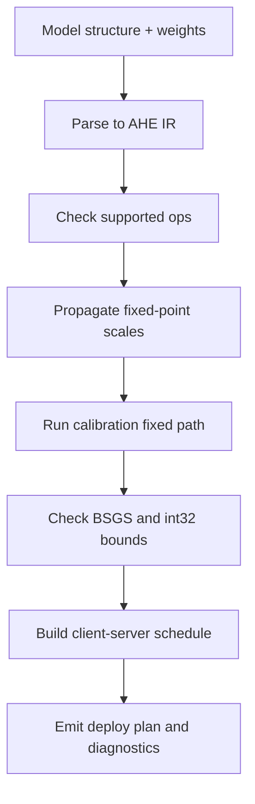

# AHE 同态推理模型动态解析算法计划

## 依据与边界

- 论文 `[Documents/2024-Privacy-Preserving Verifiable Neural Network  Inference Service.pdf](Documents/2024-Privacy-Preserving%20Verifiable%20Neural%20Network%20%20Inference%20Service.pdf)` 给出的不是通用动态模型解析算法，而是固定 CNN 流程：输入固定点编码 `f=16`，线性层由 AHE 服务端计算；非线性激活不能由 AHE 执行，需客户端解密执行；每层后交互截断是为了避免明文从约 35 bit 增长到 `>80 bit` 导致离散对数解密失败。
- 当前仓库已有家族模板式 HDC：`[vpin-client/vpin_client/hdc/layer_ir.py](vpin-client/vpin_client/hdc/layer_ir.py)`、`[vpin-client/vpin_client/hdc/range_propagate.py](vpin-client/vpin_client/hdc/range_propagate.py)`、`[vpin-client/vpin_client/hdc/orchestration.py](vpin-client/vpin_client/hdc/orchestration.py)`，但 `model_decomposer.py` 只支持 `network_a` 与 `lenet_cifar` 两个 family，不是任意模型解析。
- 不能调整当前 `network_a` / `network_b`；它们只作为参考实现与回归基线。重点从 `lenet_cifar` 入手，修复/验证 CIFAR10 LeNet 的 AHE 推理路径。
- 外部调研结论会进入设计约束：CIFAR10 ResNet20/32/56 可达约 92% 到 94%+，ResNet-18 可达约 95.49%，但 BN、残差 Add、多层 ReLU、下采样和大量通道会显著增加交互轮次与 BSGS 风险；因此 ResNet 初期作为解析/诊断模型，而不是第一阶段完整 AHE 跑通目标。

## 动态解析算法设计

将算法命名为 `AHEModelAnalyzer`，输入包括模型结构、权重、输入适配器、校准集、密码参数和目标精度阈值，输出 `homomorphic_deploy_plan.json` 与可部署诊断。

算法核心步骤：

1. 结构解析：优先用 PyTorch `torch.fx` 或显式 `nn.Module` 遍历，把模型转换为统一 IR。首批支持 `Conv2d`、`Linear`、`ReLU`、`Flatten`、`AvgPool/SumPool`；`BatchNorm` 只能在推理前融合进 Conv/Linear；`MaxPool`、`Dropout`、动态控制流标记为不可部署或需替换。
2. 尺度传播：复用 `[vpin-client/vpin_client/hdc/scale_rules.py](vpin-client/vpin_client/hdc/scale_rules.py)` 的 `F=16`、`BSGS_ABS_SAFE_LIMIT=m^2-1`、`INT32_ABS_SAFE_LIMIT=2^31-1`，对每个线性层输出和 checkpoint 计算 `from_bits/to_bits`。
3. 边界识别：遇到 `ReLU` 生成客户端 checkpoint；遇到纯缩放/平均池化生成可选 checkpoint；遇到 FC/Conv 后若下一层会使幅度越界，则插入 `shift` 或 `relu_then_shift`。
4. 范围校准：在校准集上运行定点明文路径，记录每个 checkpoint 的 `M_pre/M_post`、bit width、BSGS 安全余量和 int32 重加密安全余量。
5. 交互编排：沿用并扩展当前 `needs_client_return` 规则：`relu/relu_then_shift/relu_only` 必回传；纯 `shift` 仅在 BSGS 或 int32 风险存在时回传，否则允许服务端同态乘公开缩放常数并加入 `skip_return_phases`。
6. 可部署判定：输出 `range_ok`、`accuracy_ok`、`deployable`、`unsupported_ops`、`overflow_causes`、`recommended_shift_plan`，并区分“结构不支持”“范围不可解密”“定点精度掉点”“后端引擎缺失”四类失败。

## LeNet-CIFAR10 验证路径

先不引入复杂 ResNet，集中解决当前 LeNet 的低准确率和 AHE 跑通问题：

- 核对当前 LeNet 的六个 checkpoint：`after_conv1`、`after_pool1`、`after_conv2`、`after_pool2`、`after_fc1`、`after_fc2`。现有 `[model_training/network_lenet/truncation_config.py](model_training/network_lenet/truncation_config.py)` 指定 pool `28→16`、FC `32→16`，与 `[model_training/network_lenet/model.py](model_training/network_lenet/model.py)` 的定点路径一致。
- 对照现有 `model_training/outputs/20260623_185935/hdc_validation_report.json`：当前 fixed/proxy 准确率约 `56.54%`，float 约 `64.26%`，`range_ok=true`，但 `ahe_mode=plain_homomorphic_proxy`，说明还需要把 WebSocket 真实 AHE 路径作为验收主目标。
- 检查 `[vpin-backend/vpin_backend/inference/ahe_engine_lenet.py](vpin-backend/vpin_backend/inference/ahe_engine_lenet.py)` 与 `[vpin-backend/vpin_backend/inference/homomorphic_network_lenet.py](vpin-backend/vpin_backend/inference/homomorphic_network_lenet.py)` 的真实密文状态机，重点验证 pool `skip_return` 的服务端 shift、conv 内部 `f=32→16`、FC bias scale 与客户端 `apply_client_action` 是否完全一致。
- 若准确率仍低，优先调整训练/模型接入参数，而不是密码算法：数据增强、QAT 强制训练轮数、权重量化感知损失、通道数轻微扩大、pool/FC shift 策略校准。每次调整都输出 float、fixed、proxy/AHE、range 四组指标。

## 外部模型调研与测试模型策略

- LeNet：先复用当前仓库 LeNet-CIFAR 作为主测试模型；如需参考外部实现，只吸收训练技巧和结构约束，不直接套用与当前 AHE 不兼容的 MaxPool/BN/Dropout 流程。
- ResNet：参考 `akamaster/pytorch_resnet_cifar10` 的 CIFAR ResNet20/32/56 与 `patr1ckzhu/resnet-cifar10` 的 CIFAR ResNet-18。第一阶段只做解析和诊断：BN 融合、残差 Add 是否可作为线性同态 add、每个 ReLU 是否触发交互、每个 stage 的幅度是否超 BSGS。
- 若 ResNet 诊断显示交互轮数或 BSGS 风险不可接受，输出明确的不可部署报告，并设计 AHE-friendly ResNet-lite 变体作为后续实验，而不强行把标准 ResNet 塞进当前密码体制。

## 实施顺序

1. 只读核对并补充一份设计文档，明确论文约束、当前实现差距、动态解析算法输入/输出、支持算子集合和失败分类。
2. 扩展 HDC IR/解析器，从“family 模板”升级为“模型结构解析 + family fallback”：保留 `network_a`/`network_b` 不变，新增 LeNet 动态解析路径。
3. 给 LeNet 增加一致性测试：模型定点层输出、deploy plan、WebSocket AHE 真实路径、`skip_return_phases` 状态机全部对齐。
4. 训练/修复 CIFAR10 LeNet：以 fixed acc 和真实 AHE parity 为主指标，目标先设 fixed/AHE ≥60%，再尝试提升到 70% 左右；每轮保留 metrics 与 range report。
5. 加入 ResNet 解析诊断实验：不要求完整 AHE 跑通，先验证动态解析器能给出可解释的支持/不支持与交互成本报告。
6. 最终沉淀为 CLI：输入模型权重/结构和校准集，输出 deploy plan、交互编排、解密失败风险报告、测试摘要。

## 验收标准

- 不修改 `network_a` / `network_b` 行为，现有 Network A AHE smoke 和 HDC 测试仍通过。
- LeNet-CIFAR 生成的 deploy plan 与真实 WebSocket AHE 状态机一致，`range_ok=true` 时不会因 BSGS 明文范围导致最终解密失败。
- 动态解析器能对至少两个模型族输出结果：LeNet 为可部署或给出可修复原因；ResNet 为解析成功但可部署诊断可能失败，且失败原因可追溯到具体层、checkpoint、bit width 或 unsupported op。
- 产出文档明确区分论文已有的固定截断流程、仓库当前 HDC 模板实现、以及新增动态解析算法，避免把推导假设写成论文事实。