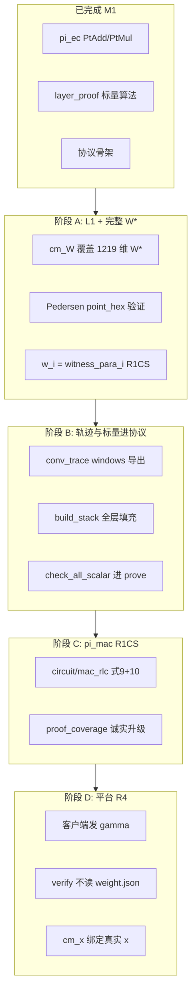
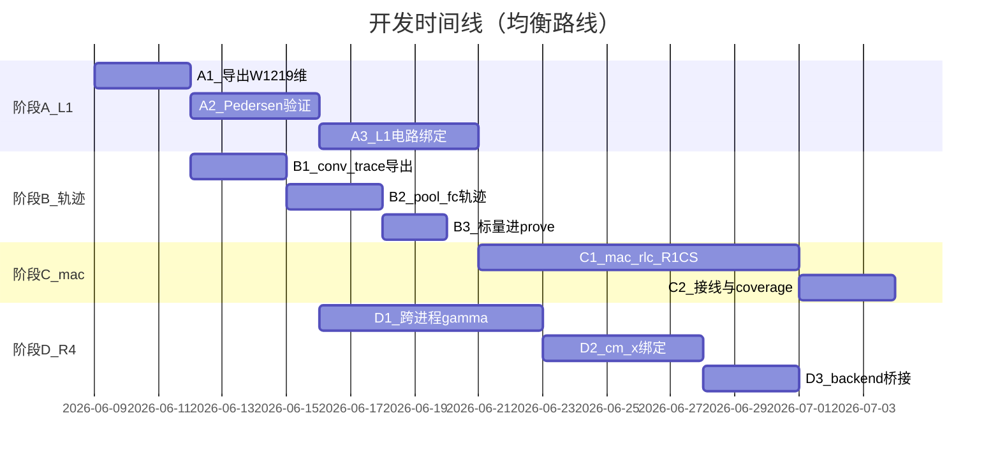

# cp-snark-full 开发顺序与详细步骤

> **⚠️ 排期以 [`docs/综合未来工作路线图.md`](../../docs/综合未来工作路线图.md) 为准。** 本文保留 Plan A→D 历史步骤；**阶段 C 已废止**；**A.3 L1 R1CS 未完成**（见路线图 §1.4.5、§5 M1-L1）。

## 一、现状快照

### 已完成（M1，勿重复立项）

| 能力 | 代码落点 | 论文对应 |
|------|----------|----------|
| 协议骨架 Setup→承诺→γ→prove→verify | [`protocol/`](src/cp-snark-full/src/protocol/)、[`prove/pipeline.rs`](src/cp-snark-full/src/prove/pipeline.rs) | 论文 Setup + 协作证明流程 |
| EC 子电路 SNARK（PtAdd/PtMul） | [`circuit_prove.rs`](src/cp-snark-full/src/circuit_prove.rs) + `vPIN_proof_generation` | §V EC gadget |
| Pedersen cm_W/cm_x + transcript | [`commitment.rs`](src/cp-snark-full/src/commitment.rs) | Setup 承诺 |
| 标量层 MAC/RLC 算法 | [`layer_proof/`](src/cp-snark-full/src/layer_proof/) | 式 (5)(7)(8)(9)(10) |
| 模型存储接口（task3 占位） | [`model/`](src/cp-snark-full/src/model/)、[`model_store/`](src/cp-snark-full/model_store/) | task3 设计 |
| P0 编码统一 | [`curve.rs`](src/cp-snark-full/src/curve.rs) | 曲线嵌入 $n_2=q_1$ |

**诚实标签：** 当前 `proof_coverage = ec_gadget_only`（或 `ec_plus_scalar_check` 若存在 `conv_trace.json`）。**不能**宣称论文级端到端命题。

### 核心缺口（按你决策后的优先级）



---

## 二、你的决策如何影响顺序

| 决策 | 影响 |
|------|------|
| **启动 L1** | 阶段 A 提前到最前；阻塞 task3(c) 承诺语义与 R3 cm_W |
| **完整 W*≈1219 维** | `commit_model` 输入从 178 轨迹标量改为 `.npy` flatten；L1 用 Merkle+L1′ 或全量等式（1219 维规模可接受，见 [`CP-SNARK自检` §7.2](docs/CP-SNARK自检与计算量预估.md)） |
| **均衡：cp-snark + R4** | 阶段 A–C 与阶段 D 可部分并行；**task3 产品化（HTTPS/DB/截断）后置** |

---

## 三、分阶段详细步骤

### 阶段 A — 完整 W* 承诺 + L1 绑定（P0，约 1–2 周）

**理论依据：**
- [`模型参数密码学绑定与客户端验证规范.md`](docs/模型参数密码学绑定与客户端验证规范.md) §0.2–§0.4：$\mathbf{W}^* \neq \mathbf{w} \neq a_j$
- [`CP-SNARK自检` §7.2](docs/CP-SNARK自检与计算量预估.md)：L1 等式 $\Delta C_{L1} \approx 484$，对 638k 约束 **<0.1%**
- 论文 Setup：服务端对完整模型参数承诺，客户端保存 $\mathsf{cm}_W$

#### A.1 导出完整 $\mathbf{W}^*$ 向量（1219 维）

**目标：** `commit_model` 承诺与 `.npy` 静态参数一致，而非 `weight.json` 轨迹标量。

**步骤：**
1. 新增 Python 脚本 `src/cp-snark-full/python/export_full_weights.py`（或扩展 `fill_model_store_sample.py`）：
   - 读取 `Pre_trained_model/*.npy`（与 [`Server.py`](src/cnn_networks/Server.py) network A 路径一致）
   - 按 manifest 固定顺序 flatten：conv 核 + FC1 权重 + FC1 bias + FC2 权重 + FC2 bias → `Vec<u128>`（定点编码与 Server 一致）
   - 输出 `model_store/models/vpin-network-a/full_weights.json` 或扩展 `model_export.json` 的 `w_star_flat` 字段
2. Rust [`model/load.rs`](src/cp-snark-full/src/model/load.rs) 增加 `load_w_star(network) -> Vec<u128>`，校验 `len == 1219`
3. 更新 [`model/record.rs`](src/cp-snark-full/src/model/record.rs) 的 `weights_digest_hex` 与 `topology_hash_hex`

**验收：** `cargo test` 新增测试：1219 维向量与 Python 脚本输出一致；`num_weights == 1219`

#### A.2 Pedersen 承诺可验证（阶段 1.1）

**理论：** $C_W = rG + \sum_i H(i) \cdot w_i \cdot G$（[`commitment.rs`](src/cp-snark-full/src/commitment.rs) 已实现生成，缺验证）

**步骤：**
1. 在 [`commitment.rs`](src/cp-snark-full/src/commitment.rs) 实现 `verify_pedersen_open(point_hex, scalars, blind)` — 解压 `CompressedRistretto`，重算承诺点比对
2. **问题：** 当前 `protocol.json` **未保存** 盲化标量 $r$。方案二选一（实现时默认 **方案 1**）：
   - **方案 1（推荐 MVP）：** 验证方用明文 opening — prover 在 artifacts 中附带 `opening: { weights: [...], blind_hex }`（仅开发/联调；生产需方案 2）
   - **方案 2：** 实现 Spartan `CPS.Comm` 或 NIZK opening proof（工期更长，见审查报告 §三.1）
3. 改写 [`verify/pipeline.rs`](src/cp-snark-full/src/verify/pipeline.rs)：`verify_model_commitment` 验证 **point_hex**（非仅 `digest_hex`）
4. 删除或弱化 SNARK 外 `rlc_binding_hex`（审查报告 §四.2，与 witness 无密码学关联）

**验收：** `cargo run -- verify A` 在**不读** `weight.json` 的情况下，仅凭 `protocol.json` 中的 opening 或 NIZK 通过 Pedersen 验证

#### A.3 L1 电路绑定 $w_i = \mathrm{witness\_para}_i$（阶段 1.2）

**理论：** 将承诺标量与 R1CS `vars_para` 乘数槽对齐（[`绑定规范` §0.4](docs/模型参数密码学绑定与客户端验证规范.md)：$\mathrm{slot}(j) = n_{\mathrm{bit}} + 3466j$）

**步骤：**
1. 建立 **轨迹索引 $j$ → $\mathbf{W}^*$ 下标 $i$** 映射表：
   - 178 次 PtMul 的 $a_j$ 来自 rLCR 路径，需从 `Server.py` `weights_array` 逻辑导出 `j_to_wstar_index.json`
   - 完整 1219 维承诺 + 178 路 witness 绑定 → 采用 **L1′ Merkle 打开**（[`CP-SNARK自检` §7.3](docs/CP-SNARK自检与计算量预估.md)：$k_w=178$，$\log_2|W| \approx 10$，约束增量 ~1–8%）
2. 在 `circuit/` 新增 `bind_l1.rs`（或扩展 `point_mult.rs` 接线）：
   - 对每个 PtMul 槽 $j$：R1CS 约束 `vars_para[slot(j)] == embed(w_star[i_j])`
   - Merkle 路径约束：$w_{\mathrm{star},i_j}$ 是 $\mathsf{cm}_W$ 对应叶节点
3. `prove_ec_batch` 前注入 L1 约束块；`ProtocolArtifacts` 增加 `l1_binding_ok` 字段
4. `prover_pipeline` 改用 `load_w_star` 替代 `load_weights_only`

**验收：** 电路可满足性 + Pedersen 验证 + L1 约束同时通过；`proof_coverage` 可升为 `ec_plus_l1_binding`（新枚举值）

---

### 阶段 B — 轨迹填充 + 标量验证进协议（P0，约 1 周）

**理论依据：**
- [`各层计算量证明算法-论文对齐.md`](docs/各层计算量证明算法-论文对齐.md)
- [`model-trace-接口与卷积windows方案.md`](docs/model-trace-接口与卷积windows方案.md) §11.1（已定案：必须 Python 新导出 windows）

#### B.1 卷积 `conv_trace.json` 完整导出

**步骤：**
1. 扩展 [`Server.py`](src/cnn_networks/Server.py) `convertFormatForRust_conv()`：
   - 导出 `windows_flat`（每输出格 $k^2$ 窗口标量/编码）
   - 导出 `output_flat`（卷积输出）
   - 写入 `model_exports/{network}/conv_trace.json`
2. 补全 network A 实测数据（当前仅有 schema，无 windows）

**验收：** `build_linear_stack_optional("A")` 不再返回 `EcOnly` fallback

#### B.2 池化 / FC 轨迹

**步骤：**
1. 同理导出 `pool_trace.json`（PtAdd 链对应的窗口求和输入）
2. 导出 `fc_trace.json`（FC 层 MAC 输入/输出；[`layer_proof/fc.rs`](src/cp-snark-full/src/layer_proof/fc.rs) 已有玩具测试）
3. 更新 [`trace/build.rs`](src/cp-snark-full/src/trace/)：`build_stack_for_network` 填充 pool + fc（当前 `pool=None, fc=[]`）

#### B.3 标量验证接入 prove 路径

**步骤：**
1. [`prove/pipeline.rs`](src/cp-snark-full/src/prove/pipeline.rs) 已有 `run_scalar_check` 框架 — 确保 prove **前**调用 `ServerLinearProofStack::check_all_scalar()`，失败则 abort
2. 将结果写入 `ProtocolArtifacts.scalar_check_ok` 与 `proof_coverage`
3. **Witness 来源（建议默认）：** 从 E₂ 密文点 JSON（`pointMult`/`pointAdd`）解码填充层 Spec；u128 标量槽仅作对照测试

**验收：** `cargo run -- prove A` 输出 `scalar_check_ok: true`；`proof_coverage: ec_plus_scalar_check`

---

### 阶段 C — $\pi_{\mathrm{mac}}$ R1CS（M3，P1，约 2–3 周）

**理论依据：**
- 卷积式 **(9)**：$\sum_r \gamma^r \hat{a}_r = \sum_r \gamma^r \langle f, \mathrm{window}_r\rangle$，挑战 $\gamma$ 来自客户端
- FC 式 **(10)**：$\gamma'$ 压缩（`ClientChallenge.gamma_mult`）
- 池化式 **(7)**：**不进** $\pi_{\mathrm{mac}}$，仅标量 + $\pi_{\mathrm{ec}}$ PtAdd（架构草案 §11.2 已定案）
- **禁止** naive MAC 进 R1CS（约束 ~7.6×，架构草案 §8）

#### C.1 R1CS 设计（一个 `MacRlcProof`）

**粒度决策（采用架构草案推荐）：** 全栈 **一个** `mac_rlc` 子电路，内含 Conv(9) + FC(10) 两个 RLC 块（非每层独立 $\pi_{\mathrm{mac}}$）

**步骤：**
1. 实现 [`circuit/mac_rlc/mod.rs`](src/cp-snark-full/src/circuit/mac_rlc/mod.rs)：
   - 公开输入：$\gamma$, $\gamma'$, filter_flat, 拓扑元数据
   - Witness：windows, outputs, FC 输入/输出
   - 约束：式 (9)(10) 的 RLC 等式（参考 [`layer_proof/rlc.rs`](src/cp-snark-full/src/layer_proof/rlc.rs) 标量逻辑升 R1CS）
2. 实现 [`prove/mac.rs`](src/cp-snark-full/src/prove/mac.rs)：`prove_mac_rlc` 调用 Spartan prove
3. 实现 [`verify/mac.rs`](src/cp-snark-full/src/verify/mac.rs)：替换 `Err("not implemented")`
4. transcript 顺序：cm_W → cm_x → γ → π_mac → π_ec（与现 `append_*_to_transcript` 对齐）

**验收：** `mac_proof` 非 `None`；`proof_coverage: ec_plus_mac_rlc`；verify 通过

#### C.2 与 $\pi_{\mathrm{ec}}$ 的关系

- 178 路 PtMul 证明 **EC gadget 代数**（式 (5) 的同态实现路径）
- $\pi_{\mathrm{mac}}$ 证明 **MAC/RLC 陈述**（式 (9)(10)）
- 两者互补，不可替代（架构草案 §11.1 末段）

---

### 阶段 D — 平台 R4 跨进程合规（P0，约 2–3 周，与 B/C 部分并行）

**理论依据：**
- [`vpin-平台架构` §2.2 P4–P6](docs/vpin-平台架构-独立客户端与服务端（协议合规）.md)：$\gamma$ **仅客户端**生成；verify **不依赖** prover 侧文件
- [`综合未来工作路线图` 阶段 4](docs/综合未来工作路线图.md)

#### D.1 跨进程 $\gamma$ / prove / verify

**步骤：**
1. 在 `vpin-backend`（或新建 `vpin-protocol`）定义消息：
   - `ChallengeRequest` / `ChallengeResponse { gamma, gamma_add, gamma_mult }`
   - `ProveRequest { network, challenge }` / `ProveResponse { artifacts }`
2. 客户端进程：`ClientChallenge::sample` → TLS 发送 → 收 $\pi$
3. 服务端进程：收 $\gamma$ → `prover_pipeline(network, challenge)` → 返回 `protocol.json` 字节
4. 客户端：`verifier_pipeline(artifacts, challenge)` — **删除**对 `rust_files/weight.json` 的读取

**验收：** 平台架构 §9.4 验收项通过

#### D.2 $\mathsf{cm}_x$ 绑定真实输入 $x$

**步骤：**
1. 扩展 `public_inputs_for_network`：纳入客户端加密输入的定点编码哈希或密文承诺标量
2. 客户端在 P2 阶段提交 $\mathsf{cm}_x$；服务端 prove 时使用同一向量
3. 更新 [`commitment.rs`](src/cp-snark-full/src/commitment.rs) 的 `commit_public_inputs` 输入源

**验收：** 自检报告 P2 从 ❌ 升为 ⚠️/✅

#### D.3 `CpSnarkBridge` 对齐

- 更新 [`vpin-backend`](vpin-backend/) `crypto/cp_snark/bridge.py`：支持跨进程 challenge 注入与 artifacts 回传

---

### 阶段 E — 后置项（本轮不做）

| 项 | 原因 |
|----|------|
| task3 产品化（HTTPS 上传、DB、截断算法、前后端） | 你决策后置；依赖阶段 A + D |
| M2 目录重命名 `layer_proof` → `statement` | 非阻塞，可在 C 完成后做 |
| M5 verifier 独立 crate / FFI | 阶段 D 后再拆 |
| R5 Rust 同态引擎 | 平台 §8：R3/R4 早于 R5 |
| L3 端到端密文链 + 完整 vPIN | 长期（阶段 7） |
| benchmark `benches/cost_report.rs` | 阶段 C 完成后实测 |

---

## 四、论文公式 ↔ 代码映射速查

| 论文 | 含义 | 实现状态 | 目标模块 |
|------|------|----------|----------|
| Setup | $\mathsf{cm}_W$, $\mathsf{cm}_x$ | ⚠️ 弱 | 阶段 A + D |
| 式 (5) | 卷积逐格 MAC | ✅ 标量 | `layer_proof/conv.rs` |
| 式 (6) | 同态卷积 | Python Server | 参考实现 |
| 式 (7) | 池化求和 | ✅ 标量 | `layer_proof/pool.rs` |
| 式 (8) | FC MAC | ✅ 标量 | `layer_proof/fc.rs` |
| 式 (9) | 卷积 RLC + $\gamma$ | ⚠️ 标量 only | 阶段 C R1CS |
| 式 (10) | FC RLC + $\gamma'$ | ⚠️ 标量 only | 阶段 C R1CS |
| EC gadget | PtAdd/PtMul | ✅ SNARK | `circuit_prove.rs` |
| L1 绑定 | $w_i = \mathrm{witness}_i$ | ❌ | 阶段 A.3 |

---

## 五、推荐执行时间线



**并行建议：** B1 可与 A2/A3 并行（Python 导出不依赖 L1）；D1 可在 A2 完成后启动（Pedersen 验证是跨进程 verify 的前置）。

---

## 六、每阶段验收命令

```bash
cd src/cp-snark-full
cargo test                                    # 单元测试全绿
cargo run -- setup A                          # cm_W 显示 1219 weights
cargo run -- prove A                          # scalar_check_ok + mac_proof
cargo run -- verify A                         # 不依赖 weight.json
# 跨进程（阶段 D 后）
python vpin-backend/... # 客户端发 gamma → 服务端 prove → 客户端 verify
```

---

## 七、风险与依赖

1. **178 路 PtMul 与 1219 维 W* 的索引映射** 需从 `Server.py` 精确导出，否则 L1 绑定语义错误 — 建议先写对照测试脚本
2. **盲化标量 $r$ 未入 artifacts** — 跨进程 verify 前必须解决（A.2 方案 1 或 2）
3. **u128 溢出项** — 部分 `weight.json` 超 u128，原 `point_mult` 有截断风险；L1 绑定前应统一大整数编码路径
4. **task3 截断算法** 虽后置，但 R2 同态会话若需多轮截断，需在阶段 D 前至少有静态 $A_l$ 表（可从 [`vPIN论文与代码对照说明.md`](vPIN论文与代码对照说明.md) §二 提取）

---

## 八、关键文件索引

| 文档 | 路径 |
|------|------|
| 架构草案 M0–M5 | [`docs/cp-snark-full-架构草案.md`](docs/cp-snark-full-架构草案.md) |
| 综合路线图 | [`docs/综合未来工作路线图.md`](docs/综合未来工作路线图.md) |
| 绑定规范 | [`docs/模型参数密码学绑定与客户端验证规范.md`](docs/模型参数密码学绑定与客户端验证规范.md) |
| 论文对照 | [`vPIN论文与代码对照说明.md`](vPIN论文与代码对照说明.md) |
| 审查报告 | [`src/cp-snark-full/内部逻辑与论文忠实性审查报告.md`](src/cp-snark-full/内部逻辑与论文忠实性审查报告.md) |
| 任务需求 | [`tasks/task1.txt`](tasks/task1.txt) |
