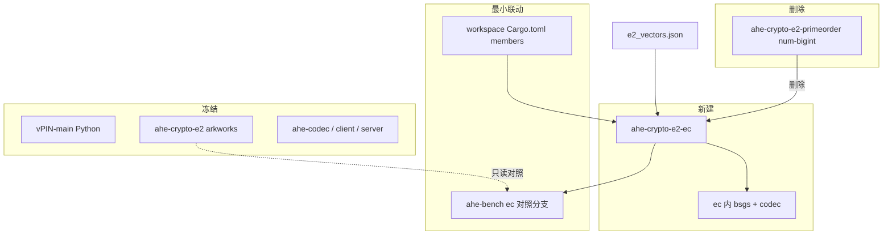

# E2 基于 elliptic-curves 的群运算实现计划

## 硬性边界（用户约束）

| 范围 | 策略 |
|------|------|
| **Python**（`vPIN-main/`） | **只读**。parity 仅读 `e2_vectors.json`，不改任何 `.py` |
| **arkworks 生产主线** | **冻结不动**。`ahe-crypto-e2`、`ahe-codec`、`ahe-client`、`ahe-server`、`ahe-homomorphic` 等生产路径一律不改 |
| **旧分线 `ahe-crypto-e2-primeorder`** | **可直接删除**。num-bigint 仿射 SW 已证慢 955×、依赖 ark/ahe-codec，结构不合理，**不就地修补** |
| **新实验 crate** | 从零新建（推荐名 **`ahe-crypto-e2-ec`**），基于 primefield + primeorder + E2 常量 |
| **对照基准** | arkworks 数字只读引用，**不触发切库** |
| **切主线** | **不在本计划内** |



---

## 为何删除而非重写 primeorder

现有 [ahe-crypto-e2-primeorder](d:/WorkStation/pythoncode/experiment-reproduction/vpin-platform/crates/ahe-crypto-e2-primeorder) 问题：

| 问题 | 说明 |
|------|------|
| 错误技术栈 | Cargo 描述写 crypto-bigint，实际 num-bigint 仿射 SW |
| 性能 | 微基准慢 arkworks **955×** |
| 错误依赖 | 运行时依赖 `ahe-crypto-e2`、`ahe-codec`，与「独立 elliptic-curves 栈」目标冲突 |
| 命名误导 | `primeorder` 名暗示 primeorder crate，实现却是手写 BigUint |
| 改造收益 | 就地重写 ≈ 删光重建，保留旧结构无价值 |

**决策（阶段 0 写入文档，默认执行）**：**删除整个 `crates/ahe-crypto-e2-primeorder/`**，新建 `crates/ahe-crypto-e2-ec/`。

---

## 背景与目标

| 项 | 现状 | 目标 |
|---|---|---|
| 生产主线 | `ahe-crypto-e2`（arkworks） | **不修改** |
| 旧实验分线 | `ahe-crypto-e2-primeorder` | **删除** |
| 新实验分线 | — | **`ahe-crypto-e2-ec`**（primefield + primeorder） |
| 成功门禁 | — | 微基准 **ec < arkworks**；parity **bit-exact** 对齐 fixture |
| 参考库 | `_refs/elliptic-curves` | 只读；实现用 crates.io |

E2 参数（252-bit prime-order SW，一般 `a`）：写入新 crate 的 `params.rs`（从 [curve.rs](d:/WorkStation/pythoncode/experiment-reproduction/vpin-platform/crates/ahe-crypto-e2/src/curve.rs) **只读复制** hex，不改 ark 文件）。

---

## 架构选型

**k256** 仅借鉴标量乘（wNAF、BasepointTable）；**p256/bp256** 为域与 `PrimeCurveParams` 模板：

- 域：`primefield::monty_field_params!` + `U256`
- 点：`primeorder::ProjectivePoint<E2>` + `EquationAIsGeneric`
- 标量乘：radix-16 → BasepointTable / wNAF

---

## 活文档

新建 [vpin-platform/docs/ahe/e2-elliptic-curves-实现日志.md](d:/WorkStation/pythoncode/experiment-reproduction/vpin-platform/docs/ahe/e2-elliptic-curves-实现日志.md)：

1. 知识提取表
2. **Crate 决策记录**（为何删 primeorder、新 crate 命名与模块树）
3. 算法调用链
4. 实现状态矩阵
5. 基准记录（ec vs ark）
6. 下一轮行动

---

## 迭代循环

知识提取 → 算法评估 → 文档 → **编码（仅 ec crate + 最小 workspace/bench 联动）** → 测试 → 未达标则重复 → 达标则完成报告。

---

## 阶段 0：知识提取 + Crate 决策（只读）

### 0.1 算法清单

（同前：traits / primefield / primeorder / k256 预计算 / wNAF 备选）

### 0.2 AHE 语义（只读 ahe-codec，在新 crate 内复刻）

| 操作 | `ahe-crypto-e2-ec` 内实现 |
|------|---------------------------|
| ElGamal enc/dec | 全射影 |
| BSGS | 自有 `bsgs.rs`，读 `tests/fixtures/table.bin` |
| 线格式 | BE u256；Identity = (0,0) |
| `scalar_mul_i64` | 专用快速路径 |

### 0.3 阶段 0 产出

- 文档：**确认删除 primeorder、新建 ec**
- 模块树与公开 API 草案（可与旧 `PoE2Point` 同名类型，但放在新 crate）

---

## 阶段 A：删除旧 crate + 新建骨架

### A.1 允许修改的文件范围

| 操作 | 路径 |
|------|------|
| **删除** | `crates/ahe-crypto-e2-primeorder/**` 整个目录 |
| **新建** | `crates/ahe-crypto-e2-ec/**` |
| **更新** | 根 [Cargo.toml](d:/WorkStation/pythoncode/experiment-reproduction/vpin-platform/Cargo.toml)：`members` / `workspace.dependencies`（primeorder → ec） |
| **更新** | [apps/ahe-bench/Cargo.toml](d:/WorkStation/pythoncode/experiment-reproduction/vpin-platform/apps/ahe-bench/Cargo.toml) + [main.rs](d:/WorkStation/pythoncode/experiment-reproduction/vpin-platform/apps/ahe-bench/src/main.rs)（**仅**对照分支改依赖 ec；**ark 分支不动**） |
| **新建** | `docs/ahe/e2-elliptic-curves-实现日志.md` |

**禁止修改**：`ahe-crypto-e2/**`、`ahe-codec/**`、`ahe-client/**`、`ahe-server/**`、`ahe-homomorphic/**`、`vPIN-main/**`

### A.2 新 crate 结构

```
crates/ahe-crypto-e2-ec/
  Cargo.toml
  src/
    lib.rs
    curve.rs
    field.rs          # Fq Montgomery
    scalar.rs         # Fr Montgomery
    arithmetic.rs     # PrimeCurveParams, EquationAIsGeneric
    point.rs          # E2PointWire（或 EcE2Point）线格式
    codec.rs          # ElGamal
    bsgs.rs           # 自包含 BSGS
    params.rs         # E2 hex 常量
  tests/
    e2_vectors.rs     # 从旧 primeorder 测试迁移逻辑，对齐 fixture
```

**依赖**（无 ark、无 ahe-codec、无 num-bigint）：

```toml
elliptic-curve = "0.13"
primefield = "0.13"
primeorder = "0.13"
crypto-bigint = { version = "0.5", features = ["rand"] }
memmap2 = "0.9"
rand = "0.8"
num-bigint = "0.4"   # 仅 ElGamal 标量 BigUint 接口兼容 ahe-bench，非域运算
```

### A.3 测试门禁

```bash
cargo test -p ahe-crypto-e2-ec
# 确认 workspace 编译通过（生产 crate 不受影响）
cargo build --release -p ahe-server -p ahe-cli
```

---

## 阶段 B：AHE 闭环 + ahe-bench 联动

- `encrypt_scalar_with_r` / `decrypt_pair` / `KeyMaterial` 在新 crate 完成
- BSGS：复制 table 格式与 giant_step 到新 `bsgs.rs`（**不改** ahe-codec）
- ahe-bench：`compare` 子命令第二路改为 `ahe-crypto-e2-ec`；第一路 ark **原样**

```bash
cargo run -p ahe-bench --release -- compare --iterations 20
```

---

## 阶段 C：性能优化（直至 ec < arkworks）

ark 基线（只读）：**20× enc+dec = 3.41 ms**。

| 优先级 | 优化项 |
|--------|--------|
| C1 | BasepointTable（`k*G`） |
| C2 | 射影热路径 |
| C3 | `scalar_mul_i64` |
| C4 | wNAF / Precomputed backend |
| C5 | BSGS batch normalize |

**达标**：ahe-bench 中 **ec 总耗时 < ark**。

---

## 阶段 D：完成报告

1. 实现日志：删 primeorder 理由、ec 最终架构、parity 与基准
2. 可选在评估文档**末尾追加** ec 分线结果（不改 ark 生产结论）
3. 记录：生产仍 arkworks；ec 为独立候选栈

---

## 风险与应对

| 风险 | 应对 |
|------|------|
| 删 crate 后 ahe-bench 编译失败 | 阶段 A 同步改 bench 依赖 |
| workspace 其他 crate 误依赖 primeorder | grep 确认仅 bench；生产 crate 无依赖 |
| ec 仍慢于 ark | C1–C5 迭代；文档记录，不切主线 |
| BSGS 与 ahe-codec 漂移 | 同一 table.bin + 单测 decrypt 结果 |

---

## 关键文件

| 用途 | 路径 | 操作 |
|------|------|------|
| **删除** | `crates/ahe-crypto-e2-primeorder/` | 整目录 |
| **新建** | `crates/ahe-crypto-e2-ec/` | 从零 |
| 参数只读 | `ahe-crypto-e2/src/curve.rs` | 不修改 |
| Fixture | `tests/fixtures/e2_vectors.json` | 只读 |
| 微基准 | `apps/ahe-bench/` | 仅 ec 分支 |
| 模板 | `_refs/elliptic-curves/bp256/src/r1/` | 只读 |
