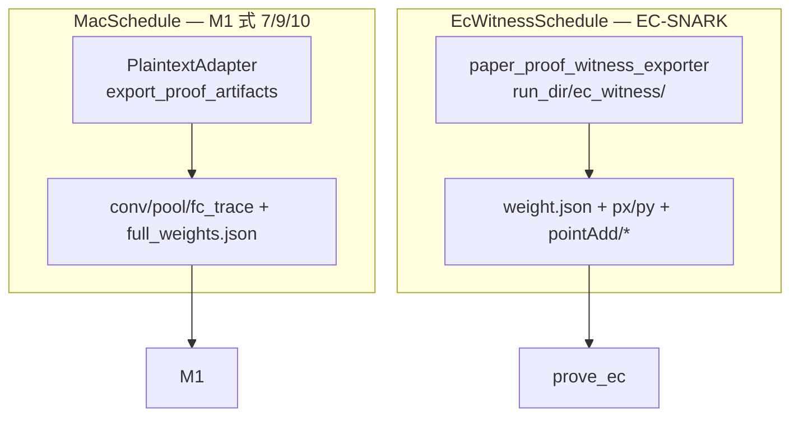

# vPIN 计算量证明（CP-SNARK）— 统一计划

> **唯一计划**（已合并并废止独立立项）  
> - 原 [`network_a_计算量证明_cee3fbd9.plan.md`](network_a_计算量证明_cee3fbd9.plan.md)  
> - 原 [`network_a_模块化证明_45ccdca0.plan.md`](network_a_模块化证明_45ccdca0.plan.md)  
> - 原 [`network_a_模块化证明_56b1c1fe.plan.md`](network_a_模块化证明_56b1c1fe.plan.md)  
>
> 规范引用：[`docs/cp-snark/`](docs/cp-snark/) · 计数：[`论文EC-Witness计数规范-NetworkA.md`](docs/cp-snark/论文EC-Witness计数规范-NetworkA.md)

---

## 0. 模块边界

| 范围 | 路径 |
|------|------|
| 证明核心 | [`src/cp-snark-full/`](src/cp-snark-full/) |
| Witness 导出 | [`model_training/network_a/`](model_training/network_a/) |
| 后端 Proof API | [`vpin_backend/api/`](vpin-backend/vpin_backend/api/)、[`proof/`](vpin-backend/vpin_backend/proof/) |
| 前端 | [`vpin_frontend/`](vpin_frontend/vpin-frontend/) |
| 本地客户端 | [`vpin-client/`](vpin-client/vpin_client/) |
| **不在范围** | [`inference/engine.py`](vpin-backend/vpin_backend/inference/engine.py) |

---

## 1. 算法定案（合并自模块化计划）

### 1.1 两套计数 — 不混用

| 模式 | `EcWitnessMode` | PtMul | PtAdd | 用途 |
|------|-----------------|-------|-------|------|
| **paper_proof**（证明线 **唯一**） | `paper_proof` | schedule 推导（A 为 178） | 2144 | 式 (9)(10) **RLC 压缩**后 EC-SNARK；[`ec_witness_schedule.py`](model_training/network_a/ec_witness_schedule.py) |
| **ahe_homomorphic**（AHE 产品对账） | `ahe_homomorphic` | ~18,560 | ~18,330 | [`homomorphic_network_a`](vpin-backend/vpin_backend/inference/homomorphic_network_a.py) `get_op_counters()`；**不进** `prove_ec` |

**禁止：** 写死 178、用 AHE 朴素计数驱动 SNARK、或 silent fallback 到 `rust_files/A`。

### 1.2 双轨 Witness



| 适配器 | 状态 | 输出 |
|--------|------|------|
| **PlaintextAdapter** | 已有脚本 | `{run_dir}/proof_artifacts/*_trace.json` |
| **RlcrAdapter / paper_proof exporter** | **待做** | `ec_witness/`（rLCR 语义，**非** legacy 复制） |

MVP AHE（parity=0）只证明**推理实现正确**；SNARK 仍走 **paper_proof / rLCR 轨迹**。

### 1.3 论文算法 → 层映射

| 式 | 层 | M1 验证 | M5（stub） | EC 区间 |
|----|-----|---------|------------|---------|
| (9) | conv | `verify_conv_eq9_rlc_only` | `conv_mac.rs` | PtMul `[0,18)` |
| (7) | pool | `verify_pool_eq7_per_cell` | `pool_sum.rs` | PtAdd pool 段 |
| (10) | fc1/fc2 | `verify_fc_eq10_rlc_only`（γ′） | `fc_mac.rs` | PtMul FC 段 |

### 1.4 Network A 拓扑（冻结）

来源：[`model_training/network_a/model.py`](model_training/network_a/model.py) + [`topology.py`](vpin-backend/vpin_backend/crypto/ahe/topology.py)

- 28×28 → pad **32×32**；Conv 3×3 pad=1；Pool **4×4** stride 4 → 64 维；FC 64→16→10；$N_W=1219$
- trace 以 **AHE 实际 topology** 为准（shift 24/30 热路径 vs truncation_config 26/32 须在 `proof_manifest.json` 冻结）

### 1.5 防模型替换（B′ 目标）

```text
cm̂ ← CPS.Comm(W*)
π  ← Spartan(EC) + transcript(cm̂, cm_x, γ, γ′)
M1 ← 式 (9)(7)(10) + trace digest
L1 ← PtMul 槽 j ↔ W* + γ′
```

M5 全量 in-circuit eq9/7/10 **不在 MVP**；`layer_proofs_plus_cps` = CPS + EC SNARK + M1 + L1。

---

## 2. 曲线嵌入（$n_2 = q_1$，已实现）

| 符号 | 本仓库 | 说明 |
|------|--------|------|
| $q_1$ | Ristretto / `embed_u128_to_scalar` | SNARK 域 |
| $n_2$ | `Client.curveBaseField` = [`curve.rs`](src/cp-snark-full/src/curve.rs) | **= $q_1$** ✓ CI 已绿 |
| $q_2$ | `curveOrder` | ElGamal；**≠** $q_1$ |

UI：`GET /proof/curve-embed` 只读展示。详述 [`CP-SNARK自检与计算量预估.md`](docs/cp-snark/CP-SNARK自检与计算量预估.md) §10。

---

## 3. 产品流程（启用 CP-SNARK）

[`SessionContextBar.vue`](vpin_frontend/vpin-frontend/src/components/SessionContextBar.vue) `cpSnarkEnabled` → 扩展协议：

1. **GET /proof/plan** — 拓扑、双 schedule 摘要、`EcWitnessMode`、manifest、W* Merkle、$n_2=q_1$
2. **层勾选** — conv / pool / fc1 / fc2（控制 M1 范围 + trace digest）
3. **AHE Infer**（已有）→ **POST /proof/export** — Plaintext + EC witness 写入 run_dir
4. **P4** — 客户端 `gamma` / `gamma_mult`(γ′) / `gamma_add`；`num_point_*` 来自 schedule
5. **POST /proof/prove** — `cp-snark-full`；transcript：cm_W(CPS) → Pedersen cm → γ → sub_circuit → π
6. **本地 verify** — M1 → L1 → CPS.Ver → EC（Z.8）；[`CpSnarkVerifyDrawer.vue`](vpin_frontend/vpin-frontend/src/components/) 分步详情

---

## 4. 待实现（唯一 backlog）

### §A 核心 — cp-snark-full + exporter

| 项 | 动作 |
|----|------|
| 去 legacy | `load_data` / `trace/ec` 无 witness root → Err |
| paper_proof 导出 | `paper_proof_witness_exporter.py`；删 `--from-legacy` |
| FC 全量 M1 | 删 `fc_layers.clear()`；exporter 重算 fc_trace |
| trace digest | `scalar_trace_digest_hex` prove/verify |
| 负面测试 | 篡改 W* / cm_W / fc_trace → fail |
| M5 | stub 边界文档化；不迁 1024 窗 R1CS |

### §B 产品 — API + UI + client

| 项 | 动作 |
|----|------|
| `routes/proof.py` | plan / export / prove / verify / curve-embed |
| `cpSnarkClient.js` + WitnessPanel + VerifyDrawer | 拓扑树、schedule 表、层勾选 |
| `proof_pipeline.py` | infer 后 export → P4 → prove → verify |
| `useProtocolSession.js` | CP-SNARK 步骤与时间线事件 |

### §C 文档（可选但建议）

- 新建 [`docs/network-a-模块化计算量证明编排.md`](docs/network-a-模块化计算量证明编排.md)：ProofPlan API、178 vs 18560、witness 契约

---

## 5. 验收（DoD）

**核心**

- [ ] EC 仅读 `{run_dir}/proof_artifacts/ec_witness/`；无 legacy
- [ ] M1 含 FC eq10；无 fallback
- [ ] trace digest + 负面测试 + `full A` artifacts

**产品**

- [ ] CP-SNARK UI：拓扑 + witness 详情 + 双模式计数说明 + $n_2=q_1$
- [ ] 层勾选 + 客户端 γ/γ′ prove + 本地 verify 详情
- [ ] `/proof/plan` + `/proof/prove` E2E

---

## 6. 关键文件

| 用途 | 路径 |
|------|------|
| Prove/Verify | [`prove/pipeline.rs`](src/cp-snark-full/src/prove/pipeline.rs)、[`verify/pipeline.rs`](src/cp-snark-full/src/verify/pipeline.rs) |
| Witness API | [`witness/`](src/cp-snark-full/src/witness/)、[`proof_plan.py`](vpin-backend/vpin_backend/proof/proof_plan.py) |
| Schedule | [`ec_witness_schedule.py`](model_training/network_a/ec_witness_schedule.py) |
| 绑定 | [`bind_l1.rs`](src/cp-snark-full/src/circuit/bind_l1.rs)、[`模型参数绑定计算轨迹-数学推导.md`](docs/cp-snark/模型参数绑定计算轨迹-数学推导.md) |

---

## 附录 A — 已废止的旧计划项（勿重复立项）

以下在旧 `.cursor/plans` 中为 pending，**现已完成或并入上文**，不再单独跟踪：

- `export_proof_artifacts` + 20260622 run、`ProofPlan`/`EcWitnessBundle`、registry  
- `ec_witness_schedule` paper_proof 推导（废止写死 178）  
- M1 verifier、CPS B′、Z.8 transcript、层 π stub、ProveRequest.run_dir  
- `sync_ptmul_weights` + L1 schedule、FC bias 绑定  
- `prover_pipeline_with_plan`、ProtocolArtifacts v3  

以下 **明确不做或延后**：

- `proof_plan/` Rust 子 crate（已由 `witness/` + Python schedule 替代）  
- `engine.py` 去 178 硬编码（证明线不经 engine）  
- AheAdapter 驱动 SNARK（仅 ahe_homomorphic 对账 UI）  
- homomorphic 补 rLCR 进 engine（改为 **exporter** 从 run 导出 paper_proof EC）  
- M5 全量 1024 窗 conv R1CS  
