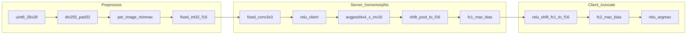

# Network A GPU 训练与 AHE 对齐方案

## 背景与约束

AHE 推理 **不是任意 CNN**，而是固定拓扑 Network A（见 [`vpin-backend/vpin_backend/crypto/ahe/topology.py`](vpin-backend/vpin_backend/crypto/ahe/topology.py)）：

| 层 | 参数 | 说明 |
|----|------|------|
| Conv 3×3 padding=1 | **固定** `[[1,0,1],[2,0,2],[1,0,1]]` | 硬编码于 [`homomorphic_network_a.py`](vpin-backend/vpin_backend/inference/homomorphic_network_a.py)，**不可训练** |
| ReLU | 客户端截断 | `after_conv` |
| AvgPool 4×4 stride 4 | 固定 `1/16`，10-bit 定点乘子 | 输出 8×8→flatten 64 |
| Shift（见下节截断方案） | 客户端 | `after_pool` / `after_fc1` |
| FC 64→16 + bias | **可训练** | 导出 `weight_fc1_64_16.npy` / `bias_fc1_16.npy` |
| ReLU + Shift（见下节） | 客户端 | `after_fc1` |
| FC 16→10 + bias | **可训练** | 导出 `weight_fc2_16_10.npy` / `bias_fc2_10.npy` |
| ReLU | 客户端本地 argmax | `after_fc2` |

预处理必须与 [`vpin-client/vpin_client/data/preprocess.py`](vpin-client/vpin_client/data/preprocess.py) 一致：

```text
uint8(28×28) → ÷255 → pad 32×32 → 单图 min-max → clip [0.001,0.9999999] → ×2^16 int32
```

**已修复的 AHE 解密要点**：`decrypt_tensor` 后 `astype(int32)` 映射（[`codec.py`](vpin-client/vpin_client/crypto/ahe/codec.py)），训练侧定点前向必须与该语义一致。

**权重部署（用户确认）**：写到 `model_training/outputs/<run_id>/`，并通过 [`registry.py`](vpin-backend/vpin_backend/storage/registry.py) 的 `upsert_model` 注册新条目（不覆盖 `src/cnn_networks/Pre_trained_model/` 旧权重）。

**截断方案（由实现方决定，约束：AHE 可正确解密）**：见下节；用户不要求死守 legacy 26/32，但须在 int32 / BSGS 可恢复范围内。

---

## 截断方案（已定稿，可校准）

### AHE 解密边界（硬约束）

- 解密后统一做 **`int32` 有符号解释**（`decrypt_tensor` → `astype(int32)`），有效范围 **[-2³¹, 2³¹-1]**
- 同态 FC 后密文解密值允许为负；**ReLU 必须在 int32 语义下执行**（不能对无符号大正数做 relu）
- BSGS 表实测可恢复 **~±2×10⁹** 量级标量；训练/截断目标：每层输出 **|x| ≤ 2³⁰**（留 1bit 余量给同态累加误差）
- Pool 平均乘子保持 **10-bit 定点** `inv_fp = round((1/16) × 2¹⁰)`（与 [`homomorphic_network_a.py`](vpin-backend/vpin_backend/inference/homomorphic_network_a.py) 一致，不改）

### 默认四轮截断（v1 基线，与当前 AHE 代码兼容）

| phase_id | 执行方 | client_action | from_bits → to_bits | 说明 |
|----------|--------|---------------|---------------------|------|
| `after_conv` | 客户端 | `relu` | 16 → 16 | Conv 输出已是 f=16 |
| `after_pool` | 客户端 | `shift` | **26 → 16** | Pool 累加 f16 × inv_fp(f10) |
| `after_fc1` | 客户端 | `relu_then_shift` | **32 → 16** | FC1 MAC：f16×f16 累加 |
| `after_fc2` | 客户端 | `relu_only` | 16 → 16 | 最终 logits，本地 argmax |

**单一真源**：新增 [`model_training/network_a/truncation_config.py`](model_training/network_a/truncation_config.py) 导出 `TRUNCATION_PLAN`；训练 `forward_fixed_point()`、导出 `truncation_config.json`、评估 layerwise 均读此配置。

### 训练前自动校准（可选微调 shift_bits）

在阶段 A 结束后、阶段 B 开始前，用 **200 张训练图** 跑明文定点前向，统计每层 `max(abs)`：

```text
shift_pool  = clamp(ceil(log2(max_after_pool)) - 16 + 1,  min=24, max=28)
shift_fc1   = clamp(ceil(log2(max_after_fc1_pre_relu)) - 16 + 1, min=30, max=36)
```

- 若校准结果 **等于默认 26/32**：不改动 [`topology.py`](vpin-backend/vpin_backend/crypto/ahe/topology.py)
- 若 **不同**：写入 `outputs/<run_id>/truncation_config.json`，并同步更新 `topology.py` 的 `NETWORK_A_TRUNCATION` + 文档（一次训练一次配置，避免 silent drift）
- **禁止** 改动：四轮结构、relu 位置、pool 4×4、inv_fp 10-bit（同态电路已固定）

### 为何不在训练时加大截断 aggressiveness

过度右移（shift 过大）会损失精度、难达 90%；过小则 FC 中间值超 int32/BSGS。校准 + 默认 26/32 在已验证的 AHE 链路上 **layerwise max diff = 0**，作为安全起点。

---

## 目录结构（新增）

```text
model_training/
  network_a/
    __init__.py
    model.py              # PyTorch NetworkA，拓扑与 homomorphic 层对齐
    preprocess.py         # torch 版 pad/min-max（与 vpin_client 数值一致）
    truncation_config.py  # 截断方案单一真源（默认 26/32，可校准）
    fixed_point.py        # shift/truncate/relu（读 truncation_config）
    dataset.py            # MNIST 官方 60k/10k 划分 + DataLoader
    train.py              # GPU 训练主入口
    export_weights.py     # 导出 4 个 npy + metrics.json
    evaluate.py           # 明文定点评估 + AHE 抽样/全量 parity
    register_backend.py   # 写 registry.json（weights_dir 指向 outputs）
  outputs/
    <timestamp>/          # 每次训练产物
      weight_fc1_64_16.npy
      bias_fc1_16.npy
      weight_fc2_16_10.npy
      bias_fc2_10.npy
      metrics.json
      truncation_config.json   # 实际使用的 shift_bits（默认或校准后）
      registry_snippet.json
```

扩展 [`model_training/run.py`](model_training/run.py)：增加 `--task network-a` 分发到 `network_a/train.py`（保留现有 pytorch/numpy 入口不变）。

---

## 模型前向（训练必须与 AHE 同构）



**`model.py` 实现要点**：

- `register_buffer("conv_weight", ...)` 固定卷积核，**不参与 optimizer**
- `nn.Linear(64,16)` / `nn.Linear(16,10)` 对应 FC 权重；前向中手动 flatten(64) 而非 `nn.Flatten` 链，确保与 `homomorphic_network_a.flatten_ciphertext` 顺序一致
- Pool：对 32×32 特征图做 **求和池化 4×4** 再乘 `(1/16)`（与 legacy `myAvgPool2d` 一致，非 `AvgPool2d` 默认均值浮点路径）
- 提供两种 forward：
  - `forward_float()`：快速预热（仍用相同拓扑+预处理，无截断）
  - `forward_fixed_point()`：按 `truncation_config.py` 插入 relu/shift（默认同 AHE：pool 26→16，fc1 32→16；校准后自动跟随）

**训练策略（两阶段，保证 AHE 不掉点）**：

1. **阶段 A（Float 预热，~30 epoch）**：`forward_float()` + CrossEntropy，AdamW + cosine LR，目标先在 float 路径上把 test acc 拉到 ≥92%（为 QAT 留余量）
2. **阶段 B（定点微调，~20 epoch）**：切换 `forward_fixed_point()` + 较小 LR；loss 仍 CE；可选 STE round 到 int32 再反传
3. **早停条件**：`acc_fixed_point_test >= 0.90` 且连续 3 epoch 无提升

仅优化 `fc1`/`fc2` 的 weight/bias（4 个张量），参数量 ~1.2k，GPU 训练很快。

---

## 数据划分

- **训练集**：`torchvision.datasets.MNIST(train=True)`，60,000 张
- **测试集**：`torchvision.datasets.MNIST(train=False)`，10,000 张
- **不做随机再划分**（与 MNIST 官方 benchmark 一致）；`DataLoader(shuffle=True)` 仅用于训练 batch
- 缓存目录：`model_training/data/mnist/`（`download=True`）
- 训练脚本内 **禁止** `Normalize(mean,std)`（与 AHE 预处理不一致）

---

## 导出与后端注册

**`export_weights.py`**：

- 从 `state_dict` 取出 `fc1.weight` (64×16)、`fc1.bias` (16)、`fc2.weight` (16×10)、`fc2.bias` (10)
- 存为 **float64 npy**（与 [`restore_network_a_weights.py`](scripts/restore_network_a_weights.py) 反向格式一致）
- 写入 `metrics.json`：`float_acc`, `fixed_point_acc`, `ahe_acc`, `train_epochs`, `git_hash` 等

**`register_backend.py`**：

```python
upsert_model({
    "id": "cnn-mnist-trained",          # 新 ID，保留原 cnn-mnist
    "name": "CNN MNIST Network A (trained)",
    "network": "A",
    "weights_dir": "<abs path>/model_training/outputs/<run_id>",
    "accuracy": fixed_point_acc * 100,
})
```

AHE 推理时：`--model cnn-mnist-trained`（或前端 ModelSelect 选新条目）。

---

## 验收标准

| 指标 | 门槛 | 验证方式 |
|------|------|----------|
| 明文定点 test acc | **≥ 90%** | `evaluate.py --mode fixed` 全量 10k |
| AHE test acc | **与明文定点差 ≤ 0.1%**（理想 0） | `evaluate.py --mode ahe --limit 200` 抽样 + 通过后 `--limit 1000` |
| 单样本中间张量 | conv/pool/fc 与 homomorphic 明文路径 **max diff = 0** | `evaluate.py --mode layerwise` |
| 截断边界 | 各层 `max(abs)` < 2³⁰ | `evaluate.py --mode bounds` |
| 权重可用 | registry 指向 outputs，backend 能 `ModelSelectAck` | 启动 backend + `ahe-infer --model cnn-mnist-trained` |

全部命令使用 `.venv`：

```powershell
.\.venv\Scripts\python.exe -m model_training.network_a.train --device cuda --epochs 50
.\.venv\Scripts\python.exe -m model_training.network_a.export_weights --run-dir model_training/outputs/<id>
.\.venv\Scripts\python.exe -m model_training.network_a.register_backend --model-id cnn-mnist-trained --weights-dir ...
.\.venv\Scripts\python.exe -m model_training.network_a.evaluate --model-id cnn-mnist-trained --mode all
```

---

## 风险与应对

- **固定卷积 + 单图 min-max** 表达能力有限：若阶段 A float acc < 88%，先延长 epoch / 调 LR；仍不足则在计划中记录并反馈（架构硬约束，不能改 conv）
- **AHE 全量 10k 极慢（~40s/张）**：parity 验收以 200～1000 张抽样为主；全量仅 optional overnight job
- **依赖**：`torch`/`torchvision` 已在 `.venv`；`model_training` 通过 `sys.path` 引用 `vpin_client` / `vpin_backend` 做评估，不新增包依赖

---

## 实现顺序

1. `preprocess.py` + `fixed_point.py` + 单元测试：与 `vpin_client.data.preprocess` 随机图数值对齐
2. `model.py` + `dataset.py`：float forward 跑通，确认 baseline acc
3. `train.py`：GPU 两阶段训练 + checkpoint
4. `export_weights.py` + `register_backend.py`
5. `evaluate.py`：fixed / layerwise / ahe 三模式
6. 更新 [`model_training/README.md`](model_training/README.md) 增加 Network A 训练章节（命令与验收说明）
