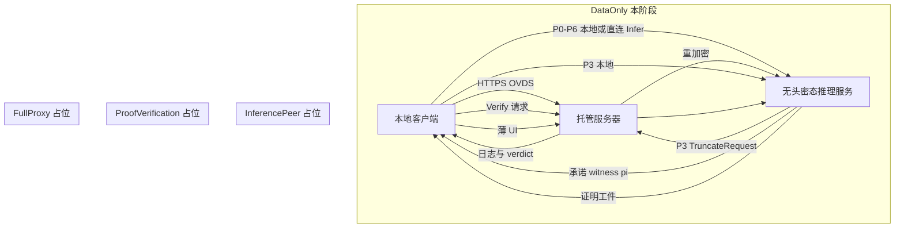
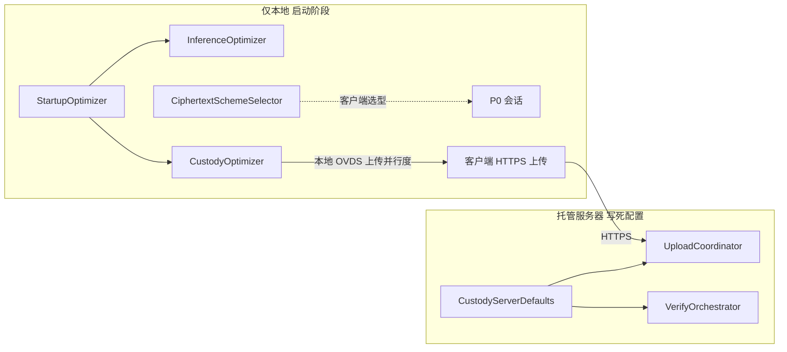

# vPIN 信任数据托管服务器 · Rust 基础框架（修订 v3）

## 目标与边界（用户定稿）

在 [`vpin-custody-server/`](vpin-custody-server/) 新建独立 Rust workspace，对应架构「信任数据托管服务器」。**本阶段仅实现「数据托管」**（OVDS/VADS 写入、查询、验证、manifest；供后续数据集/模型下载）；其余三档托管能力只做 **trait + 文档 + 501 路由占位**。

| 本阶段做 | 本阶段不做 |
|----------|------------|
| 四档 `CustodyCapabilityMode` 类型与文档 | 全量托管 / 密态推理托管 / 证明验证托管 **业务实现** |
| **数据托管** REST 骨架 + 内存 stub | VADS 密码学真实实现 |
| `CustodyServerDefaults` **写死服务端最优配置** | 服务端消费客户端 `CustodyOptimizerProfile` |
| 接口/架构文档（`vpin-custody-server/docs/`） | WSS P3 代理、CP-SNARK Verify 执行 |
| 模态族 **通用 trait**（`modality` 字段）；CNN 为首个消费方 | LLM / MPC 任何实现（仅占位） |
| OVDS Rust 替换挂钩（`custody-vads` trait） | Python OVDS 子进程桥接 |

**关键原则（用户明确）**：

1. **密态方案治理**：`CiphertextSchemeSelector` / 体制选型 **由本地客户端决定**；托管服务器不参与选型。
2. **启动阶段优化器**：`StartupOptimizer` / `InferenceOptimizer` / `CustodyOptimizer` **仅优化本地环境**；不向托管服务器上传 Profile（本阶段）。
3. **服务端调度**：托管服务器使用 **`CustodyServerDefaults` 写死最优配置**（并行上传、verify 策略等）；未来可替换为动态 Planner，接口预留。
4. **接口泛化**：针对现有 CNN 路径设计，但 trait/API **不写死 CNN**；LLM 方案全部占位。
5. **非数据托管信任前提**：全量托管、密态推理托管、证明验证托管均要求托管服务器 **可信且诚实执行协议与代码**，**不得替换**用户指定的推理数据集（文档中作为前置假设声明）。

---

## 四档托管能力模式

与顶层 [`custody_mode`](docs/architecture/vpin-平台顶层抽象架构.md)（`hosted` / `client_local`，数据存哪）正交；本枚举描述 **托管服务器承担哪些代理职责**：

```rust
/// 用户/session 级托管能力选择（客户端 UI 决定，P0 或绑定前写入）
pub enum CustodyCapabilityMode {
    /// 全量托管：仅向客户端 UI 返回推理结果 + 整体执行日志；其余全部由托管方代理
    FullProxy,
    /// 数据托管：仅 OVDS/VADS（本阶段唯一实现）
    DataOnly,
    /// 密态推理托管：托管方仅代理 P3 密态环（解密/非线性/重加密）；
    /// 计算验证相关承诺、witness、π、最终结果等须交回本地客户端
    InferencePeer,
    /// 计算量证明验证托管：推理交互在本地；托管方仅执行 Verify 并返回执行日志与验证结果
    ProofVerification,
}
```

| 模式 | 托管职责 | 须回传客户端的数据 | 信任假设 | 本阶段 |
|------|----------|-------------------|----------|--------|
| **FullProxy** | 数据 + P3 + P6 + 编排 | 推理结果摘要、整体执行日志（UI 展示） | **须可信托管** | 占位 |
| **DataOnly** | OVDS append/query/verify、manifest | VADS 块、证明摘要、`ovds_verify_ref`（供本地绑定） | 半可信存储（OVDS 文档模型） | **实现** |
| **InferencePeer** | 仅 P3 代理（CNN 首批；LLM 占位） | 承诺（`cm_x`/`cm_W`）、witness、π、密态最终结果等 | **须可信托管** | 占位 |
| **ProofVerification** | 仅 P6 Verify（CNN CP-SNARK；LLM 占位） | 验证执行日志、`inference_verdict`、覆盖披露 | **须可信托管** | 占位 |



**与 `DataBindingRecord` 字段的典型组合**（文档级，非硬编码）：

| `CustodyCapabilityMode` | 典型 `inference_peer` | 典型 `verifier_target` |
|-------------------------|----------------------|------------------------|
| `DataOnly` | `client_local` | `client_local` |
| `InferencePeer` | `custody_host` | `client_local` |
| `ProofVerification` | `client_local` | `custody_host` |
| `FullProxy` | `custody_host` | `custody_host` |

---

## 优化器：客户端 vs 服务端（分离）



| 组件 | 运行位置 | 本阶段行为 |
|------|----------|------------|
| `StartupOptimizer` / `DeviceDetector` | 客户端 | 仅采集**本地**设备画像 |
| `InferenceOptimizer` | 客户端 | 产出 `InferenceOptimizerProfile`，约束**本地** P0/P3 |
| `CustodyOptimizer` | 客户端 | 产出 `CustodyOptimizerProfile`，约束**客户端侧**上传/拉取并行度 |
| `CiphertextSchemeSelector` | 客户端 | 选型结果随 P0 提交推理服务；**托管服务器不接收** |
| `CustodyServerDefaults` | 托管服务器 | **常量最优配置**（见下），服务端 upload/verify 编排唯一输入 |
| `ProxyInferencePeerPlanner` 等 | 托管服务器 | **trait 占位**，读 `CustodyServerDefaults`；无 HTTP |

**`CustodyServerDefaults`（写死，可置于 `custody-optimizers/src/defaults.rs`）** — 对齐 OVDS 工程优化与顶层附录 C.6 默认策略：

```
max_parallel_upload:    8
chunk_size_mb:          4
verify_strategy:        aggregate
batch_size:             32
parallel_downloads:     4
parallel_verify:        4
index_reserve_batch:    64
agg_timeout_ms:         30000
```

未来全量实现时可引入 `CustodyRuntimePlanner::plan(server_capacity)` 替换常量，**本阶段不实现动态 Planner**。

**占位 trait（非 data_only，仅文档 + 空 impl）**：

- `FullProxyOrchestrator` — 会话编排门面（占位）
- `InferencePeerService` — P3 WSS 代理（占位；`modality: ModalityFamilyId` 泛型）
- `ProofVerificationService` — P6 Verify 代理（占位；`verification_path` 泛型）

---

## 与现有仓库的关系

- **默认端口**：`8003`
- **本阶段 API**：HTTPS REST（开发 HTTP）；**无 WSS 路由**
- 推理链路仍走 [`vpin-backend`](vpin-backend/) + `ahe-server`；数据托管走 `vpin-custody-server`

---

## 目录与 crate 划分

```
vpin-custody-server/
├── Cargo.toml
├── rust-toolchain.toml
├── README.md
├── docs/
│   ├── README.md
│   ├── architecture.md           # 代码架构 + 四档模式 + 六平面对照
│   ├── interfaces.md             # trait + REST + 错误码
│   ├── custody-capability-modes.md  # 四档模式详述、信任假设、数据回传契约
│   └── optimizer-separation.md   # 客户端/服务端优化器分离；CustodyServerDefaults
├── apps/custody-server/
└── crates/
    ├── custody-domain/           # CustodyCapabilityMode、DataBindingRecord、Defaults 类型
    ├── custody-vads/
    ├── custody-optimizers/       # CustodyServerDefaults + 三模式 trait stub
    ├── custody-auth/
    ├── custody-acl/
    ├── custody-storage/
    ├── custody-services/         # 仅 DataOnly 路径
    └── custody-api/
```

### `custody-domain` 要点

- `CustodyCapabilityMode`（四档枚举 + `enabled_capabilities()` 辅助）
- `ModalityFamilyId`（`cnn` | `llm` | …）— **不写 CNN 专用 API**
- `DataBindingRecord`（附录 C.1）；含可选 `capability_mode` 字段
- `CustodyOptimizerProfile` / `InferenceOptimizerProfile` — **仅用于 JSON 类型共享与文档示例**，本阶段服务端不解析
- `TrustAssumption` 文档常量：`DataOnly` vs `TrustedHonestHost`（后三档）

### `custody-services`（本阶段）

仅当 `capability_mode == DataOnly`（或 session 默认）时激活：

- `UploadCoordinator` — 读 `CustodyServerDefaults`
- `ManifestService` / `ChunkStagingStore`
- `VerifyOrchestrator` — `choose_verify_strategy` 等价逻辑 + Defaults
- `BindingService` — 从 manifest 组装 `DataBindingRecord` stub（无真实 verify）

非 `DataOnly` 请求：API 返回 `501` + `{ "error": "capability_not_implemented", "mode": "..." }`。

### `custody-api` REST（本阶段）

| 方法 | 路径 | 阶段 |
|------|------|------|
| GET | `/api/v1/health` | 实现 |
| GET | `/api/v1/capabilities` | 返回 `{ "implemented": ["data_only"], "placeholder": [...] }` |
| POST | `/v1/files/upload-sessions` | stub |
| PUT | `/v1/upload-sessions/{sid}/chunks/{k}` | stub |
| POST | `/v1/upload-sessions/{sid}/commit` | stub |
| DELETE | `/v1/upload-sessions/{sid}` | stub |
| GET | `/v1/files/{fid}` | stub |
| GET | `/v1/files/{fid}/download` | stub |
| POST | `/v1/bindings` | stub（DataBindingRecord） |
| POST | `/v1/inference-peer/sessions` | 501 占位 |
| POST | `/v1/proof-verification/sessions` | 501 占位 |
| POST | `/v1/full-proxy/sessions` | 501 占位 |

**不实现**：`/v1/inference-peer/ws`、`/v1/optimizers/runtime-plan/preview`（Profile 不上传）。

---

## 文档交付物（`vpin-custody-server/docs/`）

| 文件 | 内容 |
|------|------|
| `architecture.md` | crate 分层、OVDS 五层对照、四档模式在六平面中的落点、OVDS Rust 替换点 |
| `interfaces.md` | `VadsEngine`、存储 trait、`CustodyServerDefaults` 字段、REST 表、501 约定 |
| `custody-capability-modes.md` | 四档定义、信任假设、客户端回传数据清单、与 `DataBindingRecord` 组合 |
| `optimizer-separation.md` | 启动优化器仅本地；`CustodyOptimizerProfile` 约束客户端上传；服务端 Defaults 表 |

交叉引用：[`vpin-平台顶层抽象架构.md`](docs/architecture/vpin-平台顶层抽象架构.md) §5.3、§10；[`vpin-客户端启动阶段-工程优化器设计.md`](docs/architecture/vpin-客户端启动阶段-工程优化器设计.md)。

---

## OVDS 迁移后替换路径

1. `custody-vads` ← `ovds-rust` 实现 `VadsEngine`
2. `custody-services` DataOnly 路径替换 stub 为真实 append/query/verify
3. 三档占位 trait 在 OVDS + AHE 就绪后分里程碑实现；LLM 仍保持 trait 扩展点

---

## 脚本与验证

**脚本**：`build-rust-custody.ps1`、`start-custody-server.ps1`、更新 `vpin-env.ps1`。

**验证标准**：

- `cargo build -p custody-server` 通过
- `GET /api/v1/health` → ok
- `GET /api/v1/capabilities` → `implemented: ["data_only"]`
- `POST /v1/files/upload-sessions`（dev Bearer）→ stub
- `POST /v1/inference-peer/sessions` → 501 + 说明
- `cargo test -p custody-optimizers` — `CustodyServerDefaults` 与 verify 策略函数

---

## 实现顺序

1. workspace + `custody-domain`（含四档枚举 + Defaults 类型）
2. `docs/` 四篇文档骨架（与代码同步）
3. `custody-vads` trait stub
4. `custody-optimizers`（Defaults 常量 + 三模式空 trait）
5. auth / acl / storage 内存 stub
6. `custody-services`（DataOnly + Defaults）
7. `custody-api` + `custody-server`
8. 脚本 + README
9. 冒烟测试（仅 data_only 路径）
