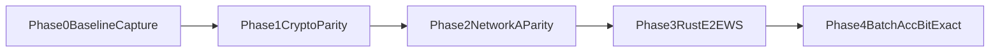

# vpin-platform Rust迁移计划（Network A）

## 目标与约束
- 只迁移 `Network A (cnn-mnist-trained)` 的 AHE 链路，暂不覆盖 compact/LeNet。
- 验收口径采用 **bit-exact**：Rust 与 Python 在同输入下 `prediction/logits` 完全一致。
- 不改动现有仓库源码，仅把其作为“基线与数据来源”。
- 已发现现状差异：文档提及的 `vpin-ahe-platform` 目录在当前工作区缺失，本计划按“从 Python 现网代码重构到新仓”执行。

## 基线与迁移依据（只读来源）
- 客户端会话与协议基线：[`vpin-client/vpin_client/protocol/ws_ahe_client.py`](vpin-client/vpin_client/protocol/ws_ahe_client.py)
- 客户端密码学实现：[`vpin-client/vpin_client/crypto/ahe/codec.py`](vpin-client/vpin_client/crypto/ahe/codec.py)、[`vpin-client/vpin_client/crypto/ahe/curve.py`](vpin-client/vpin_client/crypto/ahe/curve.py)
- 服务端会话与引擎：[`vpin-backend/vpin_backend/api/routes/session.py`](vpin-backend/vpin_backend/api/routes/session.py)、[`vpin-backend/vpin_backend/inference/ahe_engine.py`](vpin-backend/vpin_backend/inference/ahe_engine.py)
- 网络同态算子：[`vpin-backend/vpin_backend/inference/homomorphic_network_a.py`](vpin-backend/vpin_backend/inference/homomorphic_network_a.py)
- 批量 acc 基线：[`vpin-client/vpin_client/pipeline/batch.py`](vpin-client/vpin_client/pipeline/batch.py)
- 回归脚本基线：[`scripts/ahe_e2e_smoke.py`](scripts/ahe_e2e_smoke.py)

## 新仓 `vpin-platform` 目标结构
- `crates/ahe-crypto-e2`：E2 曲线、点运算封装、keygen。
- `crates/ahe-codec`：ElGamal encrypt/decrypt、定点编码、BSGS 查表。
- `crates/ahe-homomorphic`：Network A 的 conv/pool/fc 密文算子。
- `crates/ahe-engine`：phase 状态机与 `TruncateRequest` 驱动。
- `crates/ahe-client`：本地解密/激活/重加密流程（先 CLI 形态）。
- `apps/ahe-server`：Rust WS 服务（复刻 P0–P3 语义）。
- `apps/ahe-cli`：单图与批量评估入口（对齐 Python `ahe-infer` / `eval-mnist-ahe`）。
- `tools/bsgs-convert`：`table.pickle -> table.bin` 转换与校验工具。

## 实施阶段（最小可行路径）
1. **Phase 0：建立可复现基线**
   - 在旧仓运行既有命令，导出固定样本的 baseline 工件（输入定点、中间 phase、最终 logits/prediction、批量统计）。
   - 固化基线样本集（如 MNIST index: 0..9）与权重版本（`cnn-mnist-trained`）。
2. **Phase 1：迁移密码学内核（bit parity）**
   - 先实现 `curve/keygen/encrypt/decrypt/homomorphic_add/scalar_mul`。
   - 完成 BSGS 读取与 giant-step 双分支（含负值路径），并对齐 Python 结果。
3. **Phase 2：迁移 Network A 同态推理算子**
   - 实现 conv/pool/fc 三层及 checkpoint 切换。
   - 复刻客户端 `relu/shift/relu_then_shift` 行为，保持整数语义一致。
4. **Phase 3：迁移协议与端到端链路**
   - 落地 WS 消息模型与 phase 驱动，完成 Rust client↔Rust server 单图闭环。
5. **Phase 4：批量评估与 acc 验收**
   - 实现 `--limit --concurrency` 批量执行。
   - 对同一基线样本集执行 bit-exact 比对；再跑扩展样本验证 acc 稳定性。

## 验收标准
- 单图：`prediction` 与 `logits` 与 Python 基线逐元素一致（bit-exact）。
- 批量：每张样本结果与 Python 对齐，整批 `acc` 完全一致。
- 运行工件：生成 Rust 侧报告（等价 `reports/batch_*.json` 结构）便于差分。

## 风险与控制
- `BSGS` 查表与符号处理是最高风险点，优先做独立单测与基准。
- EC 点序列化/反序列化（尤其跨线程/进程）需统一格式，避免隐式不一致。
- 定点截断位（26/32）和 phase 顺序必须严格对齐，否则会出现“acc 正常但非 bit-exact”的隐性偏差。

## 里程碑可视化

