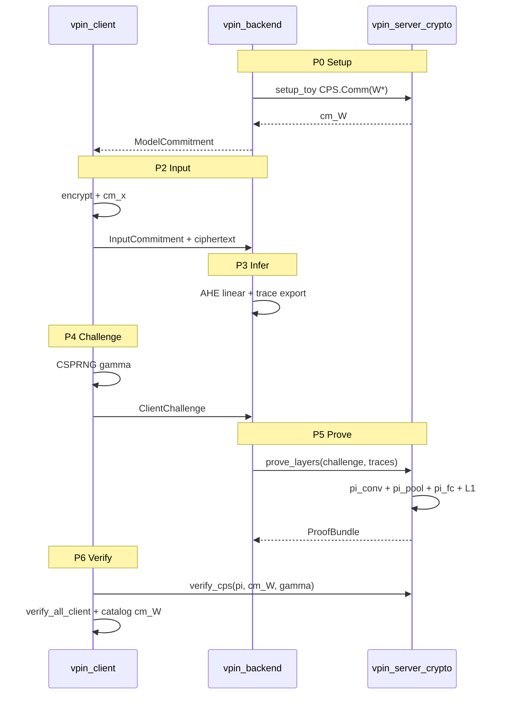

# vPIN Phase Z：密码学合规闭环计划（v2）

> **前置**：[`vpin_模块化开发框架_a78881b1.plan.md`](.cursor/plans/vpin_模块化开发框架_a78881b1.plan.md) 中 **A0–A6 已全部 `已完成`**（框架级）；本计划承接 **§十 P0–P1**，目标为论文级「模型参数 + 计算过程」硬绑定。
> **策略**：toy 网络先跑通 P0–P6 + R1CS + CPS.Ver 全链路，再迁 Network A；**B′** 为主（Spartan `CPS.Comm/Ver`），**A′** 仅占位。
> **Agent 纪律**：**完整继承原 plan §0.1–§0.8**（下文仅列 Phase Z 增量）；开 Z 任务前读 **§Z 清单 + frontmatter todos**。

---

## 0. 继承的 Agent 规范（摘自原 plan，Phase Z 强制）

### 0.1 开任务前（6 步，不可跳过）

1. `Read` 本 plan + 原 plan §0.4 必读文档 + 该 **Z.x** 行「必读」列
2. frontmatter `todos` 中 Z.x 为 `pending` 或 `in_progress`（`completed` 不得重复开工，除非用户要求修复）
3. 核对 **依赖列**：前置 Z 项必须 `completed`
4. §Z 清单状态改 `进行中`，记录列写 `开始 YYYY-MM-DD`
5. 对照源码（§0.5 + 下表「落点」）；验收标准见 §Z 清单
6. 对话首条：**Model / Subagent / Agent: Z.x / 必读 / 验收目标**

### 0.2–0.3 执行中与完成后

- **单次对话只做一个 Z.x**；建议 ≤350K token，超 400K 拆子任务（如 Z.1 拆 conv MAC 左/右端）
- 完成后：跑验收 → 更新 frontmatter `status` → 更新 §Z 清单 → 3–5 bullet 收尾
- **阻塞**：标 `阻塞` + 写 [`docs/issues/Z-x-*.md`](docs/issues/)（**禁止** silent skip 或标 `completed`）

### 0.4 Phase Z 必读文档（在原 plan §0.4 基础上追加）

| Z 阶段 | 额外必读 |
|--------|----------|
| Z.0–Z.4 | [`docs/cp-snark-实现规格-逐步可编码.md`](docs/cp-snark-实现规格-逐步可编码.md) §2；[`docs/各层计算量证明算法-论文对齐.md`](docs/各层计算量证明算法-论文对齐.md) |
| Z.5–Z.6 | [`docs/模型参数密码学绑定与客户端验证规范.md`](docs/模型参数密码学绑定与客户端验证规范.md) §1.4；[`docs/完整密码学交互与模型绑定-数学过程与复杂度.md`](docs/完整密码学交互与模型绑定-数学过程与复杂度.md) §4–§5 |
| Z.7–Z.8 | [`docs/vpin-平台架构-独立客户端与服务端（协议合规）.md`](docs/vpin-平台架构-独立客户端与服务端（协议合规）.md) §4 |
| Z.9 | [`docs/CP-SNARK自检与计算量预估.md`](docs/CP-SNARK自检与计算量预估.md) §五–§十二 |

### 0.5 代码归宿（Phase Z 澄清，对齐原 plan §0.7）

| 能力 | 主落点 | 说明 |
|------|--------|------|
| **M5 按层 R1CS（φ 入电路）** | [`vpin-backend/crates/vpin-server-crypto/src/circuit/layer/`](vpin-backend/crates/vpin-server-crypto/src/circuit/layer/) | **新建**；复用已有 [`circuit_prove.rs`](vpin-backend/crates/vpin-server-crypto/src/circuit_prove.rs) + `commit_spartan` |
| **L1 weight binding** | 同上 + `circuit/bind_l1.rs` | 约束 `vars_para[slot(j)] = embed(W*[i_j])` |
| **M-B′ CPS.Comm/Ver** | [`src/cp-snark-full/src/commit/cps.rs`](src/cp-snark-full/src/commit/cps.rs) + server-crypto `prove/pipeline.rs` 联调 | 替换 Pedersen 占位；`my_lib_verify` 联证各层 π |
| **M4 EC manifest** | 已有 [`src/cp-snark-full/src/trace/ec_layer.rs`](src/cp-snark-full/src/trace/ec_layer.rs) | toy 另建 `data/toy/` manifest |
| **客户端验证** | [`vpin-client/vpin_client/verify/`](vpin-client/vpin_client/verify/) | M1 标量 + CPS.Ver 编排；**不** import backend |
| **只读** | `src/proof_generation/`、`src/cnn_networks/` | Spartan path 依赖；语义对照不 import |

### 0.6 停步条件（Phase Z 追加）

- toy 向量手算与 `gen_toy_traces.py` **不一致** → 停步，先修 Z.0
- `cps_ver_unified` 无法在无 Pedersen 前提下联证 → 写 issue，**不得**标 `proof_coverage` 为 B′
- Network A prove **>30min** 或 OOM → 写 [`docs/issues/Z-9-network-A-perf.md`](docs/issues/)，状态 `阻塞`，不 silent skip

### 0.8 模型选型（映射表 C：Phase Z）

| Z.x | 推荐模型 | subagent_type | 禁止 |
|-----|----------|---------------|------|
| Z.0 | `gpt-5.5-medium` | `generalPurpose` | — |
| Z.1, Z.3, Z.4, Z.6, Z.9 | `claude-opus-4-7-thinking-xhigh` | `generalPurpose` | composer 单独做 |
| Z.2, Z.5 | `claude-4.6-opus-high-thinking` | `generalPurpose` | — |
| Z.7 | `claude-4.6-sonnet-medium-thinking` | `generalPurpose` | — |
| Z.8 | `gpt-5.3-codex-high-fast` | `generalPurpose` | — |
| Z.10 | `gpt-5.5-medium` | `generalPurpose` | — |
| Z.11 | `composer-2.5-fast` | `generalPurpose` | — |
| git push / cargo only | `composer-2.5-fast` | `shell` | — |

**委派模板（首行）**：

```
Model: <slug> | Subagent: generalPurpose | Agent: Z.<x> | 必读: <§0.4+Z必读> | 验收: <§Z清单>
```

---

## 1. 目标与诚实边界

**完成 Phase Z 后可宣称**：

- toy 网络：P0–P6 全链路；`CPS.Comm(W*)` + 按层 π_conv/π_pool/π_fc **真 Spartan SNARK**；L1 权重进 R1CS；客户端 `CPS.Ver` 通过
- `proof_coverage = ec_plus_layer_pi_with_model_binding`（仅 toy）

**完成前仍不能宣称**：

- Network A 论文 B′ 端到端（须 Z.9 通过且无 issue 阻塞）
- 大模型 A′ Merkle 硬绑定（Z.10 仅占位）

---

## 2. Toy 网络规格（冻结）

| 项 | 值 |
|----|-----|
| 输入 | 4×4 定点 u128 |
| conv | 3×3 filter, 1 ch → 2×2 输出（4 windows × 9） |
| pool | 2×2 → 1 sum（式 7，缩放链外在 AHE） |
| fc | 1→2 + bias[2]（式 10） |
| 权重 | `vpin-backend/data/toy/toy_full_weights.json`（N_W 可手算） |
| trace | `data/toy/{conv,pool,fc}_trace.json` |
| EC witness | 最小 PtMul/PtAdd 集（Z.8 前可 stub 计数） |

---

## 3. 密码学交互（toy 必达）



**合规硬约束**（负面测试必覆盖）：

- 服务端无 γ 时 `prove-with-challenge` **拒绝**
- 服务端代采 γ **拒绝**（API 演示路径须标注 non-production）
- transcript 顺序：`cm_W → cm_x → γ → γ_add → γ_mult → sub_circuit`
- 篡改 cm_W / filter / γ → verify **false**

---

## 4. 强制测试矩阵（每个 Z.1–Z.9）

| 类别 | 要求 | 失败处理 |
|------|------|----------|
| **可满足性** | 正确 witness → prove OK → verify true | — |
| **负面** | ≥3 条：错 filter、错 W*、错 γ、错 cm_W、重放 γ | verify false 或 prove err |
| **协议** | 缺 γ、错 transcript 顺序 | CLI/WS 拒绝 |
| **性能** | 记录 prove_ms、proof_bytes → `tests/perf/Z-x.json` | 超时写 issue |

**总入口**：

```bash
pytest vpin-backend/tests vpin-client/tests -v
cd vpin-backend && cargo test -p vpin-server-crypto --tests
cd src/cp-snark-full && cargo test --lib
pytest -k toy_e2e -v
```

---

## 5. Phase Z 任务清单（§Z）

| Agent ID | todo id | 依赖 | 落点 | 验收 | 建议模型 |
|----------|---------|------|------|------|----------|
| **Z.0** | `z0-toy-traces` | — | `scripts/gen_toy_traces.py`, `data/toy/` | `pytest test_toy_traces.py` 手算一致 | gpt-5.5-medium |
| **Z.1** | `z1-pi-conv-r1cs` | Z.0 | `server-crypto/circuit/layer/conv_mac.rs` | toy 式(9) prove/verify；错 filter 拒绝 | opus-4.7-xhigh |
| **Z.2** | `z2-pi-pool-r1cs` | Z.0 | `circuit/layer/pool_sum.rs` | toy 式(7)；错 sum 拒绝 | opus-4.6 |
| **Z.3** | `z3-pi-fc-r1cs` | Z.0 | `circuit/layer/fc_mac.rs` | toy 式(10)+bias；错 weights 拒绝 | opus-4.7-xhigh |
| **Z.4** | `z4-l1-binding` | Z.1,Z.3 | `circuit/bind_l1.rs` | 篡改 W* prove 失败；`bind_l1_test.rs` | opus-4.7-xhigh |
| **Z.5** | `z5-cps-comm` | Z.0 | `cp-snark-full/commit/cps.rs` | `cps_comm_w_star` 用 Spartan PC，≠ Pedersen | opus-4.6 |
| **Z.6** | `z6-cps-ver` | Z.1–Z.5 | `cps.rs` + `verify-cps` CLI | toy E2E CPS.Ver；错 cm_W/γ 拒绝 | opus-4.7-xhigh |
| **Z.7** | `z7-client-p6` | Z.6 | `vpin-client/verify/cps.py`, `test_toy_e2e.py` | P0–P6 客户端本地验；重放 γ 拒绝 | sonnet-medium |
| **Z.8** | `z8-ec-transcript` | Z.6 | `prove/pipeline.rs`, `prove/ec.rs` | EC+layer 同一 transcript；`VPIN_EC_REAL_PROVE=1` toy | codex-high-fast |
| **Z.9** | `z9-network-a` | Z.1–Z.8 | 参数化 network `A` | Network A prove；perf 入 `docs/M5-performance-report.md` | opus-4.7-xhigh |
| **Z.10** | `z10-a-prime-stub` | Z.6 | `commit/merkle.rs` stub | 4 叶 Merkle 单测；文档标明非 B′ | gpt-5.5-medium |
| **Z.11** | `z11-docs` | Z.9 | `docs/cps-honesty-boundary.md`, `docs/M5-performance-report.md` | proof_coverage 枚举更新 | composer-fast |

### 5.1 Sprint 批次（对话映射）

| Sprint | 顺序 | Token 估 | 说明 |
|--------|------|----------|------|
| **ZS1** | Z.0 → Z.1 ∥ Z.2 → Z.3 | ~400K | toy 向量 + 三层 R1CS（Z.1/2 可并行） |
| **ZS2** | Z.4 → Z.5 → Z.6 | ~500K | L1 + CPS 闭合（**核心密码学**） |
| **ZS3** | Z.7 → Z.8 | ~350K | 客户端 + EC 联证 |
| **ZS4** | Z.9 → Z.10 → Z.11 | ~600K+ | Network A + 文档（Z.9 可单独开对话） |

### 5.2 问题文档模板

路径：[`docs/issues/Z-{x}-{title}.md`](docs/issues/)

```markdown
# Z.x: {标题}
- **状态**: 阻塞 | 已知限制
- **复现**: 命令 + 环境
- **期望**: 验收标准
- **实际**: prove/verify 行为
- **根因**: （证据：文件:行号 或 测试输出）
- **建议**: 下一 Agent / 需用户决策
```

---

## 6. 与旧 plan 的关系

| 旧 plan | Phase Z |
|---------|---------|
| A0–A6 §八 `已完成` | **不重做**；仅在 Z 项引用其产出 |
| §十 P0–P1 | **映射为 Z.1–Z.9** |
| §0.8 映射表 A/B | **保留**；新增映射表 C（§0.8 上表） |
| `circuit/layer` stub（cp-snark-full） | **废弃为验收对照**；真 R1CS 在 server-crypto |

---

## 7. Git 与提交规范

- 每个 Z.x 验收通过后：`git commit -m "feat(z-x): <one-line why>"` on `develop`
- 含 issue 文档时：`docs(issues): Z-x <title>` 可同 commit 或独立
- push `origin/develop`（网络失败写 issue，不标 completed）

---

## 8. 完成后更新原 plan

Z 项完成后在 **原 plan** [§十](.cursor/plans/vpin_模块化开发框架_a78881b1.plan.md) 追加行状态；**不修改** A0–A6 §八 已完成记录。
