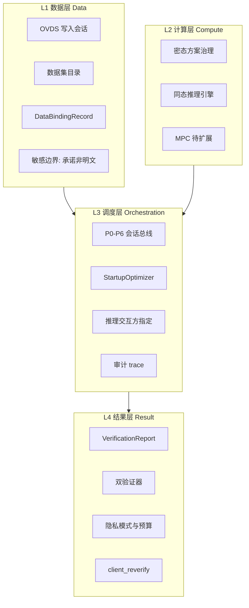

> **实现路径（已确认）**：方案 A 不在 legacy [`vpin_frontend`](vpin_frontend/vpin-frontend) 就地改造，而在新建 **[`vpin-console/`](vpin-console/)** 交付。下方 todos 中涉及 `AppLayout`/`HomeView` 的条目在实现时对应 **vpin-console 内同名视图**，非 legacy 路径。

---

# 方案备选（供评估）

> 以下为五种**差异化**信息架构，非渐进版本。可单选，也可混合（例如：方案 E 导航 + 方案 D 会话页 + 方案 A 验证报告）。

## 总览对比

| 维度 | A 四层控制面板 | B 流水线旅程 | C 三角色控制台 | D 会话驾驶舱 | E 渐进工作台 |
|------|---------------|-------------|---------------|-------------|-------------|
| **核心隐喻** | 隐私计算 NOC | 端到端 Pipeline | 三端分布式面板 | IDE / 飞行甲板 | 企业 SaaS |
| **主导航逻辑** | 数据/计算/调度/结果 | 阶段 A→B→C | Client/Custody/Infer | 当前会话 | 功能模块（现状） |
| **首页** | 系统态势控制塔 | 流水线进度条 | 三列角色健康态 | 活跃会话现场 | 欢迎 + 快捷入口 |
| **新建任务** | 5 步工程向导 | 线性 7 步（含 OVDS） | 从 Client 发起 | Modal / 侧栏 | iframe 向导（现状） |
| **核心页面** | 任务详情监视器 | Pipeline Detail | 角色子面板 | 单页驾驶舱 | TaskDetail + Security |
| **架构表达力** | ★★★★☆ | ★★★☆☆ | ★★★★★ | ★★★☆☆ | ★★☆☆☆ |
| **上手难度** | 高（工程向） | 低 | 中 | 中 | 最低 |
| **迁移成本** | 高 | 中高 | 高 | 中 | 最低 |
| **Tauri 桌面** | 好 | 好 | 好 | **最佳** | 好 |
| **边缘 mobile** | 需精简层 | 步骤条友好 | 三列变堆叠 | 单会话友好 | 一般 |

---

## 方案 A：四层控制面板（隐私计算工程风）

**一句话**：按 Data / Compute / Orchestration / Result 组织侧栏，页面密度高、泳道可视化。

- **适合**：平台工程团队、审计复核、与通用隐私计算平台对标
- **风险**：对论文复现演示者认知负担大；与现有 HomeView 风格断层大

详见下文「方案 A 详设」（原控制面板正文）。

---

## 方案 B：流水线旅程（Journey-first）

**一句话**：用户心智是「跑通一条 A→B→C 流水线」，而非管理四个平面。

### 导航（仅 4 项 + 设置）

```
流水线（首页）| 历史运行 | 资产库 | 信任与证明 | 设置
```

### 首页布局

```
阶段条：[A 数据入库] → [B 密态推理 P0-P3] → [C 双验证 P4-P6]
         ● 完成          ◐ 进行中           ○ 待开始

当前运行卡片（若有）+ 「启动新流水线」主 CTA
最近 3 条 VerificationReport 摘要
```

### 新建流水线（线性 7 步，不可跳步过多）

1. 环境检测确认（StartupOptimizer）
2. 数据入库（hosted / local）
3. 选模型 + 隐私模式
4. 指定推理方 / 验证方
5. Preflight
6. 执行（进入驾驶舱子视图，实时 P3）
7. 验证与报告

### 响应式

- 阶段条在 `sm` 缩为竖向 Stepper + 当前阶段大字
- 历史运行 = 卡片列表，非工程表格

### 优劣

- ✅ 与 [vpin-平台数据流图.md](docs/architecture/vpin-平台数据流图.md) 阶段 A/B/C 天然对齐；演示友好
- ❌ 并行多会话、独立管理 OVDS 资产时导航绕路
- ❌ 四层能力（如单独调 CustodyOptimizer）没有明确入口

---

## 方案 C：三角色控制台（架构文档镜像）

**一句话**：侧栏按三角色分栏——用户始终知道自己站在哪一端。

### 导航

```
总览（三端拓扑）
├── 客户端（本机）
│     环境检测 / 密钥空间 / 本地预处理
├── 信任托管服务器
│     OVDS 会话 / JWT 态 / 代行截断环
├── 无头密态推理服务
│     模型目录 / 活跃会话 / 链路 TLS
└── 验证域（横切）
      验证报告 / 隐私策略 / 审计 trace
```

### 首页：三列等宽「角色仪表盘」

每列：连接状态、最近事件、进入控制台 CTA。拓扑图居中，边动画表示当前数据流。

### 任务不在「推理任务」菜单，而在「无头服务 → 活跃会话」

客户端页只显示「我发出的 SessionStart」；托管页显示「我代行的 TruncateRequest」。

### 响应式

- `lg` 三列 → `md` Tab 切换角色 → `sm` 仅显示「本机 + 当前活跃角色」

### 优劣

- ✅ 与 [vpin-三端交互示意图.html](docs/architecture/vpin-三端交互示意图.html) 一致；教学、文档化最强
- ❌ 用户 90% 操作在客户端，却频繁切换菜单
- ❌ 实现上需模拟/聚合三端 API，前端状态机复杂

---

## 方案 D：会话驾驶舱（Session Cockpit）

**一句话**：**一个活跃会话占据 80% 屏幕**；其余全是检查器与抽屉。

### 导航极简

```
[会话] 当前 | 历史列表（窄轨）
[资产] 模型 · 数据（抽屉）
[信任] 证明 · 隐私（抽屉）
[设置]
```

### 首页 = 空态或会话现场

有活跃会话时：**不显示传统首页**，直接进入 `/session/active`：

```
┌─ P0-P6 轨 ─────────────────────────────────────────┐
├─ 主视窗（70%）          │ 检查器（30%）─────────────┤
│ P3 相位动画/日志         │ Binding / Scheme / TLS    │
│ 或验证结果               │ 一键 client_reverify      │
└─────────────────────────┴───────────────────────────┘
```

新建会话：`NDrawer` 五步，不全页跳转。

### 与 AheDemoView 的关系

[`AheDemoView.vue`](vpin_frontend/vpin-frontend/src/views/demo/AheDemoView.vue) 已是驾驶舱雏形——生产路径可复用其时间线/批处理 UI。

### 优劣

- ✅ 最贴合 P3 多轮实时交互；Tauri 单窗口体验最佳
- ❌ 数据托管、模型仓库等「非会话」任务入口弱
- ❌ 多任务并行时需会话切换器设计

---

## 方案 E：渐进式工作台（Evolution）

**一句话**：保留现有侧栏分组，**局部**注入架构组件，不推翻 IA。

### 导航（基本维持 AppLayout 现状）

```
工作台 | 模型仓库 | 推理任务 | 数据配置 | 安全中心 | 样板间
```

### 改造点（/widget 化）

| 页面 | 增量组件 |
|------|----------|
| 工作台 | + DeploymentRecommendation 条；+ 三角色迷你拓扑 |
| 新建任务 | Vue 化 iframe；+ Preflight 清单 |
| 任务详情 | + P3 时间线 Tab；+ DataBinding 侧栏 |
| 安全中心 | 保持现状；验证报告子路由 Vue 化 |

### 优劣

- ✅ 迁移成本最低；与已完成的 SecurityCenter Vue 化一致
- ❌ 架构表达弱；长期可能再次大改
- ❌ 难以形成「隐私计算平台」产品辨识度

---

## 混合策略（常见组合）

| 组合 | 做法 |
|------|------|
| **E + D** | 日常用工作台导航；进入任务后切换驾驶舱布局（推荐务实路径） |
| **A + D** | 侧栏四层；会话页用驾驶舱三区 |
| **B + C** | 首页流水线旅程；详情页用三角色 Tab 解释数据流 |
| **C 教学 + E 生产** | 样板间用三角色控制台教学；生产用渐进工作台 |

---

## 评估维度建议

选型时可按权重打分（1–5）：

1. **架构忠实度**：六平面 / 三角色 / P0–P6 是否一眼可见
2. **演示与论文复现**：新用户能否 10 分钟跑通 MNIST AHE
3. **工程运维**：并行会话、审计、trace 是否高效
4. **实现成本**：相对现有代码的改造量
5. **产品辨识度**：是否像「隐私计算系统」而非普通 ML 平台

### 选型结论（用户确认）

- **主线方案**：**A 四层控制面板**
- **优先维度**：架构忠实度、产品辨识度、工程运维
- **隐含取舍**：演示上手与实现成本非首要；方案 A 的泳道/元数据密度可保留，但需在「新建会话」与「任务列表」保留适度引导，避免纯 NOC 风格劝退论文复现用户
- **建议局部吸收方案 D**：仅 **任务详情 / 活跃 P3** 页采用驾驶舱三区布局，其余页面维持四层 IA——不改动主导航

---

# 方案 A 详设（四层控制面板）

## 一、风格定位：从「应用」到「控制面板」

隐私计算系统的 UI 核心不是引导用户点按钮，而是让工程师**看见数据在哪、算力在哪、谁在解密、证明是否成立**。

vPIN 当前 [`HomeView.vue`](vpin_frontend/vpin-frontend/src/views/HomeView.vue) 偏「欢迎页 + CTA」消费型；[`vpin-平台工作流程图.html`](docs/architecture/vpin-平台工作流程图.html) 已具备正确的工程视觉语言：**泳道、阶段标签、决策菱形、角色分色**——前端应以此为母版，而非普通 SaaS 仪表盘。

### 视觉母版（继承工作流程图 token）

| 元素 | 规范 | 用途 |
|------|------|------|
| 泳道底色 | client `#e8f4fc` / custody `#e8f8ef` / infer `#fdeef0` / verify `#eef2ff` | 三角色 + 验证域 |
| 阶段标签 | P0–P6 蓝色 `#2563eb` 等宽字号 | 协议进度 |
| 元数据 | `--font-mono`，12–13px | `binding_id`、`data_digest`、`vads_index` |
| 决策节点 | 菱形/琥珀底 `#fef3c7` | custody_mode、verifier_target 分叉 |
| 密度 | 信息优先，卡片内边距 ≤16px；减少大留白欢迎语 | 工程可读性 |
| 状态灯 | 绿/琥珀/红 + 文字（非纯图标） | `execution_trust`、verify pass/fail |

**Naive UI 用法调整**：少用 `NCard` 大圆角装饰；多用 `NDescriptions` bordered、`NDataTable` dense、`NTimeline`、`NCollapse` 折叠工件详情。

---

## 二、四层结构 × vPIN 架构映射

通用隐私计算四层与 vPIN **不是 1:1 照搬**，而是 UI 分区逻辑：



### 对照表：通用能力 vs vPIN 落点

| 通用隐私 UI | vPIN 对应 | vPIN 是否采纳 | UI 落点 |
|-------------|-----------|---------------|---------|
| DB/CSV/API 数据源注册 | OVDS 多模态预处理 + 数据集 catalog | **采纳（简化）** | 数据集目录、托管上传 |
| PII/PHI 字段标注 | 架构用 **输入承诺 + OVDS digest**，非字段级 DLP | **不照搬** | 改为「明文域边界」示意图，非打标表格 |
| mask/tokenization | 密态方案内定点化 / 线性化 | **语义替代** | 方案选型卡展示 `nonlinear_policy` |
| HE 任务 | AHE / 混合 HE 推理 | **核心** | 任务详情 P3 相位时间线 |
| TEE 任务 | 架构已移除 TEE 产品叙事 | **不采纳** | `secure_execution` 仅作门禁信号 |
| MPC 任务 | `mpc_puma` 待扩展 | **预留灰显槽位** | 计算层 Tab 占位 |
| FL 任务 | 不在 vPIN 范围 | **不采纳** | — |
| Airflow DAG | 固定 P0–P6，非任意 DAG | **采纳精神、非编辑器** | 只读协议轨 + 相位 DAG 缩略图 |
| 节点权限（谁能解密） | `inference_peer` + `verifier_target` | **采纳** | 2×2 决策矩阵，非 RBAC 树 |
| Audit Trail | `ahe_trace` / `mpc_trace` + OVDS verify | **采纳** | 调度层「会话审计」Tab |
| 结果可见性控制 | 密文专属契约 + 验证对象 | **采纳** | 结果层「可见性域」矩阵 |
| 解密审批流 | CNN 路径为 **本地 Verify**，非人工审批 | **不照搬** | 改为「验证器执行」时间线 |
| privacy budget / noise | LLM `game_sampling` 路径 | **部分采纳** | 隐私与策略页 |

---

## 三、导航重组：按四层 + 横切「会话现场」

侧栏从「功能菜单」改为 **四层控制域 + 会话横条**：

```
┌─ 会话横条（全局，有活跃任务时固定顶栏下方）──────────────┐
│ P2 ● P3 ○ P4 ○ P5 ○ P6 ○  │  session_id  │  inference_peer │
└──────────────────────────────────────────────────────────┘

侧栏：
  [总览] 系统态势        ← 原工作台，改为控制塔
  ── L1 数据 ──
    数据托管 / 数据集
  ── L2 计算 ──
    模型与密态方案
  ── L3 调度 ──
    推理任务 / 新建会话
  ── L4 结果 ──
    验证报告 / 隐私与策略
  ── 系统 ──
    环境检测 / 连接配置
  [演示] 隐私样板间      ← 与生产隔离
```

**关键变化**：「安全中心」拆入 L3（通信用量）+ L4（证明与隐私），不再作为独立模糊入口。

---

## 四、逐层页面布局（工程视角）

### L1 数据层

#### 1.1 数据托管中心 `/data/custody`

**面板结构**（主从双栏控制面板）：

```
┌─ 泳道条：Client ──HTTPS──▶ Custody ──▶ VADS ─────────┐
├─ 左：会话队列（状态机筛选）│ 右：选中会话详情 ─────────┤
│  CREATED / UPLOADING /    │  chunk 进度条              │
│  COMMITTED / FAILED       │  vads_index 列表 (mono)    │
│                           │  manifest revision         │
│                           │  recomposed_hash ✓/✗       │
└───────────────────────────┴────────────────────────────┘
底部：CustodyOptimizerProfile 只读参数条
```

**不做**：PII 字段打标表。**做**：`data_digest` 与 OVDS `verify_ok` 对齐状态。

#### 1.2 数据集目录 `/data/catalog`

卡片 = 数据源句柄（非文件浏览器美学）；每张卡：`format`、`modality`、`owner_id`、是否已绑定。

---

### L2 计算层

#### 2.1 模型与密态方案 `/models`

**Tab 结构**：

- **模型目录**：`modality_family`、`scheme_id`、`verification_path` 标签
- **方案可行域**（Drawer）：三维约束可视化
  - 模型硬边界（灰底不可选）
  - 设备门禁（`DeviceProfile` 摘要）
  - 用户 `PrivacyModePreference` 评分条

**MPC 槽位**：`mpc_puma` 卡片 `disabled` +「算力对等未满足」说明。

#### 2.2 密态隐私模式（内嵌于新建会话，亦可独立只读）

五模式 = **成本四维雷达**（通信/推理/密态加载/安全），非营销文案卡片。

---

### L3 调度层

#### 3.1 新建推理会话 `/tasks/new`（五步控制向导）

```
Step1 数据绑定     → custody_mode + OVDS 会话
Step2 方案决议     → SchemeSelection + PrivacyMode
Step3 角色拓扑     → inference_peer × verifier_target 矩阵
Step4 Preflight    → 门禁清单（红绿列表，非表单）
Step5 启动 P0      → 摘要 + SessionStart
```

**核心可视化**：步骤 3 嵌入 **三角色拓扑图**（复用 [`vpin-三端交互示意图.html`](docs/architecture/vpin-三端交互示意图.html) 风格），高亮当前数据流边。

#### 3.2 任务列表 `/tasks`

工程队列视图：列优先 `phase`（P几）、`scheme`、`verifier_target`、耗时；弱化「任务描述」。

#### 3.3 任务详情 `/tasks/:id`（会话现场 — 最重要页面）

**三区布局**（桌面）：

```
┌─ 上：P0-P6 只读协议轨（横向，可点击跳 Tab）─────────────┐
├─ 左 60%：主监视器          │ 右 40%：上下文检查器 ─────┤
│ Tab: 相位 DAG / 实时日志    │ DataBindingRecord          │
│ Tab: P3 截断环时间线        │ SchemeSelection            │
│ Tab: 审计 trace            │ 三端 TLS 状态              │
└────────────────────────────┴────────────────────────────┘
```

P3 时间线 = **计算层核心可视化**：每轮 `TruncateRequest` → 推理交互方 → 密文回注，按泳道着色。

#### 3.4 通信与用量 `/security`（归入 L3 横切）

保留现有三卡 + 图表；文案从「安全中心」改为「链路监视」；分 **托管 HTTPS** / **推理 WSS** 两泳道。

---

### L4 结果层

#### 4.1 验证报告 `/security/verification`

**双验证器顺序面板**（非对称两栏）：

```
[模型推理验证器]  inference_verdict / proof_coverage / π
        ↓ 收录
[密态流程验证器]  OVDS verify + ahe_trace + privacy_integrity
        ↓
[VerificationReport 总判定]
[client_reverify 本地复核 diff]
```

#### 4.2 隐私与策略 `/security/privacy`

- **可见性域矩阵**（来自 [vpin-平台隐私保护.md](docs/architecture/vpin-平台隐私保护.md) §3.1）：角色 × 数据类型，✓/✗ 表
- **隐私预算**（LLM 路径占位）：ε 消耗曲线
- **用户杠杆**：`PrivacyModePreference` + `execution_trust` 约束说明

**不做**：人工解密审批工单。**做**：密码学 Verify 状态与复核比对。

---

### 横切：系统态势 `/`（原工作台改造）

从「Hi 欢迎」改为 **控制塔**：

```
┌─ 三角色拓扑（实时连线态）────────────────────────────┐
├─ 4 指标：活跃会话 | 待验证 | 托管块数 | execution_trust ┤
├─ 启动配置包摘要（StartupOptimizerResult 折叠面板）      ┤
├─ DeploymentRecommendation 条（边缘推荐托管）          ┤
└─ 快捷：新建会话 | 继续 P3 | 最近 VerificationReport   ┘
```

---

### 全局：启动检测门（L3 调度前置）

Modal 风格偏 **系统初始化**，非营销 onboarding；检测项用 **检查清单** 而非插图。

---

## 五、响应式策略（控制面板语境）

| 断点 | 策略 |
|------|------|
| ≥1280px | 三区/双栏；泳道横向；协议轨完整 P0–P6 |
| 1024px | 右栏检查器折叠为 `NDrawer`；表格 `scroll-x` |
| 768px | 侧栏 → 抽屉；泳道改竖向；协议轨缩为 `P3 ▶` |
| <480px | **会话现场优先**：仅显示当前 phase + 一条泳道；L1–L4 通过底栏切换 |

边缘设备 `edge`：默认可隐藏图表，保留状态灯 + 推荐托管横幅。

---

## 六、与现有代码的迁移关系

| 现有 | 四层归属 | 改造方向 |
|------|----------|----------|
| `HomeView` | 总览 | 控制塔化，删减欢迎语 |
| `TaskListView` / `TaskDetailView` | L3 | 加协议轨、相位 DAG、trace Tab |
| `SecurityCenterView` | L3 横切 | 改名「链路监视」，拆验证到 L4 |
| `data-config.html` iframe | L1+L3 | 拆为托管中心 + 五步向导 |
| `verification-report.html` | L4 | Vue 化双验证器面板 |
| `privacy-budget.html` | L4 | Vue 化可见性矩阵 + 预算 |
| `ProtocolProgressBar` | L3 | 提升为全局会话横条 |
| `ConfidentialFlowPanel` | L3 | 扩展为相位 DAG 主监视器 |

---

## 七、分期实施（风格先行）

**Phase A — 控制面板骨架**：导航四层重组、控制塔首页、全局协议横条、泳道色 token 写入 `tokens.css`

**Phase B — 主链路可视化**：新建会话向导 + 任务详情相位 DAG + 验证报告双栏

**Phase C — 数据/隐私平面**：托管中心、可见性矩阵、设置页；废弃 iframe

---

## 八、设计红线（避免做成「假隐私平台」）

1. 不做通用 PII 打标 UI — vPIN 用承诺绑定表达数据完整性
2. 不做 Airflow 式 DAG 编辑器 — P0–P6 只读
3. 不做 TEE / FL 入口 — 架构未定义
4. 不做人工解密审批 — 用双验证器 + `client_reverify`
5. 演示域（样板间）视觉与生产控制面板 **分区明确**（演示可用轻松风格，生产区保持泳道工程风）
