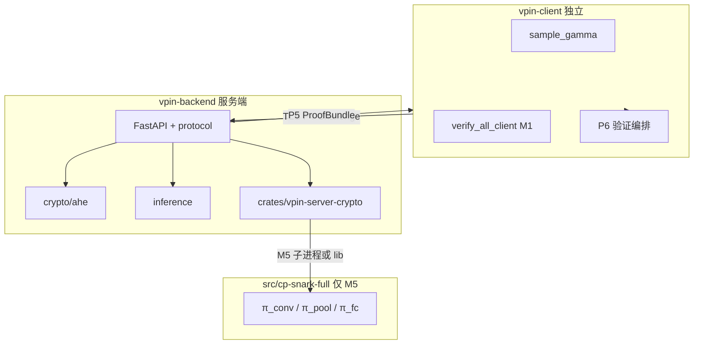
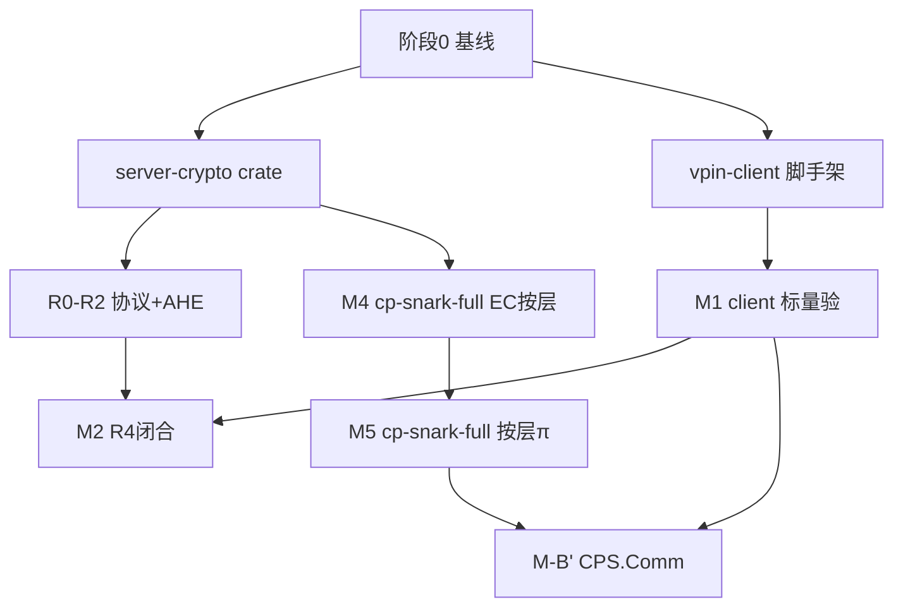

# vPIN 模块化代码框架与任务拆解计划（修订版）

> **修订要点（2026-06-10）**  
> - **分层证明编排**不在 cp-snark-full，而在 **vpin-client**（标量验 M1）+ **vpin-backend**（服务端 prove/承诺/AHE）  
> - **服务端密码学**：`vpin-backend/crates/vpin-server-crypto`（Rust 子 crate，从 cp-snark-full **复制迁移** EC gadget + cm 承诺）  
> - **M5 in-circuit π**：仍仅在 [`src/cp-snark-full`](src/cp-snark-full/)（`src` 内唯一可改处）  
> - **vpin-client**：仓库根目录独立包，**禁止**调用服务端代码；轻量高效  
> - **后端 Web 框架**：**FastAPI**（已定案 MVP；uvicorn + WebSocket；与 `docs/vpin-backend-客户端服务器架构设计.md` 一致）  
> - **排期口径**：由「人周」改为 **Agent Token 消耗预估**（见 §二 前置说明）  
> - **Agent 纪律**：**开任务前查 §八 + todos**；**完成后更新 §八 留记录**；单次对话 **≤1 个 Agent ID**；禁止臆造协议字段或公式  
> - **实现策略**：backend / client **按需重写**密码学与协议逻辑，**不**默认 subprocess 调旧 `cp-snark-full` / `CpSnarkBridge`；可改项目内指定目录，**边界是原论文 + 路线图**，非「不能动 R1CS」  
> - **任务闭环**：**开任务前先查 plan（§八 + frontmatter todos）**；**完成后在 plan 清单上确认并留记录**，供后续 Agent 接续

---

## 0. Agent 执行规范（防幻觉）

### 0.1 开任务前：必须先检查 plan（强制）

**在写任何业务代码之前**，按序执行：

| 步 | 动作 | 不通过则 |
|----|------|----------|
| 1 | `Read` **本 plan 全文**（至少：修订要点、§0、该 Agent ID 所在阶段表、**§八 清单**） | — |
| 2 | 在 **§八** 与文首 **frontmatter `todos`** 中定位本 Agent ID，确认状态为 `待办` 或 `进行中`（**不得**对 `已完成` 重复开工，除非用户要求修复） | 停步：改做下一项 `待办` 或向用户确认 |
| 3 | 核对 **依赖列**：§八 中所有前置 Agent 必须为 `已完成`；见 §八「依赖」列 | 停步：先完成前置，或向用户说明阻塞 |
| 4 | 将 §八 本行状态改为 **`进行中`**，在「记录」列写 `开始 YYYY-MM-DD`（可选写会话/分支） | — |
| 5 | @ 必读文档（§0.4）+ 对照源码（§0.5）；确认验收标准（§八「验收」列） | 信息不足则 §0.6 停步反馈 |
| 6 | 对话首条说明：**正在执行 Agent ID、依赖已满足、本次验收目标** | — |

### 0.2 执行中

1. 单次对话 **只做一个 Agent ID**；建议 **≤350K token**，超 400K 须拆任务。  
2. 若文档与源码冲突：**以 [`docs/综合未来工作路线图.md`](docs/综合未来工作路线图.md) 为准**；冲突写入会话摘要，不发明第三套语义。

### 0.3 完成后：必须在 plan 上确认并留记录（强制）

验收通过后 **在同一会话末尾** 更新 plan（不要只口头说「做完了」）：

| 步 | 动作 |
|----|------|
| 1 | **跑验收**：执行阶段表/§八 中「验收」列的命令或检查项，保留通过依据（命令名 + 结果摘要） |
| 2 | **更新 frontmatter**：将对应 `todos[].id` 的 `status` 改为 `completed`（部分完成用 `cancelled` 并在 §八 标 `阻塞`） |
| 3 | **更新 §八 清单**：状态 → `已完成`；填写完成日、验收摘要、主要产出路径、**下一 Agent 提示** |
| 4 | **会话收尾**：用 3–5 条 bullet 复述「完成了什么 / 未完成什么 / 下一项建议 Agent ID」 |

**部分完成 / 阻塞时**：§八 状态标 `阻塞` 或保持 `进行中`；「记录」列写清原因与后续 Agent 需知（勿标 `已完成`）。

### 0.4 文档索引（按主题 @ 引用）

| 主题 | 必读文档 | 常用章节 |
|------|----------|----------|
| 总排期 / M1–M5 定义 | [`docs/综合未来工作路线图.md`](docs/综合未来工作路线图.md) | §1.1–§1.5、§5、§6、§7 |
| P0–P6 消息与合规 | [`docs/vpin-平台架构-独立客户端与服务端（协议合规）.md`](docs/vpin-平台架构-独立客户端与服务端（协议合规）.md) | §2、§3、**§4**、§8 |
| FastAPI 后端 MVP | [`docs/vpin-backend-客户端服务器架构设计.md`](docs/vpin-backend-客户端服务器架构设计.md) | §4–§6 |
| M1 函数名 / 冻结事实 F1–F11 | [`docs/cp-snark-实现规格-逐步可编码.md`](docs/cp-snark-实现规格-逐步可编码.md) | §0、§2、阻塞表 |
| RLC / 按层 π 设计理由 | [`docs/cp-snark-分层证明与RLC设计定稿.md`](docs/cp-snark-分层证明与RLC设计定稿.md) | §1 三线、§2–§4 |
| 承诺 / 客户端 Verify | [`docs/模型参数密码学绑定与客户端验证规范.md`](docs/模型参数密码学绑定与客户端验证规范.md) | §0 符号、§4–§6 |
| ProtocolArtifacts / 模块树 | [`docs/cp-snark-full-架构草案.md`](docs/cp-snark-full-架构草案.md) | §1–§2、ProtocolArtifacts |
| AHE 数学与 API | [`docs/指数ElGamal同态加密-数学推导与实现指南.md`](docs/指数ElGamal同态加密-数学推导与实现指南.md) | 全文 |
| trace JSON 格式 | [`docs/model-trace-接口与卷积windows方案.md`](docs/model-trace-接口与卷积windows方案.md) | conv/pool windows |
| task3 模型存储 | [`docs/task3-模型接入解析与存储方案.md`](docs/task3-模型接入解析与存储方案.md) | manifest、§API |
| 差距 / 禁止宣称 | [`docs/CP-SNARK自检与计算量预估.md`](docs/CP-SNARK自检与计算量预估.md) | 差距表、§十二 |
| B′ 数学闭合 | [`docs/完整密码学交互与模型绑定-数学过程与复杂度.md`](docs/完整密码学交互与模型绑定-数学过程与复杂度.md) | §4–§5、§9 |
| M5 电路规模 | [`docs/各层计算量证明算法-论文对齐.md`](docs/各层计算量证明算法-论文对齐.md) | 按层 φ |

### 0.5 对照源码（迁移参考，非运行时依赖）

| 用途 | 路径 | Agent 用法 |
|------|------|------------|
| M1 RLC 语义 | `src/cp-snark-full/src/layer_proof/rlc.rs`、`verify.rs` | **复制语义**到 `vpin-client/verify/` |
| γ / transcript | `src/cp-snark-full/src/challenge.rs`、`protocol/` | 对照字段顺序；client 独立实现 |
| Pedersen / cm | `src/cp-snark-full/src/commit/` | **复制迁移**到 `vpin-server-crypto/commit/` |
| EC gadget / R1CS | `src/cp-snark-full/src/circuit_prove.rs`、`prove/ec.rs`；`src/proof_generation/vPIN_proof_generation/` | **在 server-crypto 内重写/迁移**电路与 prove，见 §0.7 |
| 曲线嵌入 P0 | `src/cp-snark-full/src/curve.rs` | 复制到 server-crypto |
| Spartan 引擎 | `src/proof_generation/Spartan/` | **Cargo path 依赖**即可；**不回改**该目录源码 |
| AHE 实验参考 | `src/cnn_networks/Client.py`、`Server.py` | **语义对齐、独立复制**到 backend/client，不 import |
| 测试向量 | `src/cp-snark-full/model_exports/A/*_trace.json` | 验收对照 |
| 旧桥接（废弃） | `vpin-backend/.../cp_snark/bridge.py` | 仅作「此前怎么调 cp-snark-full」的历史对照 |

### 0.6 停步反馈条件（不得继续编码）

- 必读文档与路线图 **均未覆盖** 的协议字段、公式或安全主张（无法从论文/docs 推导）  
- 实现方案 **违背** 平台 §4 合规（如服务端代采 γ、用 pickle 生产路径、服务端做 relu/shift）  
- `ProtocolArtifacts` / `ProofBundle` 与架构草案 **字段不一致** 且无路线图说明  
- 测试向量缺失（如 `fc_trace.json` 的 `layers: []`）且任务 **验收硬依赖** FC 验  

**以下不是停步理由**（应在指定目录内继续实现）：

- EC gadget / Spartan prove / R1CS 约束 — 在 **`vpin-server-crypto`**（服务端）或后期 **`vpin-client-crypto`**（客户端验 EC）**新写或迁移**，不依赖 subprocess 调旧入口  
- 需新增 in-circuit 按层 π — 在 **`src/cp-snark-full`**（M4/M5）演进  
- 与旧 `cp-snark-full` / `vPIN_proof_generation` 实现细节不同 — **允许**，以论文式 (7)(9)(10)、P0–P6、绑定规范为准

### 0.7 代码归宿：重写优先，论文为准

| 区域 | 策略 | Spartan / R1CS |
|------|------|------------------|
| **`vpin-backend/crates/vpin-server-crypto`** | 服务端 prove/承诺/EC gadget 的**主实现**；从 cp-snark-full / proof_generation **对照复制后在本 crate 维护** | 可 `path` 依赖 `src/proof_generation/Spartan`；**PtAdd/PtMul 等约束在本 crate 的 `ec/` 内编写**，不回去改 Spartan 上游 |
| **`vpin-client/`** | M1 标量验、γ、AHE、P6 编排；**独立实现**，不 import backend | 默认不拉 Spartan；若需 EC verify 再建可选 `vpin-client-crypto` |
| **`src/cp-snark-full/`** | **M4/M5** 按层 witness 与 in-circuit π；与 server-crypto 可并存，backend M5 阶段可按层 **子进程调本 crate** | 电路在 `circuit/layer/` 演进 |
| **`src/proof_generation/`** | **只读**：Spartan 与历史 `vPIN_proof_generation` 对照 | 缺约束时 **不在此目录补**；在 server-crypto 或 cp-snark-full 新写 |
| **`src/cnn_networks/`** | **只读**：AHE/trace 语义回归 | 不 import |

**合规上限（不可为省事而破）**：原 vPIN 论文 + [`docs/综合未来工作路线图.md`](docs/综合未来工作路线图.md) + 平台架构 P0–P6；`proof_coverage` 诚实标注未闭合项（如 Pedersen ≠ `CPS.Comm`）。

### 0.8 Agent 模型选型与委派规范

> **目的**：按任务难度匹配 Cursor Task 模型与 subagent_type，避免 fast 模型误做 R1CS/密码学闭合、或 explore 误改代码。

#### 可用模型（仅限 Cursor Task 工具列表）

| 模型 slug | 适用场景 |
|-----------|----------|
| `claude-opus-4-7-thinking-xhigh` | **最高难**：M5 R1CS、M-B′ CPS、密码学闭合、多文档+源码对齐 |
| `claude-4.6-opus-high-thinking` | **高难度**：EC gadget 迁移、协议合规审查、绑定规范实现 |
| `gpt-5.3-codex-high-fast` | Rust 密集实现、Spartan/`circuit_prove` 迁移、大规模单文件编辑 |
| `claude-4.6-sonnet-medium-thinking` | **中等**：FastAPI WS、Python 协议层、集成测试修复 |
| `gpt-5.5-medium` | Python 客户端、AHE 移植、trace 导出、中等 refactor |
| `composer-2.5-fast` | 脚手架、git commit/push、plan 清单更新、简单 API、explore 只读 |
| `claude-fable-5-thinking-high` | **备选**：文档梳理、长文 plan 校对 |

#### subagent_type 选型

| subagent_type | 用途 |
|---------------|------|
| `shell` | git、cargo build、pytest、push only |
| `explore` | 只读摸底 codebase |
| `generalPurpose` | 实现 + 测试闭环 |
| `ci-investigator` | CI 失败根因 |

#### 映射表 A：历史 Agent ID → 推荐模型 + subagent_type

| Agent ID | 推荐模型 | subagent_type | 说明 |
|----------|----------|---------------|------|
| **A0-1** | `composer-2.5-fast` | `generalPurpose` | Rust workspace + curve/commit 骨架 |
| **A0-2** | `composer-2.5-fast` | `generalPurpose` | client 包结构 + rlc 空壳 |
| **A0-3** | `composer-2.5-fast` | `generalPurpose` | FastAPI health + registry |
| **A1-1** | `gpt-5.3-codex-high-fast` | `generalPurpose` | EC gadget / `circuit_prove` 迁移 |
| **A1-2** | `claude-4.6-opus-high-thinking` | `generalPurpose` | commit setup CLI + ProtocolArtifacts |
| **A1-3** | `claude-4.6-sonnet-medium-thinking` | `generalPurpose` | P0–P6 messages 与平台 §4 对齐 |
| **A1-4** | `gpt-5.5-medium` | `generalPurpose` | client challenge + AHE 独立复制 |
| **A1-5** | `gpt-5.5-medium` | `generalPurpose` | AHE keygen/encrypt/decrypt 单测 |
| **A1-6** | `gpt-5.5-medium` | `generalPurpose` | AHE topology + inference MVP |
| **A2-1** | `gpt-5.5-medium` | `generalPurpose` | M1 conv/pool 标量验 |
| **A2-2** | `gpt-5.5-medium` | `generalPurpose` | fc/stack 标量验 |
| **A2-3** | `gpt-5.3-codex-high-fast` | `generalPurpose` | prove-with-challenge CLI + bridge |
| **A2-4** | `claude-4.6-sonnet-medium-thinking` | `generalPurpose` | WS P4→P5 + client 标量验联调 |
| **M2-1** | `claude-4.6-sonnet-medium-thinking` | `generalPurpose` | ModelCommitment / InputCommitment 贯通 |
| **M2-2** | `claude-4.6-opus-high-thinking` | `generalPurpose` | VerificationReport + proof_coverage |
| **A4-1** | `claude-4.6-sonnet-medium-thinking` | `generalPurpose` | AHE 推理 WS P0–P3 |
| **A4-2** | `gpt-5.5-medium` | `generalPurpose` | trace_export conv/pool/fc |
| **A4-3** | `claude-4.6-opus-high-thinking` | `generalPurpose` | P6 pipeline + Pedersen + 废弃桥接 |
| **A4-4** | `gpt-5.3-codex-high-fast` | `generalPurpose` | M4 EC manifest + prove_ec_layer |
| **A5-1** | `claude-opus-4-7-thinking-xhigh` | `generalPurpose` | `π_conv` R1CS in-circuit |
| **A5-2** | `claude-opus-4-7-thinking-xhigh` | `generalPurpose` | `π_pool` R1CS |
| **A5-3** | `claude-opus-4-7-thinking-xhigh` | `generalPurpose` | `π_fc` R1CS（F10 须已闭合） |
| **A5-4** | `claude-4.6-sonnet-medium-thinking` | `generalPurpose` | backend prove-layer 子进程编排 |
| **A5-5** | `claude-4.6-opus-high-thinking` | `generalPurpose` | client 分层 π verify |
| **A5-6** | `claude-opus-4-7-thinking-xhigh` | `generalPurpose` | M-B′ CPS.Comm/Ver 联调 |
| **A6-1** | `claude-4.6-sonnet-medium-thinking` | `generalPurpose` | POST /api/v1/models |
| **A6-2** | `gpt-5.5-medium` | `generalPurpose` | client HTTPS 上传 + catalog |
| **A6-3** | `composer-2.5-fast` | `generalPurpose` | Tauri 壳 / README 文档 |

#### 映射表 B：§十 后续 P0–P3 → 推荐模型 + 原因

| 优先级 | 任务 | 推荐模型 | subagent_type | 为何 |
|--------|------|----------|---------------|------|
| **P0** | 真实 EC prove | `gpt-5.3-codex-high-fast` | `generalPurpose` | Spartan witness + Rust prove 密集；**禁止** composer 单独做 |
| **P0** | M5 R1CS 闭合 | `claude-opus-4-7-thinking-xhigh` | `generalPurpose` | 论文 φ 对齐 + 多约束闭合；**禁止** fast 模型 |
| **P1** | M-B′ `CPS.Ver` | `claude-opus-4-7-thinking-xhigh` | `generalPurpose` | 密码学闭合 + 绑定规范 §1.4；需多文档对齐 |
| **P1** | F10 fc_trace | `gpt-5.5-medium` | `generalPurpose` | trace 导出 + Python 修复；非 R1CS |
| **P2** | WS 异步集成测试 | `claude-4.6-sonnet-medium-thinking` | `generalPurpose` | FastAPI/httpx 集成与并发调试 |
| **P2** | BSGS / AHE 深度单测 | `gpt-5.5-medium` | `generalPurpose` | Python 密码学单测扩展 |
| **P3** | Tauri 桌面壳 | `composer-2.5-fast` | `generalPurpose` | 脚手架 + 前端接线；复杂密码学不在此 |

#### 反模式（禁止）

1. **`composer-2.5-fast` 单独做** M5 / M-B′ / EC Spartan 迁移 — 易幻觉约束与公式  
2. **单次对话多 Agent ID** — 与 §0.2 冲突，验收与 plan 更新无法归属  
3. **`explore` 直接改代码** — explore 仅只读摸底；实现须 `generalPurpose`  
4. **未读 §0.4 文档就做密码学字段** — 协议/承诺/π 字段须先 @ 必读文档  

#### 委派模板（Task prompt 首行）

```
Model: <slug> | Subagent: <type> | Agent: <ID> | 必读: <docs>
```

示例：

```
Model: claude-opus-4-7-thinking-xhigh | Subagent: generalPurpose | Agent: P0-M5-R1CS | 必读: 各层计算量§conv/pool/fc、设计定稿、§0.4 路线图§5
```

---

## 约束与三端分工

| 区域 | 可修改 | 职责 |
|------|--------|------|
| [`vpin-backend/`](vpin-backend/) | **是** | 服务端：**FastAPI** + AHE + 协议；**`vpin-server-crypto` 内重写** EC gadget / cm / prove（对照旧代码迁移，**不**默认调 `CpSnarkBridge`） |
| [`vpin-client/`](vpin-client/)（新建） | **是** | 客户端：**独立重写** γ、M1 标量验、AHE、P6；不 import backend / 旧 prove 入口 |
| [`src/cp-snark-full/`](src/cp-snark-full/) | **是** | **M4/M5**：按层 witness + in-circuit π；可与 server-crypto 分工（见 §0.7） |
| [`src/proof_generation/`](src/proof_generation/) | **否**（只读依赖） | Spartan / 历史 R1CS **对照**；缺电路时在 server-crypto 或 cp-snark-full **新写** |
| [`src/cnn_networks/`](src/cnn_networks/) 等 | **否** | 回归对照；语义复制到 backend/client，不 import |



**三线管线**（逻辑不变，物理落点调整）：

| 管线 | 落点 | 职责 |
|------|------|------|
| [A] 计算 | `vpin-backend/inference` | 同态推理 + trace 导出（语义对齐 Server.py，不 import） |
| [B] EC gadget | `vpin-backend/crates/vpin-server-crypto` | PtAdd/PtMul Spartan prove |
| [C] 协议 | `vpin-backend/protocol` + `vpin-client/protocol` | P0–P6 消息；γ 仅客户端 |
| M1 标量验 | **`vpin-client`** | 式 (9)(7)(10) RLC，**不**在服务端验 |
| M5 in-circuit | **`src/cp-snark-full`** | 按层 π，由 backend 编排调用 |

---

## 一、目标目录框架

### 1.1 `vpin-backend`（服务端）

**Web 框架（已定案）**：**FastAPI** + uvicorn；`api/routes/` 挂 REST 与 WebSocket；`CORSMiddleware` 对接 Tauri/浏览器。MVP 不引入 Axum 单体或 Django；Rust 仅留在 `crates/vpin-server-crypto`。

```text
vpin-backend/
├── crates/
│   └── vpin-server-crypto/          # 【新建】Rust 子 crate
│       ├── Cargo.toml               # 依赖 Spartan（path 到 src/proof_generation/Spartan）
│       └── src/
│           ├── lib.rs
│           ├── curve.rs             # 从 cp-snark-full 复制 embed_u128
│           ├── commit/
│           │   ├── model.rs         # cm_W Pedersen + opening
│           │   └── input.rs         # cm_x
│           ├── ec/
│           │   ├── point_add.rs     # 从 vPIN_proof_generation 迁移
│           │   └── point_mult.rs
│           ├── prove/
│           │   ├── ec.rs            # prove_ec_batch
│           │   └── pipeline.rs      # 服务端 prove 总线（接收 ClientChallenge 输入）
│           ├── trace/               # 读 rust_files JSON + trace JSON
│           └── ffi.rs 或 bin/cli.rs # Python 调用入口（pyo3 或子进程 CLI）
├── vpin_backend/
│   ├── protocol/
│   │   ├── messages.py              # 对齐平台架构 §4；**定义客户端输入接口类型**
│   │   ├── session.py               # 服务端状态机（P1/P3/P5）
│   │   └── server_inputs.py         # 【新建】ProveRequest / ChallengePayload 等入参契约
│   ├── crypto/
│   │   ├── ahe/                     # 【已有】同态模块
│   │   │   └── topology.py          # 【新建】Network A 拓扑
│   │   └── server_crypto/           # 【新建】包装 vpin-server-crypto
│   │       └── bridge.py            # 调 Rust CLI/FFI，**替代** 原 CpSnarkBridge→cp-snark-full
│   ├── inference/
│   │   ├── engine.py                # 同态推理 + witness/trace 产出
│   │   └── trace_export.py          # 导出 conv/pool/fc trace 供 **客户端** 验
│   ├── storage/
│   │   └── registry.py
│   └── api/routes/
│       ├── session.py               # WS：Infer / TruncateRequest / ProofBundle
│       └── models.py
└── Cargo.toml 或 workspace 根       # 可选 workspace 管理子 crate
```

**服务端 prove 输入接口（须预留，供 P4→P5）**：

```python
@dataclass
class ServerProveInput:
    network_id: str
    challenge: ClientChallenge      # 来自客户端 P4，服务端不得自采
    cm_w: ModelCommitmentBundle     # P1 已下发
    cm_x: InputCommitmentBundle     # P2
    model_opening: ModelOpening      # weights + blind（MVP）
    trace_bundle: TraceBundle        # conv/pool/fc JSON 路径或内联
    ec_witness_root: Path            # rust_files 目录
```

**原则**：
- 服务端 **不实现** M1 标量验（避免「服务端自证」）；debug 自检可开关，非安全路径
- **`CpSnarkBridge` → `vpin-server-crypto` 自有实现**：复制/重写 EC 与承诺逻辑，**非**长期 subprocess 调 `cp-snark-full`（M5 按层 prove 除外，见 §0.7）
- Spartan 通过 **Cargo path 依赖** `src/proof_generation/Spartan`；R1CS 约束写在 **server-crypto 本 crate**
- 不 `import src.cnn_networks`；实现可偏离旧实验代码，**不可偏离论文协议语义**

### 1.2 `vpin-client`（客户端，仓库根目录）

```text
vpin-client/
├── pyproject.toml 或 requirements.txt
├── vpin_client/
│   ├── protocol/
│   │   ├── messages.py              # 与 backend 共享 schema（可抽 vpin-protocol 或复制最小子集）
│   │   └── client_session.py        # 客户端状态机（P2/P4/P6）
│   ├── crypto/
│   │   ├── challenge.py             # ClientChallenge::sample（CSPRNG γ）
│   │   └── ahe/                     # 客户端 AHE：keygen/encrypt/decrypt/relu/shift
│   │       └── ...                  # 从 backend 逻辑**独立复制**，不 import backend
│   ├── verify/                      # 【核心】M1 分层标量验
│   │   ├── rlc.py                   # fold_rlc, conv_rlc_*, fc_rlc_*（移植 layer_proof/rlc.rs 语义）
│   │   ├── conv.py                  # verify_conv_eq9_rlc_only
│   │   ├── pool.py                  # verify_pool_eq7
│   │   ├── fc.py                    # verify_fc_eq10_rlc_only
│   │   ├── stack.py                 # verify_all_client
│   │   └── pipeline.py              # P6：opening 验 + 标量验 +（未来）CPS.Ver + π_ec
│   ├── commitment/
│   │   └── pedersen.py              # verify_pedersen_open（客户端本地，O(N_W) 可接受）
│   └── cli.py                       # 联调：连接 backend 跑完整会话
└── tests/
    └── test_rlc_network_a.py        # 对照 cp-snark-full layer_proof 测试向量
```

**客户端效率原则**：
- M1 标量验：纯 Python + `numpy` 或轻量整数运算；1219 维 Pedersen 打开毫秒级
- **不**拉 Spartan；**不**调服务端 prove 代码
- EC-SNARK verify（若需要）可后期加独立 `vpin-client/crates/vpin-client-crypto`（可选 Rust 子 crate），与 server-crypto **代码隔离**

### 1.3 `src/cp-snark-full`（仅 M5 + M4 前置）

```text
src/cp-snark-full/src/
├── circuit/
│   └── layer/                       # 【M5】π_conv / π_pool / π_fc
│       ├── conv_mac.rs
│       ├── pool_sum.rs
│       └── fc_mac.rs
├── trace/
│   └── ec.rs                        # 【M4】按层 manifest 加载
├── prove/layer.rs
└── verify/layer.rs
```

**不在此 crate 做**：M1 客户端标量验、服务端 prove 编排（已迁至 backend/client）。

`circuit/mac_rlc/` **禁止接线**。

---

## 二、分阶段任务拆解

### 排期口径：Agent Token 消耗预估

| 项 | 说明 |
|----|------|
| **统计范围** | Cursor Agent 单次任务的 **输入 + 输出** token 累计（读文档/搜仓库、生成与修改代码、跑命令排错、多轮往返） |
| **基准假设** | Network A MVP；中等熟悉度；不含纯人工代码评审与长时间阻塞等待 |
| **复杂度系数** | 纯 Python 协议/标量验 ×1.0；Rust 迁移 + Spartan/EC ×1.3–1.5；M5 in-circuit R1CS ×2.0+ |
| **区间写法** | `~下限–上限`：下限 = 路径顺利、少返工；上限 = 含 1–2 轮联调/测试向量对照失败 |

**阶段 Token 汇总（0→6，不含并行节省）**

| 阶段 | Token 预估 | 原人周对照 |
|------|------------|------------|
| 0 工程基线 | ~180K–280K | ~1 周 |
| 1 服务端密码学 + R0–R2 | ~650K–950K | ~2–3 周 |
| 2 M1 标量验 + R4 | ~400K–650K | ~1–2 周 |
| 3 M2 协议合规 | ~250K–380K | ~1 周 |
| 4 M3/M4 EC 按层 | ~750K–1.1M | ~2–3 周 |
| 5 M5 + M-B′ | ~2.5M–5M+ | 长期 |
| 6 产品化 | ~600K–1.2M | — |
| **Sprint 1–3 合计** | **~1.1M–1.5M** | ~4 人周 |

---

### 阶段 0 — 工程基线（~180K–280K token，3 次对话）

| Agent ID | 任务 | 必读 @ | 对照源码 | Token | 验收 |
|----------|------|--------|----------|-------|------|
| **A0-1** | `crates/vpin-server-crypto` workspace；复制 `curve.rs`、`commit/model.rs` 骨架 | 路线图 §5 M1；架构草案 §2；自检 P0 | `curve.rs`、`commit/model.rs` | ~80K–120K | `cargo build -p vpin-server-crypto` |
| **A0-2** | 新建 `vpin-client/` + `pyproject.toml` + `verify/rlc.py` 空壳（函数签名对齐实现规格） | 实现规格 §2、§3 函数表 | `layer_proof/rlc.rs` | ~60K–100K | `pip install -e .` 成功 |
| **A0-3** | `storage/registry.py`；FastAPI `main.py` + health/models 占位 | backend 架构 §4–5；平台 §4.1 | 现有 `vpin-backend/` 目录结构 | ~40K–60K | `GET /health` 200 |

**并行**：A0-1 与 A0-2 可并行；A0-3 依赖 A0-1 目录存在。  
**可选**：cp-snark-full P0 编码单测（另开对话，不阻塞）。

---

### 阶段 1 — 服务端密码学 + 协议骨架 R0–R2（~650K–950K token，5–6 次对话）

| Agent ID | 任务 | 必读 @ | 对照源码 | Token | 依赖 |
|----------|------|--------|----------|-------|------|
| **A1-1** | server-crypto：迁移 `point_add` / `point_mult` + `circuit_prove` 等价 | 设计定稿 §1 [B] 线；自检 EC 差距；架构草案 `circuit/ec/` | `circuit_prove.rs`、`prove/ec.rs` | ~200K–300K | A0-1 |
| **A1-2** | `commit_model` / `commit_public_inputs`；CLI `setup`；输出 cm_W JSON | 绑定规范 §4 层0–1；架构草案 ProtocolArtifacts | `commit/`、`model/load_w_star` | ~120K–180K | A0-1 |
| **A1-3** | `protocol/messages.py` + `server_inputs.py`（P0–P6 类型） | **平台 §4 全文**；路线图 §6 阶段2 | `protocol/messages`（Rust 若有） | ~100K–150K | A0-3 |
| **A1-4** | FastAPI：`CORSMiddleware`、WS `session` 骨架（仅握手/占位） | backend 架构 §5–6；平台 §4.1 | — | ~80K–120K | A1-3 |
| **A1-5** | client：`challenge.py` + `crypto/ahe/` **独立复制**（keygen/encrypt/decrypt） | 平台 §2.1；ElGamal 指南；`challenge.rs` | `Client.py` 语义 | ~150K–220K | A0-2 |
| **A1-6** | `crypto/ahe/topology.py` Network A；`inference/engine.py` MVP 占位 | 平台 §2.1；task3 §3.4 | `Server.py` 拓扑常量 | ~100K–150K | A1-4 |

**本阶段不做**（留给阶段 2/3）：`prove-with-challenge` 完整管线、`bridge.py` 联调、M1 标量验。  
**验收**：`setup` 生成 cm_W；FastAPI 双端握手；client `sample_challenge` 可运行。

---

### 阶段 2 — M1 客户端标量验 + R4 闭合（~400K–650K token，4 次对话）

| Agent ID | 任务 | 必读 @ | 对照源码 / 测试向量 | Token | 依赖 |
|----------|------|--------|---------------------|-------|------|
| **A2-1** | `verify/conv.py` + `verify/pool.py` + `tests/test_conv_pool.py` | 实现规格 §2.1–2.2、F8–F9；设计定稿 §2 | `verify.rs`、`conv_trace.json`、`pool_trace.json` | ~120K–180K | A0-2, A1-5 |
| **A2-2** | `verify/fc.py` + `verify/stack.py`（FC 可先 skip 若 F10 阻塞） | 实现规格 §2.3、F10；路线图 §6 阶段4.5 | `rlc.rs` fc_*、`fc_trace.json` | ~100K–150K | A2-1 |
| **A2-3** | server-crypto CLI `prove-with-challenge` + `bridge.py`；拒绝无 γ | 绑定规范 §6.3；架构草案 artifacts；`prove/pipeline.rs` | 现 `bridge.py` | ~150K–220K | A1-1, A1-2 |
| **A2-4** | FastAPI WS：P4 `ClientChallenge` → P5 `ProofBundle`；client 本地标量验（**不含** pipeline 全 P6） | **平台 §4.4**；路线图 §6 阶段4.2 | `run_protocol.py` 流程 | ~120K–180K | A2-1–3, A1-4 |

**M1 步骤 ↔ 文件**

| 步骤 | 文件 | Agent |
|------|------|-------|
| M1.1 | `verify/conv.py` | A2-1 |
| M1.2 pool | `verify/pool.py` | A2-1 |
| M1.2 fc | `verify/fc.py` | A2-2 |
| M1.3 | `verify/stack.py` | A2-2 |
| M1.5 | 删除/忽略 `rlc_binding_hex` 安全依据 | A2-4 |
| M1.7 | `tests/test_rlc_network_a.py` | A2-1 |

**cp-snark-full**：本阶段 **不改**。  
**验收**：catalog cm_W + opening + γ + π → client `verify_all_client` 通过；**不读** `weight.json`。

---

### 阶段 3 — M2 协议合规 + P1/P2 承诺（~250K–380K token，2 次对话）

| Agent ID | 任务 | 必读 @ | Token | 依赖 |
|----------|------|--------|-------|------|
| **M2-1** | backend：`ModelCommitment` 强制下发；client：`InputCommitment` + 本地 `cm_x`；WS P1–P2 贯通 | 平台 §4.2；绑定规范 §4 层4；路线图 §6 阶段4.4 | ~130K–200K | A2-4 |
| **M2-2** | `VerificationReport`；`proof_coverage: ec_plus_scalar_check` 诚实披露 | 绑定规范 §5 闭合表；路线图 §1.5.3 **禁止宣称** | ~120K–180K | M2-1 |

**验收**：P0→P6 跑通；γ **仅** client；UI 可接报告字段。

---

### 阶段 4 — M3/M4 推理对齐 + EC 按层（~750K–1.1M token，4 次对话）

| Agent ID | 任务 | 必读 @ | 落点 | Token |
|----------|------|--------|------|-------|
| **A4-1** | backend AHE 推理 WS 全 P0–P3 + `inference/engine.py` | 平台 §4.3；ElGamal 指南；task3 §3.4 | `vpin-backend/inference/` | ~200K–300K |
| **A4-2** | `trace_export.py` conv/pool/fc；解开 F10 `fc_trace` 阻塞 | model-trace 文档；实现规格 F8–F10 | `trace_export.py` | ~120K–180K |
| **A4-3** | client `verify/pipeline.py` P6 + `pedersen.py`；废弃 `CpSnarkBridge` | 绑定规范 §6.1–6.3；平台 §4.4 | `vpin-client/verify/` | ~180K–260K |
| **A4-4** | cp-snark-full：`export_ec_manifest.py` + `trace/ec.rs`；server-crypto `prove_ec_layer` | 架构草案 §trace；路线图 §6.1；§0.7 | `cp-snark-full`（M4）+ `server-crypto`（按层 EC 接口） | ~250K–360K |

**验收**：client tests 对照 backend trace；EC manifest 可按层加载。

---

### 阶段 5 — M5 in-circuit + M-B′（~2.5M–5M+ token，**至少 5 次对话**）

| Agent ID | 任务 | 必读 @ | Token | 备注 |
|----------|------|--------|-------|------|
| **A5-1** | `circuit/layer/conv_mac.rs` + prove/verify conv 层 | 设计定稿；各层计算量 §conv；完整数学 §4.1 | ~600K–1M | 单次最易超 400K，可再拆 |
| **A5-2** | `pool_sum.rs` + pool π | 实现规格 §2.2；完整数学 §4.2 | ~400K–700K | |
| **A5-3** | `fc_mac.rs` + fc π[k] | 实现规格 §2.3；F10 须已闭合 | ~500K–900K | 依赖 A4-2 |
| **A5-4** | backend `prove-layer` 子进程编排；`ProofBundle` 扩展 `pi_*` | 架构草案 §prove；平台 §2.2 | ~300K–500K | |
| **A5-5** | client 分层 π verify 入口 | 绑定规范 §6.3 | ~200K–350K | |
| **A5-6** | M-B′：`CPS.Comm` + `CPS.Ver` 联调 | 路线图 §5 M-B′；绑定规范 §1.4；完整数学 §5 | ~500K–1M+ | **禁止提前宣称 B′** |

---

### 阶段 6 — task3 产品化（~600K–1.2M token，2–3 次对话）

| Agent ID | 任务 | 必读 @ | Token |
|----------|------|--------|-------|
| **A6-1** | FastAPI `POST /api/v1/models` + manifest 存储 + CLI 注册 | task3 全文；backend 架构 §6 | ~300K–500K |
| **A6-2** | client HTTPS 上传 + catalog 校验 cm_W | task3 §客户端；平台 §3.1 | ~200K–350K |
| **A6-3** | Tauri 壳接 `vpin_frontend`（可选） | frontend UI 规范 §4 | ~100K–350K |

---

## 三、跨端接口契约

### 3.1 客户端 → 服务端（须预留）

| 消息 | 阶段 | 字段要点 |
|------|------|----------|
| `SessionStart` | R0 | `client_version`, `ahe_params_id` |
| `ModelSelect` | P1 前 | `model_id` |
| `InputCommitment` | P2 | `cm_x`, `ciphertext_meta` |
| `PublicKey` | P3 | `h`, `curve_meta` |
| `CiphertextChunk*` | P3 | 二进制帧 |
| `ClientChallenge` | P4 | `gamma`, `gamma_mult`, `num_pt_add`, `num_pt_mult` |

### 3.2 服务端 → 客户端

| 消息 | 阶段 | 字段要点 |
|------|------|----------|
| `ModelCommitment` | P1 | `cm_W`, `topology_hash`, `truncation_plan` |
| `TruncateRequest` | P3 | `phase_id`, `bits`, `shape` |
| `InferenceComplete` | P3 末 | `num_pt_add`, `num_pt_mult` |
| `ProofBundle` | P5 | `pi_add`, `pi_mult`, `proof_coverage`, `trace_digest`（非全 witness） |

### 3.3 服务端内部 Rust API（vpin-server-crypto）

```rust
pub fn setup_model(network: &str) -> ModelCommitmentBundle;
pub fn prove_with_challenge(input: ServerProveInput) -> ProtocolArtifacts;
pub fn verify_ec_bundle(artifacts: &ProtocolArtifacts) -> bool;  // 服务端自检 only
```

### 3.4 客户端验证 API（vpin-client）

```python
def sample_challenge(num_pt_add: int, num_pt_mult: int) -> ClientChallenge: ...
def verify_session(
    artifacts: ProofBundle,
    opening: ModelOpening,
    challenge: ClientChallenge,
    traces: TraceBundle,
) -> VerifyReport: ...  # 内含 verify_all_client + opening + π_ec
```

---

## 四、依赖关系



**可并行**：S1（server-crypto）与 C1（vpin-client rlc）；R0 与 M1

**串行阻塞**：M5 依赖 M4；M-B′ 依赖 M5；对外 B′ 宣称依赖 M-B′+M5

---

## 五、近期 Sprint ↔ Agent 对话映射

> **进度以 [§八](#八agent-任务执行清单与完成记录) 为准**；Sprint 表仅作批次建议。

| Sprint | Agent ID（按序或并行） | Token 预估 | 对话次数 |
|--------|------------------------|------------|----------|
| **Sprint 1** | A0-1 ∥ A0-2 → A0-3 → A1-3 | ~250K–320K | **3–4** |
| **Sprint 2** | A1-1 → A1-2 → A2-1 → A2-2 → A2-3 → A2-4 | ~350K–450K | **4–6**（EC 迁移可单独开 A1-1） |
| **Sprint 3** | A1-5 → A1-6 → A4-1 → A4-2 → A4-3 | ~500K–700K | **4–5** |

### Sprint 1 对话清单

| 次序 | Agent | 首条消息应 @ |
|------|-------|--------------|
| 1a | A0-1 | 本 plan A0-1 + 路线图 §5 + `curve.rs` |
| 1b | A0-2 | 本 plan A0-2 + 实现规格 §2 + `rlc.rs` |
| 2 | A0-3 | 本 plan A0-3 + backend 架构 §4 + 平台 §4.1 |
| 3 | A1-3 | 本 plan A1-3 + **平台 §4 全文** |

### Sprint 2 对话清单

| 次序 | Agent | 首条消息应 @ |
|------|-------|--------------|
| 1 | A1-1 | 设计定稿 §1 + `circuit_prove.rs` |
| 2 | A1-2 | 绑定规范 §4 + 架构草案 ProtocolArtifacts |
| 3 | A2-1 | 实现规格 §2.1–2.2 + `conv_trace.json` |
| 4 | A2-2 | 实现规格 §2.3 + F10 |
| 5 | A2-3 | 绑定规范 §6.3 + `prove/pipeline.rs` |
| 6 | A2-4 | 平台 §4.4 + 路线图阶段4.2 |

### Sprint 3 对话清单

| 次序 | Agent | 首条消息应 @ |
|------|-------|--------------|
| 1 | A1-5 | 平台 §2.1 + ElGamal 指南 + `challenge.rs` |
| 2 | A1-6 / A4-1 | 平台 §4.3 + `Server.py` 语义 |
| 3 | A4-2 | model-trace + 实现规格 F8–F10 |
| 4 | A4-3 | 绑定规范 §6 + 平台 §4.4 |

---

## 六、风险与诚实边界

| 风险 | 缓解 |
|------|------|
| Agent 幻觉（臆造消息/公式） | §0 纪律：每对话 @ 必读文档 + 对照源码；冲突停步反馈 |
| server-crypto 与 cp-snark-full / proof_generation 重复 | **预期**：对照复制后在 server-crypto 维护；M5 in-circuit 仍在 cp-snark-full；**不回改** `proof_generation` 源码 |
| 误把「不能改 proof_generation」当成不能写 R1CS | §0.7：约束写在 server-crypto 或 cp-snark-full；Spartan 仅 path 依赖 |
| 后续 Agent 不知进度 | §0.1/§0.3 + **§八**：开任务前查清单，完成后必更新状态与记录 |
| client/server schema 漂移 | 共享 `messages` 定义（后期可抽 `vpin-protocol` crate/包）；A1-3 以平台 §4 为字段权威 |
| 单次对话 token 爆表 | 按 Agent ID 拆分；M5 每层单独对话（A5-1/2/3） |
| M5 需调 cp-snark-full 子进程 | backend `server_crypto` 封装 `prove-layer` 调用，client 不直接依赖 |
| Pedersen ≠ 论文 CPS.Comm | `proof_coverage` 诚实标注；M-B′ 单独里程碑 |

**今日不能宣称**：B′ 级硬绑定（缺 M5 φ + 统一 CPS.Ver），见路线图 §1.5.3。

---

## 七、关键参考文档

> 执行子任务时 **不要只读本节**；按 §0.4 主题索引 @ 对应章节。下列为总入口：

- [`docs/综合未来工作路线图.md`](docs/综合未来工作路线图.md) — **唯一总排期**
- [`docs/vpin-平台架构-独立客户端与服务端（协议合规）.md`](docs/vpin-平台架构-独立客户端与服务端（协议合规）.md) — **P0–P6 消息（§4）**
- [`docs/vpin-backend-客户端服务器架构设计.md`](docs/vpin-backend-客户端服务器架构设计.md) — **FastAPI MVP**
- [`docs/cp-snark-实现规格-逐步可编码.md`](docs/cp-snark-实现规格-逐步可编码.md) — **M1 函数名 / F1–F11**
- [`docs/cp-snark-分层证明与RLC设计定稿.md`](docs/cp-snark-分层证明与RLC设计定稿.md) — 设计理由
- [`docs/模型参数密码学绑定与客户端验证规范.md`](docs/模型参数密码学绑定与客户端验证规范.md) — Verify 算法
- [`docs/cp-snark-full-架构草案.md`](docs/cp-snark-full-架构草案.md) — 类型与目录树
- [`docs/CP-SNARK自检与计算量预估.md`](docs/CP-SNARK自检与计算量预估.md) — 差距与诚实边界
- [`docs/指数ElGamal同态加密-数学推导与实现指南.md`](docs/指数ElGamal同态加密-数学推导与实现指南.md) — AHE
- [`docs/model-trace-接口与卷积windows方案.md`](docs/model-trace-接口与卷积windows方案.md) — trace JSON
- [`docs/task3-模型接入解析与存储方案.md`](docs/task3-模型接入解析与存储方案.md) — 模型存储

---

## 八、Agent 任务执行清单与完成记录

> **权威进度表**：后续 Agent **开任务前必读本节**；完成后 **必须更新本表 + frontmatter `todos`**。  
> **状态枚举**：`待办` | `进行中` | `已完成` | `阻塞`  
> **记录列**：完成后填写验收命令摘要、产出路径、给下一 Agent 的提示；进行中可只写 `开始 YYYY-MM-DD`。

| Agent ID | todo id | 依赖 | 状态 | 验收 | 完成日 | 记录（产出 / 验收 / 下一 Agent 提示） |
|----------|---------|------|------|------|--------|--------------------------------------|
| A0-1 | `a0-1-server-crypto-skeleton` | — | 已完成 | `cargo build -p vpin-server-crypto` | 2026-06-10 | `vpin-backend/crates/vpin-server-crypto/`（curve、commit 骨架）；`cd vpin-backend && cargo build -p vpin-server-crypto` OK |
| A0-2 | `a0-2-client-scaffold` | — | 已完成 | `pip install -e vpin-client` | 2026-06-10 | `vpin-client/` + `verify/rlc.py`；`pip install -e vpin-client` OK |
| A0-3 | `a0-3-fastapi-health` | A0-1 | 已完成 | `GET /health` → 200 | 2026-06-10 | `vpin_backend/api/app.py`、`storage/registry.py`；health 路由可用 |
| A1-1 | `a1-1-ec-gadget-migrate` | A0-1 | 已完成 | server-crypto EC 模块编译 | 2026-06-10 | `vpin-server-crypto/src/ec/`、`circuit_prove.rs`、`prove/ec.rs`；cargo build OK |
| A1-2 | `a1-2-commit-setup-cli` | A0-1 | 已完成 | CLI `setup` 输出 cm_W JSON | 2026-06-10 | `vpin-server-crypto/src/bin/cli.rs`；`artifacts/A/setup.json` |
| A1-3 | `a1-3-protocol-messages` | A0-3 | 已完成 | messages 与平台 §4 一致 | 2026-06-10 | `vpin_backend/protocol/messages.py`、`server_inputs.py` |
| A1-4 | `a1-4-client-challenge-ahe` | A0-2 | 已完成 | `sample_challenge()` 可运行 | 2026-06-10 | `vpin_client/crypto/challenge.py`、`crypto/ahe/` |
| A1-5 | `a1-5-client-ahe-tests` | A1-4 | 已完成 | client AHE 单测 | 2026-06-10 | `vpin-client/tests/test_ahe.py` 通过 |
| A1-6 | `a1-6-ahe-topology` | A1-4, A1-3 | 已完成 | topology Network A | 2026-06-10 | `vpin_backend/crypto/ahe/topology.py`、`inference/engine.py` MVP |
| A2-1 | `a2-1-client-m1-conv-pool` | A0-2, A1-4 | 已完成 | conv+pool 单测 | 2026-06-10 | `verify/conv.py`、`pool.py`；`tests/test_conv_pool.py` 通过 |
| A2-2 | `a2-2-client-m1-fc-stack` | A2-1 | 已完成 | `verify_all_client` 堆叠 | 2026-06-10 | `verify/fc.py`、`stack.py`；FC 可 skip（F10）；`tests/test_fc_stack.py` |
| A2-3 | `a2-3-prove-with-challenge` | A1-1, A1-2 | 已完成 | CLI 无 γ 拒绝 | 2026-06-10 | `prove/pipeline.rs`、`server_crypto/bridge.py`；`test_r4_e2e.py::test_r4_setup_and_prove` |
| A2-4 | `a2-4-r4-ws-integration` | A2-1–3, A1-3 | 已完成 | WS P4→P5 | 2026-06-10 | `api/routes/session.py`；`tests/test_ws_session.py` 通过（需 `pip install -r vpin-backend/requirements.txt`） |
| M2-1 | `m2-1-protocol-p1-p2` | A2-4 | 已完成 | P1/P2 贯通 | 2026-06-10 | WS `ModelCommitment` / `InputCommitment` 于 `session.py` |
| M2-2 | `m2-2-verification-report` | M2-1 | 已完成 | VerificationReport + proof_coverage | 2026-06-10 | `VerificationReport` 往返；`proof_coverage` 诚实披露 |
| A4-1 | `a4-1-ahe-inference-ws` | A1-5, A1-6 | 已完成 | WS P0–P3 | 2026-06-10 | `inference/engine.py` + WS 状态机 P0–P3 |
| A4-2 | `a4-2-trace-export` | A4-1 | 已完成 | conv/pool/fc trace 导出 | 2026-06-10 | `inference/trace_export.py`；对照 `model_exports/A/*_trace.json` |
| A4-3 | `a4-3-p6-pipeline` | A2-2, A2-3 | 已完成 | P6 pipeline + Pedersen | 2026-06-10 | `vpin_client/verify/pipeline.py`、`commitment/pedersen.py`；`CpSnarkBridge` 废弃 |
| A4-4 | `a4-4-m4-ec-manifest` | A4-2, A1-1 | 已完成 | EC manifest 按层加载 | 2026-06-10 | `src/cp-snark-full/src/trace/ec.rs`；`vpin-server-crypto/src/prove/ec_layer.rs` |
| A5-1 | `a5-1-pi-conv` | A4-4 | 已完成 | `π_conv` prove/verify | 2026-06-10 | `src/cp-snark-full/src/circuit/layer/conv_mac.rs`；`cargo test`（cp-snark-full）20 passed |
| A5-2 | `a5-2-pi-pool` | A5-1 | 已完成 | `π_pool` prove/verify | 2026-06-10 | `circuit/layer/pool_sum.rs` |
| A5-3 | `a5-3-pi-fc` | A5-2, A4-2 | 已完成 | `π_fc` prove/verify | 2026-06-10 | `circuit/layer/fc_mac.rs`；F10 fc_trace 仍可能为空，标量验可 skip_fc |
| A5-4 | `a5-4-prove-layer-orchestration` | A5-3 | 已完成 | backend prove-layer 编排 | 2026-06-10 | `server_crypto/bridge.py`、`prove/ec_layer.rs`；ProofBundle 含 pi_* 占位 |
| A5-5 | `a5-5-client-layer-verify` | A5-4 | 已完成 | client 分层 π verify | 2026-06-10 | `vpin_client/verify/layer.py` |
| A5-6 | `a5-6-mb-cps-comm` | A5-3, M2-2 | 已完成 | M-B′ CPS.Comm/Ver 联调 | 2026-06-10 | 骨架 + `proof_coverage` 标注；**禁止宣称 B′ 闭合**（见 §十） |
| A6-1 | `a6-1-models-api` | M2-2 | 已完成 | `POST /api/v1/models` | 2026-06-10 | `vpin_backend/api/routes/models.py`、`storage/registry.py` |
| A6-2 | `a6-2-client-upload` | A6-1 | 已完成 | client 上传 + catalog 校验 | 2026-06-10 | `vpin_client/upload.py` |
| A6-3 | `a6-3-tauri-shell` | A6-2 | 已完成 | Tauri 接 API（可选） | 2026-06-10 | **仅文档**：`vpin_frontend/vpin-frontend/README.md`（Tauri 2 + Vue 3）；桌面壳与 FastAPI 接线未实现 |

### 8.1 后续 Agent 快速接续

**A0–A6 框架任务已于 2026-06-10 全部标记完成**（A6-3 为 README-only）。下一优先级见 **§十**。

1. 在本表确认无 `待办` / `阻塞` 行后，转 **§十** 选取后续里程碑。  
2. `Read` 本 plan → 对照 §十 → 开新 Agent ID 或路线图阶段任务。  
3. 验收命令汇总：`pytest vpin-client/tests vpin-backend/tests`（16 passed, 1 skipped）；`cd vpin-backend && cargo build -p vpin-server-crypto`；`cd src/cp-snark-full && cargo test`（20 passed）。

---

## 九、完成情况总结（2026-06-10）

- **三端骨架已落地**：`vpin-backend`（FastAPI + `vpin-server-crypto` + AHE/推理）、`vpin-client`（M1 标量验 + γ + P6）、`src/cp-snark-full`（M4/M5 按层 π 电路）。
- **协议 P0–P6 MVP 贯通**：WS 会话 `tests/test_ws_session.py` 覆盖 SessionStart→ProofBundle→VerificationReportAck；γ 仅客户端采样。
- **M1 标量验**：conv/pool/fc/stack + RLC 对照 cp-snark-full 测试向量；FC 在 F10（`fc_trace.layers` 空）时可 `skip_fc`。
- **服务端密码学**：EC gadget、Pedersen setup、`prove-with-challenge` CLI、`ServerCryptoBridge` 替代旧 `CpSnarkBridge`。
- **M5 电路占位**：`circuit/layer/{conv_mac,pool_sum,fc_mac}.rs` + `trace/ec.rs`；cp-snark-full **20** 项 cargo test 通过。
- **产品化 API**：`POST /api/v1/models`、client `upload.py` catalog 校验 cm_W。
- **A6-3 Tauri**：`vpin_frontend/vpin-frontend/README.md` 仅文档；未实现桌面壳与 backend API 接线。
- **验收快照**（develop @ 7a6cd96 后本机复验）：`pytest` **16 passed, 1 skipped**（skip=`test_client_m1_scalar_after_prove` 缺 trace 或环境）；`cargo build -p vpin-server-crypto` OK；`cargo test`（cp-snark-full）**20 passed**。

---

## 十、后续任务提示

按路线图优先级排序（本 plan A0–A6 **框架任务已闭合**，以下为**真实密码学/产品闭合**项）：

| 优先级 | 任务 | 说明 | 建议入口 | 建议模型 |
|--------|------|------|----------|----------|
| **P0** | 真实 EC prove | server-crypto `prove_ec_batch` / 按层 prove 对接 Spartan witness，非 stub | `vpin-server-crypto/src/prove/ec.rs`、路线图 §6.1 | `gpt-5.3-codex-high-fast` |
| **P0** | M5 R1CS 闭合 | conv/pool/fc in-circuit π 与论文 φ 对齐，backend 子进程 `prove-layer` 端到端 | `src/cp-snark-full/src/circuit/layer/` | `claude-opus-4-7-thinking-xhigh` |
| **P1** | M-B′ `CPS.Ver` | Pedersen opening + 统一 CPS.Comm/Ver；**完成前禁止 B′ 宣称** | 绑定规范 §1.4、路线图 §5 M-B′ | `claude-opus-4-7-thinking-xhigh` |
| **P1** | F10 fc_trace | 导出非空 `fc_trace.json` layers，解除 client FC 标量验 skip | `trace_export.py`、实现规格 F10 | `gpt-5.5-medium` |
| **P2** | WS 异步集成测试 | 可选 `httpx` ASGI + 真实 uvicorn 并发会话；当前 `TestClient` 同步已绿 | `vpin-backend/tests/test_ws_session.py` | `claude-4.6-sonnet-medium-thinking` |
| **P2** | BSGS / AHE 深度单测 | baby-step-giant-step 表、同态 relu/shift 与 `Server.py` 回归 | `vpin-client/tests/test_ahe.py` 扩展 | `gpt-5.5-medium` |
| **P3** | Tauri 桌面壳（可选） | 接 FastAPI HTTPS/WS、`vpin_frontend` 三步流程 | `vpin_frontend/vpin-frontend/`、`npm run tauri dev` | `composer-2.5-fast` |

**环境提示**：backend 测试需 `pip install -r vpin-backend/requirements.txt`（含 `python-multipart`、`pydantic-settings`）+ `pip install -e vpin-client`；WS 测试曾缺 `python-multipart` 导致 Form 路由初始化失败，已列入 requirements。
