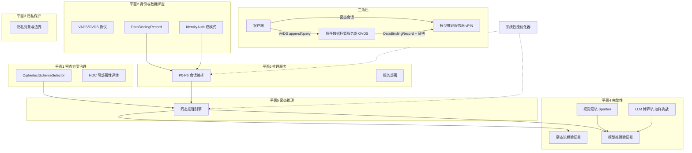
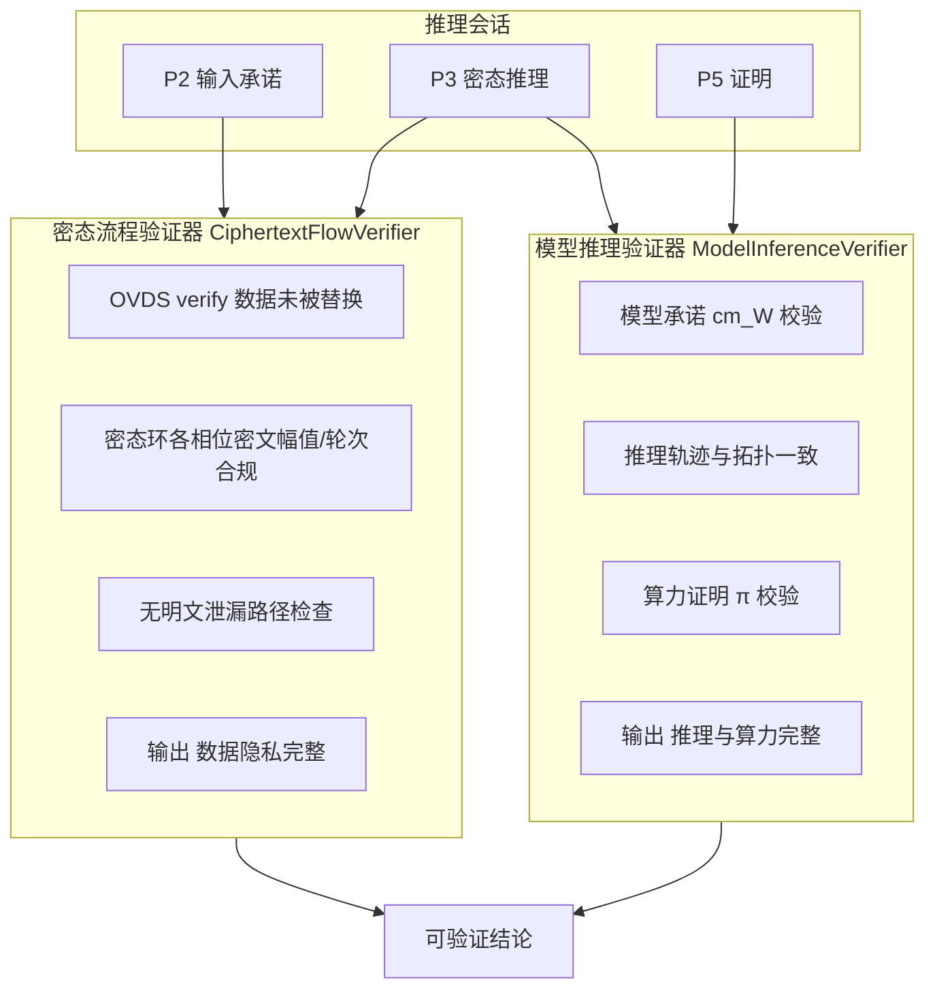
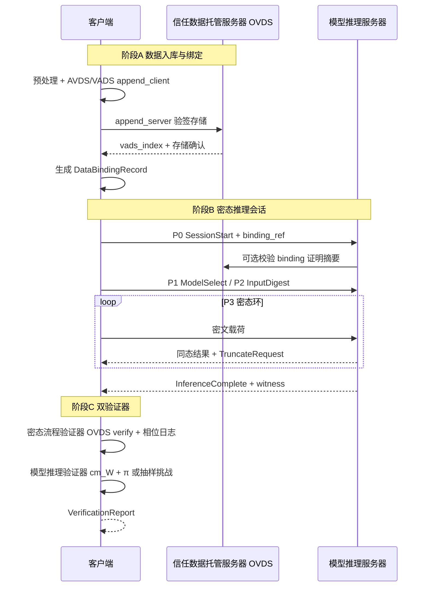

# vPIN 顶层抽象架构设计（修订稿 v3）

## 1. 核心定位

> **可验证隐私推理平台**——在期望精度下为视觉与 LLM 选择密态方案完成同态推理，通过 OVDS 将用户数据与身份绑定，经双验证器分别确认**数据隐私完整**与**模型推理及算力承诺完整**。

**三角色**（物理部署单元）：

| 角色 | 职责 | 参考实现 |
|------|------|----------|
| **客户端** | 数据预处理、OVDS 签名 append、密态推理参与、验证报告接收 | Tauri + `vpin-client` |
| **信任数据托管服务器** | 维护 VADS/OVDS 协议，存储可验证数据流，维护身份-数据绑定，向推理侧提供数据引用与完整性证明 | `ovds` 库（VADS + AVDS） |
| **模型推理服务器** | 执行治理平面选定的密态方案，接收绑定数据引用，生成推理结果与算力证明 | `vpin-backend` |

**术语**（来自 [`ovds`](D:/WorkStation/pythoncode/experiment-reproduction/ovds) 库）：

| 缩写 | 全称 | 作用 |
|------|------|------|
| **OVDS** | Optimized Verifiable Data Streaming | 多模态可验证流式数据托管方案（工程封装） |
| **VADS** | Verifiable Data Streaming | 核心协议：BLS 签名 + RSA Accumulator，操作 `setup/append/query/verify/audit/judge` |
| **AVDS** | Authenticated Verifiable Data Structure | 身份认证扩展：CLVC 承诺 + PRF，操作 `setup/append` 绑定身份向量 |
| **CLVC** | Commitment-Linked Vector Commitment | AVDS 底层向量承诺 |

---

## 2. 六平面总览



**设计原则**：六平面各管一事；三角色分部署；性能优化器横切注入平面 5/6，不独立成平面。

---

## 3. 平面一：密态方案治理平面

**职责**：为模型计算图选择可落地的同态加密体制与非线性策略。

| 模型类型 | 密态体制 | 非线性策略 | 完整性配套 |
|----------|----------|------------|------------|
| 小 CNN（Network A） | E₂ 指数 ElGamal（加法群域） | 客户端卸载 ReLU + 定点截断 | Spartan + EC gadget（硬轨） |
| 中 CNN（LeNet-CIFAR） | 同上 | 多相位截断 Π | 同上 |
| LLM | CKKS / BFV 混合 HE | Block 线性化、激活近似、统一非线性点 | **博弈轨**：采样式挑战（见 §6.3） |

**输出**：`{scheme, nonlinear_policy, deploy_plan, integrity_track}`

**落点**：`vpin_client/hdc/`、`orchestrator.py`、`ahe-onboard` API

---

## 4. 平面二：身份与数据绑定平面

**职责**：将用户身份与托管数据建立可验证绑定，使推理服务器只能消费**经 OVDS 认证的数据引用**，而非任意上传明文。

### 4.1 OVDS 数据托管流程（客户端 ↔ 托管服务器）

```
1. Setup     客户端 + 托管服务器初始化 VADS 状态（vk / server_state）
2. Append    客户端 append_client(数据块) → 托管服务器 append_server 验签存储
             每块获得 (vads_index, tag_i, sigma_i, data_digest)
3. Query     推理前按 vads_index 查询数据块 + 非成员证明 pi_q
4. Verify    客户端/验证方 verify / verify_star 确认数据未被篡改
5. Audit     定期 audit → judge 审计托管完整性（可选）
```

多模态数据经 OVDS 预处理（分块、SHA-256、整数编码）后进入 VADS 流（见 `OVDS实际应用多模态数据方案.md`）。

### 4.2 数据绑定记录 `DataBindingRecord`

推理会话通过绑定记录关联 OVDS 与 vPIN，**推理服务器不持有原始明文**：

```
DataBindingRecord {
  owner_id          // 身份标识（见 §4.3）
  ovds_file_id      // OVDS 文件/流 ID
  vads_indices[]    // 参与本次推理的 VADS 块索引
  data_digest       // SHA-256（与 P2 cm_x 对齐）
  ovds_verify_ref   // query/verify 证明摘要（可审计）
  binding_timestamp
}
```

- **P2 输入承诺** `cm_x` 与 `data_digest` / OVDS `tag_i` 链绑定，防止推理时偷换输入。
- 托管服务器向推理服务器下发 **绑定记录 + 密文或密文引用**（非明文像素）。

### 4.3 身份认证：双模式（保证全流程完整性）

| 模式 | 维护方 | 机制 | 适用 |
|------|--------|------|------|
| **托管中心模式** | 信任数据托管服务器 | AVDS `setup` 生成身份向量承诺 ρ；append 时 CLVC 打开证明绑定 owner_id ↔ 数据流；托管服务器校验授权后放行 query | ToB 多租户、统一审计 |
| **本地联邦模式** | 客户端本地 + 推理服务器 | 客户端自持身份凭证链；推理服务器在 P0 校验 session credential；OVDS 仅作数据完整性，身份由客户端签名断言 | 边缘单用户、离线优先 |

两种模式均须保证：**从数据入库 → 绑定记录生成 → 推理会话 → 验证报告** 的身份链条不断裂。托管中心模式由托管服务器充当信任锚；本地模式由客户端签名 + 推理服务器会话校验充当信任锚。

### 4.4 与密态推理的衔接

```
客户端 --[VADS 协议]--> 托管服务器（存储 + 证明）
客户端 --[DataBindingRecord + 密态载荷]--> 推理服务器
托管服务器 --[可选：证明摘要推送]--> 推理服务器（校验数据来源）
```

推理服务器与托管服务器**协同执行**治理平面选定的密态方案：托管侧负责数据可验证性，推理侧负责密态计算，二者通过 `DataBindingRecord` 与会话 ID 关联。

---

## 5. 平面三：隐私保护平面

**职责**：抽象用户数据与推理行为的隐私保护属性（不涉及密钥/挑战等实现细节）。

### 5.1 隐私对象

| 对象 | 保护目标 |
|------|----------|
| 原始输入 | 像素 / token 不对推理服务器以明文暴露 |
| 中间激活 | 层间特征不以明文存于推理服务器 |
| 推理行为 | 单次请求输入-输出关联不被持久画像 |
| 托管数据 | OVDS 块内容仅授权身份可 query |

### 5.2 小视觉模型五保证（Network A 实例）

1. **输入边界**：预处理在客户端；推理服务器无像素 API
2. **密态计算环**：线性@推理服务器，非线性必须回客户端再加密
3. **传输隔离**：用户内容走 WS 密文；REST 仅元数据
4. **行为隔离**：独立会话；批量密文按图独立
5. **托管绑定**：经 OVDS 入库的数据带 BLS 签名与 digest，推理引用绑定记录而非裸传文件

### 5.3 抽象接口

```
interface PrivacyPolicy {
  plaintext_zone()     -> {client_local}
  server_visible()     -> {ciphertext, public_weights, binding_meta}
  custody_visible()    -> {signed_chunks, indices, no_plaintext_export}
}
```

---

## 6. 平面四：完整性平面

**职责**：通过**两个独立验证器**分别确认密态流程隐私完整、模型推理与算力承诺完整。

### 6.1 双验证器架构



| 验证器 | 验证命题 | 输入 | 输出 |
|--------|----------|------|------|
| **密态流程验证器** | 数据保密性与密态流程完整性 | `DataBindingRecord`、OVDS 证明、P2/P3 密文相位日志 | `privacy_integrity: pass/fail` |
| **模型推理验证器** | 模型版本、推理正确性、算力承诺 | `cm_W`、轨迹 witness、π、部署计划 digest | `inference_integrity: pass/fail` |

二者均在客户端或指定验证方执行，推理服务器不可自证。

### 6.2 视觉小模型：硬完整性轨

- **模型承诺**：Spartan PC `cm_W`
- **算力证明**：CP-SNARK 按层 π + EC gadget
- **验证目标**：Pr[作弊] = 0（密码学硬保证）
- **落点**：`server-crypto` / `cp-snark-full`，P4–P6 协议

### 6.3 LLM：博弈轨 + 采样式挑战（工程优化）

受限于当前前沿效率，LLM **不做全量 Spartan 式算力承诺**，采用工程可落地的博弈轨：

| 组件 | 策略 |
|------|------|
| **密态推理** | 仍由治理平面选型 CKKS/混合 HE 执行（平面五） |
| **模型绑定** | Merkle / 张量分块承诺根（非全量 CPS.Comm） |
| **计算完整性** | **采样式挑战**：验证方随机抽取层/子图/ token 位置，要求服务器打开对应 trace 或 Freivalds 式随机投影响应 |
| **激励兼容** | 押金 / 重复抽检 / 多验证方交叉审计，使理性服务器作弊期望收益 < 0 |
| **验证器分工** | 密态流程验证器仍覆盖 HE 环；模型推理验证器执行抽样挑战判定 |

```
LLM 完整性 ≠ 全量承诺
LLM 完整性 = 密态推理可执行 + 抽样式挑战可审计 + 博弈惩罚可执行
```

### 6.4 可验证结论

```
VerificationReport {
  privacy_integrity      // 密态流程验证器
  inference_integrity    // 模型推理验证器
  integrity_track        // hard | game_sampling
  proof_coverage         // 明示覆盖范围，避免过度宣称
}
```

---

## 7. 平面五：密态推理平面

**职责**：执行治理平面选定的同态方案，消费 `DataBindingRecord` 引用的密态输入。

| 层 | 内容 |
|----|------|
| IR | LayerGraph + 定点尺度 |
| 编译 | HDC → `homomorphic_deploy_plan.json` |
| 执行 | `E2ElGamalBackend`（视觉）/ `CKKSHybridBackend`（LLM，待建） |

托管服务器与推理服务器分工：

- **托管服务器**：数据块存储、OVDS 证明、绑定记录签发
- **推理服务器**：加载模型权重、执行同态前向、产出 witness 与 π

---

## 8. 平面六：推理服务平面

**职责**：模型注册、会话编排、多引擎部署、可验证结论输出。

| 模块 | 职责 |
|------|------|
| 模型目录 | `registry.json` 能力标签 |
| Preflight | 数据集↔模型族、deploy plan、**DataBindingRecord 有效性** |
| 会话编排 | P0–P6；REST 控制 + WS 数据 |
| 多引擎 | Python :8000 / Rust-ark :8001 / Rust-ec :8002 |
| 安全中心 | 双验证器结果、证明覆盖披露 |

**扩展 P2**：`InputDigest` 除现有 digest 外，携带 `ovds_binding_ref`（绑定记录 ID）。

---

## 9. 横切：系统性能优化器

附着于平面五/六，根据边缘设备 **内存 / GPU / CPU** 画像与用户选定 `PerformanceProfile` 规划流水线、并发、引擎选择与弹性卸载。

| 指标 | Python 基线 | Rust 目标 |
|------|-------------|-----------|
| 单图同态推理 | ~27–33 s | <300 ms |
| 完整会话 P0–P3 | ~40–50 s | <1000 ms |
| 边缘批量吞吐 | ~2.25× @C=4 | 2.5 img/s |

---

## 10. 端到端时序（OVDS + vPIN 联合）



---

## 11. 代码映射（含 OVDS 集成）

| 抽象 | 平面 | 状态 | 路径 |
|------|------|------|------|
| `CiphertextSchemeSelector` | 治理 | 视觉已通 | `vpin_client/hdc/` |
| VADS `append/query/verify` | 身份绑定 | ovds 库已实现 | `ovds/src/vads_lib.py` |
| AVDS `setup` | 身份绑定 | ovds 库已实现 | `ovds/src/avds_lib.py` |
| `DataBindingRecord` | 身份绑定 | **待建** | 新模块或 `vpin-client` |
| `CiphertextFlowVerifier` | 完整性 | 部分（OVDS verify） | ovds + 会话 trace |
| `ModelInferenceVerifier` | 完整性 | 视觉桥接态 | `server-crypto` / verify/ |
| LLM 抽样挑战器 | 完整性 | 设计态 | 博弈轨文档 |
| `HomomorphicBackend` | 密态推理 | Python+Rust | `ahe_engine` / crates |
| `SessionOrchestrator` | 推理服务 | P0–P3 | `session.py` |
| `PerformanceProfile` | 性能优化器 | 部分 | `batch.py` |

---

## 12. 待写文档结构

新建 [`docs/architecture/vpin-平台顶层抽象架构.md`](docs/architecture/vpin-平台顶层抽象架构.md)：

1. 平台定位与三角色
2. 六平面定义与总图
3. OVDS/VADS/AVDS 术语与数据绑定流程
4. 身份认证双模式
5. 隐私平面抽象 + Network A 五保证
6. 完整性双验证器 + 视觉硬轨 + LLM 博弈采样式挑战
7. 密态方案治理选型表
8. 系统性能优化器
9. OVDS+vPIN 联合时序
10. 代码映射与演进路线
11. 附录：Network A 参考实例

**不写**：文献调研；私钥/γ 实现细节。

---

## 13. 变更记录

| 版本 | 变更 |
|------|------|
| v2 | 五平面；治理=密态选型；性能优化器横切；LLM 同态推理 |
| v3 | **+身份与数据绑定平面**；**三角色**（客户端/托管/推理）；**OVDS 集成**；**双验证器**；LLM 完整性改为**博弈轨采样式挑战**；P2 扩展 `ovds_binding_ref` |
