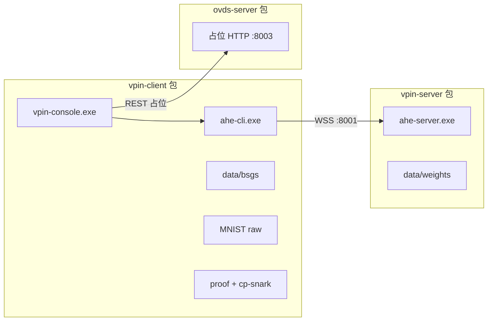

# 三包分拆发布计划

## 目标拓扑



| 包名 | 输出目录 | 核心产物 | 默认端口 |
|------|----------|----------|----------|
| **vpin-server** | `release/vpin-server_{ver}_win64/` | `ahe-server.exe` + 权重 | 8001 / 8002 |
| **vpin-client** | `release/vpin-client_{ver}_win64/` | `vpin-console.exe` + `ahe-cli.exe` + BSGS/MNIST/证明 | 连远程 server |
| **ovds-server** | `release/ovds-server_{ver}_win64/` | 占位 HTTP 服务 | 8003 |

**资产归属原则**（与架构一致）：
- **Server**：同态权重、模型 registry（服务端视角）；不含 BSGS、不含 UI
- **Client**：BSGS、MNIST、数据集/模型目录 JSON、ahe-cli、证明 witness + `cp-snark-full.exe`（延续当前便携证明路径）
- **OVDS**：仅占位，不依赖外部 `ovds/` 仓库

---

## 1. 配置与清单（新建 3 套 manifest）

在 [`config/`](config/) 新增：

| 文件 | 用途 |
|------|------|
| `release-vpin-server.manifest.json` | server 必需文件：`bin/ahe-server.exe`、`data/weights/...`、启动脚本 |
| `release-vpin-client.manifest.json` | client 必需文件：exe、cli、BSGS、MNIST、proof、cp-snark |
| `release-ovds-server.manifest.json` | ovds 占位：`bin/ovds-server-stub.exe` 或脚本、`config/placeholder.json` |

从现有 [`config/runtime-artifacts.manifest.json`](config/runtime-artifacts.manifest.json) **按角色拆分** `bundled` 条目（复用 `dir-all` / `dir-all-recursive` 类型），例如：

- **server**：`network_a_weights`（仅 npy + truncation）
- **client**：`bsgs_table_bin`、`mnist_raw`、`network_a_proof_artifacts`
- **ovds**：无大工件

保留 [`config/release-baseline.manifest.json`](config/release-baseline.manifest.json) 给一体包；三包各用自己的 baseline 或在 manifest 内嵌 `required_files`。

---

## 2. 构建脚本

### 2.1 编排入口

新建 [`scripts/build-release-split.ps1`](scripts/build-release-split.ps1)：

```powershell
.\scripts\build-release-server.ps1 -Version 0.1.0
.\scripts\build-release-client.ps1 -Version 0.1.0
.\scripts\build-release-ovds.ps1 -Version 0.1.0
.\scripts\check-release-split.ps1
```

参数：`-SkipRust`、`-SkipTauri`、`-Version`、`-Only server|client|ovds`

### 2.2 分包脚本（复用 [`scripts/lib/vpin-env.ps1`](scripts/lib/vpin-env.ps1)）

**[`scripts/build-release-server.ps1`](scripts/build-release-server.ps1)**
- 调用 [`scripts/build-rust-ahe.ps1`](scripts/build-rust-ahe.ps1)（仅 server 侧）
- 输出：`bin/ahe-server.exe`、`data/weights/cnn-mnist-trained/`、`config/models-registry.json`
- 生成 `start-vpin-server.ps1` / `.bat`：设 `VPIN_REPO_ROOT`、`VPIN_WEIGHTS_DIR`，启动 `:8001`（`-Both` 可选 `:8002`）
- **不含** `vpin-console.exe`、`ahe-cli.exe`、`table.bin`

**[`scripts/build-release-client.ps1`](scripts/build-release-client.ps1)**
- Tauri build → `vpin-console.exe`
- 复制 `ahe-cli.exe`、`cp-snark-full.exe`、BSGS、MNIST、proof、catalog JSON
- 生成 `start-vpin-client.ps1` / `.bat`：
  - `VPIN_REPO_ROOT`、`VPIN_BSGS_TABLE`
  - **`VPIN_SKIP_LOCAL_AHE=1`**（不拉起本地 ahe-server）
  - **`AHE_SERVER_HOST` / `AHE_SERVER_PORT`**（默认 `127.0.0.1:8001`，可改远程 IP）
  - 可选 `VITE_AHE_SERVER_URL` 写入 `config/client-endpoints.json` 供 UI 读取
- **不含** `ahe-server.exe`

**[`scripts/build-release-ovds.ps1`](scripts/build-release-ovds.ps1)**
- 最小占位：PowerShell `HttpListener` 脚本 **或** 新建极简 Rust crate `apps/ovds-stub`（仅 `GET /api/v1/health` + 托管路由 `501`）
- 推荐 **Rust stub**（与 ahe-server 一致，单 exe 可分发）：放在 `vpin-backend/apps/ovds-stub/` 或仓库根 `ovds-server-stub/`
- 输出：`bin/ovds-server.exe`（或 `ovds-server-stub.exe`）、`start-ovds-server.ps1`

### 2.3 保留一体包

[`scripts/build-release.ps1`](scripts/build-release.ps1) **保持不变**（或重命名为 `build-release-monolithic.ps1`，原脚本加 `-Monolithic` 别名），避免破坏现有 `check-release` 与已验证的 530MB 便携包。

---

## 3. 校验脚本

新建 [`scripts/check-release-split.ps1`](scripts/check-release-split.ps1)：

| 包 | 冒烟测试 |
|----|----------|
| **server** | 启动 ahe-server → `GET :8001/api/v1/health` |
| **client** | 文件清单 +（可选）若 server 已起：`ahe-cli preprocess --mnist-index 0` |
| **ovds** | 启动 stub → `GET :8003/api/v1/health` 返回 `placeholder` |

端到端可选：先起 server，再起 client，跑单图 infer + 证明 plan 可读。

---

## 4. 客户端代码改动（分包后必需）

当前客户端**硬编码本机**推理服，分包后需支持远程：

| 位置 | 改动 |
|------|------|
| [`vpin-console/src/config/networkAEngine.ts`](vpin-console/src/config/networkAEngine.ts) | `networkAEngineWsUrl()` 从 `aheServerApiBase()` / `config/client-endpoints.json` 推导 WS，而非写死 `127.0.0.1` |
| [`vpin-console/src/composables/usePlatformConnect.ts`](vpin-console/src/composables/usePlatformConnect.ts) | `VPIN_SKIP_LOCAL_AHE=1` 时跳过 `ensureAheServer()`，仅 ping 远程 |
| [`vpin-console/src-tauri/src/lib.rs`](vpin-console/src-tauri/src/lib.rs) | `build_rust_infer` 传递 `AHE_SERVER_HOST`（已有 port）；`ensure_ahe_server` 读环境变量跳过 |
| [`scripts/templates/start-vpin-client.ps1`](scripts/templates/)（新建） | 与 server 分离的启动模板 |

`ahe-cli` 已支持 `AHE_SERVER_HOST`（[`vpin-client/crates/ahe-client/src/config.rs`](vpin-client/crates/ahe-client/src/config.rs)），Tauri 侧补齐 env 传递即可。

---

## 5. OVDS 占位实现（最小可运行）

新建轻量 stub（二选一，优先 Rust exe）：

```
ovds-server_0.1.0_win64/
├── bin/ovds-server.exe      # 或 ovds-server-stub.exe
├── start-ovds-server.ps1
└── config/placeholder.json  # { "mode": "placeholder", "port": 8003 }
```

行为：
- `GET /api/v1/health` → `{ "status": "ok", "mode": "placeholder" }`
- `POST /api/v1/custody/*` → `501 Not Implemented`
- UI 侧 custody 仍可用 `LocalCustodyShim`；占位服供链路监视/未来对接

---

## 6. 发布文档

更新 [`scripts/templates/release-guide.md`](scripts/templates/release-guide.md) 为 **三包指南**（生成 `release/release-guide-split.md`）：

1. 先部署 **vpin-server**（推理节点）
2. 再部署 **vpin-client**（用户机，配置 `AHE_SERVER_HOST`）
3. **ovds-server** 可选（占位）
4. 一体包仍可用于单机离线演示

---

## 7. 实施顺序

1. 拆分 manifest + `build-release-server.ps1` + `check` server 冒烟
2. `build-release-ovds.ps1` + ovds stub
3. 客户端远程连接改动 + `build-release-client.ps1`
4. `build-release-split.ps1` 编排 + 端到端联调
5. 保留/文档化原 `build-release.ps1` 一体包

## 风险与边界

- **跨机部署**：需防火墙放行 8001 WSS；当前无 TLS，仅内网/本机
- **证明 P5**：仍在 client 包内调 `cp-snark-full`（与现 release 一致）；未来可迁到 vpin-server 二期
- **Python :8000**：三包均不含；开发环境仍用 `start-ahe-full.ps1`
- **ovds 真实现**：本里程碑仅占位，不引入外部 `experiment-reproduction/ovds` 依赖
