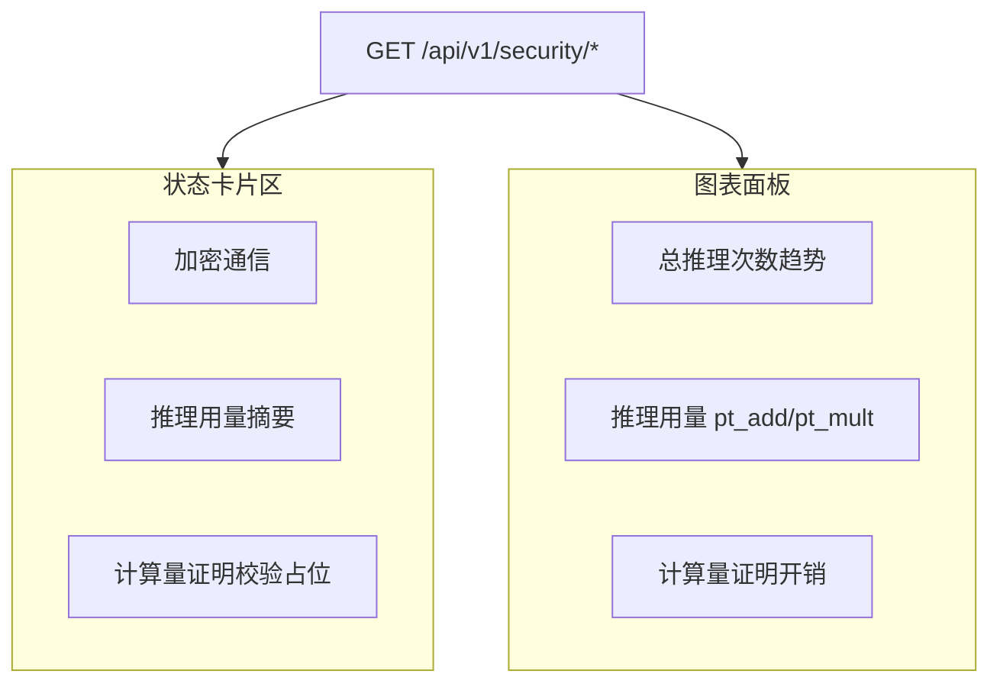

# 安全中心 Vue 化改造计划

## 背景与目标

当前 [`/security`](vpin_frontend/vpin-frontend/src/router/index.js) 通过 [`EmbedPage.vue`](vpin_frontend/vpin-frontend/src/views/EmbedPage.vue) 嵌入静态页 [`security-center.html`](vpin_frontend/vpin-frontend/public/vpin/pages/security-center.html)，内容为 TEE/TLS 占位文案，与 vPIN 实际能力不符。

**实际通信现状**（来自 [`aheClient.js`](vpin_frontend/vpin-frontend/src/services/aheClient.js) / Vite proxy）：
- REST：`http://127.0.0.1:8000/api/v1`（开发期经 Vite 代理 `/api/v1`）
- WebSocket：`ws://127.0.0.1:8000/api/v1/session/ws`
- **无 TLS、无证书**；密文在应用层 AHE 协议内传输

改造后页面结构（3 卡 + 图表面板）：



---

## 1. 架构：iframe → Vue（Tauri 友好）

| 项 | 方案 |
|---|---|
| 路由 | `/security` 改为挂载 `SecurityCenterView.vue`，不再使用 `EmbedPage` |
| 图表 | 新增 npm 依赖 **`chart.js` + `vue-chartjs`**（体积小于 echarts，Vite 可 tree-shake，适合 Tauri 本地包） |
| API | 新建 [`securityApi.js`](vpin_frontend/vpin-frontend/src/services/securityApi.js)，统一 fetch + 错误降级 |
| 样式 | 复用现有 Naive UI + [`naive-theme.js`](vpin_frontend/vpin-frontend/src/theme/naive-theme.js) token，卡片左边框色延续 `components.css` 中 secure/warning/info 语义 |

**不改动** `public/vpin/pages/security-center.html` 主体逻辑（保留旧直链兼容）；可在文件头加注释指向 Vue 路由，避免双份维护。

---

## 2. UI 改造明细

### 2.1 删除 TEE
- 移除「TEE 保护状态」卡片
- 移除下方「远程证明报告 / TEE 完整性验证报告」整块
- 网格由 4 列改为 **3 列**（`repeat(3, 1fr)`，窄屏 `auto-fit`）

### 2.2 加密通信（按实际情况 + TLS 可扩展）

卡片标题保持「加密通信」，内容**由 API 驱动**，本地开发默认展示：

| 字段 | 当前值（无 TLS） | TLS 启用后 |
|------|------------------|------------|
| 传输层 | HTTP / WS 明文 | HTTPS / WSS |
| API 基址 | `VITE_VPIN_API` 或 `/api/v1` | 同左 + 显示实际 host |
| 会话通道 | `.../session/ws` | `wss://...` |
| 证书 | **未配置**（灰色 Tag） | 颁发者 / 有效期 / 校验结果 |
| 应用层 | AHE 密文载荷 | 不变 |

使用 `NTag` 区分状态：`warning`（明文开发）、`success`（TLS 已启用）。

### 2.3 计算量证明校验（占位）

原「远程证明」卡片改为：
- 标题：**计算量证明校验**
- 副文案：`待接入 server-crypto / CP-SNARK 校验流程`
- 状态行：`最近一次校验：—`；按钮「查看报告」跳转现有 [`/security/verification`](vpin_frontend/vpin-frontend/src/router/index.js)（验证报告页暂保留，后续再 Vue 化）
- 对接 `GET /api/v1/security/computation-proof` 后替换占位文案

### 2.4 推理用量（替代「隐私预算」）

**顶部摘要卡**（原隐私预算位）：
- 标题：**推理用量**
- 主指标：总推理次数 `total_inferences`
- 副指标：本周/今日增量（API 字段 `delta_7d` / `delta_1d`）

**下方图表面板**（宽卡片，3 图横排，移动端纵向堆叠）：

1. **总推理次数** — 折线图（按日 `inferences_by_day[]`）
2. **推理用量** — 堆叠柱图（`pt_add` / `pt_mult` 按日或按会话聚合）
3. **计算量证明开销** — 组合图：证明耗时 `prove_ms`、验证耗时 `verify_ms`、开销倍率 `overhead_ratio`（或双轴折线）

加载态 `NSkeleton`；API 失败时显示 Mock 数据 + `NTag type="warning"`「演示数据」标签（与 [`MetricsPanel.vue`](vpin_frontend/vpin-frontend/src/components/task/MetricsPanel.vue) 占位风格一致）。

---

## 3. 后端 API 契约（供后端实现，前端先 Mock）

建议新增路由文件 [`vpin-backend/vpin_backend/api/routes/security.py`](vpin-backend/vpin_backend/api/routes/security.py) 并挂到 [`app.py`](vpin-backend/vpin_backend/api/app.py)：

### `GET /api/v1/security/transport`
```json
{
  "tls_enabled": false,
  "http_scheme": "http",
  "ws_scheme": "ws",
  "api_base": "http://127.0.0.1:8000/api/v1",
  "session_ws": "ws://127.0.0.1:8000/api/v1/session/ws",
  "certificate": null,
  "forward_secrecy": false,
  "payload_encryption": "ahe_ciphertext"
}
```
`certificate` 非 null 时：`{ "subject", "issuer", "valid_from", "valid_to", "verified" }`

### `GET /api/v1/security/inference-metrics`
```json
{
  "total_inferences": 0,
  "delta_7d": 0,
  "delta_1d": 0,
  "usage": {
    "pt_add_total": 0,
    "pt_mult_total": 0,
    "by_day": [{ "date": "2026-06-30", "pt_add": 0, "pt_mult": 0, "inferences": 0 }]
  },
  "proof_overhead": {
    "prove_ms_avg": 0,
    "verify_ms_avg": 0,
    "overhead_ratio": 0,
    "by_day": [{ "date": "2026-06-30", "prove_ms": 0, "verify_ms": 0 }]
  }
}
```
数据来源可对齐现有 [`get_op_counters()`](vpin-backend/vpin_backend/inference/homomorphic_network_a.py) 与会话完成事件聚合。

### `GET /api/v1/security/computation-proof`（占位）
```json
{
  "status": "pending",
  "last_verified_at": null,
  "coverage": null,
  "message": "计算量证明校验待接入"
}
```

前端 [`securityApi.js`](vpin_frontend/vpin-frontend/src/services/securityApi.js) 在 404/网络错误时返回内置 Mock，保证 Tauri 离线演示可用。

---

## 4. 文件清单

**新建**
- `src/views/SecurityCenterView.vue` — 页面容器
- `src/components/security/TransportStatusCard.vue`
- `src/components/security/ComputationProofCard.vue`
- `src/components/security/InferenceMetricsCharts.vue`
- `src/services/securityApi.js`
- `src/mocks/securityMetrics.js` — Mock 数据

**修改**
- [`src/router/index.js`](vpin_frontend/vpin-frontend/src/router/index.js) — `/security` → `SecurityCenterView`
- [`package.json`](vpin_frontend/vpin-frontend/package.json) — 添加 `chart.js`、`vue-chartjs`
- [`src/layouts/AppLayout.vue`](vpin_frontend/vpin-frontend/src/layouts/AppLayout.vue) — 安全中心分组文案可微调（副标题改为「通信与推理用量监控」）

**可选同步（低优先级）**
- [`task-dashboard.html`](vpin_frontend/vpin-frontend/public/vpin/pages/task-dashboard.html) 内嵌的 4 卡安全面板：删除 TEE 或加「已迁移至安全中心」提示，避免两套文案不一致
- 静态侧栏 [`sidebar.html`](vpin_frontend/vpin-frontend/public/vpin/components/sidebar.html)：「隐私预算」子项改为「推理用量」或移除（Vue 壳 [`AppLayout`](vpin_frontend/vpin-frontend/src/layouts/AppLayout.vue) 已无此项）

---

## 5. 验收标准

- `/security` 不再加载 iframe，Tauri `tauri dev` 下页面正常
- 无 TEE 相关文案与卡片
- 加密通信明确展示 HTTP/WS 明文 + AHE 应用层，无虚假「证书验证通过」
- 预留 TLS 字段：后端返回 `tls_enabled: true` 时 UI 自动切换为 HTTPS/WSS + 证书信息
- 三张图表有数据（API 或 Mock），总推理次数与 pt_add/pt_mult 可读
- 计算量证明校验为占位态，不伪造「已验证」
- `npm run build` 产物体积可控（chart.js 按需注册 Line/Bar 组件）
