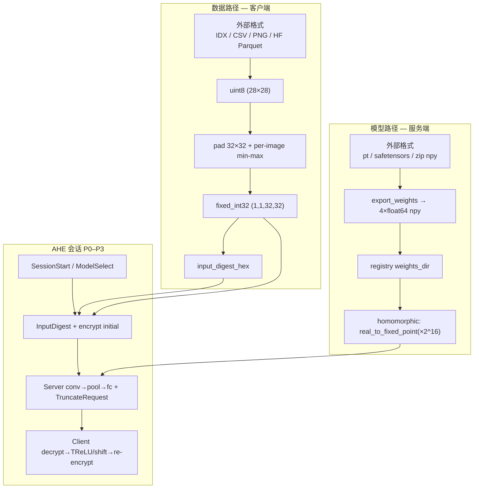

# AHE 同态推理：数据与模型预处理流程

> **最后更新**：2026-06-23  
> **实测报告**：`reports/dataset_format_analysis.json`（`python scripts/analyze_dataset_formats.py`）  
> **关联**：[数据集格式与上传规范](./数据集格式与上传规范.md) · [模型权重格式规范](./模型权重格式规范.md)

本文描述从**外部数据集/模型文件**到 **AHE WebSocket 会话**的完整预处理链路，含各平台格式实测结论。

---

## 1. 总览：两条并行流水线



| 路径 | 执行位置 | 输出物 | 进入 AHE 的形式 |
|------|----------|--------|-----------------|
| **数据** | 客户端（或上传 API 服务端预处理） | `fixed_int32` + digest | WS `InputDigest` + `initial` 密文 |
| **模型** | 服务端加载 | `NetworkAWeights` float64 | 同态 `fc1_layer` / `fc2_layer` 内定点化 |

---

## 2. 数据预处理（逐步）

### 2.1 标准流水线（代码：`vpin_client/data/core.py`）

```
Step 0  原始 uint8 (28, 28)     灰度 0–255
Step 1  x_f = raw / 255.0       float32
Step 2  pad 到 (1,1,32,32)      28×28 嵌入 [2:30, 2:30]
Step 3  min-max（单图）           clip [0.001, 0.9999999]
Step 4  fixed = norm × 2^16      int32
Step 5  digest = SHA256(bytes)   hex 64 字符
```

常量 SSOT：`FIXED_POINT_BITS=16`, `PAD_SIZE=32`, `INPUT_HW=28`（`constants.py`）。

### 2.2 统一加载入口（CLI / 推理）

`vpin_client/data/input_loader.py` → `load_inference_input()`，四选一：

| 参数 | 来源 | 预处理发生位置 |
|------|------|----------------|
| `mnist_index` | `load_official_test` | 客户端本地 |
| `upload_id` | `data/uploads/{id}/fixed_int32.npy` | 已预处理（上传时） |
| `image_path` | `preprocess_upload_path` | 客户端本地 |
| `fixed_npy` | 直接 `np.load` | 跳过（调用方负责） |

CLI 示例：

```powershell
.\.venv\Scripts\python.exe -m vpin_client ahe-infer --mnist-index 0 --model cnn-mnist-trained --timing
.\.venv\Scripts\python.exe -m vpin_client ahe-infer --upload-id <uuid> --model cnn-mnist-trained
.\.venv\Scripts\python.exe -m vpin_client ahe-infer --image path\to\digit.png --model cnn-mnist-trained
```

---

## 3. 外部数据格式：实测对照（test index=0）

运行 `scripts/analyze_dataset_formats.py` 生成 `reports/dataset_format_analysis.json`。

| 来源 | 原始格式 | 与官方 IDX digest 一致 | 说明 |
|------|----------|------------------------|------|
| **LeCun IDX**（`official_mnist.py`） | `*-ubyte` magic 2051/2049 | ✅ 基准 | digest `369c85c3…` |
| **PNG 无损上传** | PNG → Pillow LANCZOS 28×28 | ✅ | 与官方逐字节一致 |
| **Kaggle CSV** | `label` + `pixel0..783` | ✅ | 展平/reshape 后与 IDX 一致 |
| **HF `ylecun/mnist`** | Hub Parquet；API 缓存 **JPEG** | ❌ | 像素 mean 23.54 vs 24.69；**勿用于 AHE 验收** |
| **JPEG 重编码**（实验） | quality=95 | ❌ | 有损压缩改变像素 → digest 变 |

### 3.1 官方 IDX（torchvision / CVDF 镜像）

**磁盘布局**（本仓库缓存）：

```
model_training/data/mnist/MNIST/raw/
  train-images-idx3-ubyte   # 47_040_016 B, 60000×28×28
  train-labels-idx1-ubyte   # 60_008 B
  t10k-images-idx3-ubyte    # 7_840_016 B, 10000×28×28
  t10k-labels-idx1-ubyte    # 10_008 B
```

**IDX 图像头**：`magic=2051`, `count`, `rows=28`, `cols=28`，随后 `count×784` 字节。

**AHE 推荐**：唯一验收数据源 `official_mnist.py`（自动下载 CVDF / S3 镜像）。

### 3.2 Hugging Face `ylecun/mnist`

| 项 | 内容 |
|----|------|
| Hub | https://huggingface.co/datasets/ylecun/mnist |
| 特征 | `image`（28×28 L）、`label`（0–9） |
| 存储 | Parquet 分片（Hub 自动从 IDX 转换） |
| `datasets` 加载 | `load_dataset("ylecun/mnist", split="test", streaming=True)` |
| API 探针 | `https://datasets-server.huggingface.co/rows?dataset=ylecun/mnist&config=mnist&split=test&offset=0&length=1` |

**实测结论**：通过 datasets-server 取回的 `image` 为 **JPEG 缓存 URL**，解码后与官方 IDX **像素不完全相同**，vPIN digest **不一致**。

**AHE 做法**：

- 验收 / 训练对齐 → 用 `official_mnist.py`
- 演示 HF 集成 → 可加载 HF，但应视为**独立数据源**，不假设 index 与 LeCun test 对齐
- 若必须从 HF Parquet 本地读取 → 优先 `datasets` 的 **PNG/无损字节列**，避免 JPEG 二次编码

### 3.3 Kaggle Digit Recognizer

| 文件 | 列 | 布局 |
|------|-----|------|
| `train.csv` | 785 列 | `label` + `pixel0`…`pixel783` |
| `test.csv` | 784 列 | 无 label |
| 像素公式 | `x = i×28 + j` | 行 `i`、列 `j`，0-based |

```python
pixels = row[[f"pixel{i}" for i in range(784)]].to_numpy(dtype=np.uint8).reshape(28, 28)
prep = preprocess_uint8_28x28(pixels, label=int(row["label"]), source="kaggle_csv")
```

实测：与官方 IDX 同 index **digest 一致**（CSV 为无损整数像素）。

### 3.4 图片上传（PNG / JPEG / WebP）

`upload.py`：`PIL.open → convert("L") → resize((28,28), LANCZOS)`。

| 格式 | AHE 影响 |
|------|----------|
| PNG | ✅ 无损，实测 digest 与官方一致 |
| JPEG | ⚠️ 有损，像素漂移 → digest 变、精度风险 |
| 非 28×28 | resize 引入插值，与原生 28×28 可能不同 |

服务端存储（`vpin_backend/data/upload.py`）：

```
data/uploads/{upload_id}/
  fixed_int32.npy    # AHE 可直接 --upload-id 加载
  meta.json          # digest、preview、filename
```

---

## 4. 模型预处理（逐步）

### 4.1 训练 → AHE npy bundle

```
checkpoint.pt (PyTorch NetworkA/B)
    ↓ export_weights.py
weight_fc1_*_*.npy   shape (fc1_in, fc1_out)  float64
bias_fc1_*.npy       shape (fc1_out,)
weight_fc2_*_*.npy   shape (fc1_out, 10)
bias_fc2_10.npy      shape (10,)
    ↓ register_backend / POST models npy_bundle
registry.json → weights_dir
```

Network A 导出逻辑（`export_weights.py`）：`fc.weight.numpy().T.astype(float64)`。

### 4.2 服务端同态加载

`weights_bundle.load_homomorphic_weights()` → `NetworkAWeights`（float64 ndarray）。

同态 FC 前（`homomorphic_network_a.py`）：

```python
weight_fp = real_to_fixed_point(weight_matrix.astype(np.float64), bits=16)
```

卷积核 **固定**，来自 `topology` / 引擎内置，**不在 npy 包内**。

### 4.3 本仓库实测 npy bundle

| 路径 | network | 校验 |
|------|---------|------|
| `model_training/outputs/20260622_184254/` | A | ✅ valid |
| `model_training/outputs/20260622_174721/` | A | ✅ valid |
| `src/cnn_networks/Pre_trained_model/` | A | ✅ valid（legacy） |

各文件 dtype 均为 `float64`，形状与 `weights_layout.py` 一致。

### 4.4 外部模型格式 → AHE 路径

| 外部格式 | 检测 | AHE 路径 |
|----------|------|----------|
| `.zip` / 目录 4×npy | `AHE_NPY_BUNDLE` | 直接注册 |
| `checkpoint.pt` | `CHECKPOINT_PT` | `export_weights.py` |
| HF `safetensors` | 未自动 | 映射 `fc1/fc2` 键 → npy（须拓扑一致） |
| `model_export.json` | `MODEL_EXPORT_JSON` | CP-SNARK 注册，**非** AHE 主路径 |
| `.onnx` / `.h5` | `UNKNOWN` | 需重训或手写导出 |

详见 [模型权重格式规范.md](./模型权重格式规范.md)。

---

## 5. AHE 会话内数据流（P0–P3）

### 5.1 协议时序

```text
Client                          Server
  | SessionStart                    |
  |<──────── SessionAccept ─────────|
  | ModelSelect(model_id)           |
  |<──────── ModelSelectAck ────────|  truncation_plan + network_id
  | InputDigest(digest, shape)      |
  |<──────── InputDigestAck ────────|
  | PublicKey                       |
  |                                 | 构造 AheEngine + 加载 npy
  | encrypt(fixed_int32) initial    |
  |────────────────────────────────>|
  |<──────── conv 密文 + TruncateRequest(after_conv, relu)
  | decrypt → relu → re-encrypt     |
  |────────────────────────────────>|
  |<──────── pool+flat + TruncateRequest(after_pool, shift, 26)
  | decrypt → shift(26) → re-encrypt|
  |────────────────────────────────>|
  |<──────── fc1 + TruncateRequest(after_fc1, relu_then_shift, 32)
  | decrypt → relu → shift(32)      |
  |────────────────────────────────>|
  |<──────── fc2 + TruncateRequest(after_fc2, relu_only)
  | decrypt → relu → argmax         |
  |<──────── InferenceComplete ─────|
```

代码：`vpin_client/protocol/ws_ahe_client.py`（客户端）、`vpin_backend/api/routes/session.py` + `inference/ahe_engine.py`（服务端）。

### 5.2 Network A 截断相位（`topology.py`）

| phase_id | client_action | shift_bits | 张量形状 |
|----------|---------------|------------|----------|
| `after_conv` | `relu` | — | (1,1,32,32) |
| `after_pool` | `shift` | **26** | (1,64) |
| `after_fc1` | `relu_then_shift` | **32** | (1,16) |
| `after_fc2` | `relu_only` | — | (1,10) |

客户端实现：`vpin_client/crypto/ahe/activation.py` → `shifting(decrypted, from_bits)` 等价 legacy `Client.py shifting()`。

**训练对齐**：`model_training/network_a/fixed_point.py` 中 `apply_client_action` 在 shift **之前**保持 int64，与 legacy 一致（修复 FC₁ 精度 bug 的关键）。

### 5.3 定点语义

| 阶段 | 定点含义 |
|------|----------|
| 输入 encrypt | 明文 `fixed_int32`，scale 2^16 |
| pool 后 shift 26 | 除以 2^26 再 × 2^16 |
| fc1 后 relu+shift 32 | ReLU 后除以 2^32 再 × 2^16 |
| fc2 后 relu_only | 解密得 logits，客户端 argmax |

---

## 6. 按场景的推荐工作流

### 6.1 官方 MNIST AHE 验收（推荐）

```powershell
# 1. 数据：官方 IDX（自动缓存）
.\.venv\Scripts\python.exe -m vpin_client ahe-infer --mnist-index 0 --model cnn-mnist-trained --timing

# 2. 可行性（定点 vs float）
.\.venv\Scripts\python.exe scripts\check_ahe_feasibility.py --run-dir model_training/outputs/20260622_184254
```

### 6.2 用户上传图片（演示预处理）

```powershell
# 浏览器 → POST /api/v1/data/upload/preprocess
# CLI 推理（需后端 uploads 目录有 fixed_int32.npy）
.\.venv\Scripts\python.exe -m vpin_client ahe-infer --upload-id <uuid> --model cnn-mnist-trained
```

### 6.3 Kaggle CSV → vPIN

```python
import pandas as pd
from vpin_client.data.core import preprocess_uint8_28x28

df = pd.read_csv("train.csv")
row = df.iloc[0]
raw = row.filter(like="pixel").to_numpy(dtype=np.uint8).reshape(28, 28)
result = preprocess_uint8_28x28(raw, label=int(row["label"]), source="kaggle_csv")
# result.fixed_int32 → ahe-infer --fixed-npy out.npy（或扩展 CLI）
```

### 6.4 HF 数据集 → vPIN（注意 JPEG）

```python
# 推荐：本地 Parquet/Arrow 无损列，勿用 datasets-server JPEG URL
from datasets import load_dataset
import numpy as np
from vpin_client.data.core import preprocess_uint8_28x28

ds = load_dataset("ylecun/mnist", split="test", streaming=True)
row = next(iter(ds))  # 或 skip 到目标 index
raw = np.array(row["image"].convert("L"), dtype=np.uint8)
# 与 official 对比 digest 再决定是否用于验收
```

### 6.5 自训模型 → AHE

```powershell
.\.venv\Scripts\python.exe -m model_training.network_a.train --device cuda
.\.venv\Scripts\python.exe -m model_training.network_a.export_weights --run-dir model_training\outputs\<id>
.\.venv\Scripts\python.exe -m model_training.network_a.register_backend --weights-dir model_training\outputs\<id>
```

---

## 7. 格式选型决策树

```text
需要 AHE 同态推理？
├─ 数据
│   ├─ 要与论文/LeCun 对齐 → official_mnist.py（IDX）
│   ├─ Kaggle CSV 像素列 → reshape 28×28 → preprocess_uint8_28x28 ✅
│   ├─ 用户照片 → PNG 优先；避免 JPEG
│   └─ HF Hub → 验证 digest；JPEG/Parquet 无损列需甄别
└─ 模型
    ├─ 已有 vPIN 训练 run → export_weights → npy bundle ✅
    ├─ legacy Pre_trained_model → 直接 cnn-mnist ✅
    ├─ HF safetensors → 映射脚本 → npy（拓扑须 A/B）
    └─ LeNet/ONNX 通用 CNN → 重训 Network A/B
```

---

## 8. 工具与报告

| 工具 | 用途 |
|------|------|
| `scripts/analyze_dataset_formats.py` | 多格式下载/探针 + digest 对照 |
| `scripts/check_ahe_feasibility.py` | float vs fixed 精度门槛 |
| `vpin_client/models/format_adapter.py` | 模型格式检测 |
| `reports/dataset_format_analysis.json` | 最近一次实测输出 |

---

## 9. 已知限制

| 项 | 状态 |
|----|------|
| HF Hub 与 IDX 同 index 字节一致 | ❌ JPEG 缓存可导致不一致 |
| 前端 AHE 对 upload_id | ⚠️ CLI 支持；浏览器 Demo 待接 WS |
| Network C–E AHE | ❌ 待引擎扩展 |
| HF/Kaggle 一键导入 API | ❌ 见 §6 脚本路径 |
