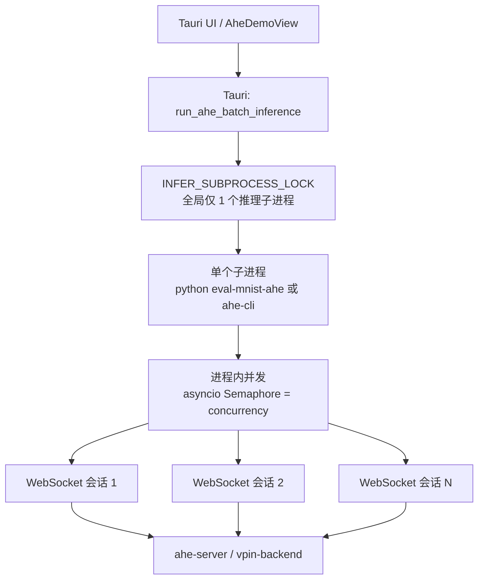
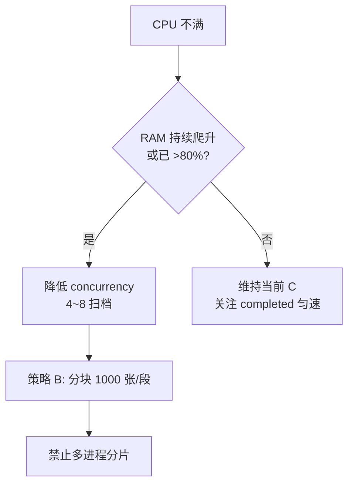
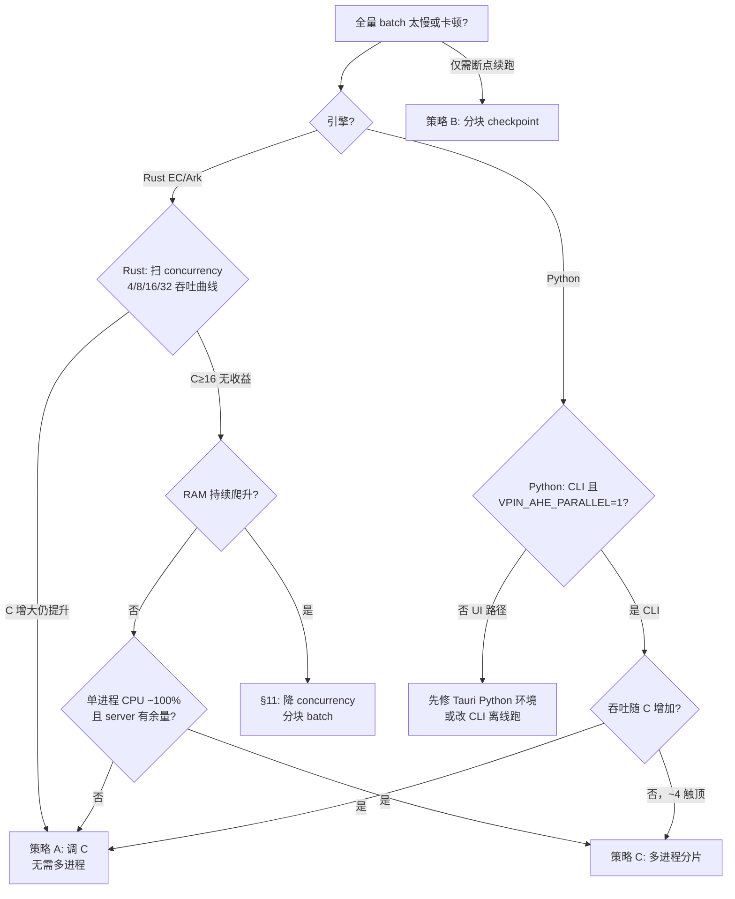

# AHE 批量并发策略：是否需要「多进程分片」？

> 文档性质：架构思考 / 决策参考（非实现规格）  
> 日期：2026-06-28  
> 背景：UI 全量 MNIST（0–9999）批量推理；观测约 **1 s/张**（Rust EC 轨）；讨论是否应改为「分批起多个子进程」。

---

## 1. 结论摘要

| 场景 | 是否需要新的多进程分片策略 | 建议 |
|------|---------------------------|------|
| **Rust EC/Ark + 均摊 ~1 s/张** | **暂不需要** | 单 `ahe-cli` + 进程内并发；**内存 bound 时降 C（4–8），勿加进程** |
| **CPU 不满 + 内存持续升高** | **否，反向操作** | 降 concurrency / 分块 batch；多进程会复制 BSGS 与会话缓冲 |
| **Python + vpin-backend + 均摊 >10 s/张** | **可选，非 MVP 必须** | 单进程 asyncio 并发在 ~4 会话后收益递减（见 §4）；CLI 离线评测可考虑分片 |
| **Tauri UI 驱动 Python 批量** | **先修环境，再谈分片** | Tauri 强制 `VPIN_AHE_PARALLEL=0`，客户端 ProcessPool 关闭，比 CLI 慢一截 |

**核心判断**：你当前看到的 **~1 s/张** 说明瓶颈已不在「单进程 Python GIL」，而在 **Rust 客户端 + ahe-server 的会话吞吐**。此时再拆多个客户端进程，**收益不确定、运维复杂度显著上升**，除非压测证明单进程并发已触顶（§6）。

---

## 2. 现状：批量并发到底在哪里发生？



### 2.1 进程内并发（当前默认策略）

- **Python**：`vpin_client/pipeline/batch.py` → `asyncio.Semaphore(concurrency)` + `asyncio.gather`
- **Rust**：`ahe-cli eval-mnist-ahe --concurrency N`（与 Python 语义对齐）
- **含义**：**一个 OS 进程**内同时维持 **N 条 WebSocket 会话**，共享同一 keypair（P1+P2 批量优化）
- **UI 文案**：「并发 = 并发 WebSocket 会话数」（不是 OS 进程数）

### 2.2 Tauri 层的额外约束

| 约束 | 位置 | 影响 |
|------|------|------|
| 全局子进程锁 | `lib.rs` → `INFER_SUBPROCESS_LOCK` | 同一时刻只能跑 **一个** batch/single 子进程；UI 不能并行起第二个 CLI |
| Python 并行加密关闭 | `apply_python_env` → `VPIN_AHE_PARALLEL=0` | UI 路径下客户端 **ProcessPool 加解密被关**，仅为避免 Tauri 管道/并发 invoke 下 exit 1 |
| 大批量 UI | `useAheBatchTimeline` compact 模式 | 只影响展示，不影响推理吞吐 |

### 2.3 服务端并发

- **vpin-backend (:8000)**：`ProcessPoolExecutor` 卸载同态 EC（`VPIN_AHE_SERVER_WORKERS`，默认约 3）
- **ahe-server (:8001/:8002)**：Rust 实现，能力取决于编译配置与 CPU；需用 `completed/total` 与后端 CPU 监控判断是否饱和

---

## 3. 性能观测：~1 s/张 意味着什么？

### 3.1 与历史基线对照

| 路径 | 典型均摊/张 | 来源 |
|------|------------|------|
| Python 串行 | ~28 s | [ahe-批量推理-性能优化设计.md §12.1](ahe-批量推理-性能优化设计.md) |
| Python 并发=4 | ~12 s | 同上 |
| Python 报告单张 crypto | ~18 s | `reports/batch_10_*.json`（Tauri/CLI，concurrency=2） |
| **Rust EC（你的观测）** | **~1 s** | 现场 UI/顶栏 ETA |

Rust 轨比 Python 快 **一个数量级以上**，说明：

1. 当前全量 10000 张的主要耗时在 **推理本身 × 张数**，而非 UI 表格（已做 compact 优化）。
2. 若 concurrency=16 且流水线饱和，粗算墙钟时间：
   - 理想：\(10000 / 16 \times 1\text{s} \approx 10.4\) **分钟**
   - 部分重叠不足：\(10000 \times 1\text{s} / \text{有效并行度}\)，仍可能在 **数十分钟** 量级，属正常。

### 3.2 「1 s/张」的两种读法

| 读法 | 含义 | 多进程是否有用 |
|------|------|----------------|
| **单张 crypto_infer ≈ 1 s** | 并发 16 时理论 ~16 张/秒 完成 | 仅当单进程 event loop 已 100% CPU 且服务端有余量 |
| **顶栏 ETA 均摊 ≈ 1 s/张** | 已含并发摊销 | 说明当前策略 **已经有效**；应先扫 concurrency 曲线再考虑分片 |

---

## 4. 为什么 Python 路径「加并发」有上限？

详见 [ahe-批量推理-性能优化设计.md §12.4](ahe-批量推理-性能优化设计.md)：

- 吞吐约 **5–6 img/min** 触顶，与 concurrency 4→8→16 **关系不大**
- 瓶颈：**单主进程**内的 pickle IPC、WS 分帧、asyncio 协调（GIL）
- 加解密 ProcessPool **已非瓶颈**；再加 worker 无效

因此 Python 的「新策略」讨论的是 **多进程绕开 GIL**，而不是简单把 UI 里的 concurrency 调到 32。

---

## 5. 策略对比：三种批量并行模型

### 策略 A：维持现状 — 单进程 + Semaphore（推荐：Rust @ ~1 s/张）

```
[ Tauri ] → [ 1 × ahe-cli --concurrency C ] → [ C × WS ] → [ ahe-server ]
```

**优点**

- 实现已完成；keypair 共享；进度 NDJSON 单流，易聚合
- Rust 路径下性能已足够支撑万级 batch

**缺点**

- 单点：子进程崩溃则整批失败（可 CLI 断点续跑补做）
- concurrency 过大时服务端 / 端口 / 内存压力上升

**适用**：Rust EC/Ark 在线 batch；Python 小规模（≤500）UI 验证

---

### 策略 B：单进程分块顺序 — 降低风险，非加速

```
10000 张 → 10 段 × 1000 张，顺序启动 10 次 batch（仍受 Tauri 全局锁）
```

**优点**：每段报告独立、失败易重跑  
**缺点**：**不增加并行度**，总时间 ≈ 一次跑完  
**适用**：稳定性优先、需中间 checkpoint，不用于提速

---

### 策略 C：多进程分片 — 新策略（仅在有压测证据时做）

```
                    ┌─ Worker 0: ahe-cli --start 0    --limit 2500 -j 4 ─┐
[ Orchestrator ] ──┼─ Worker 1: ahe-cli --start 2500 --limit 2500 -j 4 ─┼→ ahe-server
                    └─ Worker 3: ahe-cli --start 7500 --limit 2500 -j 4 ─┘
```

**理论收益**

- Python：每 worker 独立 GIL、独立 ProcessPool → 可能突破 §12.4 单进程天花板
- Rust：仅当单进程 event loop / 单核 CPU 已满 **且** server 仍有 headroom

**成本与风险**

| 项 | 说明 |
|----|------|
| 协调器 | 需合并 report、汇总 NDJSON、处理部分失败 |
| 密钥 | 每 worker 独立 keypair 可以；与现 P1+P2「跨会话共享 key」不同，但不影响正确性 |
| 服务端 | 4 worker × concurrency 4 = **16 会话** 与单进程 c=16 **等效负载**；若拆 4×16 则会话爆炸 |
| 内存 | Python 每 worker 一份 BSGS 表 (~230MB+) |
| Tauri | 需 **放宽或绕过** `INFER_SUBPROCESS_LOCK`，或 orchestrator 在 Tauri 外（CLI 脚本）运行 |
| 进度 UI | 多路 NDJSON 需 `shard_id` 字段 |

**适用**

- Python 离线全量评测，且压测证明单进程 c=4 无法再提升
- Rust 单进程 CPU 打满 1 核、ahe-server CPU 仍 <50%

**不适用**

- Rust 已 ~1 s/张且 server 接近饱和
- 仅为了「看起来并行」而 4 进程 × 高 concurrency
- **CPU 未跑满但内存已高**（见 §11）— 多进程会 **复制 BSGS/会话缓冲**，雪上加霜

---

## 11. 内存 bound vs CPU bound（2026-06-28 现场反馈）

> **观测**：全量 batch 期间 **CPU 并未跑满，内存占用为主**。  
> **含义**：当前瓶颈更可能是 **并发会话数 × 密文/中间态常驻**，而非算力不足；**不应**通过「多加进程」提速。

### 11.1 内存主要花在哪里

| 来源 | 量级（粗估） | 随 concurrency 变化 |
|------|-------------|---------------------|
| BSGS 解密表 | ~230MB × 解密 worker 数（Python 客户端） | 进程池 worker 固定；**Tauri Python 路径已关 ProcessPool** |
| Rust `ahe-cli` / `ahe-server` | 表 + 运行时缓冲（实现相关） | 单进程内多会话 **线性叠加 in-flight 缓冲** |
| 每条 WS 会话 in-flight | conv 1024 cell 密文、logits 等 | **≈ 与 concurrency 成正比** |
| 批量 report（CLI stdout） | 10000 条 × 含 logits 的 JSON | **结束时一次性峰值**（UI compact 不渲染全表） |
| Trace | 每图数十步 × N 张 | concurrency × 样本数；**必须 none** |

设计文档 [ahe-批量推理-性能优化设计.md §6 / §12.5](ahe-批量推理-性能优化设计.md) 已指出：**背压 Semaphore 的上限应受内存约束，而非 CPU 核数**。

### 11.2 为何 CPU 不满却「慢」或卡

1. **内存压力 → 换页 / GC / 分配阻塞**：CPU 空等内存带宽或 OS 分页，利用率看起来不高。
2. **I/O 与协调**：WebSocket 收发、序列化在主线程/async 循环，不占满多核。
3. **服务端排队**：会话在等锁或缓冲 flush，客户端 CPU 空闲。
4. **并发设过高**：16 路会话同时持有大密文块 → **RAM 顶满**，但 EC 计算仍主要在少数核上。

这与 §12.4「加 concurrency / 加 worker 池 CPU 仍不满」是同一类现象，只是你的机器上 **先触顶的是内存而非 GIL**。

### 11.3 策略修正（内存 bound 时）

| 做法 | 建议 | 原因 |
|------|------|------|
| 多进程分片（策略 C） | **❌ 不推荐** | 每进程一份表 + 会话缓冲，RAM **乘 shard 数** |
| 提高 concurrency 到 32+ | **❌ 不推荐** | in-flight 密文 **线性增** |
| **降低 concurrency（8→4→2 扫档）** | **✅ 优先** | 减 in-flight，常 **略增均摊/张** 但总吞吐可能更稳、更少 swap |
| Trace = none | **✅ 必须** | 避免 trace 堆内存 |
| 分块顺序 batch（策略 B） | **✅ 推荐** | 如 10×1000 张；每段结束释放 report，**峰值 RAM 可控** |
| 全量结果只看 report 文件 | **✅** | 勿在 UI 展开 10000 行 |

**Rust EC @ ~1 s/张 且内存 bound 的典型调参**：

```text
concurrency: 16 → 试 8 → 4
观察：任务管理器 ahe-cli.exe + ahe-server.exe 合计 RSS、是否仍 swap
目标：RSS 稳定不再爬升 + 顶栏 completed 匀速增加
```

### 11.4 决策流程补充（内存分支）



### 11.5 与「是否需要新并发策略」的直接回答

- **不需要**「多进程分批」来提速 — 在内存 bound 下会 **更差**。
- **需要**的是 **内存感知的单进程并发**：把 `concurrency` 当作 **in-flight 会话上限**（背压），而不是「越大越快」。
- 若降到 concurrency=4 后 **RSS 稳定、吞吐几乎不变**，说明之前 16 主要在 **堆内存/换页**，而非真并行 16 路计算。

---

## 6. 决策流程（是否上策略 C）



### 6.1 自动化压测（已实现）

仓库内 CLI 命令 **`bench-mnist-ahe`** 会按并发档扫参，记录耗时与 RSS，并写入 `reports/bench_batch_*.json`。

**Rust EC（与你 UI 一致，需先启动 ahe-server :8002）：**

```powershell
cd d:\WorkStation\pythoncode\experiment-reproduction\vPIN-main
.\.venv\Scripts\python.exe -m vpin_client.cli bench-mnist-ahe `
  --engine rust-ec `
  --limit 64 `
  --concurrency 4,8,16,32 `
  --no-warmup
```

**Python + vpin-backend :8000：**

```powershell
.\.venv\Scripts\python.exe -m vpin_client.cli bench-mnist-ahe `
  --engine python `
  --limit 32 `
  --concurrency 1,2,4,8
```

可选：`pip install psutil` 后 `--watch-names ahe-cli.exe,ahe-server.exe` 统计客户端+服务端合计 RSS。

等价脚本：`python scripts/benchmark_ahe_batch.py --engine rust-ec --limit 64 --concurrency 4,8,16`

输出列：`C`（并发）、`time(s)`、`s/img`、`img/s`、`rss_peak`（本进程+子进程）、`watch_peak`（按进程名合计）。

---

### 6.2 手工扫档（备用）

```powershell
# 固定 64 张，扫并发档（热态第二次可略准）
foreach ($c in 4,8,16,32) {
  Measure-Command {
    & D:\...\vpin-platform\target\release\ahe-cli.exe eval-mnist-ahe `
      --start 0 --limit 64 --concurrency $c --progress `
      --crypto-backend ec --model cnn-mnist-trained
  } | Select-Object TotalSeconds
}
```

记录：**总耗时、均摊/张、ahe-server 进程 CPU%**。

- 若 **c=16→32 总耗时下降 ≥15%** → 继续提高单进程 concurrency，**不需要**多进程
- 若 **c 增大无收益且 ahe-cli 单核 100%** → 考虑 **2–4 个分片进程、每片 c=8**
- 若 **c 增大无收益且 server CPU 100%** → 瓶颈在服务端，应扩 server worker / 多实例，而非加客户端进程

---

## 7. 全量 10000 张：推荐配置（基于 ~1 s/张 观测）

| 参数 | 建议 | 理由 |
|------|------|------|
| Trace | **none** | 万级 trace 极大 NDJSON / 内存 |
| concurrency | **4–8 起**（内存 bound 时勿默认 16） | 见 §11；in-flight 会话 ≈ 内存占用 |
| UI 模式 | compact（>200 张自动） | 已上线，避免表格卡死 |
| 引擎 | 继续 Rust EC | 与 ~1 s/张 一致 |
| 多进程分片 | **暂不启用** | 无压测顶板证据前复杂度不值 |
| 预估墙钟 | concurrency=16、1 s/张 → **约 10–30 min** | 含冷启动、抖动、服务端排队 |

若顶栏 `completed` 持续增加、均摊稳定在 ~1 s/张，**即属正常完成路径**，无需为了「心理并行」拆进程。

---

## 8. 若未来实现策略 C：最小规格草案

> 以下为 **Phase 2** 占位，非当前 MVP 范围。

### 8.1 CLI 协调器（Tauri 外优先）

```text
python -m vpin_client.cli eval-mnist-ahe-shard \
  --start 0 --limit 10000 \
  --shard-workers 4 \        # OS 进程数
  --concurrency 4 \          # 每 shard 内 WS 并发
  --merge-report reports/full.json
```

- 父进程：划分 `[start, start+chunk)`，`ProcessPoolExecutor(max_workers=shard_workers)` spawn `eval-mnist-ahe`
- 子进程：stdout JSON + stderr NDJSON 带 `shard_id`
- 合并：accuracy 加权、errors 拼接；**不**合并 10000 条 results 进 UI（写文件即可）

### 8.2 Tauri 集成（可选）

- 新增 `run_ahe_batch_sharded_inference`：内部 fork N 个 `ahe-cli`，**专用 batch 锁**（与单图 infer 锁分离或队列）
- UI：顶栏仍显示全局 `completed/total`；表格保持 compact

### 8.3 不推荐的做法

- ❌ 同一 10000 张在 UI 连点多次 batch（全局锁会排队，无加速）
- ❌ 4 进程 × concurrency 16（64 会话）在未压测 server 上限前极易 **ClientDisconnected**
- ❌ Python UI 路径强行 `VPIN_AHE_PARALLEL=1` 而不解决 Tauri 稳定性问题

---

## 9. 与现有文档关系

| 文档 | 关系 |
|------|------|
| [ahe-批量推理-性能优化设计.md](ahe-批量推理-性能优化设计.md) | Python 单进程并发上限、ProcessPool、§12 压测数据 |
| [ahe-ui-client-server-test-startup.md](../ahe-ui-client-server-test-startup.md) | 启动端口、CLI 批量示例 |
| [ahe-python-ui-inference-exit1-错误报告.md](../ahe-python-ui-inference-exit1-错误报告.md) | Tauri 为何关闭 `VPIN_AHE_PARALLEL` |

---

## 10. 最终建议（针对你的问题）

1. **~1 s/张** 说明 Rust 轨计算本身不慢；**CPU 不满 + 内存高** 说明瓶颈在 **并发会话持有的大量密文/缓冲**，不是算力不够。
2. **不要**上多进程分片 — 会复制 BSGS/运行时，**内存成倍涨**（§11.3）。
3. **优先动作**：
   - 将 concurrency **从 16 降到 8 或 4**，看 RSS 是否稳定、顶栏 `completed` 是否仍匀速；
   - Trace 保持 **none**；
   - 全量 10000 可改为 **10 段 × 1000 张**（策略 B），段间看 `reports/batch_*.json`，降低峰值内存。
4. 若 concurrency=4 时 **内存稳定且均摊仍 ~1 s/张**，则当前 16  mostly 在 **浪费 RAM** 而非加速。
5. 多进程分片仅保留给未来：**CPU 打满 + 内存有余 + 单进程 C 扫档触顶** 三者同时成立时（§6）。

---

*文档随压测结果更新。内存 bound 场景请记录：concurrency 4/8/16 下的 ahe-cli + ahe-server RSS、是否 swap、64 张扫档总耗时。*
