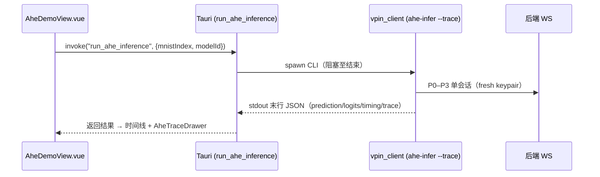

# AHE 批量推理性能优化设计

> 状态：P1+P2 已实现（CLI `eval-mnist-ahe`）；P4 前端批量 UI 见 §11（待实现）
> 范围：Network A（`cnn-mnist`）纯 AHE 同态推理 P0–P3 闭环
> 目标：把"逐图串行 ~33s/张"优化为可并行的批量推理，并评估算法级打包可行性

---

## 1. 现状与瓶颈

### 1.1 当前串行实现

```
vpin_client/pipeline/batch.py :: run_mnist_batch
  for i in range(limit):
      await run_ahe_inference(job)   # 一张做完才下一张
```

每张图独占一条 WebSocket 会话，循环内 `await` 完全串行。实测 10 张 ≈ 330s，单张 ≈ 33s。

### 1.2 单张推理算子规模（实测 op counters）

| 指标 | 值 |
|------|---|
| 服务端 EC 点乘 (`pt_mult`) | ~18,560 |
| 服务端 EC 点加 (`pt_add`) | ~18,330 |
| 客户端 BSGS 解密 cell 数 | conv 1024 + pool 64 + fc1 16 + fc2 10 |

### 1.3 时间分布与可并行性

| 环节 | 执行位置 | 主要成本 | 现状并行 |
|------|---------|---------|---------|
| keygen + BSGS prewarm | 客户端/会话启动 | 加载 230MB pickle、起进程池 | ❌ 每会话重复 |
| 输入加密（1024 cell） | 客户端 | EC 点乘 | ✅ 线程池 |
| Conv / Pool / FC1 / FC2 同态 | **服务端 event loop 线程** | EC 点运算 | ❌ 同步阻塞 |
| 各层解密 | 客户端 | BSGS giant-step | ✅ 3 进程池 |

**根本瓶颈**：服务端同态 EC 运算是纯 Python（`ecdsa`），同步阻塞跑在 asyncio event loop 线程内。即使开多条并发 WS，受 GIL + 阻塞调用影响，服务端无法真正并行。

---

## 2. 可共享 / 不可变数据清单

并发与流水线设计的前提，是先界定哪些数据**只读可共享**、哪些**必须每图独立**。

### 2.1 全局只读（跨会话、跨图共享，零拷贝/单例）

| 数据 | 位置 | 说明 |
|------|------|------|
| 曲线参数 / 生成元 G / 单位元 | `curve_e2_info()` | 常量 |
| 模型权重（conv 滤波器、fc1/fc2、bias） | `AheEngine.weights` | 注册即固定，只读 |
| BSGS 解密表（~230MB） | `load_bsgs_table` | 进程内单例缓存，进程池各 worker 各一份 |

### 2.2 每批次可共享（一个客户端的一批图复用一次）

| 数据 | 现状 | 优化点 |
|------|------|--------|
| 客户端密钥对 (sk, h=sk·G) | 每会话 `key_gen()` 重生成 | **整批复用一对密钥**：加性同态正确性不依赖每图换密钥；省 keygen + 公钥预计算 |
| bias 密文 `Enc(b_fc1)/Enc(b_fc2)` | 每层 `encrypt_bias` 现加密 | **每密钥对只加密一次**：bias 跨图不变，ElGamal 随机性不影响加性结果 → 整批复用 |
| BSGS 进程池 | 每会话 prewarm | 进程池整批只初始化一次 |

> 安全性说明：批内复用密钥对仅在"同一客户端、同一信任域"成立。跨客户端绝不复用。bias 密文复用不泄露额外信息（服务端本就持有明文权重）。

### 2.3 必须每图独立（不可共享）

| 数据 | 原因 |
|------|------|
| 输入密文 `Enc(x_i)` | 每图不同 |
| 各层中间密文张量 | 每图推理状态 |
| `AheEngine.phase` 状态机 | 每图独立推进 |

---

## 3. 方案 A：算法级密文打包（评估结论：**当前不可行**）

### 3.1 EC-ElGamal 没有 CKKS 式 slot

CKKS/BFV 等格基 HE 把向量打包进多项式 slot，可天然 SIMD。本系统是**椭圆曲线加性 ElGamal**，每个标量单独加密成 `(c1, c2)` 点对，**没有 slot 结构**。"把 B 张图同一像素位打进一个密文"在本方案里只有一种实现路径——**位置式整数打包**。

### 3.2 位置式打包原理与约束

把 B 张图同位置的值编码进一个标量：

```
m_packed = m_1 + m_2·D + m_3·D² + … + m_B·D^(B-1)
```

线性运算（点加、共享权重的标量乘）在各 lane 间天然分配，**前提是不发生跨 lane 进位**：

- `D` 必须大于该层线性运算后任一 lane 的最大幅值
- 整体打包值 `≈ D^B` 必须落在 BSGS 可解密范围内

无进位打包因子上界：

```
B_max = ⌊ log2(BSGS_range) / 每lane比特宽 ⌋
```

### 3.3 实测：BSGS 范围已被单图占满

| 量 | 值 | 比特 |
|----|----|----|
| BSGS 可解密范围（m=3.2e6, ±m²） | ±1.024×10¹³ | **43.2 bit** |
| conv 输出最大幅值 | 520,168 | 19 bit |
| pool 移位前最大 | 446,974,976 | 29 bit |
| fc1 relu 前最大 | 67,653,985,329 | 36 bit |
| fc2 relu 前最大 | 117,197,641,375 | **37 bit** |

按正确的位置式上界 `⌊43.2 / 每lane比特⌋`：

| 层 | 每lane比特 | B_max（无进位） |
|----|-----------|----------------|
| conv | 19 | 2 |
| pool | 29 | 1 |
| fc1 | 36 | 1 |
| **fc2** | **37** | **1** |

### 3.4 结论

- **FC1/FC2/Pool 层 B_max = 1**：连 2 张都打不进，因为单图动态范围（37 bit）已逼近 BSGS 上限（43 bit），仅剩 ~6 bit 余量。
- **仅 conv 层 B_max = 2**：但客户端在每层边界都要解密+截断，conv 之后立刻被 pool 的幅值膨胀（×inv_fp 再求和）顶破，且需额外的打包/拆包与无进位证明，收益（半条流水线 2×）远不抵复杂度与正确性风险。

> **打包要可行，必须先改底层密码学**：
> 1. 扩大 BSGS 表（m↑ → giant-step 循环时间/内存平方增长，已 m=3.2M），或
> 2. 更激进截断压缩单图动态范围（牺牲精度，当前定点已 90%），或
> 3. 迁移到格基 HE（CKKS/BFV，有真 slot + 大明文模数）——研究级重写。
>
> 三者都超出 MVP 范围。**密文打包暂不纳入路线。**

---

## 4. 方案 B：分层流水线并行（推荐核心）

利用"推理天然分层 + 协议 client/server 交替"的结构做流水线，是当前架构下收益最高、不动密码学的方案。

### 4.1 阶段划分（单图 8 阶段，server/client 交替）

```
S1 conv ─ C1 decrypt+relu ─ S2 pool ─ C2 decrypt+shift ─
S3 fc1  ─ C3 decrypt+relu+shift ─ S4 fc2 ─ C4 decrypt+relu+argmax
```

- S* = 服务端同态 EC 运算（CPU 密集，阻塞）
- C* = 客户端 BSGS 解密 + 非线性（已可多进程）

### 4.2 流水线重叠

串行：总时间 = Σ(所有阶段)。
流水线：图 i 在 S_k 时，图 i-1 在 C_k、图 i-2 在 S_{k+1}…重叠后吞吐由**最慢的单一阶段**决定（瓶颈级）。

```
时间 →
图1: S1 C1 S2 C2 S3 C3 S4 C4
图2:    S1 C1 S2 C2 S3 C3 S4 C4
图3:       S1 C1 S2 C2 S3 C3 S4 C4
```

理想稳态吞吐 ≈ 1 / max(单阶段耗时)，相对串行可逼近 stage 数倍（受瓶颈阶段与资源约束）。

### 4.3 调度器设计

```
BatchScheduler
  - 共享：1 个密钥对、1 套 bias 密文、1 个 BSGS 进程池、1 个服务端计算执行器
  - in_flight: List[ImageState]（各自 phase + 中间密文）
  - server_executor: ProcessPoolExecutor（卸载 S* 阻塞计算，见方案 C）
  - decrypt_pool: 复用现有解密进程池（C*）
  - 事件循环：每个 ImageState 完成一个阶段就投递下一阶段，server/client 阶段分派到各自执行器
  - 背压：Semaphore 限制 in_flight 数（受内存约束，见 §6）
```

### 4.4 正确性约束

- 各图状态机严格隔离，禁止共享中间密文。
- 共享只读资源（权重、bias 密文、BSGS 表）只读访问，无写竞争。
- 单图内部阶段仍严格 S1→C1→…→C4 有序；并行只发生在**不同图之间**。

---

## 5. 方案 C：服务端进程池卸载（解锁真正并发）

流水线要真正并行，必须解决"服务端阻塞 event loop"。

### 5.1 改造点

把 `conv2_ciphertext / avg_pool_ciphertext / fc1_layer / fc2_layer` 用
`loop.run_in_executor(ProcessPoolExecutor, …)` 卸载到工作进程。

### 5.2 难点

| 难点 | 说明 | 对策 |
|------|------|------|
| EC `Point` 跨进程序列化 | `ecdsa.Point` 需可 pickle | 传 `(x, y)` 整数对，worker 内用共享曲线重建 |
| 权重/曲线重复加载 | 每 worker 初始化 | `initializer` 预载权重与曲线（只读） |
| 进程数 vs 内存 | 见 §6 | 限并发度 = CPU-1，且与解密池错峰 |

### 5.3 与流水线的关系

方案 C 是方案 B 的使能项：没有 C，B 的 server 阶段仍在主线程串行排队。二者需同步落地。

---

## 6. 资源约束与并发度

| 约束 | 数值 | 影响 |
|------|------|------|
| BSGS 表常驻内存 | ~230MB / 进程 | 解密池 3 进程 ≈ 690MB；服务端计算池无需 BSGS |
| CPU 核数 | 影响总并发度 | 计算池 + 解密池总进程数 ≤ 物理核 |
| 单图中间密文内存 | conv 1024 点对×2 等 | in_flight 上限受内存约束 |

**推荐并发度**：先验证 in_flight=2、服务端计算池=2、解密池沿用 3，压测后再调。

---

## 7. 综合推荐架构

```
            ┌─────────────────────── BatchScheduler ───────────────────────┐
            │  共享: keypair · bias密文 · BSGS池 · 权重(只读)               │
            │                                                               │
  图队列 ─► │  in_flight (Semaphore 限流)                                   │
            │    每图: phase 状态机 + 中间密文                              │
            │      ├─ server 阶段 ─► ProcessPool(计算, 重建曲线)  ← 方案C   │
            │      └─ client 阶段 ─► ProcessPool(BSGS 解密, 复用)          │
            └───────────────────────────────────────────────────────────────┘
```

- 方案 B（流水线）+ 方案 C（服务端卸载）+ §2 数据共享 = 完整批量方案
- 方案 A（打包）在当前 BSGS/截断参数下不可行，列为"需先改密码学"的长期项

---

## 8. 分阶段路线（建议）

| 阶段 | 内容 | 风险 | 预期收益 |
|------|------|------|---------|
| P1 | §2 共享化：批内复用 keypair + bias 密文 + BSGS 池单次初始化 | 低 | 单张省 2–5s 固定成本 |
| P2 | 方案 B+C：流水线调度 + 服务端进程池卸载 | 中高 | 批量吞吐逼近瓶颈阶段倍数（~2–3×） |
| P3 | 算法级（打包/换 HE 后端） | 高/研究级 | 数量级，但需改密码学，暂缓 |
| P4 | 前端批量 UI（Tauri `run_ahe_batch` + 进度/结果表） | 低 | 与 CLI 对齐；见 **§11** |

---

## 9. 验收口径（实现阶段使用）

- **正确性优先**：批量结果必须与现串行逐图结果 **逐图 bit-exact**（prediction 与 logits 完全一致），否则视为回归。
- 用 `scripts/ahe_e2e_smoke.py` 单图基线 + `eval-mnist-ahe` 批量交叉校验。
- 性能指标：批量总耗时、单图均摊耗时、稳态吞吐（图/分钟）。

---

## 附：关键证据

- BSGS 范围 ±43.2 bit、各层动态范围（19/29/36/37 bit）均为本机实测（`model_training/outputs/20260622_184254` 权重，MNIST test）。
- 串行基线：10 张 330s（≈33s/张），op counters：pt_mult≈18.5k / pt_add≈18.3k / 图。

---

## 10. 实测数据档案（2026-06-24，本机基准）

> 环境：16 核 CPU；权重 `model_training/outputs/20260622_184254`（cnn-mnist-trained，Network A）；
> BSGS 表 `src/Pre_computed_table/table.pickle`（~230MB）；后端 `127.0.0.1:8000`。
> 所有"正确性"均以 AHE 密文路径与定点明文路径 `logit_max_diff == 0.0`（bit-exact）为准。

### 10.1 单层算子成本（单进程，1024-cell conv 层）

| 阶段 | 耗时 | 位置 | 说明 |
|------|------|------|------|
| 输入加密 1024 cell | **10.4s** | 客户端 | 优化前：ThreadPool，GIL 绑定，等效单核 |
| 服务端 conv（1→1024） | **0.3s** | 服务端 | 同态 EC，**非瓶颈** |
| 解密 conv 1024 cell | **6.1s** | 客户端 | ProcessPool 3 worker（BSGS giant-step） |

**结论**：瓶颈在客户端加解密，不在服务端同态计算。服务端进程池卸载（P2）只改善跨会话并行，单图瓶颈是加密。

### 10.2 加密进程池化前后（1024 cell，热态）

| 实现 | 耗时 | 倍数 |
|------|------|------|
| ThreadPool（GIL 绑定，优化前） | 10.4s | 1× |
| ProcessPool（`_encrypt_parallel_mp`，8 worker） | **2.6s** | **4×** |

正确性：MP 加密结果解密后与顺序加密、与原始明文**逐元素相等**。

### 10.3 端到端单图推理

| 场景 | 耗时 | 备注 |
|------|------|------|
| 优化前（基线） | ~42s | — |
| MP 加密后 · 热态稳态 | **19.4s** | **2.2×**；池已 spawn，无冷启动 |
| MP 加密后 · CLI 冷启动单次 | 50–71s | 含 ~11 进程池 spawn（8 加密 + 3 解密 BSGS×230MB），单图不摊销 |

> 冷启动开销仅一次性，批量场景被摊销；单图延迟敏感可调小 `VPIN_AHE_ENCRYPT_WORKERS`。

### 10.4 批量吞吐

| 配置 | 张数 | 总耗时 | 均摊/张 | acc | 备注 |
|------|------|--------|---------|-----|------|
| 串行（优化前） | 10 | 330s | 33s | — | 原始基线 |
| 串行（MP 加密） | 10 | 278s | 27.8s | 90% | 含冷启动 |
| 并发=2（仅 P1+P2，未 MP 加密） | 4 | 122s | 30.5s | 100% | 两两并行可见 |
| 并发=4（P1+P2 + MP 加密） | 4 | 69s | 17.2s | 100% | 预测 [7,2,1,0]=标签 |
| 并发=4（P1+P2 + MP 加密） | 10 | **124s** | **12.4s** | 90% | 相对优化前 **2.66×** 吞吐 |

### 10.5 准确率基线（与性能无关，留档）

| 路径 | 样本 | 准确率 |
|------|------|--------|
| float 模型 | 10000 | 92.93% |
| 定点同态明文 | 100 | 90.0% |
| AHE 密文（=定点，bit-exact） | 10 | 90.0% |

### 10.6 改动与依据对照

| 改动 | 文件 | 依据（本档数据） |
|------|------|------------------|
| 客户端加密 ThreadPool→ProcessPool | `vpin-client/.../crypto/ahe/codec.py` `_encrypt_parallel_mp` | §10.1 加密 10.4s 为最大单项；§10.2 实测 4× |
| 服务端同态卸载到 ProcessPool（P2） | `vpin-backend/.../api/routes/session.py`、`inference/ahe_worker.py` | §10.1 服务端单层 0.3s（解锁跨会话并行，非单图加速） |
| 批内共享 keypair（P1） | `vpin-client/.../protocol/ws_ahe_client.py`（可选 `keys`）、`pipeline/batch.py` | §2 keypair 跨图可复用；省 keygen 固定成本 |
| 批量并发驱动 + `--concurrency` | `vpin-client/.../pipeline/batch.py`、`cli.py` | §10.4 并发吞吐提升 |
| bias 密文缓存（P1-服务端）**未做** | — | bias 加密 ~26 次 vs 18k 算子（<0.2%），收益边际，风险不划算 |

### 10.7 可调参数（环境变量）

| 变量 | 默认 | 作用 |
|------|------|------|
| `VPIN_AHE_ENCRYPT_WORKERS` | min(8, 核-1) | 客户端加密进程数 |
| `VPIN_AHE_DECRYPT_WORKERS` | min(3, 核-1) | 客户端解密进程数（已可配置；见 §12 实测：放宽无收益） |
| `VPIN_AHE_SERVER_POOL` | 1 | 服务端同态卸载开关（0 关闭回退） |
| `VPIN_AHE_SERVER_WORKERS` | min(3, 核-1) | 服务端同态进程数 |

### 10.8 待办（基于以上数据）

1. 解密池 worker 数放宽（当前硬编码 3，16 核欠用）：§10.1 解密 6.1s 是第二大单项。
2. Tauri 单图场景：后端常驻 + 客户端池复用，消除冷启动（§10.3 冷启动 30s+）。
3. **前端批量推理 UI**：见 §11（当前未实现，CLI 已可用）。

---

## 11. 前端 UI 适配建议（批量推理）

> **现状**：`vpin_client eval-mnist-ahe`（P1+P2+MP 加密）已在 CLI 验证；**桌面 Demo 尚无批量提交入口**。  
> 路由 `/demo/ahe` → `AheDemoView.vue` 仅支持单图 `run_ahe_inference`；画廊 `ahePreprocessBatch` 只做**预处理预览**，与推理无关。

### 11.1 现状与缺口对照

| 能力 | CLI / 客户端 | 前端（Tauri） | 说明 |
|------|--------------|---------------|------|
| 官方 MNIST 批量预处理 | `GET /data/official/batch` | ✅ `loadGallery` | 10 张缩略图，**不含推理** |
| 单图 AHE 推理 + trace | `ahe-infer --trace` | ✅ `aheInfer` → `run_ahe_inference` | P0–P3 时间线 + `AheTraceDrawer` |
| 批量 AHE 评估 | `eval-mnist-ahe --limit N --concurrency C --progress` | ❌ 无 | 无 Tauri 命令、无 `aheClient` 封装、无 UI |
| 批内共享 keypair / 并发 | `batch.py` + `ws_ahe_client.keys` | — | 仅批量路径使用 |
| 进度回调 | stdout `[ i/N ] correct=… acc=…` | — | 需 Rust 边读 stdout 边 `emit` |
| 结果落盘 | `reports/batch_{limit}_{ts}.json` | — | 可由 Tauri 读回或 stdout 末行 JSON |

**设计原则**

1. **单图路径不变**：保留「运行 AHE 推理」+ 时间线 + trace 抽屉；批量为**并列模式**，不替换单图。
2. **批量默认无 trace**：`run_mnist_batch` 并发路径 `collect_trace=False`；避免 N×trace 撑爆内存与 DOM。
3. **仅 Tauri 可跑批量**：与单图相同，私钥在本地；浏览器模式只显示说明 + 禁用按钮。
4. **与画廊起始序号对齐**：批量从 `galleryStartIndex`（或当前 `index`）起连续 `limit` 张官方 test，与 CLI 默认 `mnist_index=0..limit-1` 需**显式约定**（见 §11.4）。

### 11.2 页面布局与交互（建议）

在现有两栏布局上，于右侧「推理」卡片内增加 **模式切换**（`n-radio-group`：`单图` | `批量`）。

#### 单图模式（保持现状）

- 按钮：`运行 AHE 推理（#索引）`
- 下方：`AheFlowTimeline` + `AheTraceDrawer`
- `busy` 时禁用画廊点击与批量控件

#### 批量模式（新增）

**控件区**（推理卡片内）：

| 控件 | 类型 | 默认 | 说明 |
|------|------|------|------|
| 起始序号 | `n-input-number` | 当前 `index` 或画廊 `start` | 对应 MNIST test 下标 |
| 张数 `limit` | `n-input-number` | `10` | 与 `PREVIEW_COUNT` 对齐；上限建议 50（与 CLI 默认一致） |
| 并发 `concurrency` | `n-input-number` | `4` | `1`=串行；>1 启用 P1+P2；可附 tooltip 引用 §10.4 |
| 模型 | 已有 `n-select` | — | 与单图共用 `modelId` |
| 主按钮 | `n-button type="primary"` | — | 文案：`批量评估 N 张（并发=C）` |
| 取消 | `n-button`（可选 P1） | — | 需 CLI/Tauri 支持子进程 kill；MVP 可不做 |

**进度区**（推理卡片下方或独立 `n-card`「批量进度」）：

```
┌─────────────────────────────────────────────┐
│ 批量评估中  7 / 10                          │
│ ████████████░░░░░░░░  70%                   │
│ 正确 6 · 准确率 85.7% · 已用 89s · ETA 38s │
└─────────────────────────────────────────────┘
```

- 使用 `n-progress`（`type="line"`，`percentage = completed/limit*100`）。
- **批量运行期间**：折叠或禁用「推理流程时间线」（`v-if="!batchState.running && inferMode==='single'"`），避免与假阶段动画混淆。

**结果区**（完成后）：

```
准确率 90.0%（9/10）· 总耗时 124s · 均摊 12.4s/张 · concurrency=4
```

- `n-data-table` 列：`序号(mnist_index)` | `标签` | `预测` | `正确`（`n-tag` success/error）。
- 行点击（可选 P2）：切回单图模式并 `applySelection` 对应样本，便于对错题做 trace 复现。
- 「导出 JSON」：直接下载 Tauri 返回的 `BatchReport`（与 `reports/batch_*.json` 同结构）。

**浏览器模式**：批量区显示 `n-alert`：「批量 AHE 需在 Tauri 桌面端运行」，控件 `disabled`。

### 11.3 Tauri 桥接（`lib.rs`）

单图命令 `run_ahe_inference` 使用 `run_python_json`（阻塞至结束）。批量需 **流式 stdout**，建议新增异步命令，勿复用 `run_python_json`。

**推荐实现要点**

1. 子进程：`python -m vpin_client eval-mnist-ahe --backend … --model … --limit … --concurrency … --progress`。
2. `tokio::process::Command` + `stdout` 行读取；stderr 合并记录，失败时返回。
3. 进度行正则（与 `cli.py` 一致）：
   ```text
   [  {idx+1}/{limit} ] correct={n} acc={pct}% elapsed={s}s eta={s}s
   ```
4. 每匹配一行 → `window.emit("ahe-batch-progress", { index, limit, correct, accuracy, elapsed_s, eta_s })`（`accuracy` 建议传 0–1 浮点，与 `batch.py` 一致）。
5. 进程结束后：
   - **方案 A（推荐）**：在 Rust 侧解析末行 `Wrote reports/batch_….json`，`read_to_string` 后 `serde_json::from_str` 返回完整 `BatchReport`。
   - **方案 B**：CLI 增加 `--json-out -` 打印最终 JSON 到 stdout（需改 `cli.py`）；Rust 取最后一行 JSON。MVP 可用方案 A，避免改 CLI。

**命令签名草案**

```rust
#[tauri::command]
async fn run_ahe_batch(
    start_index: u32,      // 若 CLI 暂不支持，MVP 固定 0 并在 UI 注明
    limit: u32,
    concurrency: u32,
    backend_ws: String,
    model_id: String,
    window: tauri::Window,
) -> Result<serde_json::Value, String>
```

注册：`invoke_handler![..., run_ahe_batch]`。

> **CLI 缺口（实现 UI 前需二选一）**  
> 当前 `run_mnist_batch` 固定 `mnist_index=i`（`i ∈ [0, limit)`），与画廊「从任意 `start` 起连续 N 张」不一致。  
> - **短期**：UI 固定 `start_index=0`，文案写「批量评估 test 集前 N 张」。  
> - **完整**：为 `eval-mnist-ahe` 增加 `--start`，`batch.py` 循环改为 `range(start, start+limit)`。

### 11.4 前端服务层（`aheClient.js`）

```javascript
/** @typedef {Object} AheBatchProgress
 *  @property {number} index
 *  @property {number} limit
 *  @property {number} correct
 *  @property {number} accuracy  // 0–1
 *  @property {number} elapsed_s
 *  @property {number} eta_s
 */

export async function aheBatch({ limit, concurrency, modelId, backendWs, onProgress }) {
  if (!isTauri()) throw new Error("批量 AHE 需在 Tauri 桌面端运行");
  const { invoke } = await import("@tauri-apps/api/core");
  const { listen } = await import("@tauri-apps/api/event");
  const unlisten = await listen("ahe-batch-progress", (e) => onProgress?.(e.payload));
  try {
    return await invoke("run_ahe_batch", {
      startIndex: 0,
      limit,
      concurrency,
      backendWs: backendWs ?? DEFAULT_BACKEND_WS,
      modelId,
    });
  } finally {
    unlisten();
  }
}
```

### 11.5 状态管理（`useAheDemoSession.js`）

在 composable 中增加 `inferMode: 'single' | 'batch'` 与 `batchState`（与单图 `state` 分离，避免 `reset()` 误清批量结果）：

```javascript
const batchState = reactive({
  running: false,
  startIndex: 0,
  limit: 10,
  concurrency: 4,
  completed: 0,
  correct: 0,
  accuracy: 0,
  elapsed_s: 0,
  eta_s: 0,
  report: null,   // 完整 BatchReport
  error: null,
});

function resetBatch() {
  Object.assign(batchState, {
    running: false, completed: 0, correct: 0, accuracy: 0,
    elapsed_s: 0, eta_s: 0, report: null, error: null,
  });
}
```

`AheDemoView.vue` 中 `runBatch()` 流程：

1. `resetBatch()`；`batchState.running = true`；`busy = true`。
2. `aheBatch({ ..., onProgress: (p) => { batchState.completed = p.index + 1; ... } })`。
3. 成功：`batchState.report = result`；`addLog('批量完成', …)`。
4. `finally`：`batchState.running = false`；`busy = false`。

**互斥**：`busy` 同时锁住单图按钮、批量按钮、画廊切换（防中途改样本）。

### 11.6 与现有组件的关系

| 组件 | 单图 | 批量 |
|------|------|------|
| `AheFlowTimeline` | 展示 P0–P3 + trace 步骤 | **隐藏**或显示静态说明「批量模式不记录逐步 trace」 |
| `AheTraceDrawer` | 点击步骤查看密文细节 | 仅在对错题「单图复现」后使用 |
| 画廊 `gallery` | 选一张推理 | 可高亮 `[start, start+limit)` 范围（`n-tag` 角标），**不要求**每张都已预处理（推理走 `load_inference_input`） |
| `useAheDemoSession.state.connectionStatus` | 连接态 | 批量可映射为：`connecting`→运行中，`connected`→完成，`error`→失败 |

### 11.7 返回 JSON 契约（与 CLI 一致）

`BatchReport.to_dict()` 结构，供表格与导出使用：

```json
{
  "limit": 10,
  "correct": 9,
  "accuracy": 0.9,
  "elapsed_s": 124.2,
  "concurrency": 4,
  "results": [
    {
      "mnist_index": 0,
      "label": 7,
      "prediction": 7,
      "correct": true,
      "logits": […],
      "num_pt_add": 18300,
      "num_pt_mult": 18500
    }
  ]
}
```

UI 表格行：`mnist_index`、`label`、`prediction`、`correct`；`logits` 仅在行展开或详情抽屉中显示。

### 11.8 分阶段落地建议

| 阶段 | 范围 | 验收 |
|------|------|------|
| **M0** | 仅文档 + CLI（当前） | `eval-mnist-ahe --limit 10 --concurrency 4 --progress` 与单图预测 bit-exact |
| **M1** | Tauri `run_ahe_batch` + 最小 UI（无取消） | 桌面端点按钮可见进度条与结果表；10 张 acc 与 CLI 一致 |
| **M2** | `--start` + 画廊起始对齐 + 并发可配置 tooltip | 从当前序号起批；文案引用 §10.4 推荐 `concurrency=4` |
| **M3** | 错题一键单图 trace、导出 JSON、可选取消 | 提升调试体验 |

### 11.9 实现时文件清单

| 文件 | 改动 |
|------|------|
| `vpin_frontend/.../src-tauri/src/lib.rs` | `run_ahe_batch`、stdout 解析、`emit`、读 `reports/` |
| `vpin_frontend/.../src/services/aheClient.js` | `aheBatch()` + 事件监听 |
| `vpin_frontend/.../src/composables/useAheDemoSession.js` | `inferMode`、`batchState`、`resetBatch` |
| `vpin_frontend/.../src/views/demo/AheDemoView.vue` | 模式切换、批量控件、进度条、`n-data-table` |
| `vpin-client/.../cli.py`、`pipeline/batch.py` | （M2）`--start` 参数 |
| `MVP-AHE-部署指南.md` | 补充「桌面批量评估」小节，指向本文 §11 与 CLI 示例 |

**CLI 手动验收（实现 UI 前后均可）**

```powershell
cd d:\WorkStation\pythoncode\experiment-reproduction\vPIN-main
.\.venv\Scripts\python.exe -m vpin_client eval-mnist-ahe `
  --limit 10 --concurrency 4 --progress `
  --model cnn-mnist-trained `
  --backend ws://127.0.0.1:8000/api/v1/session/ws
```

### 11.10 风险与注意

1. **长时间阻塞**：10 张并发约 2 分钟量级；Tauri 命令应用 `async` + 事件推送，避免 UI 无响应（不要用同步 `invoke` 且无进度）。
2. **冷启动**：首次批量含进程池 spawn（§10.3）；UI 文案可提示「首张较慢属正常」。
3. **后端压力**：`concurrency` 过大可能挤占服务端进程池；默认 4，与 §10.4 实测一致，不建议 UI 默认 16。
4. **上传样本**：当前 `eval-mnist-ahe` **仅官方 test 序号**；批量 UI 勿混入 `upload` 画廊项，或单独禁用并说明。
5. **正确性**：UI 层无需自证 bit-exact；以 CLI 闸门为准。若批量 acc 异常，先查 `registry.json` 权重路径（见部署指南）。

### 11.11 端到端交互时序（实现接线参考）

> 当前**未实现**；下图为建议的批量提交数据流。单图路径（已实现）作对照保留。

```mermaid
sequenceDiagram
    participant U as 用户
    participant V as AheDemoView.vue
    participant S as aheClient.js
    participant T as Tauri lib.rs<br/>(run_ahe_batch)
    participant C as vpin_client CLI<br/>(eval-mnist-ahe)
    participant B as 后端 WS<br/>(127.0.0.1:8000)

    U->>V: 切到「批量」模式，设 limit/concurrency，点开始
    V->>V: resetBatch(); batchState.running=true; busy=true
    V->>S: aheBatch({limit, concurrency, modelId, onProgress})
    S->>S: listen("ahe-batch-progress", onProgress)
    S->>T: invoke("run_ahe_batch", {...})
    T->>C: spawn: python -m vpin_client eval-mnist-ahe --concurrency C --progress
    Note over C,B: P1: 整批共享 keypair；P2: 并发会话 + 服务端进程池
    loop 每张完成
        C-->>T: stdout 行 [ i/N ] correct=.. acc=.. elapsed=.. eta=..
        T-->>S: window.emit("ahe-batch-progress", {index,limit,correct,accuracy,...})
        S-->>V: onProgress(payload) → 更新进度条/统计
    end
    C->>C: 写 reports/batch_{N}_{ts}.json
    C-->>T: 进程结束（末行 Wrote reports/...）
    T->>T: 读回 BatchReport JSON（方案 A）
    T-->>S: 返回完整 BatchReport
    S-->>V: batchState.report = result; running=false; busy=false
    V-->>U: 结果表（序号/标签/预测/正确）+ 准确率 + 导出
```

**对照：单图路径（已实现）**



---

## 12. 压力测试与并发上限（2026-06-24，本机 16 核 / 16.9GB）

> 目的：找极限并发量。方法：同一进程内**热态**扫并发档（避免每档冷启动干扰），
> 固定 8 张/档，共享 keypair，复用进程池。吞吐 = 8 / 总耗时 × 60（img/min）。

### 12.1 串行 vs 并发（10 张，CLI，含冷启动）

| 模式 | 总耗时 | 均摊/张 | acc | 加速比 |
|------|--------|---------|-----|--------|
| 串行 `--concurrency 1` | 278.3s | 27.8s | 90%(9/10) | 1× |
| 并发 `--concurrency 4` | 124.0s | 12.4s | 90%(9/10) | **2.25×** |

> 预测逐图一致（bit-exact 未回归）。相对最初基线（ThreadPool 加密 + 串行，330s）整体 **2.66×**。

### 12.2 并发档扫描（8 张/档，热态，默认池：解密3/加密8/服务端3）

| 并发 | 总耗时 | 均摊/张 | 吞吐 |
|------|--------|---------|------|
| 4 | 102.7s | 12.8s | 4.7 img/min |
| 8 | 114.4s | 14.3s | 4.2 img/min |
| 16 | 84.3s | 10.5s | 5.7 img/min |

### 12.3 放宽 worker 池后（解密6/加密6，8 张/档，热态）

| 并发 | 总耗时 | 均摊/张 | 吞吐 |
|------|--------|---------|------|
| 6 | 104.8s | 13.1s | 4.6 img/min |
| 8 | 85.3s | 10.7s | 5.6 img/min |

### 12.4 结论：极限并发 ≈ 4，瓶颈不在 worker 池

1. 吞吐锁定在 **~5–6 img/min**，与并发数、与池大小（解密 3↔6、加密 8↔6）**都基本无关**。
2. 解密/加密池放宽**无改善** → 排除"crypto worker 池是瓶颈"。
3. 单图热态 19.4s，并发后摊销至 ~12s/张（~1.6× 重叠）即触顶；并发 >4 无收益，并发=8 偶现回退。

**真正天花板**：每会话的密文序列化（pickle 进出 worker）、WS 分帧（base64）、asyncio 协调，都在**客户端/服务端各自单一主进程**内完成，受 GIL 限制不可并行。并发会话越多，主进程串行排队越重，故加 worker 无效。

| 限制项 | 可并行 | 现状 |
|--------|--------|------|
| EC 加/解密计算 | ✅ 进程池 | 已非瓶颈 |
| IPC pickle + WS 分帧 + 事件循环 | ❌ 主进程单线程 | **当前天花板** |

### 12.5 内存约束

可用内存约 6.5GB；每解密 worker 含 BSGS 表（~230MB + 开销）。解密 worker 数受内存上限约束，6 为本机安全值，8+ 需谨慎。

### 12.6 突破方向（需更大改动，超出 MVP）

1. **客户端/服务端多进程化**：每会话独立进程，绕开单主进程 GIL。
2. **编译型 EC 后端**（Rust/C 绑定替代纯 Python `ecdsa`）：同时消除序列化与计算的 Python 开销，数量级杠杆。
3. 当前 MVP：**并发设 4 为最优性价比**，UI/CLI 默认值据此设定。
