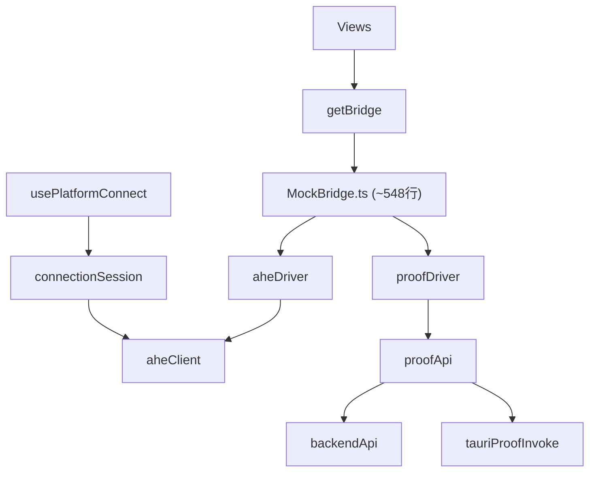

# vpin-console 通信层冗余与架构问题清单

> **文档版本**：2026-07-08  
> **背景**：通信模块已初步拆分为 `src/communication/`（前端）与 `src-tauri/src/communication.rs`（Rust），但历史代码仍保留大量 facade、单体文件与双轨路径。本文供三包分拆与后续重构排期使用。  
> **范围**：`vpin-console/`、`vpin-console/src-tauri/`、`vpin-client/crates/ahe-client/src/config.rs`（配置重复）

---

## 1. 总体结论

| 维度 | 现状 | 风险 |
|------|------|------|
| 分层 | 新 `communication/` 与旧 `config/endpoints`、`services/backendApi`、`services/aheClient` **三层并存** | 分包后改一处漏一处 |
| Rust | `lib.rs` **~1948 行**、25+ Tauri command | 维护成本高、职责边界模糊 |
| Bridge | `MockBridge.ts` **~548 行** 承担全流程编排 | 命名误导、与 communication 启动逻辑重复 |
| 配置 | env / VITE / JSON / 硬编码 **四套来源** | 浏览器 vs Tauri 行为不一致 |
| 死代码 | Python 证明 command、部分 Python 预处理 command | 权限面过大、误导阅读 |

**建议治理顺序**：P0 删死代码与硬编码 → P1 去掉 deprecated facade、拆 lib.rs → P2 统一 WS URL 与 Bridge 命名。

---

## 2. 冗余与重复层（P1）

### 2.1 端点解析：三处转发、一处实现

```
communication/endpoints.ts     ← 唯一实现
    ↑
config/endpoints.ts            ← @deprecated re-export（aheApiBase → aheServerApiBase）
    ↑
SettingsView / LinkMonitorView / proofApi / securityApi（部分）
```

| 文件 | 问题 |
|------|------|
| `vpin-console/src/config/endpoints.ts` | 整文件 7 行，仅 re-export |
| `vpin-console/src/communication/endpoints.ts` | `backendApiBase()`、`aheWsUrlForEngine()` 等真实逻辑 |
| `vpin-console/src/config/networkAEngine.ts` | `networkAEngineWsUrl()` 再包一层 `aheWsUrlForEngine()` |
| `vpin-console/src/services/aheClient.ts` | `rustWsUrl()` 再包一层 `aheWsUrlForEngine()` |

**同一 WS URL 经 3 层函数名到达调用方**，增加认知负担，无额外行为。

**仍 import deprecated 路径（2026-07-08 统计）**：

| 路径 | 引用文件数 | 典型文件 |
|------|------------|----------|
| `@/config/endpoints` | 4 | `SettingsView.vue`, `LinkMonitorView.vue`, `proofApi.ts`, `securityApi.ts` |
| `@/services/backendApi` | 8+ | `datasetsApi.ts`, `modelCatalogApi.ts`, `proofApi.ts`, `MockBridge.ts` |
| `@/services/aheClient` | 15+ | 各 View、`aheDriver.ts`, `proofClient.ts`, `connectionSession.ts` |

**建议**：
- 删除 `config/endpoints.ts`，调用方改为 `@/communication`
- `networkAEngineWsUrl` / `rustWsUrl` 标记 deprecated，统一 `aheWsUrlForEngine`
- `backendChannel.ts` L80 勿再 re-export `backendApiBase`（避免 channel ↔ endpoints 循环依赖）

---

### 2.2 HTTP 通道：`backendApi.ts` 与 `backendChannel.ts`

| 文件 | 角色 |
|------|------|
| `services/backendApi.ts` | deprecated facade：re-export + `pingAheServer()` / `fetchAheModelIds()` 薄包装 |
| `communication/backendChannel.ts` | 实现：`pingBackend`, `fetchBackendJson`, `postBackendJson`, `apiPath` |
| `services/modelsApi.ts` | 再 re-export `backendApi` → 形成 **第四层** |

**层间错配**：`MockBridge.ts` 从 `backendApi` 导入 `pingAheServerPort`，AHE 探活应来自 `aheChannel`。

**建议**：`modelsApi.ts` 直连 `backendChannel`；一轮 codemod 后删除 `backendApi.ts`。

---

### 2.3 AHE：`aheClient.ts` 混合「通信」与「运行时 invoke」

| 职责 | 当前位置 | 应归属 |
|------|----------|--------|
| 探活 / 启动 server | `communication/aheChannel.ts` | communication |
| 预处理 / 推理 invoke | `services/aheClient.ts` | 新建 `tauri/aheRuntime.ts` |
| 进度事件订阅 | `services/aheClient.ts` | 同上或 `aheSession.ts` |
| `isTauri` | `aheClient.ts` → `isTauriRuntime` | `communication/runtimeConfig.ts` |

**反向依赖**：`communication/connectionSession.ts` L18 仍 `import { ensureRuntimeArtifacts } from "@/services/aheClient"`，communication 层不应依赖 services 层。

**建议**：
1. 新建 `src/tauri/aheRuntime.ts`（或 `src/runtime/aheInvoke.ts`）承载全部 `invoke`
2. `aheClient.ts` 仅保留 deprecated re-export 一个版本周期
3. `ensureRuntimeArtifacts` 迁入 `tauri/artifacts.ts`，由 connectionSession 引用

---

### 2.4 WS / Profile 字段重复构造

| 位置 | 构造方式 |
|------|----------|
| `communication/runtimeConfig.ts` L27 | `` `ws://${host}:${port}/api/v1/session/ws` `` |
| `communication/endpoints.ts` L34–37 | `aheWsUrlForEngine()` 按 engine 端口再拼 |
| `communication/types.ts` L48–49 | normalize `wsSession` |
| `src-tauri/communication.rs` L89–90 | `ws_session_url()` |
| `LinkMonitorView.vue` L64 | `aheServerApiBase().replace(/^http/, 'ws') + '/session/ws'` |

**问题**：`CommunicationProfile.ahe.wsSession` 写入后 **前端从未读取**；LinkMonitor 仍用手写 replace，与 profile 可能不一致（远程 host、EC :8002）。

---

## 3. Rust 单体与死代码（P0–P1）

### 3.1 `lib.rs` 规模

- **约 1948 行**，含路径探测、artifact 下载、AHE 启停、Python/Rust 双轨预处理、推理、证明、目录读取等。
- 已抽取 `communication.rs`（~240 行），其余仍堆在单文件。

**建议拆分模块**：

| 模块 | 迁出内容（代表符号） |
|------|----------------------|
| `artifacts.rs` | `ensure_runtime_artifacts`, `download_artifact`, `bsgs_table` |
| `ahe_server.rs` | `ensure_ahe_server_blocking`, `ahe_server_bin` |
| `ahe_preprocess.rs` | `ahe_preprocess_rust` / `ahe_preprocess` 双轨 |
| `ahe_infer.rs` | `run_ahe_inference`, `build_rust_infer*` |
| `proof_bridge.rs` | `proof_prove`, `proof_verify`, `read_proof_plan` |
| `catalog.rs` | `read_datasets_catalog`, `read_models_registry` |
| `subprocess.rs` | `run_subprocess_with_progress*`, `emit_progress` |

`lib.rs` 仅保留 `repo_root`、`run()`、`generate_handler!`。

---

### 3.2 未注册 Tauri command 的死代码（P0）

下列函数存在于 `lib.rs`，但 **不在** `invoke_handler`（L1922–1944）：

| 函数 | 行号 | 说明 |
|------|------|------|
| `run_computation_proof` | ~1355 | Python CLI `computation-proof` |
| `verify_computation_proof` | ~1455 | Python CLI verify |
| `save_proof_artifact` | ~1470 | Python CLI save |
| `build_computation_proof*` | ~1325–1438 | 上述命令的 builder |

前端 `proofApi.ts` / `proofDriver.ts` 已走 **HTTP fallback + `proof_prove`/`proof_verify` Tauri 命令**，与死路径功能重叠。

**建议**：删除或迁入 `legacy_proof.rs` 并标注废弃；同步缩小 permissions 面。

---

### 3.3 权限与 handler、前端调用不对齐（P1）

`permissions/ahe-commands.toml` 中允许但前端 **无调用** 的命令：

- `ahe_preprocess` / `ahe_preprocess_batch` / `preprocess_upload_file`（前端仅用 `*_rust`）
- `greet`

前端 **直接 invoke、未走统一门面** 的路径：

| Tauri 命令 | 调用位置 |
|------------|----------|
| `preprocess_dataset_single/batch` | `services/datasetPreview.ts` |
| `write_text_file` | `services/proofClient.ts` |
| `read_proof_*` / `proof_*` | `services/proofApi.ts` 内联 |
| `run_ahe_*` | `services/aheClient.ts` |

**建议**：新建 `src/tauri/commands.ts` 统一 invoke；permissions 按域拆分（`ahe-runtime.toml`, `proof.toml`, `catalog.toml`）。

---

### 3.4 硬编码 URL 残留（P0）

| 位置 | 内容 | 影响 |
|------|------|------|
| `lib.rs` L1125, L1225, L1269 | `ws://127.0.0.1:8000/...` | Python 推理 fallback |
| `lib.rs` L1369, L1461, L1478 | `http://127.0.0.1:8000`（无 `/api/v1`） | 死 proof 路径 |
| `lib.rs` run_ahe_inference | 硬编码 8001/8002 | 未统一读 `communication::ahe_target` |
| `communication.rs` L128–132 | `read_client_endpoints_file` **读两次** | 冗余 IO |

**建议**：`run_ahe_inference` 默认 WS 由 `communication::ahe_target(port).ws_session` 生成；删除死 proof 后统一 backend base 带 `/api/v1`。

---

## 4. Bridge 层结构问题（P1）

### 4.1 职责与命名



| 组件 | 问题 |
|------|------|
| **MockBridge** | 名称暗示 mock，实为 **唯一 Bridge 实现**；含 custody、推理、证明、demo 计时 |
| **aheDriver** | 进度 → eventBus；与 MockBridge 内 Rust 推理路径强耦合 |
| **proofDriver** | P4–P6 状态机；与 proofApi 流程重复编排 |
| **proofApi + proofClient** | HTTP / Tauri 双轨；`proofClient` 绕过 proofApi 直接 `write_text_file` |

### 4.2 启动/bootstrap 双轨

- `usePlatformConnect` → `bootstrapCommunication`（通信探活、artifact、AHE 启动）
- `MockBridge.bridgeBootstrapDetect`（StartupOptimizer mock）

两者在 `initPlatformSession` 串联，日志源分散（`bridge://client` vs `bridge://bootstrap`），难以判断失败阶段。

**建议**：
1. `MockBridge` 重命名为 `ConsoleBridge` 或 `LocalBridge`
2. `proofApi` + `proofClient` 合并为 `communication/proofChannel.ts`
3. `proofDriver` 仅保留 UI 状态机，不直接 HTTP/invoke
4. Bootstrap 合并为单一 `platformBootstrap.ts`

---

## 5. 配置源重复与行为不一致（P1）

### 5.1 四套配置来源

| 层级 | 来源 | 字段 |
|------|------|------|
| Rust Tauri | `communication.rs` `load_profile` | `VITE_*`, `AHE_SERVER_*`, `VPIN_SKIP_LOCAL_AHE`, `config/client-endpoints.json` |
| 前端 Tauri | `loadCommunicationProfile` → invoke | 同上（经 Rust 合并） |
| 前端浏览器 | `runtimeConfig.buildDefaultProfile` | **仅** `VITE_*`，不读 JSON |
| ahe-cli crate | `ahe-client/src/config.rs` | `AHE_SERVER_HOST`, `AHE_SERVER_PORT` |
| Vite dev | `vite.config.ts` proxy | 硬编码 `:8000` |

### 5.2 已知不一致

1. **浏览器 dev 与 Tauri 发布包**：同一开发者切换模式，endpoint 来源不同。
2. **`VITE_AHE_SERVER_URL` vs `AHE_SERVER_HOST/PORT`**：Rust 中 `ahe_http_base` 优先 VITE 整 URL，host/port 可能被忽略。
3. **`ovdsApiBase()`**：已导出，**全项目无消费者**（三包 ovds 占位未接入 UI）。
4. **`client-endpoints.json` 的 `ahe.http_base` 与 `host/port`**：Rust 第二次读文件取 http_base，第一次 merge 未用该字段。

**建议优先级文档**（写入 README / 启动脚本注释）：

```
client-endpoints.json > 进程 env > VITE 编译期 > 代码默认值
```

---

## 6. 跨 crate 重复（P2）

| 逻辑 | vpin-console Rust | ahe-cli (`ahe-client/config.rs`) |
|------|-------------------|----------------------------------|
| 默认 host | `127.0.0.1` | `127.0.0.1` |
| 默认 port | 8001 | 8001 |
| BSGS/weights 路径探测 | `lib.rs` repo_root | `config.rs` detect_repo_root |

分包后 client 只跑 ahe-cli、server 只跑 ahe-server，**路径探测逻辑应文档化归属**，避免两端各自猜 repo 根。

---

## 7. 问题优先级汇总

| 优先级 | ID | 问题 | 建议动作 | 预估工作量 |
|--------|-----|------|----------|------------|
| **P0** | R-01 | 死 proof Tauri 命令 ~130 行 | 删除或 `legacy_proof.rs` | S |
| **P0** | R-02 | `lib.rs` 硬编码 WS :8000 / :8001 | 改用 `communication::ahe_target` | S |
| **P0** | R-03 | backend URL 有无 `/api/v1` 混用 | 全局统一 base | S |
| **P1** | F-01 | deprecated 三层 facade | codemod → `@/communication` | M |
| **P1** | F-02 | `aheClient` 混合通信与 invoke | 拆 `tauri/aheRuntime.ts` | M |
| **P1** | F-03 | `connectionSession` 依赖 `aheClient` | 反转依赖方向 | S |
| **P1** | R-04 | `lib.rs` 1948 行单体 | 按 §3.1 拆 6 模块 | L |
| **P1** | R-05 | permissions 与 handler 不对齐 | 清理 + 分文件 permissions | M |
| **P1** | B-01 | MockBridge 命名/体量 | 重命名 + 拆 custody/推理 | L |
| **P1** | B-02 | proofApi / proofClient / proofDriver 三轨 | 合并 proofChannel | M |
| **P1** | C-01 | 配置四套来源 | 文档 + Rust 单次读 JSON | S |
| **P2** | F-04 | `wsSession` 死字段 | 读 profile 或删除 | S |
| **P2** | F-05 | `networkAEngineWsUrl` 多余包装 | deprecated | S |
| **P2** | F-06 | `LinkMonitorView` 手写 WS URL | 用 `aheWsUrlForEngine` | S |
| **P2** | C-02 | `ovdsApiBase` 无消费者 | 三包 ovds 接入或暂删 export | S |
| **P2** | X-01 | Python 预处理 command 无前端调用 | 从 permissions 移除或标 deprecated | S |

工作量：S ≤ 0.5d，M ≤ 2d，L ≥ 3d

---

## 8. 推荐重构路线图

### 阶段 A — 止血（1–2 天，不破坏发布包）

1. 删除 R-01 死 proof 代码
2. 修复 R-02/R-03 硬编码与 URL 不一致
3. 修复 C-01：`communication.rs` 双次读 JSON
4. LinkMonitor / Settings 改用 `@/communication`（F-06）

### 阶段 B — 分层收敛（2–4 天）

1. codemod F-01：删除 `config/endpoints.ts`、`services/backendApi.ts`
2. 新建 `tauri/commands.ts` + `tauri/aheRuntime.ts`（F-02、R-05）
3. `ensureRuntimeArtifacts` 迁出 aheClient（F-03）

### 阶段 C — 单体拆分（3–5 天，可与三包 build 并行）

1. Rust `lib.rs` 按 §3.1 拆分（R-04）
2. MockBridge 重命名与瘦身（B-01）
3. proof 通道合并（B-02）
4. 三包启动脚本写入 `client-endpoints.json` 模板（C-01）

---

## 9. 验收标准（重构完成后）

- [ ] 全项目无 `@/config/endpoints`、`@/services/backendApi` import（或仅剩 deprecated 空壳）
- [ ] 所有 Tauri `invoke` 经 `src/tauri/commands.ts`（或分域子模块）
- [ ] `lib.rs` < 300 行
- [ ] WS URL 仅由 `aheWsUrlForEngine` / `profile.ahe.wsSession` 生成
- [ ] `permissions/*.toml` 与 `invoke_handler`、前端调用三方一致
- [ ] 浏览器 / Tauri / ahe-cli 配置优先级有单页文档
- [ ] `VPIN_SKIP_LOCAL_AHE=1` + 远程 host 端到端冒烟通过

---

## 10. 关键文件索引

| 路径 | 问题类型 |
|------|----------|
| `vpin-console/src/communication/` | 目标通信层（继续扩展 proof/ovds channel） |
| `vpin-console/src/config/endpoints.ts` | deprecated re-export |
| `vpin-console/src/services/backendApi.ts` | deprecated facade |
| `vpin-console/src/services/aheClient.ts` | 通信 + invoke 混合 |
| `vpin-console/src/bridge/mock/MockBridge.ts` | 单体编排、错误 import 层 |
| `vpin-console/src/bridge/aheDriver.ts` | 与 aheClient 重叠 |
| `vpin-console/src/services/proofApi.ts` | HTTP/Tauri 双轨 |
| `vpin-console/src-tauri/src/lib.rs` | ~1948 行单体 |
| `vpin-console/src-tauri/src/communication.rs` | 端点解析（应扩展为 Rust 唯一 endpoint 源） |
| `vpin-console/src-tauri/permissions/ahe-commands.toml` | 权限面过大 |
| `config/client-endpoints.example.json` | 运行时配置模板 |
| `vpin-client/crates/ahe-client/src/config.rs` | 与 console 重复默认 host/port |

---

*本文档由通信模块拆分后的代码审查生成，随重构进展更新 §7 验收项勾选状态。*
