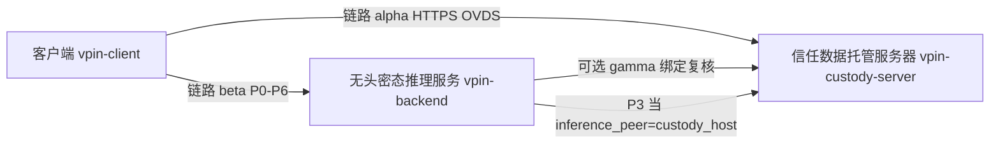
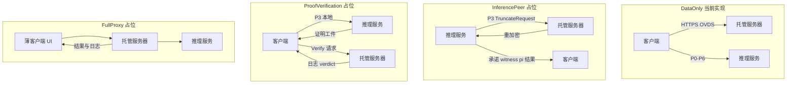
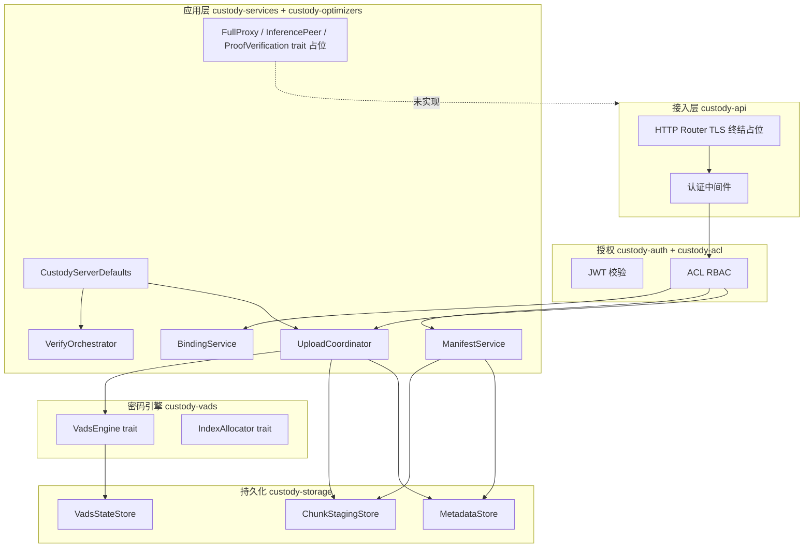
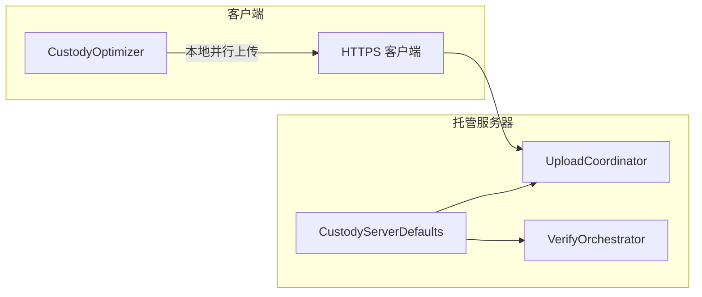

# vPIN 信任数据托管服务器 · 软件架构

> **文档性质**：信任数据托管服务器（`vpin-custody-server`）的代码架构、四档托管能力模式、客户端/服务端优化器分离与 OVDS 分层对照。与 [vpin-平台顶层抽象架构](./vpin-平台顶层抽象架构.md) 配套；OVDS 密码语义以外部 OVDS 文档为准。  
> **关联文档**：[平台顶层抽象架构](./vpin-平台顶层抽象架构.md)（§2 三角色、§5 平面二、§10 工程优化器）、[客户端启动阶段 · 工程优化器设计](./vpin-客户端启动阶段-工程优化器设计.md)、[平台数据流图](./vpin-平台数据流图.md)、OVDS 托管服务器（外部 `experiment-reproduction/ovds/document/OVDS数据托管服务器技术文档.md`）、OVDS 工程优化（外部 `experiment-reproduction/ovds/document/OVDS工程优化方案.md`）。  
> **实现映射**：Rust workspace [`vpin-custody-server/`](../../vpin-custody-server/)（与 `vpin-backend` 推理服务分部署）；**当前里程碑仅实现「数据托管」能力**。

---

## 1. 系统定位

信任数据托管服务器是 vPIN **三角色**之一（见顶层 §2），职责边界：

| 负责 | 不负责 |
|------|--------|
| VDS 协议栈（VADS + OVDS 工程层）的可验证数据流存储 | 密态方案治理与体制选型（**客户端** `CiphertextSchemeSelector`） |
| JWT/OIDC + ACL + 多租户 VADS 实例 | 无头密态推理服务上的同态前向与算力证明生成 |
| 上传/下载会话编排、manifest、索引预占 | 启动阶段设备检测与 `StartupOptimizer` 编排 |
| 按用户选择的**托管能力模式**提供对应代理面（见 §3） | 替用户选定推理数据集或密态体制（非数据托管模式须诚实执行，见 §3.4） |

**默认部署**：独立进程，HTTPS REST（生产 TLS 1.2+）；默认端口 **8003**（与 Python 推理控制面 `:8000`、Rust AHE `:8001/:8002` 分离）。



---

## 2. 与顶层概念的正交关系

平台存在两组**正交**维度，托管服务器软件架构须同时支持：

### 2.1 数据存放双模式（`custody_mode`，顶层 §5.3.2）

| 值 | 含义 |
|----|------|
| `hosted` | 用户数据块经 OVDS 写入托管方 VADS |
| `client_local` | 数据留本地；绑定记录可仅含摘要 |

### 2.2 托管能力四档（`CustodyCapabilityMode`，本文 §3）

描述**托管服务器承担哪些代理职责**，由客户端 UI / 会话配置选择，写入 `DataBindingRecord.capability_mode`（可选字段，见顶层附录 C.1）。

| 值 | 中文 | 概要 |
|----|------|------|
| `data_only` | 数据托管 | 仅 OVDS/VADS；**当前唯一实现** |
| `inference_peer` | 密态推理托管 | 仅代理 P3；承诺/witness/π/最终结果回客户端 |
| `proof_verification` | 计算量证明验证托管 | 推理本地；托管仅 P6 Verify，回传日志与 verdict |
| `full_proxy` | 全量托管 | 仅向 UI 回传推理结果与整体执行日志 |

**组合示例**：`custody_mode = hosted` 且 `capability_mode = data_only` 为当前 MVP；`full_proxy` 通常隐含 `hosted` 且 `inference_peer = verifier_target = custody_host`。

### 2.3 密态方案治理归属

`CiphertextSchemeSelector`、`ModalityFamilyRegistry`、`HomomorphicSchemePlugin` 均在**本地客户端**运行；选型结果经 P0 提交**无头密态推理服务**。**托管服务器不接收、不覆盖** `SchemeSelection` 或 `PrivacyModePreference`。

---

## 3. 四档托管能力模式

### 3.1 总览

| 模式 | 托管职责 | 须回传客户端的数据 | 信任假设 | 实现状态 |
|------|----------|-------------------|----------|----------|
| **DataOnly** | OVDS append/query/verify、manifest、绑定引用 | VADS 块、证明摘要、`ovds_verify_ref` | 半可信存储（OVDS 威胁模型） | **实现中** |
| **InferencePeer** | 仅 P3：解密 / 非线性 / 重加密 | `cm_x`、`cm_W`、witness、π、密态最终结果等 | **可信托管**：诚实执行、不替换指定数据集 | 占位 |
| **ProofVerification** | 仅 P6：模型推理验证器 Verify | 验证执行日志、`inference_verdict`、`proof_coverage` | **可信托管** | 占位 |
| **FullProxy** | 数据 + P3 + P6 + 会话编排 | 推理结果摘要、整体执行日志（UI 展示） | **可信托管** | 占位 |

**模态族**：接口使用泛化 `modality_family_id`（`cnn` \| `llm` \| …）；CNN 为首个消费路径（`strict_proof`）；LLM / MPC 方案**仅占位**，不在 API 层写死 CNN。

### 3.2 典型 `DataBindingRecord` 组合

| `capability_mode` | 典型 `inference_peer` | 典型 `verifier_target` | 典型 `custody_mode` |
|-------------------|----------------------|-------------------------|---------------------|
| `data_only` | `client_local` | `client_local` | `hosted` |
| `inference_peer` | `custody_host` | `client_local` | `hosted` |
| `proof_verification` | `client_local` | `custody_host` | `hosted` 或 `client_local` |
| `full_proxy` | `custody_host` | `custody_host` | `hosted` |

### 3.3 分模式数据流



#### 3.3.1 DataOnly（数据托管）

- 客户端经 OVDS 流水线预处理 → `append_client` / 托管方 `append_server`
- 托管方维护 manifest、`file_revision`、租户 VADS 状态
- 产出 `ovds_verify_ref` 供 `DataBindingRecord` 与 Preflight / 密态流程验证器消费
- 数据集、模型权重文件可经同一 OVDS 通道托管，供后续下载与绑定

#### 3.3.2 InferencePeer（密态推理托管，占位）

- 无头推理服务 P3 线性层在密态域执行；**非线性卸载**在托管方明文域完成（WSS，顶层 §5.3.0）
- **须交回客户端**：输入/模型承诺、按层 witness、算力证明 π、密态 logits 或约定摘要——客户端保留验证与复核能力
- 托管方**不得**持久化用户解密私钥于不可审计通道；不得替换 `DataBindingRecord` 引用的数据块

#### 3.3.3 ProofVerification（证明验证托管，占位）

- P3 推理交互在**本地客户端**（或本地 + 推理服务密态环）
- 托管方仅运行 **模型推理验证器**（CNN：`CPS.Ver`；LLM：占位）
- 向客户端返回结构化 `inference_verdict` 与可审计执行日志；客户端可 `client_reverify`（顶层 §7.1.2）

#### 3.3.4 FullProxy（全量托管，占位）

- 客户端为薄 UI；绑定、P3、P6 编排由托管方代理
- 向客户端仅交付：**推理结果**（或摘要）与 **整体执行日志**（会话级 audit/trace）
- 等价于 `DeploymentRecommendation` 全套默认（顶层 §10.1.4）的产品化形态

### 3.4 信任前提（非 DataOnly）

除 **DataOnly** 外，下列模式均要求：

1. 托管服务器 **可信且诚实**执行协议实现与已部署代码；
2. **不得替换**用户为本次推理**指定**的数据集 / OVDS 文件 / 模型绑定；
3. 用户仍可通过 OVDS `verify`、承诺对齐与（若保留工件）本地复核进行 **defense in depth**。

DataOnly 模式下，密码学分片防篡改由 VADS 保证；身份归属由 JWT + ACL 保证（OVDS 托管文档 §2.2）。

---

## 4. 软件分层与 crate 结构

对齐 OVDS 托管服务器技术文档 §3 五层，映射到 Rust workspace：



### 4.1 目录结构

```
vpin-custody-server/
├── Cargo.toml
├── rust-toolchain.toml          # stable
├── README.md
├── apps/
│   └── custody-server/          # 二进制：AppConfig、Router、监听
└── crates/
    ├── custody-domain/          # 类型、CustodyCapabilityMode、错误码
    ├── custody-vads/            # VadsEngine / IndexAllocator trait
    ├── custody-optimizers/      # CustodyServerDefaults；三模式 trait stub
    ├── custody-auth/
    ├── custody-acl/
    ├── custody-storage/
    ├── custody-services/        # 业务编排（DataOnly 路径）
    └── custody-api/             # Axum handlers、middleware
```

### 4.2 crate 依赖方向

```
custody-server → custody-api → custody-services → {custody-optimizers, custody-vads, custody-storage, custody-auth, custody-acl}
                              → custody-domain
custody-vads → custody-domain
custody-optimizers → custody-domain
```

**原则**：`custody-domain` 无 IO；密码实现仅经 `custody-vads` trait 注入；OVDS 迁移 Rust 后替换 `UnimplementedVadsEngine`，上层 crate 不变。

### 4.3 六平面落点

| 平面 | 托管服务器模块 |
|------|----------------|
| 平面一 密态方案治理 | **无**（客户端） |
| 平面二 身份与数据绑定 | `custody-api` + `custody-services`（OVDS、BindingService） |
| 平面三 隐私保护 | TLS 接入；DataOnly 不导出明文 |
| 平面四 完整性 | VerifyOrchestrator；ProofVerification 模式占位 |
| 平面五 密态推理 | **无**（InferencePeer 仅占位，不执行同态前向） |
| 平面六 推理服务 | **无**（FullProxy 占位，不替代 vpin-backend 会话编排） |

---

## 5. 工程优化器：客户端 vs 服务端

### 5.1 分离原则

| 组件 | 运行位置 | 输入 | 输出 | 说明 |
|------|----------|------|------|------|
| `StartupOptimizer` | **客户端** | 本地设备检测 / 基线 | `StartupOptimizerResult` | 启动阶段唯一编排门面 |
| `InferenceOptimizer` | **客户端** | 本地 `DeviceProfile` | `InferenceOptimizerProfile` | 约束本地 P0/P3 与客户端侧并发 |
| `CustodyOptimizer` | **客户端** | 本地 `DeviceProfile`、`custody_mode` | `CustodyOptimizerProfile` | 约束**客户端侧** OVDS 上传/拉取并行度 |
| `CiphertextSchemeSelector` | **客户端** | 模型、本地画像、用户意愿 | `SchemeSelection` | 不经托管服务器 |
| **`CustodyServerDefaults`** | **托管服务器** | （常量） | 服务端 upload/verify 参数 | **写死最优配置**，见 §5.2 |

**当前里程碑**：客户端 **不向**托管服务器上传 `CustodyOptimizerProfile` / `InferenceOptimizerProfile`；服务端调度仅读 `CustodyServerDefaults`。



### 5.2 `CustodyServerDefaults`（服务端写死最优配置）

托管服务器内置常量，供 `UploadCoordinator`、`VerifyOrchestrator` 使用；与 OVDS 工程优化默认策略及顶层附录 C.6 对齐：

| 字段 | 默认值 | 消费模块 |
|------|--------|----------|
| `max_parallel_upload` | 8 | UploadCoordinator |
| `chunk_size_mb` | 4 | UploadCoordinator |
| `verify_strategy` | `aggregate` | VerifyOrchestrator |
| `batch_size` | 32 | VerifyOrchestrator |
| `parallel_downloads` | 4 | VerifyOrchestrator |
| `parallel_verify` | 4 | VerifyOrchestrator |
| `index_reserve_batch` | 64 | IndexAllocator 预占粒度 |
| `agg_timeout_ms` | 30000 | VerifyOrchestrator |

**未来扩展**：可引入 `CustodyRuntimePlanner::plan(server_capacity)` 动态替换常量；trait 预留于 `custody-optimizers`，**当前不实现**。

### 5.3 占位：非 DataOnly 服务端编排 trait

| Trait | 对应模式 | 职责 |
|-------|----------|------|
| `InferencePeerService` | `inference_peer` | P3 WSS 代理环调度（泛化 `modality_family_id`） |
| `ProofVerificationService` | `proof_verification` | P6 Verify 执行与日志回传 |
| `FullProxyOrchestrator` | `full_proxy` | 跨 OVDS + 推理 + 验证的会话门面 |

均为 **空实现 / 501**；接口签名见 [接口规格](./vpin-custody-server-接口规格.md)（随代码增量补充）。

---

## 6. VADS 引擎抽象（`custody-vads`）

与 OVDS 托管文档 §10 对齐；每个租户一个 `VadsEngine` 实例：

| 操作 | 说明 |
|------|------|
| `setup` | 租户开通 |
| `sign_block` | KMS 代签 |
| `append` / `batch_append` | 验签入库 |
| `query` / `query_batch` | 查询与证明 |
| `verify` / `verify_batch` | 分片验证 |
| `update` / `batch_update` | 批量更新 |
| `audit` / `judge` | 可选审计 |

**当前**：`UnimplementedVadsEngine` 返回 `NotImplemented`；feature `ovds-rust` 预留 sibling `ovds` crate 路径依赖。

**IndexAllocator**：`reserve(count) -> index_base`，与 upload-coordinator 索引预占配合（OVDS 工程优化 §4.2）。

---

## 7. 应用服务（`custody-services`，DataOnly）

| 服务 | 职责 | 依赖 |
|------|------|------|
| `UploadCoordinator` | 会话状态机、`index_base` 预占、commit | Defaults、IndexAllocator、VadsEngine |
| `ManifestService` | `file_revision`、`chunk_map`、回退指针 | MetadataStore |
| `ChunkStagingStore` | 未 commit 分片暂存 | custody-storage |
| `VerifyOrchestrator` | 下载批计划、`verify_strategy` | Defaults、VadsEngine |
| `BindingService` | 组装 `DataBindingRecord` | ManifestService、verify 摘要 |

会话状态机：`CREATED → UPLOADING → READY → COMMITTING → COMMITTED`；`CANCELLED` / `FAILED` 不写 VADS。

---

## 8. HTTP API 概要（当前里程碑）

| 方法 | 路径 | `data_only` | 其他模式 |
|------|------|-------------|----------|
| GET | `/api/v1/health` | 实现 | — |
| GET | `/api/v1/capabilities` | 声明已实现能力 | — |
| POST | `/v1/files/upload-sessions` | stub → 实现 | — |
| PUT | `/v1/upload-sessions/{sid}/chunks/{k}` | stub → 实现 | — |
| POST | `/v1/upload-sessions/{sid}/commit` | stub → 实现 | — |
| DELETE | `/v1/upload-sessions/{sid}` | stub → 实现 | — |
| GET | `/v1/files/{fid}` | stub → 实现 | — |
| GET | `/v1/files/{fid}/download` | stub → 实现 | — |
| POST | `/v1/bindings` | stub | — |
| POST | `/v1/inference-peer/sessions` | — | **501** |
| POST | `/v1/proof-verification/sessions` | — | **501** |
| POST | `/v1/full-proxy/sessions` | — | **501** |

认证：`Authorization: Bearer <JWT>`（生产）；开发可用 dev token（仅限本地）。

**本阶段无 WSS 路由**；InferencePeer 的 P3 通道后续单独里程碑接入。

---

## 9. OVDS Rust 迁移与替换路径

1. 在 `experiment-reproduction/ovds` 提供 Rust `vads-core`，实现 `VadsEngine` trait。
2. 开启 `vpin-custody-server` 的 `ovds-rust` feature，注入真实引擎。
3. `custody-services` DataOnly 路径由 stub 切换为真实 append/query/verify。
4. InferencePeer / ProofVerification / FullProxy 在 OVDS + AHE 就绪后按模式分里程碑实现；LLM 保持 trait 扩展点。

---

## 10. 文档索引

| 问题 | 查阅 |
|------|------|
| 四档托管能力与信任假设 | 本文 §3 |
| 客户端优化器与 Defaults | 本文 §5；[启动阶段优化器设计](./vpin-客户端启动阶段-工程优化器设计.md) |
| 顶层六平面与 P0–P6 | [vpin-平台顶层抽象架构](./vpin-平台顶层抽象架构.md) |
| OVDS 密码协议 | 外部 `OVDS协议完整流程.md` |
| JWT/ACL/多租户 | 外部 `OVDS数据托管服务器技术文档.md` |
| trait / REST 字段级规格 | [vpin-custody-server-接口规格](./vpin-custody-server-接口规格.md) |
