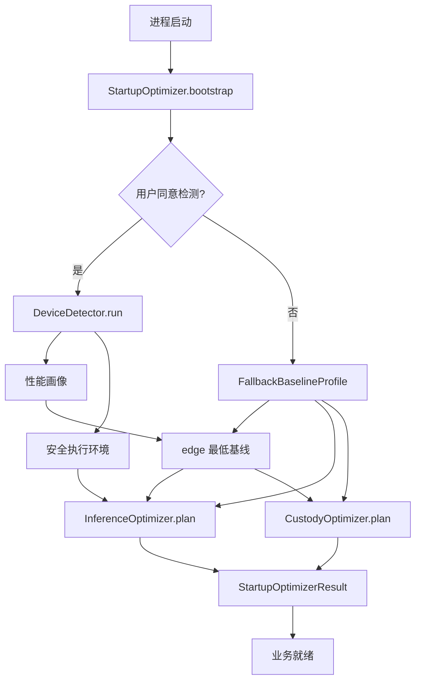
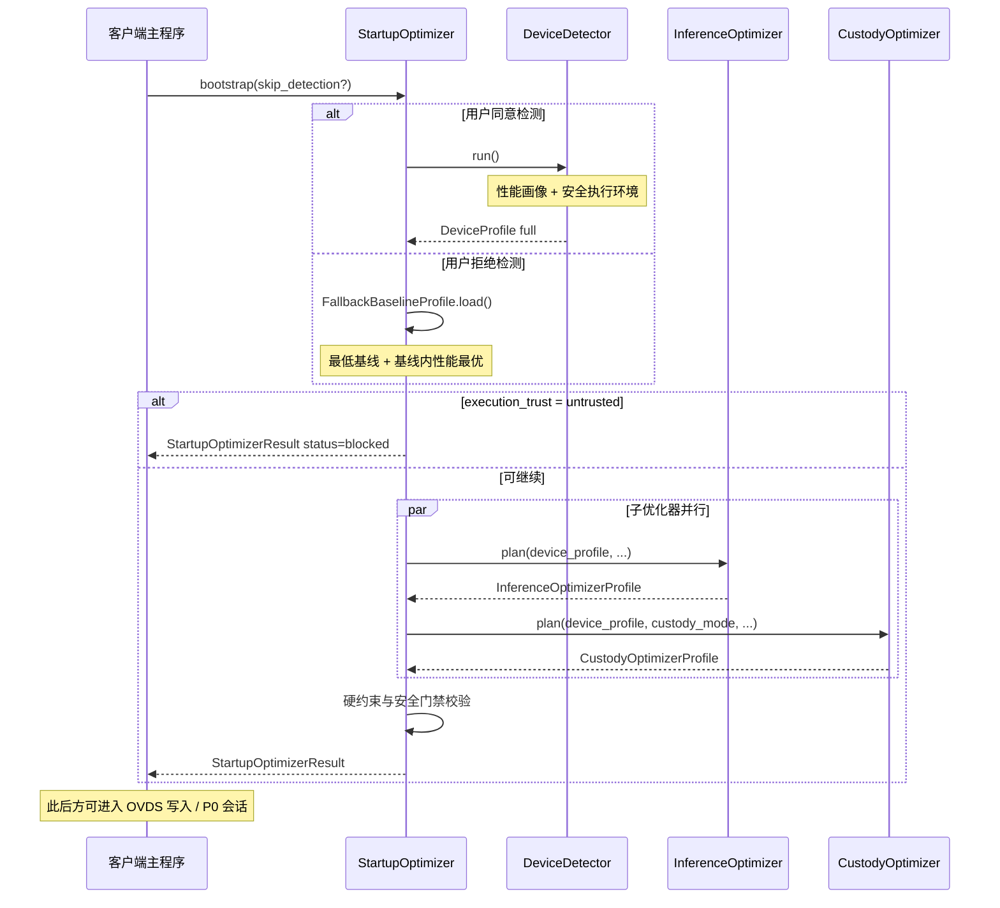

# vPIN 客户端启动阶段 · 工程优化器设计

> **文档性质**：与 [vpin-平台顶层抽象架构](./vpin-平台顶层抽象架构.md) 配套的专项设计；定义客户端**启动阶段**内置性能优化器的职责划分、调用顺序与接口契约。  
> **顶层对齐**：对应主文档 §2.2（客户端启动序）、§10（工程优化器）、附录 C.5 / C.6。  
> **参考材料**（策略细节来源，本文接口与之保持一致）：  
> - 隐私推理侧：`docs/ahe/ahe-批量推理-性能优化设计.md`  
> - 数据托管侧：外部 `experiment-reproduction/ovds/document/OVDS工程优化方案.md`

---

## 1. 设计目标

| 目标 | 说明 |
|------|------|
| **启动默认检测** | 进程初始化后默认提示设备检测；**用户可拒绝** |
| **拒绝即基线** | 拒绝检测时注入 `FallbackBaselineProfile`，不阻断业务 |
| **基线内性能最优** | 拒绝检测后子优化器在最低基线约束内仍做性能最优调度（§3.6） |
| **双重目的** | 完整检测服务于 **优化性能** 与 **检测安全执行环境**（§3.1） |
| **分模块优化** | 画像（实测或基线）馈入隐私推理优化器与数据托管优化器 |
| **语义不变** | 优化器不改变 VADS 验签、同态语义与双验证器命题 |
| **接口稳定** | `StartupOptimizerResult` 为 P0、OVDS、平面一的统一输入 |

---

## 2. 启动阶段总览

客户端内置 **启动优化编排器** `StartupOptimizer`（程序入口唯一调用的优化门面）。其职责是串联**设备检测**与子优化器，**不**替代各子优化器内部的策略逻辑。



**约束**：

1. `StartupOptimizer.bootstrap()` 在首次业务操作之前**必须**返回配置包；`execution_trust = untrusted`（仅完整检测可判定）时进入阻断态（§7）。
2. 用户可拒绝设备检测；拒绝后使用 `FallbackBaselineProfile`，`status = ok`，`detect_mode = skipped_user_refused`（§3.6）。
3. 用户可覆盖子优化器**单项可调参数**；不可将 `execution_trust` 从 `constrained` 伪造成 `trusted`。
4. `custody_mode = client_local` 时，托管优化器仍执行 `plan` 并返回 `enabled = false`，接口路径统一。

---

## 3. 设备检测（DeviceDetector）

由 `StartupOptimizer` 内嵌调用。检测服务于**两项目的**，结果统一写入 `DeviceProfile`（字段见主文档附录 C.5）。

### 3.1 双重目的

| 目的 | 回答的问题 | 主要产出 | 主要消费方 |
|------|------------|----------|------------|
| **优化性能** | 本机算力与网络能否支撑所选密态方案？应以何种并发、引擎与 I/O 策略运行？ | `device_category`、`cpu_cores`、`memory_available_mb`、`accelerator`、`network_rtt_ms` | `InferenceOptimizer`、`CustodyOptimizer` |
| **检测安全执行环境** | 本机是否为可信的密态推理与密钥操作环境？ | `execution_trust`、`secure_execution` | `StartupOptimizer` 门禁、Preflight、P0、`InferenceOptimizer`（密钥复用 / 卸载约束） |

两项检测在 `DeviceDetector.run()` 内**并行执行**，合并为单一 `DeviceProfile`；安全结论可否决性能侧的高风险优化（如 `batch_key_reuse`、`remote_preferred`）。

### 3.2 设备类别（性能维度）

| `device_category` | 典型形态 | 归类依据（检测信号组合） |
|-------------------|----------|--------------------------|
| `edge` | 手机、平板、嵌入式网关、离线工控机 | 低算力；**优先推荐托管交付**（§6.3） |
| `compute` | 工作站、塔式多 GPU 主机、机房单机 | 充裕内存、本地离散 GPU 或多核 CPU、低本地 RTT |
| `cloud` | 云 VM、容器实例、弹性 GPU 池 | 容器/虚拟化标签、配额感知内存、对远端服务 RTT 显著 |

细粒度 `device_class`：`edge_cpu` | `edge_gpu` | `compute_cpu` | `compute_gpu` | `cloud_vm` | `cloud_gpu`。

### 3.3 安全执行环境（SecureExecutionSignals）

| 信号 | 类型 | 说明 |
|------|------|------|
| `app_sandboxed` | bool | 应用是否处于 OS 级沙箱 / 容器隔离 |
| `tee_available` | bool | TEE / 安全 enclave / 可信执行环境是否可用 |
| `debugger_attached` | bool | 调试器或跟踪器是否附着 |
| `privileged_escalation` | bool | Root / 越狱 / 管理员提权痕迹 |
| `emulator_or_vm` | bool | 模拟器或可疑虚拟化环境（与 `cloud` 类别交叉判断） |
| `secure_storage_available` | bool | 平台安全存储（密钥封装）是否可用 |

**综合等级** `execution_trust`（由 `DeviceDetector` 派生，不可由用户直接写入）：

| 等级 | 派生条件（摘要） | 平台行为 |
|------|------------------|----------|
| `trusted` | 无高风险信号；`app_sandboxed` 或 `tee_available` 至少一项为真 | 允许全量性能优化策略 |
| `constrained` | 存在轻度风险（如虚拟机但非模拟器）或隔离不完整 | 禁止 `batch_key_reuse`；`offload_policy` 上限为 `hybrid` |
| `untrusted` | `debugger_attached` 或 `privileged_escalation` 为真，或多项高风险叠加 | 阻断密态推理与托管写入 |

### 3.4 性能检测项

| 检测项 | 写入字段 | 消费方 |
|--------|----------|--------|
| 逻辑 CPU 核数 | `cpu_cores` | 推理并发、托管并行 verify |
| 可用内存 | `memory_available_mb` | 推理背压、托管分块缓冲 |
| 加速器类型与显存 | `accelerator` | 推理 `engine_tier` |
| 对默认托管端 / 推理端的 RTT 抽样 | `network_rtt_ms` | 托管聚合策略、推理 `offload_policy` |
| 部署环境标签 | （内部信号） | 与 `device_category` 交叉校验 |
| 检测时刻 | `detect_timestamp` | 缓存失效判断 |

### 3.5 缓存与再检测

- 完整检测（`detect_mode = full`）结果在进程内缓存。
- 用户拒绝检测后，可随时主动触发 `DeviceDetector.run()` 升级为完整画像。
- 环境显著变化时 `StartupOptimizer.redetect(reason)` 刷新配置包。

**方法签名（文档级）**：

```
DeviceDetector.run() -> DeviceProfile          // detect_mode = full
FallbackBaselineProfile.load() -> DeviceProfile  // detect_mode = skipped_user_refused
```

### 3.6 拒绝检测 · 默认最低基线 · 性能最优

用户拒绝设备检测时，`StartupOptimizer` **不调用** `DeviceDetector`，改为加载 **`FallbackBaselineProfile`**：

| 字段 | 基线默认值 | 说明 |
|------|------------|------|
| `detect_mode` | `skipped_user_refused` | 标记非实测 |
| `device_category` | `edge` | 保守算力假设 |
| `device_class` | `edge_cpu` | 触发托管交付推荐 |
| `cpu_cores` | `2` | 平台常量 |
| `memory_available_mb` | `2048` | 平台常量 |
| `accelerator` | `none` | — |
| `network_rtt_ms` | `100` | 保守默认 |
| `execution_trust` | `constrained` | 安全信号未知，非 `trusted` |

**基线内性能最优**（`InferenceOptimizer` + `CustodyOptimizer` 在拒绝检测路径下的策略）：

| 参数 | 值 | 理由 |
|------|-----|------|
| `engine_tier` | `balanced` | 在基线内取较高性能档位（非 `lightweight`） |
| `concurrency` | `2` | 基线允许的最大并发 |
| `pipeline_depth` | `2` | 浅流水线以降延迟 |
| `offload_policy` | `hybrid` | 卸载至推理服/托管方以弥补未知本机算力 |
| `batch_key_reuse` | `false` | `execution_trust = constrained` 门禁 |
| `deployment_recommendation` | 托管交付全套默认 | `rationale = detection_skipped` |

拒绝检测**不等于**降级为不可用；平台在最低基线约束下仍追求**可达成范围内的最优吞吐与延迟**。

---

## 4. 隐私推理优化器（InferenceOptimizer）

**对应顶层**：主文档 **模型推理优化器**；作用平面五（密态推理）、平面六（推理服务）。

### 4.1 职责

据 `DeviceProfile`（**性能 + 安全**）与同态推理负载特征，生成 `InferenceOptimizerProfile`，约束：

- 同态引擎档位（`engine_tier`）
- 批量并发与会话流水线深度
- 密态环卸载策略（本地截断 vs 远端线性层）
- 批内密钥与 bias 密文复用策略（**受 `execution_trust` 约束**）

策略维度与三类设备的默认倾向见主文档 §10.1.3；批量并发、密钥复用等算法级权衡见 `ahe-批量推理-性能优化设计.md`。

### 4.2 接口

**输入** `InferenceOptimizerRequest`：

| 字段 | 类型 | 必填 | 说明 |
|------|------|------|------|
| `device_profile` | `DeviceProfile` | 是 | 设备检测产出 |
| `modality` | `cnn` \| `llm` | 否 | 缺省按客户端默认模态族 |
| `custody_mode` | `hosted` \| `client_local` | 否 | 影响 `offload_policy` 默认值 |
| `user_overrides` | `Partial<InferenceOptimizerProfile>` | 否 | 用户显式覆盖项；不得突破 `execution_trust` 门禁 |

**输出** `InferenceOptimizerProfile`：字段见主文档附录 C.5。

**方法签名（文档级）**：

```
InferenceOptimizer.plan(request: InferenceOptimizerRequest) -> InferenceOptimizerProfile
```

### 4.3 三类设备默认策略摘要

| 维度 | `edge` | `compute` | `cloud` |
|------|--------|-----------|---------|
| `engine_tier` | `lightweight` | `high_throughput` | `balanced` |
| `concurrency` | 1–2 | 按内存线性至上限 | 按远端配额 |
| `pipeline_depth` | 1 | 2–4 | 2–3 |
| `batch_key_reuse` | false | true（`trusted` 时） | true（`trusted` 时） |
| `offload_policy` | `hybrid`（低算力边缘） | `local_only` / `hybrid` | `hybrid` / `remote_preferred`（`trusted` 时） |
| `memory_budget_mb` | ≤ 可用内存 70% | ≤ 85% | 容器配额感知 |

**边缘低算力**：当 `device_category = edge` 且 `device_class = edge_cpu`（或算力低于阈值）时，`InferenceOptimizer` 与 `StartupOptimizer` 联合产出 `DeploymentRecommendation`（§6.4）：默认 `custody_mode = hosted`、`inference_peer = custody_host`、`verifier_target = custody_host`、`offload_policy = hybrid`，将截断环与验证交付转移至信任托管服务器。

---

## 5. 数据托管优化器（CustodyOptimizer）

**对应顶层**：主文档 **托管数据优化器**；作用平面二（数据绑定）、平面四（完整性校验输入）。

### 5.1 职责

据 `DeviceProfile` 与托管模式，生成 `CustodyOptimizerProfile`，约束写入路径与读出验证路径参数。`execution_trust = untrusted` 时即使 `hosted` 亦不得 `enabled = true`。

**传输**：所有托管 I/O（上传、query、verify、RTT 探测）仅经 **HTTPS（标准 TLS 1.2+）**；若 `custody_host_endpoint` 非 `https://`，`CustodyOptimizer.plan` **拒绝**并返回错误。

### 5.2 接口

**输入** `CustodyOptimizerRequest`：

| 字段 | 类型 | 必填 | 说明 |
|------|------|------|------|
| `device_profile` | `DeviceProfile` | 是 | 设备检测产出 |
| `custody_mode` | `hosted` \| `client_local` | 是 | `client_local` 时输出 `enabled = false` |
| `custody_host_rtt_ms` | int | 否 | 缺省用 `device_profile.network_rtt_ms` |
| `expected_file_size_mb` | int | 否 | 启动时未知可省略；上传前可再 plan |
| `user_overrides` | `Partial<CustodyOptimizerProfile>` | 否 | 用户显式覆盖项 |

**输出** `CustodyOptimizerProfile`：字段见主文档附录 C.6。

**方法签名（文档级）**：

```
CustodyOptimizer.plan(request: CustodyOptimizerRequest) -> CustodyOptimizerProfile
```

### 5.3 分块与验证策略

分块大小与 `choose_verify_strategy` 与主文档附录 C.6 一致；启动阶段 `chunk_count = 0` 时写入默认并行度，供首次托管拉取使用。

---

## 6. 启动优化编排器（StartupOptimizer）

### 6.1 接口

**方法**：

```
StartupOptimizer.bootstrap(request: StartupBootstrapRequest) -> StartupOptimizerResult
StartupOptimizer.redetect(reason: RedetectReason) -> StartupOptimizerResult
```

**输入** `StartupBootstrapRequest`：

| 字段 | 类型 | 必填 | 说明 |
|------|------|------|------|
| `skip_detection` | bool | 否 | `true` 表示用户拒绝检测，走 `FallbackBaselineProfile` |
| `custody_mode` | `hosted` \| `client_local` | 否 | 默认 `client_local` |
| `modality` | `cnn` \| `llm` | 否 | 默认 `cnn` |
| `custody_host_endpoint` | string | 否 | `hosted` 时托管服务根 URL；**必须为 `https://`**（§5.3.0）；用于 TLS 握手与 RTT 探测 |
| `inference_overrides` | `Partial<InferenceOptimizerProfile>` | 否 | 透传推理优化器 |
| `custody_overrides` | `Partial<CustodyOptimizerProfile>` | 否 | 透传托管优化器 |

**输出** `StartupOptimizerResult`：

| 字段 | 类型 | 说明 |
|------|------|------|
| `startup_id` | string | 本次启动配置唯一 ID |
| `device_profile` | `DeviceProfile` | 设备检测产物 |
| `inference_profile` | `InferenceOptimizerProfile` | 隐私推理优化配置 |
| `custody_profile` | `CustodyOptimizerProfile` | 数据托管优化配置 |
| `deployment_recommendation` | `DeploymentRecommendation` | 托管交付推荐 |
| `detect_mode` | `full` \| `skipped_user_refused` | 配置来源 |
| `bootstrap_timestamp` | ISO8601 | 编排完成时刻 |
| `status` | `ok` \| `degraded` \| `blocked` \| `failed` | 见 §7；拒绝检测为 `ok` |

### 6.2 编排顺序（固定）

```
1. 若 skip_detection → FallbackBaselineProfile.load()
   否则 DeviceDetector.run()  → DeviceProfile
2. 若 execution_trust = untrusted → status = blocked（§7）
3. InferenceOptimizer.plan()   → InferenceOptimizerProfile（拒绝检测：基线内性能最优）
4. CustodyOptimizer.plan()     → CustodyOptimizerProfile
5. 派生 DeploymentRecommendation（§6.3；拒绝检测：rationale = detection_skipped）
6. 校验硬约束
7. 组装 StartupOptimizerResult
```

步骤 3 与 4 **可并行**；均依赖步骤 1 的输出。步骤 5 依赖步骤 1、3、4。

### 6.3 托管交付推荐（DeploymentRecommendation）

**原则**：边缘低算力设备**优先推荐**将数据绑定、P3 交互与 P6 验证**交付至信任托管服务器**，客户端作薄编排层。

**触发条件**（满足其一即可）：

- `device_category = edge` 且 `device_class = edge_cpu`
- `device_category = edge` 且 `memory_available_mb` 或 `cpu_cores` 低于平台阈值
- `detect_mode = skipped_user_refused`（用户拒绝检测）

**默认推荐值**：

| 字段 | 值 |
|------|-----|
| `custody_mode` | `hosted` |
| `inference_peer` | `custody_host` |
| `verifier_target` | `custody_host` |
| `offload_policy` | `hybrid` |
| `rationale` | `edge_low_compute`（实测低算力）或 `detection_skipped`（拒绝检测） |
| `user_confirm_required` | `false`（采纳推荐时） |

用户将 `inference_peer` 或 `verifier_target` 改回 `client_local` 时，置 `user_confirm_required = true`，`rationale = user_override`。

**方法签名（文档级）**：

```
StartupOptimizer.derive_deployment_recommendation(
  device_profile,
  inference_profile,
  custody_profile
) -> DeploymentRecommendation
```

### 6.4 配置包下游消费

| 消费方 | 携带字段 | 时机 |
|--------|----------|------|
| 业务向导 / `DataBindingRecord` 预填 | `deployment_recommendation` | 边缘低算力首次任务创建 |
| 平面一 `CiphertextSchemeSelector` | `device_profile`、`inference_profile.engine_tier` | 模型部署 / 方案选型 |
| P0 `SessionStart` | `device_profile` 摘要（含 `execution_trust`）、`inference_profile` | 密态会话建连 |
| OVDS 写入协调 | `custody_profile`（`enabled=true` 且非 `blocked`） | 托管数据 append 前；**HTTPS only** |
| Preflight | 完整 `StartupOptimizerResult` | 会话门禁 |

---

## 7. 失败、降级与阻断

| `status` | 条件 | 行为 |
|----------|------|------|
| `ok` | 检测或拒绝检测路径均成功；`execution_trust` 为 `trusted` 或 `constrained` | 全功能就绪 |
| `degraded` | 完整检测部分失败（如 RTT 超时）但可归类设备 | 保守性能参数 |
| `blocked` | 完整检测判定 `execution_trust = untrusted` | 阻断密态推理与托管写入 |
| `failed` | 用户同意检测但无法采集最低限度信号 | 阻断全部业务 |

**说明**：用户**拒绝检测**走基线路径，结果为 `ok` + `detect_mode = skipped_user_refused`，**不属于** `failed` 或 `degraded`。

完整检测降级时 `InferenceOptimizer` 强制：`engine_tier = lightweight`，`concurrency = 1`，`offload_policy = local_only`，`batch_key_reuse = false`。**拒绝检测路径不适用此降级表**，而适用 §3.6 基线内性能最优策略。

---

## 8. 启动阶段时序



---

## 9. 与顶层架构的接口对照

| 顶层概念 | 本文模块 | 启动产物字段 |
|----------|----------|--------------|
| 客户端启动序 §2.2 | `StartupOptimizer` | 全流程 |
| 设备检测 §10.1.2 | `DeviceDetector` | `device_profile` |
| 模型推理优化器 §10.1 | `InferenceOptimizer` | `inference_profile` |
| 托管数据优化器 §10.2 | `CustodyOptimizer` | `custody_profile` |
| 附录 C.5 | `DeviceProfile` + `InferenceOptimizerProfile` | 字段一致 |
| 附录 C.5.1 | `DeploymentRecommendation` | 字段一致 |
| 附录 C.6 | `CustodyOptimizerProfile` | 字段一致 |

---

## 10. 术语表

| 术语 | 含义 |
|------|------|
| **设备检测** | 默认执行、**可跳过**；跳过时用最低基线 + 基线内性能最优 |
| **托管传输** | 客户端 ↔ 托管服务器须 **HTTPS / TLS 1.2+**；见主文档 §5.3.0 |
| **拒绝检测基线** | `FallbackBaselineProfile`；`detect_mode = skipped_user_refused` |
| **安全执行环境** | 本机是否具备可信执行密态推理与密钥操作的条件 |
| **启动阶段** | 从进程启动到 `StartupOptimizerResult` 返回；不包含 P0–P6 业务会话 |
| **隐私推理优化器** | 本文 `InferenceOptimizer`；顶层称「模型推理优化器」 |
| **数据托管优化器** | 本文 `CustodyOptimizer`；顶层称「托管数据优化器」 |
| **配置包** | `StartupOptimizerResult` 及其子 Profile 的统称 |
| **托管交付推荐** | 边缘低算力时默认将绑定、截断环与验证交付信任托管服务器 |
