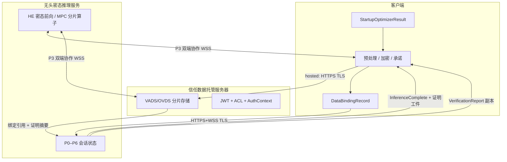
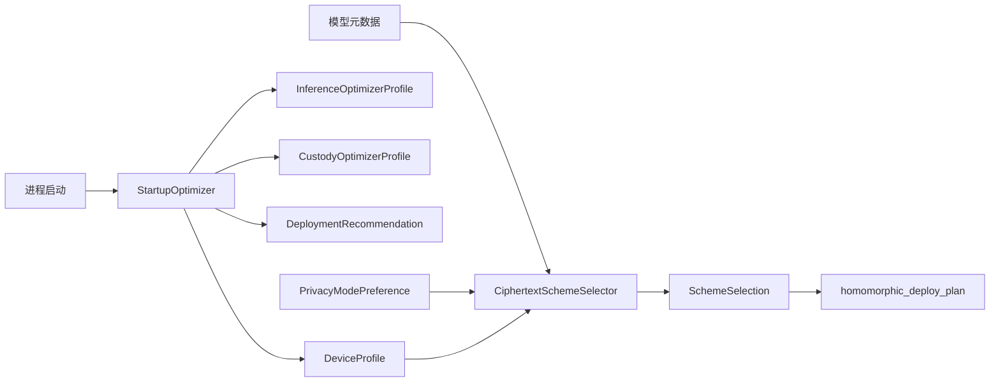
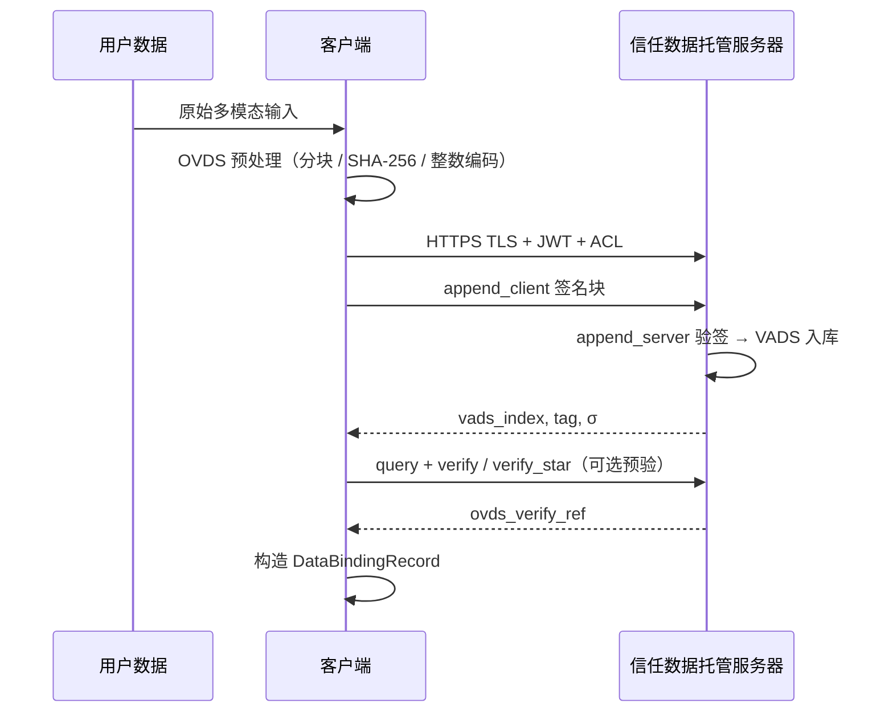
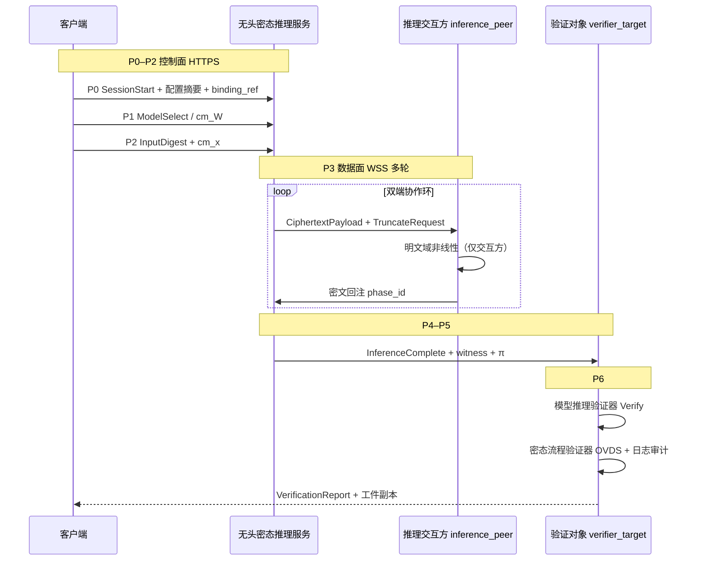
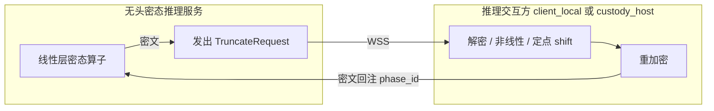
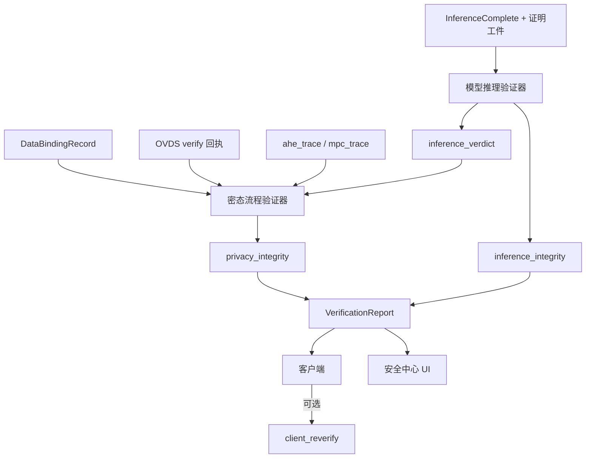
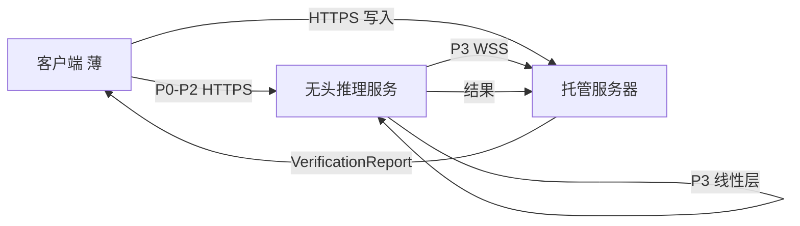

# vPIN 平台数据流图

> **文档性质**：基于 [vpin-平台顶层抽象架构.md](./vpin-平台顶层抽象架构.md) 的数据流向专篇，描述三角色间**各类数据工件**的产生、传输、消费与落点。本文聚焦**应然数据面**与**控制面**分工，不记述实现路径与仓库映射。  
> **关联文档**：[平台隐私保护](./vpin-平台隐私保护.md)、[独立客户端与服务端协议合规](./vpin-平台架构-独立客户端与服务端（协议合规）.md)、[客户端启动阶段 · 工程优化器设计](./vpin-客户端启动阶段-工程优化器设计.md)。

---

## 1. 总览

### 1.1 三角色与主干链路



### 1.2 生命周期阶段

| 阶段 | 名称 | 主要数据产出 | 参与角色 |
|------|------|--------------|----------|
| **0** | 启动与治理 | `StartupOptimizerResult`、`SchemeSelection`、`homomorphic_deploy_plan` | 客户端；治理平面本地 |
| **A** | 数据入库与绑定 | OVDS 分片、`ovds_verify_ref`、`DataBindingRecord` | 客户端 ↔ 托管（`hosted`）或客户端本地（`client_local`） |
| **B** | 密态推理会话 P0–P5 | 密文环 / `ahe_trace`、witness、π / `mpc_trace` | 客户端 ↔ 无头推理服务 ↔ 推理交互方 |
| **C** | 验证 P6 | `VerificationReport`、`inference_verdict`、`client_reverify` | 验证对象；客户端复核 |

---

## 2. 数据工件目录

### 2.1 配置与治理类

| 工件 | 产生方 | 主要字段 / 内容 | 流向 | 落点 |
|------|--------|-----------------|------|------|
| `StartupOptimizerResult` | 客户端 `StartupOptimizer` | `device_profile`、`inference_profile`、`custody_profile`、`deployment_recommendation`、`detect_mode` | P0 摘要上传无头服务；本地消费 | 客户端进程内缓存 |
| `DeviceProfile` | `DeviceDetector` / `FallbackBaselineProfile` | `device_category`、`cpu_cores`、`memory_available_mb`、`network_rtt_ms`、`execution_trust` | 编入启动包；平面一选型；Preflight | 客户端；P0 控制面 |
| `SchemeSelection` | `CiphertextSchemeSelector` | `scheme`、`nonlinear_policy`、`verification_path`、`compute_paradigm` | P1 前本地；Preflight | 客户端；会话上下文 |
| `homomorphic_deploy_plan.json` | HDC / `DeployabilityEvaluator` | 层图、截断相位 Π、定点尺度 | 无头服务执行面；验证器 | 客户端 + 推理服务 |
| `PrivacyModePreference` | 用户 UI / 配置 | 四维权重、`preferred_scheme_id` | 平面一选型输入 | 客户端 |

### 2.2 托管与绑定类（`hosted`）

| 工件 | 产生方 | 主要字段 / 内容 | 流向 | 落点 |
|------|--------|-----------------|------|------|
| 原始多模态文件 | 用户 | 图像 / 文本 / 音频等 | 客户端预处理 | 客户端暂存 → OVDS 流水线 |
| OVDS 预处理块 | 客户端 OVDS 流水线 | 分块整数项、`file_index.json` | `append_client` → `append_server` | 托管 VADS 流 |
| `(vads_index, tag_i, σ_i)` | VADS append | 块索引、标签、签名 | 托管服务器持久化 | 托管 DB |
| `ovds_verify_ref` | `query` + `verify` / `verify_star` | 证明摘要 | 写入 `DataBindingRecord` | 客户端；验证对象 |
| `DataBindingRecord` | 客户端（数据就绪后） | 见 §3.2 | P0/P2；可选服务间 HTTPS | 客户端；无头服务 Preflight |

### 2.3 推理会话类（P0–P5）

| 工件 | 产生方 | 主要字段 / 内容 | 流向 | 落点 |
|------|--------|-----------------|------|------|
| P0 会话上下文 | 客户端 + 无头服务 | 认证令牌、配置包摘要、`ovds_binding_ref` | HTTPS 控制面 | 双方会话状态 |
| P1 `cm_W` | 客户端 / 目录 | 模型承诺 | HTTPS | 验证对象；证明链 |
| P2 `InputDigest` / `cm_x` | 客户端 | SHA-256 摘要、`ovds_binding_ref` | HTTPS 控制面 | 无头服务；验证器 |
| 密文输入句柄 | 客户端或托管方 | 密文引用 / 句柄（非明文） | WSS 数据面 | 无头服务 |
| `CiphertextPayload` | 无头服务 | 层间密文、相位 ID | WSS ↔ 推理交互方 | 往返；`ahe_trace` |
| `TruncateRequest` | 无头服务 | 截断相位、待处理密文 | WSS → `inference_peer` | 推理交互方 |
| 重加密密文回注 | 推理交互方 | `phase_id`、新密文 | WSS → 无头服务 | 闭合 P3 环 |
| `InferenceComplete` | 无头服务 | 输出密文 / logits 摘要 | WSS → 验证对象 | 验证阶段 |
| witness + π | 无头服务（HE·CNN） | 算力证明工件 | WSS → 验证对象 | 模型推理验证器 |
| `mpc_trace` | MPC 参与方（*待扩展*） | 分片轮次、交换记录 | 验证对象 | `mpc_protocol` 审计 |

### 2.4 验证与结论类（P6）

| 工件 | 产生方 | 主要字段 / 内容 | 流向 | 落点 |
|------|--------|-----------------|------|------|
| `inference_verdict` | 模型推理验证器 | `pass`/`fail`、失败码、`proof_coverage` | → 密态流程验证器 | 验证对象 |
| `privacy_integrity` | 密态流程验证器 | OVDS + 日志审计结论 | → `VerificationReport` | 验证对象 |
| `VerificationReport` | 验证对象 | 双验证器合并结论 | → 客户端（必达） | 安全中心展示 |
| 验证工件副本 | 验证对象 | π、witness、`ahe_trace`/`mpc_trace`、OVDS 回执 | → 客户端 | 本地 `client_reverify` |

---

## 3. 分阶段数据流

### 3.0 阶段 0：启动与密态方案治理



| 步骤 | 数据输入 | 数据输出 | 说明 |
|------|----------|----------|------|
| 设备检测（可选） | 本机性能 / 安全信号 | `DeviceProfile` | 拒绝检测 → `FallbackBaselineProfile` |
| 子优化器 | `DeviceProfile`、`custody_mode` | `InferenceOptimizerProfile`、`CustodyOptimizerProfile` | 横切平面五/六、二/四 |
| 密态选型 | 模型拓扑、精度、`DeviceProfile`、用户偏好 | `SchemeSelection` | MPC 须过 `ComputeParityGate` |
| 可部署编译 | 权重、校准集、`SchemeSelection` | `homomorphic_deploy_plan` | P1 之前完成 |

**数据不落服务端**：完整 `DeviceProfile` 与 `PrivacyModePreference` 默认留存客户端；P0 仅上传**摘要**与门禁所需字段。

---

### 3.1 阶段 A：数据入库（`hosted` 模式）



| 链路 | 协议 | 载荷类型 | 禁止项 |
|------|------|----------|--------|
| 客户端 → 托管 | **HTTPS** TLS 1.2+ | JWT、`append_*`、`query`/`verify` 请求体 | 明文 HTTP |
| 托管 → 客户端 | HTTPS | 索引确认、证明回执、分片密文态数据 | 未授权租户数据 |

**`client_local` 模式**：阶段 A 在客户端本地完成预处理与摘要；**不向托管服务器写入**用户数据块；`DataBindingRecord.ovds_file_id` 可为空，仅保留 `data_digest` 与本地密文句柄。

---

### 3.2 `DataBindingRecord` 数据流

绑定记录是**平面二**与**平面五/六**的枢纽，本身**不承载用户明文**：

```
客户端（数据就绪）
    │
    ├─ owner_id, tenant_id, custody_mode
    ├─ ovds_file_id, vads_indices, data_digest
    ├─ ovds_verify_ref
    ├─ inference_peer, verifier_target
    └─ binding_timestamp
         │
         ├─[HTTPS+WSS]─→ 无头密态推理服务（Preflight / P2 引用）
         └─[可选 HTTPS]─→ 无头服务向托管拉取 ovds_verify_ref 复核
```

| 字段 | 在推理链路的消费点 |
|------|-------------------|
| `data_digest` | P2 `cm_x` 对齐；密态流程验证器承诺校验 |
| `ovds_verify_ref` | Preflight；密态流程验证器 OVDS 校验 |
| `inference_peer` | P3 双端协作往返目标 |
| `verifier_target` | P6 双验证器执行位置 |

---

### 3.3 阶段 B：P0–P6 推理会话数据流

#### 3.3.1 控制面 vs 数据面

| 平面 | 协议 | 典型消息 | 载荷性质 |
|------|------|----------|----------|
| **控制面** | HTTPS REST | P0 `SessionStart`、P1 模型元数据、P2 `InputDigest`、Preflight | 元数据、承诺摘要、认证 |
| **数据面** | **WSS** TLS | P3 密文环、`TruncateRequest`、密文回注、`InferenceComplete` | 密文 / 分片（HE 或 MPC） |

客户端 ↔ 托管 OVDS 读写走**独立 HTTPS 链路**，不得与推理 WSS 混用未加密端点。

#### 3.3.2 P0–P6 消息流（HE 主路径）



| 阶段 | 跨角色数据流 | 关键工件 |
|------|--------------|----------|
| **P0** | 客户端 → 无头服务 | 会话 ID、认证、`DeviceProfile` 摘要、`ovds_binding_ref` |
| **P1** | 客户端 → 无头服务 | `cm_W`、deploy plan digest |
| **P2** | 客户端 → 无头服务 | `InputDigest`、`cm_x`；数据面密文句柄 |
| **P3** | 无头服务 ↔ `inference_peer` | 密文往返、`ahe_trace` 各 `phase_id` |
| **P4** | 验证对象本地（CNN 非交互 γ） | transcript 派生挑战 |
| **P5** | 无头服务 → 验证对象 | π、witness（HE·CNN）或抽样响应（LLM·HE） |
| **P6** | 验证对象 → 客户端 | `VerificationReport`、`client_reverify` 可选 |

#### 3.3.3 P3 双端协作数据流（详图）



- **线性算子输出**：密文张量（WSS 下行至交互方仅当需要非线性时）。
- **交互方输出**：新密文 + `phase_id`（WSS 上行）。
- **日志**：双方会话内写入 `ahe_trace`；验证阶段由密态流程验证器审计相位序与 Π 一致性。

---

### 3.4 阶段 C：验证数据流



| 验证器 | 输入数据 | 输出数据 |
|--------|----------|----------|
| **模型推理验证器** | `cm_W`、`cm_x`、witness、π / 抽样响应 / `mpc_trace` | `inference_integrity`、`inference_verdict` |
| **密态流程验证器** | `DataBindingRecord`、`ovds_verify_ref`、P2/P3 日志、`inference_verdict` | `privacy_integrity` |

**执行顺序**：先模型推理验证器 → 后密态流程验证器（收录 `inference_verdict`）。  
**客户端复核**：收到报告与工件副本后，可本地重放 Verify / 审计，写入 `client_reverify`。

---

## 4. 链路级数据矩阵

### 4.1 客户端 ↔ 信任数据托管服务器

| 方向 | 数据 | 加密 | 认证 |
|------|------|------|------|
| C → O | OVDS 分片、`append_*` 请求 | TLS | JWT + ACL |
| C → O | `query` / `verify` / `verify_star` | TLS | JWT + ACL |
| O → C | `vads_index`、证明回执、分片读出 | TLS | 租户隔离 |
| C → O | P3 截断环（当 `inference_peer = custody_host`） | WSS TLS | JWT + 会话 |
| O → C | `VerificationReport`（当 `verifier_target = custody_host`） | TLS | 同上 |

### 4.2 客户端 ↔ 无头密态推理服务

| 方向 | 数据 | 信道 | 说明 |
|------|------|------|------|
| C → I | P0–P2 控制消息 | HTTPS | 含承诺摘要，不含明文输入 |
| C → I | 密文输入句柄 | WSS | 密文专属数据面 |
| I → C | `TruncateRequest`（当 peer=client） | WSS | 交互方为本机 |
| C → I | 密文回注 | WSS | 闭合 P3 |
| I → C | `InferenceComplete`、证明工件 | WSS | 当验证对象含客户端 |

### 4.3 无头密态推理服务 ↔ 信任数据托管服务器

| 方向 | 数据 | 信道 | 说明 |
|------|------|------|------|
| I → O | 绑定证明拉取、`ovds_verify_ref` 复核 | HTTPS / mTLS | Preflight 可选 |
| I ↔ O | P3 协作（当 `inference_peer = custody_host`） | WSS / HTTPS | 密文或分片，非明文 |

### 4.4 服务间禁止流

| 禁止流 | 原因 |
|--------|------|
| 用户明文输入 → 无头推理服务 | 密文专属契约 §8.1 |
| 解密私钥 → 无头推理服务 | 非线性仅在推理交互方 |
| JWT / 分片 / 密文 → 明文 HTTP | §5.3.0 TLS 强制 |
| 无头服务自证 `VerificationReport` | 双验证器须在验证对象执行 |

---

## 5. 部署模式数据流差异

### 5.1 `hosted` + 边缘低算力（推荐拓扑）



| 项 | 默认值 | 数据落点 |
|----|--------|----------|
| `custody_mode` | `hosted` | 用户数据块在托管 VADS |
| `inference_peer` | `custody_host` | 非线性在托管明文域 |
| `verifier_target` | `custody_host` | 报告由托管出具；客户端收副本 |

### 5.2 `client_local` + 高算力本地

| 项 | 数据流特征 |
|----|------------|
| 数据存放 | 预处理与摘要在客户端；无 OVDS 块或可选 |
| `inference_peer` | `client_local`；P3 往返不经过托管 |
| `verifier_target` | 通常 `client_local` |
| 密钥材料 | 解密私钥不离开客户端 |

### 5.3 MPC 路径（*待扩展*，`scheme_id = mpc_puma`）

| 差异点 | HE 路径 | MPC 路径 |
|--------|---------|----------|
| P3 数据面 | 密文句柄 / `CiphertextPayload` | **秘密分片**交换 `mpc_trace` |
| 无头服务载荷 | 同态密文 | 模型分片 + 协议消息 |
| 门禁 | 常规范 | **`ComputeParityGate`** 算力对等 |
| P6 验证 | CP-SNARK / 抽样 | `mpc_protocol` transcript 审计 |

---

## 6. 模态族数据流差异（摘要）

| 模态族 | 体制 | P3 主载荷 | P5–P6 主工件 |
|--------|------|-----------|--------------|
| **CNN** | E₂ ElGamal | 密文 + `TruncateRequest` | witness、π；`CPS.Ver` |
| **LLM·HE** | CKKS/BFV 混合 | 密文 / 线性化图 | 分层承诺、抽样响应 |
| **LLM·MPC** | PUMA 类（待扩展） | 分片轮次 | `mpc_trace` |

CNN 族数据流详见顶层架构 [附录 A.6](./vpin-平台顶层抽象架构.md#附录-acnn-模态族详述)。

---

## 7. 与六平面的数据归属

| 平面 | 管辖的数据工件 |
|------|----------------|
| **平面一 治理** | `SchemeSelection`、`homomorphic_deploy_plan` |
| **平面二 绑定** | `DataBindingRecord`、OVDS 分片索引、`ovds_verify_ref` |
| **平面三 隐私** | 可见性边界（见 [隐私保护文档](./vpin-平台隐私保护.md)） |
| **平面四 完整性** | `VerificationReport`、`inference_verdict`、`ahe_trace`/`mpc_trace` |
| **平面五 密态推理** | 密文环 / MPC 分片、witness、π |
| **平面六 推理服务** | P0–P6 会话状态、Preflight 门禁记录 |

---

## 8. 修订记录

| 版本 | 说明 |
|------|------|
| 1.0 | 自顶层抽象架构拆出；覆盖启动、OVDS、P0–P6、双验证器与三部署模式 |
