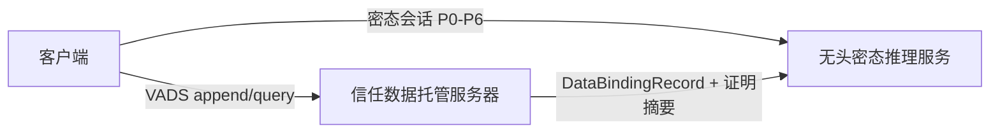
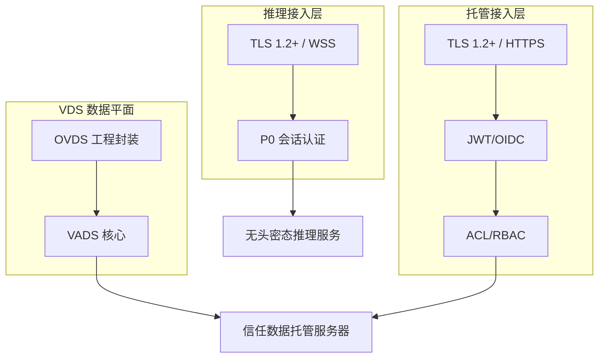
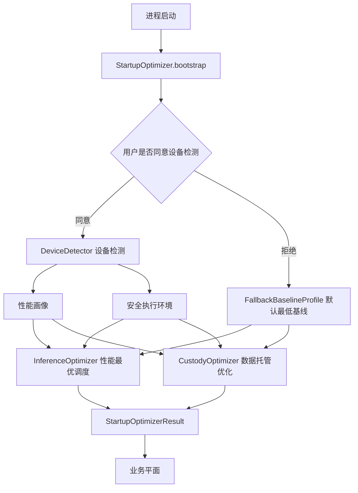
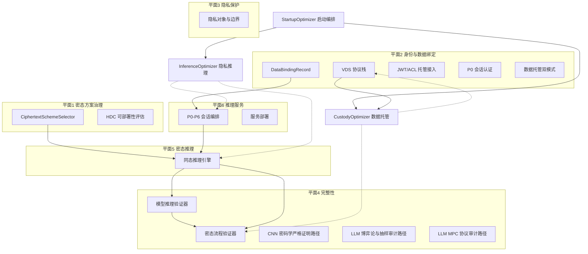
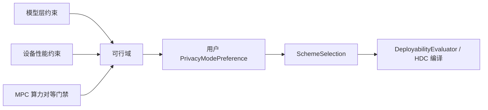
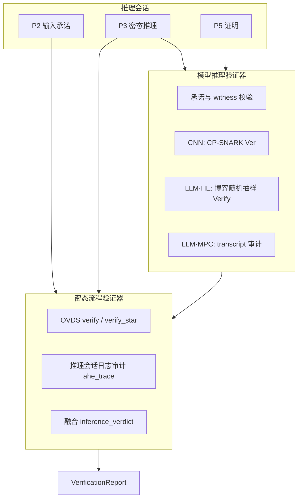
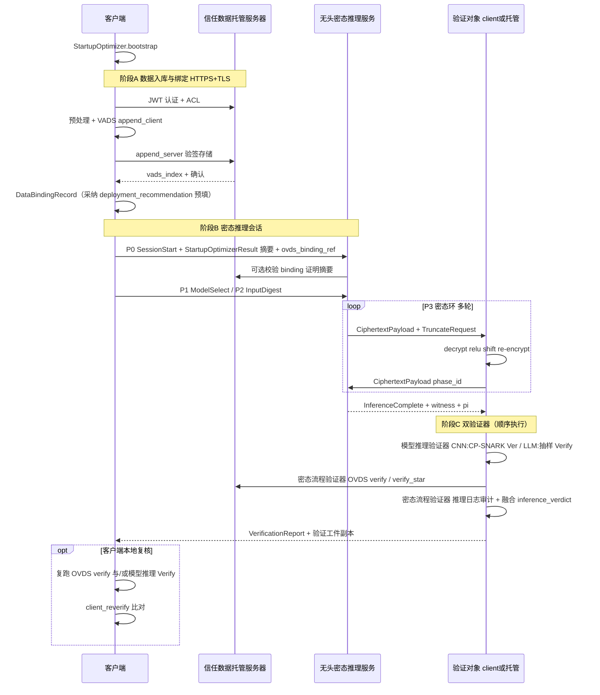
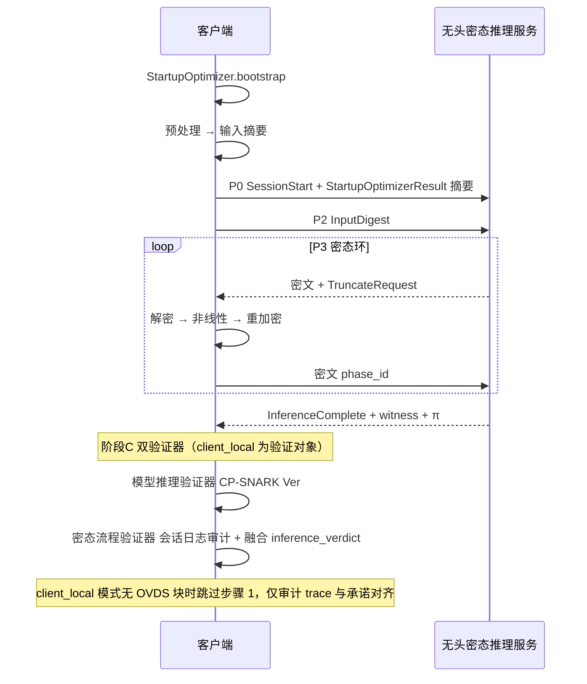
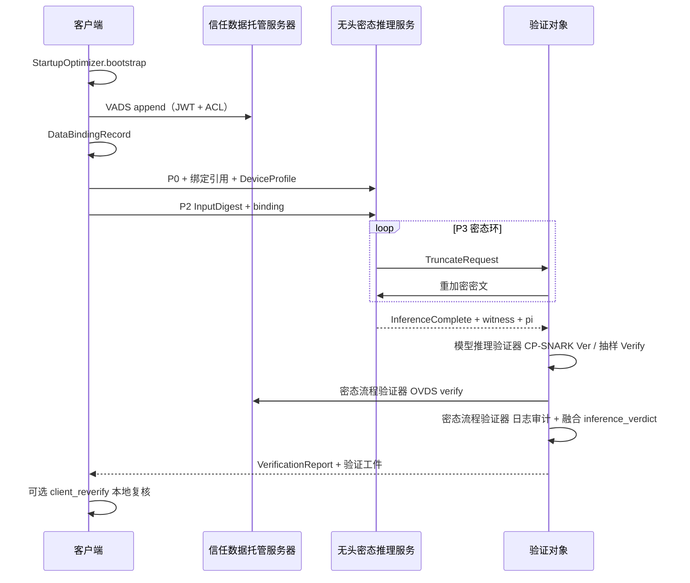

# vPIN 平台顶层抽象架构

> **文档性质**：平台级高概念架构定稿，描述六平面、三角色、OVDS 数据绑定、启动优化编排器与工程优化器（隐私推理 + 数据托管）、双端身份认证、数据托管双模式与双验证器分工。本文定义**平台应然结构**，不记述实现进度与仓库映射。  
> **关联文档**：[平台数据流图](./vpin-平台数据流图.md)（三角色数据流向专篇）、[平台隐私保护](./vpin-平台隐私保护.md)（隐私对象与五类机制保证）、[独立客户端与服务端协议合规](./vpin-平台架构-独立客户端与服务端（协议合规）.md)（P0–P6 细节）、[客户端启动阶段 · 工程优化器设计](./vpin-客户端启动阶段-工程优化器设计.md)（启动阶段设备检测与子优化器接口）、[信任数据托管服务器 · 软件架构](./vpin-custody-server-软件架构.md)（四档托管能力、`vpin-custody-server` 分层与 Defaults）、[信任数据托管服务器 · 接口规格](./vpin-custody-server-接口规格.md)（trait / HTTP 契约）、[HDC 同态可部署编译器](../ahe/hdc-同态可部署编译器.md)、OVDS 协议流程（外部 `experiment-reproduction/ovds/OVDS协议完整流程.md`）、OVDS 多模态方案（`experiment-reproduction/ovds/OVDS实际应用多模态数据方案.md`）、OVDS 工程优化（`experiment-reproduction/ovds/document/OVDS工程优化方案.md`）、OVDS 托管服务器（`experiment-reproduction/ovds/document/OVDS数据托管服务器技术文档.md`）。  
> **本文不写**：文献调研索引；密码学实现细节（私钥、挑战采样等）。

---

## 1. 平台定位

vPIN 是 **可验证隐私推理平台（Verifiable Private Inference Platform）**：

- 按模型规模与模态 **选择密态方案**，在期望精度下完成同态推理部署；
- 通过 **VDS 协议栈**（VADS 核心 + OVDS 工程封装）实现可验证数据托管与完整性校验；**身份认证与授权**在应用接入层完成（见 §5.3）；
- 经 **双验证器** 分别确认 **数据隐私完整** 与 **模型推理及算力承诺完整**。

平台不是单一密码学产品，而是 **密态方案治理 + 可验证数据绑定 + 双端身份认证 + 可部署编译 + 密态推理 + 推理服务** 的组合体。

**客户端启动序**：进程初始化后、进入任何密态推理或数据托管业务之前，**默认调用**程序内置的启动优化编排器 `StartupOptimizer`：在**用户同意**时完成**设备检测**（优化性能 + 安全执行环境）；**用户可拒绝检测**，此时采用**默认最低基线画像**并由子优化器在基线内做**性能最优**调度。无论哪条路径均产出 `StartupOptimizerResult`（见 §2.2、[启动阶段优化器设计](./vpin-客户端启动阶段-工程优化器设计.md)）。

平台按 **模态族** 选择密态方案与完整性验证路径；**用户可自行选用密态隐私模式**（§4.2.3），在通信、推理、密态加载与安全之间表达倾向。模态族通过 **可扩展注册接口** 增量接入（§4.1），当前内置 CNN / LLM 两族；族内差异见 [附录 A](#附录-acnn-模态族详述)。

| 模态族 | 密态推理（当前内置） | 完整性验证路径 | 扩展 |
|--------|----------------------|----------|------|
| **CNN 视觉模型** | 加法群域 AHE（E₂ 指数 ElGamal） | **密码学严格证明路径** | 族内可增拓扑 |
| **大语言模型** | 混合同态加密 + 计算图线性化 | **博弈论与抽样审计路径** | 族内可增尺度 |
| **LLM / 多模态大模型** | **MPC 秘密分享**（*待扩展*；参考 **PUMA**，arXiv:2307.12533） | **`mpc_protocol` 协议审计路径** | 算力对等门禁（§4.3） |
| *（后续增量）* | 经 `HomomorphicSchemePlugin` 注册 | 经 `ModalityFamilyDescriptor` 绑定 | 见 §4.1 |

CNN 族内覆盖 SimpleCNN、LeNet、ResNet 等卷积网络；族内共用 AHE 与非线性卸载范式。LLM / 多模态族默认走混合 HE 与博弈论抽样审计；在**算力对等**且满足信任假设时，可选用 **MPC 体制**（§4.3，*待扩展*）。新增模态族或密态体制**不改动六平面划分**，仅扩展治理平面注册表与后端插件槽位。

---

## 2. 三角色

| 角色 | 职责 | 部署形态 |
|------|------|----------|
| **客户端** | **启动时设备检测**（性能画像 + 安全执行环境）与优化配置生成；数据预处理、VADS append（经 OVDS 流水线）、密态推理参与；作为验证对象或**本地复核方**执行双验证器（§7.1.2） | 桌面、移动、嵌入式或命令行形态 |
| **信任数据托管服务器** | 维护 **VDS 协议栈**（VADS 数据流 + OVDS 工程封装），存储可验证数据流；承担 **JWT/OIDC 认证 + ACL**；按用户选择的 **托管能力模式**（§2.3）提供数据托管、P3 代理、P6 验证代理或全量代理；**不参与**密态方案选型（§4） | 独立托管服务（`vpin-custody-server`） |
| **无头密态推理服务** | 密文专属数据面：仅经 TLS 接收密文载荷、绑定元数据与公开模型参数，执行同态前向与算力证明；无用户明文 I/O 通道；`client_local` 模式下承担 P0 会话认证 | 边缘节点或数据中心无头部署 |



**用户可指定的两类终端对象**（推理结果与计算量证明校验的接收方，二选一）：

| 对象 | 角色 |
|------|------|
| **本地客户端** | 本机执行截断/验证、接收 `VerificationReport` |
| **信任托管服务器** | 代客执行截断或验证、托管侧出具审计结论 |

**推理交互方**（密态推理双端交互协作的客户端侧端点，二选一，可与验证对象相同或不同）：

| 交互方 | 说明 |
|--------|------|
| **本地客户端** | 默认路径：`TruncateRequest` → 本地解密 / ReLU / 重加密 |
| **信任托管服务器** | 托管数据模式下，由托管方代行非线性卸载环节 |

### 2.1 VDS 协议栈与术语

**VDS**（Verifiable Data Streaming，可验证流式数据）是托管侧的**协议族总称**。平台主流程采用 **VADS 核心协议 + OVDS 工程封装**。

```
VDS（协议族：可验证流式数据）
├── VADS   核心数据流协议（BLS + RSA Accumulator）
│   └── OVDS  工程优化层（多模态预处理、分块、批量 query/verify、索引管理）
└── 应用接入层（见 §5.3）
    ├── 传输安全：客户端 ↔ 各服务端标准 TLS（§5.3.0）
    ├── 托管服务器：JWT/OIDC + ACL + AuthContext
    └── 无头密态推理服务：P0 会话认证（client_local 模式）
```

| 缩写 | 全称 | 在 VDS 中的位置 | 职责 |
|------|------|-----------------|------|
| **VDS** | Verifiable Data Streaming | **协议族** | 可验证流式数据的抽象问题域 |
| **VADS** | Verifiable Data Streaming（具体方案名） | **核心协议层** | BLS + RSA Accumulator；`setup` / `append` / `query` / `verify` / `audit` / `judge`；分片防篡改 |
| **OVDS** | Optimized Verifiable Data Streaming | **VADS 之上的工程层** | 多模态编码、分块、`file_index`；工程优化见 **托管数据优化器**（§10.2） |
| **AuthContext** | — | **托管应用接入层** | `subject_id`、`tenant_id`、`roles` 等请求上下文（OVDS 托管服务器 §5.3） |

**关系说明**：

- **OVDS 解决**：多模态数据如何高效、可验证地写入与读出 VADS 流。
- **应用接入层解决**：传输机密性与完整性（**标准 TLS**）、调用者身份（JWT）、资源授权（ACL）、数据归属（`owner_id`）；与 VADS 验签分层协作。
- **vPIN 接入点**：完整性走 **VADS/OVDS**；身份与授权走 **双端接入层**（§5.3）。



### 2.2 客户端启动序与优化配置包

客户端为**启动优化编排的承载角色**。任何用户可见功能之前，启动流程为：



**设备检测的双重目的**（用户同意检测时）：

| 目的 | 产出 | 消费方 |
|------|------|--------|
| **优化性能** | 算力画像、`device_category`、网络 RTT | `InferenceOptimizer`、`CustodyOptimizer` |
| **检测安全执行环境** | `execution_trust`、`secure_execution` 信号 | Preflight、P0 门禁、密钥与截断环策略 |

**用户拒绝检测时**：不采集本机信号；注入平台预置 **`FallbackBaselineProfile`**（默认最低基线），`detect_mode = skipped_user_refused`；子优化器在基线约束内仍执行**性能最优**策略（§10.1.5），并默认采纳托管交付推荐以降低边缘端负载。

| 阶段 | 组件 | 职责 |
|------|------|------|
| **1. 设备检测（可选）** | `DeviceDetector` 或 `FallbackBaselineProfile` | 同意：并行采集性能与安全信号；拒绝：加载最低基线画像 |
| **2. 隐私推理优化** | `InferenceOptimizer` | 据 `DeviceProfile` 生成 `InferenceOptimizerProfile`；拒绝检测时基线内性能最优 |
| **3. 数据托管优化** | `CustodyOptimizer` | 据 `DeviceProfile` 与 `custody_mode` 生成 `CustodyOptimizerProfile` |
| **4. 配置包组装** | `StartupOptimizer` | 校验硬约束，输出 `StartupOptimizerResult`（`detect_mode` 标记来源） |
| **5. 下游携带** | 各业务平面 | P0、平面一选型、OVDS 写入/拉取均消费配置包 |

**边缘低算力交付原则**：实测为边缘低算力，或用户拒绝检测（视为低信息、按基线当作边缘低算力）时，**优先推荐**信任托管服务器交付路径。

编排与接口见 [vpin-客户端启动阶段-工程优化器设计.md](./vpin-客户端启动阶段-工程优化器设计.md)。用户可覆盖单项可调参数；**可跳过设备检测**，但不可伪造 `execution_trust`（跳过检测时固定为 `constrained`）。

已检测画像在进程内缓存；环境变化时可 `redetect` 刷新。用户事后可主动触发完整检测以替换基线配置。

### 2.3 托管能力四档（`CustodyCapabilityMode`）

与 **`custody_mode`**（§5.3.2，数据存于托管方或本地）正交；描述**托管服务器承担哪些代理职责**，由客户端 UI / 会话配置选择，可写入 `DataBindingRecord.capability_mode`（附录 C.1）。详述与软件分层见 [信任数据托管服务器 · 软件架构](./vpin-custody-server-软件架构.md) §3。

| 模式 | 托管职责 | 须回传客户端的数据 | 信任假设 |
|------|----------|-------------------|----------|
| **`data_only`** 数据托管 | 仅 OVDS/VADS（append/query/verify、manifest） | 证明摘要、`ovds_verify_ref`、分片引用 | 半可信存储（VADS 威胁模型） |
| **`inference_peer`** 密态推理托管 | 仅 P3 密态环（解密 / 非线性 / 重加密） | 承诺、witness、π、密态最终结果等 | **可信托管**：诚实执行、不替换指定数据集 |
| **`proof_verification`** 证明验证托管 | 仅 P6 模型推理验证器 Verify | 验证执行日志、`inference_verdict` | **可信托管** |
| **`full_proxy`** 全量托管 | 数据 + P3 + P6 + 编排 | 推理结果摘要、整体执行日志（UI 展示） | **可信托管** |

**典型组合**（与 `inference_peer` / `verifier_target` 对齐，非强制）：

| `capability_mode` | 典型 `inference_peer` | 典型 `verifier_target` |
|-------------------|----------------------|-------------------------|
| `data_only` | `client_local` | `client_local` |
| `inference_peer` | `custody_host` | `client_local` |
| `proof_verification` | `client_local` | `custody_host` |
| `full_proxy` | `custody_host` | `custody_host` |

**模态族**：接口泛化 `modality_family_id`（`cnn` \| `llm` \| …）；CNN 为首批路径；LLM / MPC **占位**。除 `data_only` 外，均要求托管方**不替换**用户为本次推理指定的 OVDS 文件 / 数据集绑定。

---

## 3. 六平面总览



**设计原则**：六平面各管一事；三角色分部署；**工程优化器**横切注入业务平面但不升格为第七平面——客户端启动时由 **`StartupOptimizer`** 统一调度 **隐私推理优化器**（`InferenceOptimizer`，平面五/六）与 **数据托管优化器**（`CustodyOptimizer`，平面二/四，仅 `hosted` 启用写入/拉取策略）。

---

## 4. 平面一：密态方案治理

**职责**：在**模型约束**、**设备能力**与**用户密态隐私模式意愿**三者交集内，为计算图选择可落地的同态加密体制与非线性处理策略，输出可部署方案包；通过 **可扩展注册接口** 支持后续增量接入新模态族与新密态体制。

**运行位置**：平面一全部模块（含 `CiphertextSchemeSelector`）在 **本地客户端** 执行；选型结果经 P0 提交无头密态推理服务。**信任数据托管服务器不参与**密态体制治理或 `PrivacyModePreference` 解析。

| 模块 | 抽象 | 输入 | 输出 |
|------|------|------|------|
| `ModalityFamilyRegistry` | 模态族注册表 | `ModalityFamilyDescriptor` | 已注册族列表、路由规则 |
| `CiphertextSchemeSelector` | 密态体制选型 | 模型参数、`DeviceProfile`、**`PrivacyModePreference`** | `SchemeSelection` |
| `HomomorphicSchemePlugin` | 密态/隐私计算体制插件槽 | `scheme_id`、HE 或 MPC 契约、验证路径 | 可插拔 `HomomorphicBackend` / `MpcBackend` |
| `DeployabilityEvaluator` | 可部署性评估 | 权重 + 校准集 + 选型结果 | `homomorphic_deploy_plan.json` |
| `NonlinearLinearizer` | 非线性线性化 | 期望精度阈值 | 重排计算图 |

### 4.1 模态族与密态体制可扩展接口

平台将 **模态族** 与 **密态体制** 解耦为可注册条目，避免主文随新方案反复改写：

```
ModalityFamilyDescriptor {
  family_id:           string          // 如 cnn | llm | <future>
  display_name:        string
  default_scheme_id:   string
  verification_path:   strict_proof | game_sampling | <plugin>
  supported_schemes:   scheme_id[]
  version:             semver          // 增量更新版本
}

HomomorphicSchemePlugin {
  scheme_id:           string          // 如 e2_elgamal | ckks_hybrid | mpc_puma | <future>
  family_ids:          string[]        // 可服务的模态族
  compute_paradigm:    he | mpc        // HE 密文路径 | MPC 秘密分片路径
  backend_factory:     HomomorphicBackend | MpcBackend
  nonlinear_policies:  NonlinearPolicy[]
  ciphertext_only:     bool            // HE 必须为 true；MPC 插件声明分片契约（§4.3）
  cost_profile:        SchemeCostProfile
  version:             semver
  min_device_profile:  DeviceProfile
  compute_parity_required: bool         // MPC 插件通常为 true
}
```

| 扩展操作 | 接口 | 说明 |
|----------|------|------|
| 注册新模态族 | `ModalityFamilyRegistry.register(descriptor)` | 绑定默认 `scheme_id` 与 `verification_path` |
| 注册新密态体制 | `HomomorphicSchemePlugin.register(plugin)` | 挂载同态后端与非线性策略 |
| 增量更新 | `descriptor.version` / `plugin.version` 递增 | 不破坏已部署会话；新会话消费新注册项 |
| 选型路由 | `CiphertextSchemeSelector.select(request)` | 综合模型参数、设备画像与用户偏好；查注册表 + 门禁 |

**当前内置条目**（非封闭列表）：

| 模态族 | 密态体制 | 非线性策略 | 完整性验证机制 | 状态 |
|--------|----------|------------|------------|------|
| **CNN** | E₂ 指数 ElGamal（加法群域） | 客户端卸载 ReLU / 截断；族内拓扑差异由 HDC 编译 | Spartan CP-SNARK + EC gadget（`strict_proof`） | 内置 |
| **LLM** | 混合 HE（如 CKKS / BFV） | 计算图线性化、激活近似 | 抽样审计 + 经济激励（`game_sampling`） | 内置 |
| **LLM / 多模态** | **MPC · PUMA**（秘密分享 Transformer 推理；Li et al., arXiv:2307.12533） | 协议内安全 GELU / Softmax / LayerNorm 近似（`mpc_native`） | **`mpc_protocol`**：协议轮次与重构 transcript 审计 | **待扩展** |

> **PUMA 参考说明**（文档级占位，非实现承诺）：面向 LLaMA 级 Transformer 与多模态任务（文本生成、图文/音频到文本等）的 **MPC 安全推理框架**；以高质量多项式近似降低非线性开销。插件注册名建议 `scheme_id = mpc_puma`。CNN 族 **不** 纳入 MPC 默认路由。

SimpleCNN / LeNet / ResNet 等同属 CNN 族，族内分型见 [附录 A.1](#a1-族内分型)。

### 4.2 密态体制选型（多因素综合决策）

`CiphertextSchemeSelector` 在**可行域**内做权衡选型，输入分为三类；用户通过 **`PrivacyModePreference`（密态隐私模式偏好）** 显式表达成本—安全倾向，并可**自行选用**密态隐私模式或覆盖平台默认路由。

#### 4.2.1 模型层约束（硬边界）

| 因素 | 字段 / 来源 | 作用 |
|------|-------------|------|
| **模态族** | `modality` / `ModalityFamilyRegistry` | 限定可用密态体制与非线性策略集合 |
| **模型拓扑** | `model_family`、`param_count`、层图 | 决定截断相位、定点尺度与可部署编译路径 |
| **目标精度** | `target_accuracy` | 门禁非线性线性化、近似激活与校准集要求 |

不满足模型层约束的 `(scheme, nonlinear_policy, verification_path)` 组合**不得**进入候选集。

#### 4.2.2 设备性能约束（硬边界 + 软评分）

来自 `DeviceProfile`（§10.1.2）及 `InferenceOptimizerProfile` 摘要：

| 因素 | 典型信号 | 作用 |
|------|----------|------|
| **内存开销** | `memory_available_mb`、密文膨胀系数 | 过滤超出驻留能力的体制 / batch |
| **CPU 占用期望** | `cpu_cores`、`device_class` | 影响卸载策略与非线性落点 |
| **网络与 RTT** | `network_rtt_ms` | 影响多轮双端协作环的通信代价估计 |
| **执行信任** | `execution_trust` | 约束本地截断、密钥复用等安全敏感选项 |
| **算力对等（MPC）** | `ComputeParityGate`（§4.3.1） | **仅** `scheme_id` 含 MPC 时启用；未通过则剔除 MPC 候选 |

设备画像定义**可行域**；在可行域内，设备信号参与**性能侧**评分，但不替代用户意愿。

#### 4.2.3 用户密态隐私模式（意愿层）

用户通过 UI / 配置提交 **`PrivacyModePreference`**，在下列成本维度表达倾向，并选用密态隐私模式：

```
PrivacyModePreference {
  privacy_mode:            strict | balanced | performance | bandwidth | custom
  weight_communication:    float    // 通信成本（P3 往返、密文载荷体积）
  weight_inference_time:   float    // 推理时间成本（无头服务同态计算）
  weight_crypto_load:      float    // 密态加载成本（客户端加解密、重加密开销）
  weight_security:         float    // 安全性倾向（证明强度、卸载面、完整性路径）
  preferred_scheme_id:     string?  // 用户显式指定体制（须在注册表可行域内）
  preferred_verification:  strict_proof | game_sampling | mpc_protocol | auto
}
```

| `privacy_mode` | 典型倾向 | 说明 |
|----------------|----------|------|
| **`strict`** | 高 `weight_security` | 优先密码学严格证明、最小明文域暴露；接受更高通信与密态加载成本 |
| **`balanced`** | 均衡权重 | 平台默认；在可行域内综合评分 |
| **`performance`** | 高 `weight_inference_time` | 优先低延迟推理、浅协作环、托管 offload |
| **`bandwidth`** | 高 `weight_communication` | 优先减少 P3 往返次数与密文传输量 |
| **`custom`** | 用户自定四维权重 | 完全由 `weight_*` 驱动排序 |

**用户自行选用**：`preferred_scheme_id` 非空时，Selector 校验其属于当前模态族可行域且满足设备门禁后**直接采纳**；否则按 `privacy_mode` / 权重在候选集中排序取最优。

#### 4.2.4 选型流程



1. **求交**：`ModalityFamilyRegistry` + `HomomorphicSchemePlugin` → 模型可行体制集 ∩ 设备门禁过滤 ∩ **MPC 算力对等门禁**（§4.3.1）。
2. **评分**：对剩余候选按用户四维权重估算通信、推理、密态加载、安全得分（插件可声明各体制代价画像）。
3. **决议**：用户显式指定优先；否则取加权最优；产出 `SchemeSelection` 供可部署编译与 P1 消费。
4. **可覆盖**：用户可在会话前修改 `PrivacyModePreference`；变更后须重新 `select` 并走 Preflight。

### 4.3 MPC 体制（待扩展）

**定位**：面向 **LLM / 多模态大模型** 的备选隐私计算路径；与 CNN 族 AHE、LLM 族混合 HE **并列可选**，**不替换**既有 HE 条目。参考论文方案：**PUMA**（*Secure Inference of LLaMA-7B in Five Minutes*, arXiv:2307.12533）——秘密分享下的 Transformer 安全推理，支持文本与多模态（如 image-to-text、audio-to-text）任务。

#### 4.3.1 算力对等门禁（`ComputeParityGate`）

MPC 体制**仅**在算力对等条件满足时进入 Selector 可行域：

| 部署形态 | 算力对等要求 | 信任假设 |
|----------|--------------|----------|
| **`client_local`** | 本地客户端与无头推理服务 **算力对等**（`DeviceProfile` 同量级：`device_category`、`cpu_cores`、`memory_available_mb` 达平台阈值） | 双方作为 MPC 参与方；客户端不信任推理方单独还原明文 |
| **`hosted`** | 信任托管服务器与无头推理服务 **算力对等** | 用户**信任托管服务器**；且托管方与推理服务在 **MPC / 隐私计算层面不合谋**（不联合还原用户输入或模型分片） |

```
ComputeParityGate {
  eligible:                    bool
  parity_mode:                 client_vs_inference | custody_vs_inference
  custody_non_collusion:       bool    // hosted 时必须为 true（用户显式确认或策略缺省）
  peer_compute_delta_ratio:    float   // 双方算力画像差异上限（如 ≤ 0.2）
}
```

未通过门禁时，`mpc_puma` **不得**出现在 `SchemeSelection` 候选集中；HE 主路径不受影响。

#### 4.3.2 与三角色的映射

| MPC 参与方 | vPIN 角色 | 说明 |
|------------|-----------|------|
| 输入持有方 | **客户端** 或 **信任托管服务器**（`inference_peer`） | 持有用户输入秘密分片 |
| 模型持有方 | **无头推理服务** | 持有模型权重秘密分片；**仍不参与** OVDS 明文导出 |
| 托管辅助方（可选） | **信任托管服务器** | `hosted` 且算力对等时，可作为与推理服务 **非合谋** 的第三参与方（PUMA 类 3PC 拓扑） |

MPC 会话的数据面为 **秘密分片交换**（非 HE 密文句柄），但平台仍要求：**单方可还原域**不扩大——未授权方不得独立获得完整明文输入或权重。

#### 4.3.3 完整性路径 `mpc_protocol`

选用 MPC 时，`verification_path = mpc_protocol`（与 `strict_proof` / `game_sampling` 并列）：

- **模型推理验证器**：审计 MPC 协议 **transcript**（轮次、分片重构、输出一致性）；不执行 CP-SNARK `CPS.Ver`
- **密态流程验证器**：OVDS `verify` + **MPC 会话日志审计**（`mpc_trace`）+ 收录 `inference_verdict`；客户端可本地复核（§7.1.2）

选型与插件接口规格见 [附录 C.2](#c2-密态方案治理可扩展接口)。

---

## 5. 平面二：身份与数据绑定

**职责**：通过 VADS/OVDS 建立可验证数据绑定；通过**双端身份认证与授权**断言操作者身份与资源权限；向**无头密态推理服务**仅下发经完整性校验的绑定引用与密文载荷。

### 5.1 VDS 数据托管流程（VADS + OVDS）

OVDS 负责预处理与分块；**可验证性原语由 VADS 提供**（见 `OVDS协议完整流程.md`）：

```
1. Setup    客户端 + 托管服务器初始化 VADS 状态（vk / sk / server_state）
2. Append   OVDS 预处理 → 整数数据项 s
            客户端 append_client → 托管服务器 append_server 验签存储
            每块获得 (vads_index, tag_i, sigma_i)
3. Query    按 vads_index 查询数据块 + 非成员证明 π_q
4. Verify   verify / verify_star 确认数据未被篡改
5. Audit    audit → judge 审计托管完整性（可选）
```

多模态数据经 OVDS 预处理（分块、SHA-256、整数编码、`file_index.json`）后进入 VADS 流。大文件并行写入、会话提交与拉取验证策略由 **托管数据优化器**（§10.2）承担，不属于本平面密码语义。

### 5.2 数据绑定记录 `DataBindingRecord`

推理会话通过绑定记录关联 OVDS 与 vPIN。推理面遵循 **密文专属契约**（Ciphertext-Only Contract，见 §8、§9）：绑定记录仅携带摘要、索引与密文引用，**不构成**用户明文输入通道。

| 字段 | 含义 |
|------|------|
| `owner_id` | 数据归属主体（托管模式：`JWT.sub`；见 OVDS 托管服务器 §11.4） |
| `tenant_id` | 租户标识（托管模式；一租户一 VADS 实例） |
| `custody_mode` | `hosted` \| `client_local`（数据托管双模式，见 §5.3） |
| `ovds_file_id` | OVDS 文件/流 ID |
| `vads_indices` | 参与本次推理的 VADS 块索引 |
| `data_digest` | SHA-256，与 P2 `cm_x` 对齐 |
| `ovds_verify_ref` | query/verify 证明摘要 |
| `inference_peer` | 用户指定的**推理交互方**：`client_local` \| `custody_host` |
| `verifier_target` | 用户指定的**验证对象**：`client_local` \| `custody_host`（二选一） |
| `binding_timestamp` | 绑定时间 |

- P2 输入承诺 `cm_x` 与 `data_digest` / OVDS 块链绑定，防止推理时偷换输入。
- 托管模式下，托管服务器向无头推理服务下发 **绑定记录 + 密文句柄或密文引用**（数据面仅密文态）。

**接口规格**：见 [附录 C](#附录-c抽象接口规格文档级)。

### 5.3 身份认证、传输安全与数据托管双模式

二者正交：**传输安全**保证链路上机密性与完整性；**身份认证与授权**解决「向谁证明身份、能否操作该资源」；**数据托管双模式**解决「数据存哪里、推理环与谁多轮交互」。

#### 5.3.0 通信传输安全（标准 TLS）

用户设备与**信任数据托管服务器**之间的全部应用层通信须在 **标准 TLS** 之上进行；TLS 与 JWT/ACL **分层**：TLS 保护链路，JWT/ACL 授权应用操作。

| 链路 | 传输协议 | 要求 |
|------|----------|------|
| **客户端 ↔ 托管服务器** | **HTTPS**（REST：append / query / verify / 会话管理） | **必须** TLS 1.2 及以上；生产环境推荐 TLS 1.3；禁止明文 HTTP |
| **客户端 ↔ 托管服务器**（长连接场景） | **WSS**（若托管方提供截断环 / 验证交互通道） | 等同 TLS 要求；与 HTTPS 共用证书信任链 |
| **无头推理服务 ↔ 托管服务器**（服务间） | HTTPS 或 mTLS | 拉取绑定证明、`ovds_verify_ref` 复核；规范见 OVDS 托管服务器文档 |
| **客户端 ↔ 无头密态推理服务** | HTTPS + WSS | 见 §9；数据面仅密文态；与托管链路**独立**，须分别满足 TLS |

**证书与信任**：

- 生产：公有 CA 或企业 PKI 签发；客户端校验主机名（SNI）与证书链。
- 开发：可配置信任自签根；**不得**在生产降级为明文。
- JWT、API Key、分片载荷、密文引用等敏感字段**不得**走非 TLS 通道。

**与 OVDS 对齐**：托管服务器 API Gateway 终结 TLS（OVDS 托管服务器技术文档 §2、§11.1）；vPIN 客户端仅将 `https://` 端点写入 `custody_host_endpoint`。

#### 5.3.1 双端身份认证

身份认证在**应用接入层**、**TLS 连接已建立之后**完成，与 VADS 分片验签分层协作（OVDS 托管服务器文档 §5.4）：

| 层 | 验证内容 |
|----|----------|
| **TLS** | 链路加密、服务端身份（证书） |
| **JWT / OIDC** | 调用者是谁、属哪个租户 |
| **ACL / RBAC** | 能否操作该 `file_id`（读 / 写 / 审计） |
| **VADS 验签** | 分片密码学是否合法（租户验证密钥下） |

**托管方（`hosted` 模式）** — 规范见 `OVDS数据托管服务器技术文档.md` §5–6：

| 项 | 说明 |
|----|------|
| 认证方式 | OIDC / JWT（主推）；可选 mTLS、API Key + HMAC |
| 请求上下文 | `AuthContext`：`subject_id`、`tenant_id`、`roles`、`session_id`、`client_ip` |
| 写入路径 | `JWT 通过 → ACL 写权限 → KMS 代签 → VADS Append 验签入库` |
| 数据归属 | commit 时 `owner_id = JWT.sub`，写入 manifest |
| 多租户 | 一租户一 VADS 实例；索引由服务端分配，客户端不可任意指定 `vads_index` |

**无头密态推理服务（`client_local` 模式）** — P0 会话认证：

| 项 | 说明 |
|----|------|
| 认证时机 | `SessionStart` 建连前 |
| 认证方式 | OIDC / JWT 或 API Key（可与托管方共用 IdP） |
| 作用域 | 密态推理会话；**不替代**托管侧文件 ACL |

#### 5.3.2 数据托管双模式

| 模式 | 数据存放 | 认证与授权对象 | 典型推理交互方 | 平台推荐场景 |
|------|----------|----------------|----------------|--------------|
| **托管数据模式** `hosted` | 信任数据托管服务器（VADS/OVDS） | 托管方 JWT + ACL | 托管服务器或本地客户端（用户指定） | **边缘低算力设备默认推荐** |
| **客户端本地存储模式** `client_local` | 用户设备本地 | 无头密态推理服务 P0 会话认证 | 本地客户端 | 大型计算设备、高可信本地环境 |

两种模式均须保证：**数据入库 → 绑定记录 → 推理会话 → 验证报告** 链路不断裂。

#### 5.3.3 托管能力四档（与 `custody_mode` 正交）

**`custody_mode`** 回答「数据存哪里」；**`CustodyCapabilityMode`**（§2.3）回答「托管方代理哪些环节」。二者独立配置，由客户端在绑定 / 会话创建时指定。

| 场景 | 建议 `custody_mode` | 建议 `capability_mode` |
|------|---------------------|------------------------|
| 仅托管数据集或模型文件 | `hosted` | `data_only` |
| 边缘低算力 + 代行 P3 | `hosted` | `inference_peer` |
| 本地推理 + 托管 Verify | `hosted` 或 `client_local` | `proof_verification` |
| 薄客户端全交付 | `hosted` | `full_proxy` |

服务端实现与 API 分里程碑：当前工程以 **`data_only`** 为先（见 [托管服务器软件架构](./vpin-custody-server-软件架构.md)）；其余三档为 trait / 501 占位。

### 5.4 与密态推理衔接

```
[托管模式] 客户端 --[HTTPS + TLS：VADS append/query/verify]--> 托管服务器
[本地模式] 数据留存客户端，仅提交 digest + 密文
客户端/托管方 --[DataBindingRecord + 密文载荷；HTTPS+WSS + TLS]--> 无头密态推理服务
无头密态推理服务 --[P3 多轮密态环]--> 用户指定的推理交互方（本地客户端 | 托管服务器）
无头密态推理服务 --[InferenceComplete + π]--> 用户指定的验证对象（本地客户端 | 托管服务器）
```

密态推理（P3）需**多次双端交互协作**完成；客户端侧交互位置由用户指定（`inference_peer`：`client_local` | `custody_host`），不必与 `verifier_target` 相同。

---

## 6. 平面三：隐私保护

**职责**：抽象用户数据与推理行为的隐私保护属性。数据流向见 [vpin-平台数据流图.md](./vpin-平台数据流图.md)；机制详述见 [vpin-平台隐私保护.md](./vpin-平台隐私保护.md)。

### 6.1 隐私对象

| 对象 | 保护目标 |
|------|----------|
| 原始输入 | 用户明文输入仅在客户端或推理交互方明文域出现；**无头推理服务数据面不承载明文输入** |
| 中间激活 | 层间特征不以明文驻留于无头推理服务；非线性在推理交互方解密—处理—重加密 |
| 推理行为 | 单次请求输入-输出关联不被持久画像 |
| 托管数据 | OVDS 块经托管方 ACL 授权后可 query；**客户端与托管方链路须 TLS 加密**（§5.3.0） |

### 6.2 抽象接口 `PrivacyPolicy`

```
plaintext_zone()   -> {client_local}
server_visible()   -> {ciphertext, public_weights, binding_meta}
custody_visible()  -> {signed_chunks, indices, no_plaintext_export}
```

### 6.3 密态推理隐私保证

各模态族在隐私平面上共享下列机制（与具体拓扑无关）：

1. **输入域隔离（Input Boundary）**：输入预处理与定点化驻留于**客户端可信域**；无头推理服务在 P2 控制面仅接纳**输入承诺**（摘要），数据面仅接纳**密文输入句柄**；依密文专属契约（§8.1），不开放用户明文载荷入站路径。
2. **密态–明文协作环（Hybrid Compute Loop）**：同态可兼容的线性算子在无头推理服务**密态域**执行；非线性算子在用户指定的**推理交互方**明文域完成后，以密文**回注**会话，闭合多轮双端协作环。
3. **传输域隔离（Transport Segregation）**：密文载荷经 **TLS** 保护的专用信道传输——推理链路 **WSS**、托管链路 **HTTPS**（OVDS 读写）；控制面 REST 同样终止于 TLS，仅承载会话元数据与输入承诺，与密文数据面分离。
4. **会话域隔离（Session Isolation）**：推理状态按**会话边界**隔离；批处理模式下各样本维持独立密态环与相位进度（`phase_id`），互不串扰。
5. **输入承诺绑定（Commitment Binding）**：P2 提交密码学输入承诺（SHA-256）；无头推理服务侧**不持久化用户明文态数据**；与 OVDS `data_digest` / `DataBindingRecord` 的一致性由平面四**双验证器**在完整性阶段核验。

**CNN 族参考实例**（SimpleCNN · MNIST）：见 [附录 A.3](#a3-cnn-族隐私五保证参考实例simplecnn)，上述保证在族内最小拓扑上的具象化。

---

## 7. 平面四：完整性

**职责**：通过两个独立验证器分工核验完整性——**模型推理验证器**执行密码学 **Verify 阶段**（CNN：CP-SNARK `CPS.Ver`；LLM：博弈论随机抽样 Verify）；**密态流程验证器**执行 OVDS `verify` 与推理会话日志审计，并**收录**前者结论。客户端可对验证工件**本地复核**（§7.1.2）。

### 7.1 双验证器



| 验证器 | 验证命题 | 核心执行 | 主要输入 | 输出 |
|--------|----------|----------|----------|------|
| **密态流程验证器** `CiphertextFlowVerifier` | 数据绑定完整性、密态流程合规与推理会话可审计性 | **OVDS `verify` / `verify_star`**；**推理会话日志审计**（`ahe_trace` 或 **`mpc_trace`**、相位序）；**收录**模型推理验证器结论 | `DataBindingRecord`、`ovds_verify_ref`、P2/P3 相位日志、`inference_verdict` | `privacy_integrity` |
| **模型推理验证器** `ModelInferenceVerifier` | 模型版本、推理正确性、算力/协议承诺 | **CNN**：CP-SNARK **`CPS.Ver`**；**LLM·HE**：博弈论随机抽样 **Verify**；**LLM·MPC**：**transcript 审计**（§4.3.3） | `cm_W`、`cm_x`、witness、π / 抽样响应 / **`mpc_trace`** | `inference_integrity`、`inference_verdict` |

二者在**用户指定的验证对象** `verifier_target`（本地客户端或信任托管服务器）顺序执行：**先**模型推理验证器产出 `inference_verdict`，**后**密态流程验证器完成 OVDS 校验与会话日志审计并融合该结论；无头密态推理服务**不可自证**。

**客户端本地复核**：无论 `verifier_target` 为何，客户端均须收到 `VerificationReport` 及验证工件副本；可在本地**独立复跑** OVDS `verify` 与模型推理验证器（或二者之一），作为对托管方出具结论的二次校验（defense in depth）。

**验证对象**仅两类：`client_local` | `custody_host`（见 §2、§5.2 `verifier_target`）。

### 7.1.1 计算量证明与挑战形态

| 模态族 | 随机挑战形态 | 说明 |
|--------|--------------|------|
| **CNN** | **非交互式** | 验证对象本地由 transcript（`cm_W` ∥ `cm_x` ∥ session）派生 γ（Fiat–Shamir）；P4 不额外往返 |
| **LLM·HE** | **可交互**（博弈论与抽样审计路径） | 可与验证对象进行额外挑战—响应轮次 |
| **LLM·MPC** | **协议内嵌**（`mpc_protocol`） | P4/P5 语义并入 MPC 多轮；验证侧重 **transcript 完整性** |

最终推理结果（`InferenceComplete`、logits 密文或摘要）与算力证明 π **一并交付验证对象**，经双验证器顺序核验后出具 `VerificationReport`。

### 7.1.2 验证器执行职责

#### 模型推理验证器 `ModelInferenceVerifier`

在验证对象本地执行完整性路径的 **`Verify` 阶段**（Prover 侧对应 P5 证明生成）：

| 模态族 | 验证路径 | Verify 执行 |
|--------|----------|-------------|
| **CNN** | `strict_proof` | 调用 CP-SNARK **`CPS.Ver`**：校验 `cm_W`、`cm_x`、按层 witness 与 π；挑战 γ 由 transcript **非交互**派生（Fiat–Shamir） |
| **LLM·HE** | `game_sampling` | **博弈论随机抽样 Verify**：按审计策略抽取计算子图 / 层块，核验分层承诺与抽样点响应；可与验证对象**多轮交互**补充挑战 |
| **LLM·MPC** | `mpc_protocol` | 审计 **`mpc_trace`**：MPC 协议轮次、分片交换与输出重构一致性；校验参与方身份与算力对等会话绑定 |

产出结构化 **`inference_verdict`**（`pass` \| `fail`、失败码、`proof_coverage`），供密态流程验证器收录与会话报告引用。

#### 密态流程验证器 `CiphertextFlowVerifier`

在验证对象本地执行数据面与流程面审计，**不替代**模型推理验证器的密码学 Verify，但**必须收录其结论**：

| 步骤 | 执行内容 |
|------|----------|
| 1. OVDS 校验 | 对 `DataBindingRecord` 引用的 VADS 块执行 **`query` + `verify` / `verify_star`**，确认分片未被替换（BLS + RSA Accumulator）；`client_local` 且无托管块时跳过 |
| 2. 承诺对齐 | `data_digest` 与 P2 `input_digest` / `cm_x` 一致 |
| 3. 推理会话日志审计 | 审计 P2/P3 轨迹：**HE** 路径审 `ahe_trace`（截断相位 Π、密文专属契约）；**MPC** 路径审 **`mpc_trace`**（分片轮次、参与方、重构边界） |
| 4. 融合推理验证结论 | 将 **`inference_verdict`** 写入审计记录；`inference_integrity = fail` 时 `privacy_integrity` 不得单独判 `pass` |

#### 客户端本地复核

| 场景 | 行为 |
|------|------|
| `verifier_target = client_local` | 客户端即验证对象，直接执行上述双验证器 |
| `verifier_target = custody_host` | 托管方出具 `VerificationReport`；客户端收到报告 + 工件副本后，**可本地再次执行** OVDS `verify` 与/或模型推理验证器，比对 `privacy_integrity` / `inference_integrity` |

复核不等同于重复 P3 推理，仅重放 **Verify 与审计** 逻辑；不一致时客户端可拒收或发起争议流程。

### 7.2 完整性验证路径（按模态族）

完整性验证路径与 §1 模态族一一对应，主文仅描述分工原则；CNN 族证明细节见附录 A.2。

| 路径 | 安全类型 | 典型机制 |
|------|----------|----------|
| **密码学严格证明路径** `strict_proof` | Knowledge soundness（知识可靠） | CP-SNARK；验证方多项式时间可拒绝伪造证明 |
| **博弈论与抽样审计路径** `game_sampling` | 统计 / 经济安全 | 随机抽样、押金与理性参与方假设；可辅以交互式挑战 |
| **MPC 协议审计路径** `mpc_protocol` | 协议正确性 + transcript 可审计 | 秘密分享推理轮次日志、分片重构一致性（§4.3.3） |

| 模态族 | 完整性验证路径 | 模型推理验证器（Verify 阶段） | 密态流程验证器 |
|--------|----------|------------------------------|----------------|
| **CNN** | **密码学严格证明路径** | CP-SNARK **`CPS.Ver`**；非交互 γ | OVDS `verify` + 会话日志审计 + 收录 `inference_verdict` |
| **LLM（HE）** | **博弈论与抽样审计路径** | 博弈论**随机抽样 Verify**；可交互挑战 | 同上 |
| **LLM / 多模态（MPC）** | **`mpc_protocol`**（*待扩展*） | MPC **transcript 审计**与输出重构校验 | OVDS `verify` + **`mpc_trace` 日志审计** + 收录 `inference_verdict` |

**密态流程验证器**（两族共用）：执行 OVDS 完整性校验与推理会话日志审计，**融合**模型推理验证器产出的 `inference_verdict`，输出 `privacy_integrity`。

**CNN 密码学严格证明路径**：Spartan 类 CP-SNARK + EC gadget；在标准假设下达到可检测作弊的 soundness（恶意证明者优势可忽略）。

**LLM 博弈论与抽样审计路径**：不构建全电路 CP-SNARK；以抽样复验与博弈激励约束理性 prover 的期望收益。抽样粒度、押金与审计策略由 LLM 族专项架构文档定义，本文不展开。

**LLM / 多模态 MPC 路径**（*待扩展*）：选用 PUMA 类方案时走 `mpc_protocol`；正确性主要依赖 MPC 协议本身，平台以 **transcript 可审计 + 双验证器融合** 交付可验证结论，不套用 CP-SNARK `CPS.Ver`。

### 7.3 可验证结论 `VerificationReport`

| 字段 | 含义 |
|------|------|
| `privacy_integrity` | 密态流程验证器结果（含 OVDS 校验与会话日志审计） |
| `inference_integrity` | 模型推理验证器结果（CP-SNARK Ver 或博弈抽样 Verify） |
| `inference_verdict` | 模型推理验证器结构化结论；被密态流程验证器收录 |
| `verification_path` | `strict_proof`（CNN）\| `game_sampling`（LLM·HE）\| `mpc_protocol`（LLM·MPC） |
| `proof_coverage` | 明示覆盖范围，避免过度宣称 |
| `verifier_target` | `client_local` \| `custody_host`：主验证报告出具方 |
| `client_reverify` | 可选；客户端本地复核结果（与主报告比对） |

---

## 8. 平面五：密态推理

**职责**：在无头推理服务上执行治理平面选定的同态方案，消费 `DataBindingRecord` 引用的**密文专属**输入；执行参数受 **`InferenceOptimizerProfile`** 约束。

### 8.1 无头密态推理服务 · 密文专属契约（Ciphertext-Only Contract）

三角色中的推理服务在架构上定位为 **无头密态推理服务（Headless Homomorphic Inference Service）**——**仅提供密文专属数据面**，不承载用户明文输入/输出通道：

| 维度 | 契约 |
|------|------|
| **数据面** | 仅接受密文载荷、密文句柄、绑定元数据、公开模型参数与算力证明工件 |
| **禁止面** | 不接收、不缓存、不持久化用户明文输入、明文中间激活或解密私钥 |
| **非线性** | 明文域算子仅存在于推理交互方；无头服务通过 `TruncateRequest` / 密文回注完成环闭合 |
| **可验证性** | 输出密文结果、witness 与 π；**不可自证**，由验证对象执行双验证器 |

该契约与模态族无关；**HE 体制**下新增 `HomomorphicSchemePlugin` 时须声明密文编解码边界，**不得**扩展明文上传 API。**MPC 体制**（§4.3）改用秘密分片数据面，仍禁止单方未授权还原完整明文输入或权重。

| 层 | 内容 |
|----|------|
| IR | 层图与定点尺度 |
| 编译 | 可部署编译 → 同态部署计划 |
| 执行 | 同态推理后端 |

| Backend | 模态族 | 说明 |
|---------|--------|------|
| `E2ElGamalBackend` | CNN | 加法群域 AHE，族内主路径；经 `HomomorphicSchemePlugin` 注册 |
| `CKKSHybridBackend` | LLM | 混合 HE 后端；经插件槽扩展 |
| `MpcPumaBackend` | LLM / 多模态 | **待扩展**；PUMA 类 MPC 秘密分享推理（`scheme_id = mpc_puma`） |
| `BatchPipelinedBackend` | CNN（批量） | 由 `InferenceOptimizerProfile` 启用流水线与批处理 |
| *（后续插件）* | 注册表声明 | `HomomorphicSchemePlugin.register` 增量挂载 |

**分工**：托管服务器负责数据块存储与 OVDS 证明；无头推理服务负责 HE 同态前向（及 witness、π）或 **MPC 参与方算子**（依 `compute_paradigm`）。

---

## 9. 平面六：推理服务

**职责**：无头密态推理服务的模型注册、会话编排、多引擎路由与可验证结论输出；会话数据面严格遵守 §8.1 密文专属契约。

| 模块 | 职责 |
|------|------|
| 模型目录 | 能力标签：`ahe` / `mpc` / `proof` / `deployable` |
| Preflight | 数据集↔模型族、`DataBindingRecord` 有效性、**设备检测配置包**与 `execution_trust` 门禁；MPC 时校验 **`ComputeParityGate`** |
| 会话编排 | P0–P6；REST 控制面 + WebSocket 数据面 |
| 多引擎 | 按 `engine_tier` 与 `device_category` 路由至轻量 / 均衡 / 高吞吐执行面 |
| 安全中心 | 双验证器结果、`inference_verdict`、证明覆盖披露；可选展示 `client_reverify` 本地复核比对 |

**P0 携带**：除会话认证外，客户端提交 `DeviceProfile` 摘要（含 `execution_trust`）与 `InferenceOptimizerProfile`，供 Preflight 与平面五调度。

**P2 扩展**：`InputDigest` 携带 `ovds_binding_ref`（绑定记录 ID）。

**控制面 vs 数据面**（客户端 ↔ **无头密态推理服务**；须 **TLS**，见 §5.3.0）：

- HTTPS REST：注册、元数据、门禁、监控（控制面）
- WSS：密文专属数据面——密态环、截断往返、推理完成事件

客户端 ↔ **托管服务器**的 OVDS 写入/拉取/验证走 **HTTPS**（`hosted` 模式）；不得与推理链路混用未加密端点。

---

## 10. 工程优化器

工程优化器与六平面正交：**不改变密码语义**，仅调度资源、并发与会话以提升吞吐与可用性。

**启动阶段**（设备检测、子优化器调度、配置包组装）的完整接口与编排见 **[vpin-客户端启动阶段-工程优化器设计.md](./vpin-客户端启动阶段-工程优化器设计.md)**。下文给出顶层职责摘要。

**客户端 vs 托管服务器**：`StartupOptimizer`、`InferenceOptimizer`、`CustodyOptimizer` **仅在本地客户端**运行，输入为**本地** `DeviceProfile`，产出 Profile 约束**客户端侧**上传并行度与 P0/P3 行为；**不向托管服务器上传** Profile（当前里程碑）。托管服务器侧 upload/verify 编排使用内置 **`CustodyServerDefaults`**（写死最优配置，§10.3），与客户端 Profile **独立**。详见 [托管服务器软件架构 §5](./vpin-custody-server-软件架构.md#5-工程优化器客户端-vs-服务端)。

| 组件 | 顶层名称 | 运行位置 | 作用平面 | 适用模式 | 优化对象 |
|------|----------|----------|----------|----------|----------|
| `StartupOptimizer` | 启动优化编排器 | **客户端** | 客户端启动序 | 全体 | 设备检测、子优化器调度、`StartupOptimizerResult` |
| `InferenceOptimizer` | 模型推理优化器（隐私推理） | **客户端** | 平面五、六 | 全体模态族 | 同态流水线、并发、引擎与卸载策略 |
| `CustodyOptimizer` | 托管数据优化器（数据托管） | **客户端** | 平面二、四 | `hosted` | **客户端侧**大文件写入、拉取验证并行度 |
| `CustodyServerDefaults` | 托管服务端默认调度 | **托管服务器** | 平面二 | `hosted` | 服务端 upload-coordinator / verify-orchestrator |

### 10.1 隐私推理优化器（InferenceOptimizer）

**定位**：由 `StartupOptimizer` 在启动阶段调用；客户端内置，输出 `InferenceOptimizerProfile`（附录 C.5）。

#### 10.1.1 设备类别（Device Category）

检测完成后，本机被归入且仅归入下列三类之一：

| `device_category` | 典型形态 | 优化侧重 |
|-------------------|----------|----------|
| **边缘设备** `edge` | 手机、平板、嵌入式网关、离线工控机、低功耗边缘盒 | 低算力下**优先推荐** `hosted` + 信任托管服务器承担截断环与验证交付；本地仅作薄客户端 |
| **大型计算设备** `compute` | 工作站、塔式多 GPU 主机、机房单机 | 高并发密态环、深流水线、大 batch、本地完成非线性卸载 |
| **云计算设备** `cloud` | 云虚拟机、容器实例、弹性 GPU 池、远程推理节点 | RTT 感知调度、弹性扩缩、密态环远端 offload、按量计费友好批处理 |

细粒度 `device_class` 在类别内进一步区分算力形态，供平面一与平面六消费，例如：`edge_cpu`、`edge_gpu`、`compute_cpu`、`compute_gpu`、`cloud_vm`、`cloud_gpu`。

#### 10.1.2 设备检测（DeviceDetector）

**目的**：① **优化性能**——为子优化器提供算力与网络画像；② **检测安全执行环境**——评估本机是否具备执行密态推理与密钥操作的可信条件。

| 检测维度 | 检测项 | 用途 |
|----------|--------|------|
| **性能** | CPU 核数、可用内存、加速器、网络 RTT、部署环境标签 | `device_category`、`InferenceOptimizerProfile`、`CustodyOptimizerProfile` |
| **安全执行环境** | 应用沙箱 / OS 隔离、TEE 或安全 enclave 可用性、调试器附着、Root/越狱、模拟器痕迹 | `execution_trust`、Preflight 门禁、是否允许 `batch_key_reuse` / 远端卸载 |

检测输出 **`DeviceProfile`**（含 `secure_execution` 子结构）；`InferenceOptimizer.plan` 据此生成 **`InferenceOptimizerProfile`**（接口见 [启动阶段优化器设计](./vpin-客户端启动阶段-工程优化器设计.md) §3–§4、附录 C.5）。

**`execution_trust` 等级**：

| 等级 | 含义 | 平台约束（摘要） |
|------|------|------------------|
| `trusted` | 隔离完备、无高风险信号 | 允许全量优化策略 |
| `constrained` | 部分风险或弱隔离 | 禁止批内密钥复用；限制远端卸载 |
| `untrusted` | 高风险执行环境 | 阻断密态推理与托管写入；仅只读元数据 |

用户可在优化器生成的默认值之上调整单项参数；调整不得违背已检测的硬约束（内存预算、安全门禁）。

#### 10.1.3 优化策略维度

| 维度 | 边缘设备 | 大型计算设备 | 云计算设备 |
|------|----------|--------------|------------|
| 单图延迟 | 优先轻量引擎、浅流水线 | 优先高性能引擎、深流水线 | 权衡 RTT 与算力，可远端执行线性层 |
| 会话开销 | 少批量、密钥材料按需生成 | 整批共享密钥、bias 密文复用 | 批间并行下载/上传与算力池复用 |
| 并发 | 低（通常 1–4） | 高（据内存线性扩展） | 据远端配额弹性伸缩 |
| 内存背压 | 严格 Semaphore | 宽松上限 | 容器配额感知 |
| 弹性计算 | **优先托管交付**（截断环 + 验证落托管方） | 默认本地，可选托管 offload | 默认可将密态环片段卸载至推理服务或托管方 |

#### 10.1.4 边缘低算力 · 托管交付推荐（DeploymentRecommendation）

当 `device_category = edge` 且满足低算力条件（`device_class = edge_cpu`，或 `memory_available_mb` / `cpu_cores` 低于平台阈值）时，`StartupOptimizer` 在配置包中写入 **`DeploymentRecommendation`**，**优先推荐**将绑定、密态环交互与验证结论**交付至信任托管服务器**：

| 推荐字段 | 边缘低算力默认值 | 含义 |
|----------|------------------|------|
| `custody_mode` | `hosted` | 数据经 OVDS 绑定至托管方 |
| `inference_peer` | `custody_host` | P3 截断与非线性卸载由托管方代行 |
| `verifier_target` | `custody_host` | `VerificationReport` 由托管方出具 |
| `offload_policy` | `hybrid` | 线性层在无头推理服务；重交互环节不压在边缘端 |

推荐为**默认预填 + 可覆盖**；偏离推荐时 `user_confirm_required = true`。`execution_trust = untrusted` 时不得推荐本地承担截断环。

**触发条件扩展**：`detect_mode = skipped_user_refused`（用户拒绝检测）时，**视同边缘低算力**，同样写入托管交付推荐（`rationale = detection_skipped`）。

#### 10.1.5 拒绝检测 · 默认最低基线 · 性能最优（FallbackBaseline）

用户拒绝设备检测时，不阻断启动；`StartupOptimizer` 注入平台预置 **`FallbackBaselineProfile`**，并在该基线内调用子优化器做**性能最优**调度（非极简降级）。

| 项 | 默认最低基线 | 基线内性能最优策略 |
|----|--------------|-------------------|
| `detect_mode` | `skipped_user_refused` | — |
| `device_category` / `device_class` | `edge` / `edge_cpu` | 假定低算力，卸载至服务端/托管方 |
| `cpu_cores` / `memory_available_mb` | 平台常量（如 2 核 / 2048 MB） | 并发取基线上限（如 2） |
| `execution_trust` | `constrained`（安全信号未知） | 禁止 `batch_key_reuse`；允许 `hybrid` 卸载 |
| `engine_tier` | — | `balanced`（非 `lightweight`） |
| `offload_policy` | — | `hybrid` |
| `deployment_recommendation` | — | 默认 `hosted` + `custody_host` 交付 |

```
FallbackBaselineProfile {
  detect_mode:          skipped_user_refused
  device_category:      edge
  device_class:         edge_cpu
  cpu_cores:            2
  memory_available_mb:  2048
  accelerator:          none
  network_rtt_ms:       100        // 保守默认
  execution_trust:      constrained
  secure_execution:     unknown    // 分项均为未知，不当作 trusted
}
```

用户事后可在设置中发起完整 `DeviceDetector.run()`，以实测画像替换基线配置包。

```
DeploymentRecommendation {
  custody_mode:            hosted | client_local
  inference_peer:          client_local | custody_host
  verifier_target:         client_local | custody_host
  offload_policy:          local_only | hybrid | remote_preferred
  rationale:               edge_low_compute | network_degraded | user_override
  user_confirm_required:   bool
}
```

```
DeviceProfile {
  device_category:  edge | compute | cloud
  device_class:     edge_cpu | edge_gpu | compute_cpu | compute_gpu | cloud_vm | cloud_gpu
  cpu_cores:        int
  memory_available_mb: int
  accelerator:      none | integrated_gpu | discrete_gpu | cloud_gpu
  network_rtt_ms:   int
  execution_trust:  trusted | constrained | untrusted
  secure_execution: SecureExecutionSignals   // 见启动阶段优化器设计 §3.3
  detect_timestamp: ISO8601
  detect_mode:      full | skipped_user_refused
}

InferenceOptimizerProfile {
  device_category:  edge | compute | cloud
  device_class:     ...
  memory_budget_mb: int
  concurrency:      int
  engine_tier:      lightweight | balanced | high_throughput
  batch_key_reuse:  bool
  pipeline_depth:   int
  offload_policy:   local_only | hybrid | remote_preferred
}
```

### 10.2 数据托管优化器（CustodyOptimizer）

**职责**：由 `StartupOptimizer` 在启动阶段调用；在 VADS 密码层之上叠加工程会话与 I/O 调度，覆盖 **写入路径** 与 **读出验证路径**；**仅在 Commit 时落盘 VADS**。`client_local` 模式返回 `enabled = false`，接口路径仍统一。

**运行位置**：**客户端**；产出 Profile 约束**客户端侧** HTTPS 上传/拉取并行度。托管服务器 upload/verify 编排使用 **`CustodyServerDefaults`**（§10.3），不读取本 Profile（当前里程碑）。

**传输约束**：所有与托管服务器的并行上传、批量 `query`/`verify`、RTT 探测均在 **HTTPS（标准 TLS 1.2+）** 上执行；`custody_host_endpoint` 必须为 `https://` URL（§5.3.0）。

```
┌─────────────────────────────────────────┐
│  会话层 Session / Revision               │  ← 写入编排
├─────────────────────────────────────────┤
│  VADS 层 DB / R / Acc_R / cnt            │  ← VADS 协议状态
└─────────────────────────────────────────┘
         ↑ 写入                    读出 ↓
   upload-coordinator          verify-orchestrator
```

#### 10.2.1 写入与会话编排

| 项 | 说明 |
|----|------|
| **标识** | `tenant_id`、`file_id` / `file_revision`、`chunk_index` ↔ `vads_index`、`session_id` |
| **状态机** | `CREATED → UPLOADING → READY → COMMITTING → COMMITTED`；`CANCELLED` / `FAILED` **不写 VADS** |
| **并行 Append** | `index_base = atomic_reserve_cnt(N)`；分片 `k` → `vads_index = index_base + k`；Worker 并行 `sign_block` + `append_server` |
| **批量多文件** | 每 `file_id` 独立 session，共享租户 VADS |
| **更新** | 小改（&lt;10% 块）→ 批量 `Update` + 一次性累计 `z*`；大改 → **COW**（新索引 Append + manifest 切换） |
| **并发冲突** | `base_file_revision` OCC + 服务端 `commit_seq` LWW；`idempotency_key` 幂等 |
| **取消 / 回退** | 未 `COMMITTED` 可取消；回退采用 manifest 指针切换，**不逆向** VADS `R`/`Acc_R` |

**模块**：

| 模块 | 职责 |
|------|------|
| `upload-coordinator` | 索引预占、会话状态、`commit_seq` |
| `chunk-staging` | 暂存区（取消不写 VADS） |
| `vads-writer` | `append_server` / `batch_update` |
| `manifest-service` | `file_revision`、`chunk_map`、回退 |
| `conflict-resolver` | OCC + LWW + 幂等 |

#### 10.2.2 拉取与验证编排（`VerifyOrchestrator`）

推理前 / 完整性校验时，从托管服务器拉取 VADS 块并校验。调度 `query` / `query_star` 与 `verify` / `verify_star`，按 RTT、批大小与 CPU 在策略间切换。

**验证层次**（两层均须满足）：

1. **VADS 层**：每分片 BLS + RSA 非成员证明
2. **应用层**：重组 SHA-256 == `manifest.file_hash`（对齐 `DataBindingRecord.data_digest`）

**策略选择**：

| 条件 | 策略 |
|------|------|
| 批 ≤ 64 且 RTT 高 | `query_star` + `verify_star`（聚合） |
| 批很大 / 聚合超时 / 弱 CPU | 并行单片 `query` + `verify` |
| 千兆内网、多核 | 多批并行 `query_star` |

**默认**（约 1GB / 1024 块）：`batch_size = 32`，批间 4–8 路 HTTP 并行，本地 4 路 `verify_star`，最后重组校验整文件哈希。

```
CustodyOptimizerProfile {
  # 写入侧
  chunk_size_mb:      int
  max_parallel_upload: int
  # 读出侧
  chunk_count:        int
  rtt_ms:             int
  cpu_cores:          int
  agg_timeout_ms:     int
  parallel_downloads: int
  parallel_verify:    int
}
```

**与 vPIN 衔接**：产出 `ovds_verify_ref` → `DataBindingRecord` → Preflight / **密态流程验证器**（§7.1）；执行方可为本地客户端或信任托管服务器。

接口规格见 [启动阶段优化器设计](./vpin-客户端启动阶段-工程优化器设计.md) §5、[附录 C.6](#c6-custodyoptimizerprofile托管数据优化器)。

### 10.3 托管服务端默认调度（`CustodyServerDefaults`）

**定位**：信任数据托管服务器内置常量，供 **服务端** `upload-coordinator`、`verify-orchestrator` 消费；**不**读取客户端 `CustodyOptimizerProfile`（当前里程碑）。

| 字段 | 默认值（摘要） | 说明 |
|------|----------------|------|
| `max_parallel_upload` | 8 | 服务端并行 append 协调 |
| `chunk_size_mb` | 4 | 与 OVDS 工程优化默认分块一致 |
| `verify_strategy` | `aggregate` | 下载验证默认聚合 |
| `batch_size` | 32 | 批量 query/verify |
| `parallel_downloads` / `parallel_verify` | 4 / 4 | 批间并行 |

完整字段与占位 trait（`InferencePeerService`、`ProofVerificationService`、`FullProxyOrchestrator`）见 [托管服务器软件架构 §5](./vpin-custody-server-软件架构.md#5-工程优化器客户端-vs-服务端) 与 [接口规格](./vpin-custody-server-接口规格.md)。

---

## 11. P0–P6 跨平面会话总线

```
P0 建连     → 推理服务平面（会话认证 + StartupOptimizerResult 中的 DeviceProfile / InferenceOptimizerProfile）
P1 模型承诺 → 完整性平面（ModelBinding）
P2 输入承诺 → 完整性 + 隐私 + 数据绑定（cm_x ↔ DataBindingRecord）
P3 密态推理 → 隐私 + 密态推理（多轮往返 inference_peer）
P4 挑战     → 完整性（CNN：验证对象本地非交互派生 γ；LLM：可与验证对象交互）
P5 证明     → 完整性（ComputeProof）
P6 验证报告 → 验证对象：模型推理验证器 Verify → 密态流程验证器 OVDS verify + 日志审计 → VerificationReport；客户端可本地复核
```

治理平面产出（deploy plan、scheme、verification_path）在 P1 之前完成——由 `CiphertextSchemeSelector` 综合模型参数、设备画像与用户 `PrivacyModePreference`（§4.2）；**启动优化配置包**在 P0 之前由 `StartupOptimizer.bootstrap` 产出（§2.2）；设备检测可跳过，跳过时使用默认最低基线。

---

## 12. OVDS + vPIN 联合时序

> 分阶段数据工件与链路矩阵见 [vpin-平台数据流图.md](./vpin-平台数据流图.md) §3–§5。



**说明**：

- `V`（验证对象）与 P3 推理交互方可同为客户端或托管服务器，由用户在 `DataBindingRecord` 中分别指定。
- 阶段 C：**先**模型推理验证器（CNN：CP-SNARK `Verify`；LLM：博弈随机抽样 `Verify`），**后**密态流程验证器（OVDS `verify` + 会话日志审计并融合 `inference_verdict`）。
- 客户端收到报告与工件后，**可本地再次校验**，写入可选字段 `client_reverify`。

---

## 附录 A：CNN 模态族详述

> CNN 族（SimpleCNN、LeNet、ResNet 等）共享 §1 所述 AHE + 密码学严格证明路径；本附录给出族内分型、参考实例与数据流。

### A.1 族内分型

| 族内类型 | 典型拓扑 | 数据集 | 说明 |
|----------|----------|--------|------|
| **SimpleCNN** | 浅层 conv + FC | MNIST | 族内最小参考拓扑 |
| **LeNet** | conv + pool + FC | CIFAR-10 | 中等深度 |
| **ResNet** | 残差块堆叠 | CIFAR-10 等 | 深层扩展 |

族内共性：E₂ ElGamal、客户端 ReLU/截断、可部署编译产出同态部署计划、Spartan 密码学严格证明路径。  
族内差异：层数与截断相位 Π、定点尺度公式、校准集与动态范围门禁。

### A.2 CNN 密码学严格证明路径（族内要点）

- **模型承诺**：Spartan PC `cm_W`
- **算力证明**：CP-SNARK 按层 π + EC gadget（PtAdd / PtMul witness）
- **验证目标**：知识可靠性（knowledge soundness）；伪造证明在验证算法下以可忽略优势被拒绝

### A.3 CNN 族隐私五保证参考实例（SimpleCNN）

> 将 §6.3 五保证映射到族内最小拓扑（MNIST · 浅层 conv + FC），用于说明隐私平面在 CNN 族中的具象语义。

| # | 隐私保证（§6.3） | 在 SimpleCNN 上的具象 |
|---|------------------|----------------------|
| 1 | **输入域隔离** | 28×28 灰度图在客户端完成 min-max 定点化；P2 提交 `InputDigest`，数据面仅传递密文句柄 |
| 2 | **密态–明文协作环** | 卷积 / 全连接在线性层密态执行；ReLU 与定点 shift 在 `inference_peer` 明文域完成后密文回注 |
| 3 | **传输域隔离** | 密文环与 OVDS 分片分别经 WSS / HTTPS（TLS 1.2+）传输；控制面 REST 仅承载元数据 |
| 4 | **会话域隔离** | 每样本独立会话与密态环；批量并发在优化器配额内仍按 `phase_id` 隔离推进 |
| 5 | **输入承诺绑定** | P2 提交 SHA-256 输入承诺；与 OVDS `data_digest` 的一致性由平面四在 P4–P6 双验证器核验 |

### A.4 性能目标（按设备类别）

`InferenceOptimizer` 按 §10.1.1 设备类别给出差异化目标（相对量级）：

| 设备类别 | 单图密态推理 | 完整会话 P0–P3 | 批量吞吐 |
|----------|--------------|----------------|----------|
| **边缘设备** | 可接受秒级；优先可用性 | **托管方代行截断环** | 低并发；结果与证明交付托管方 |
| **大型计算设备** | 亚秒级 | 深流水线、高并发 | 线性扩展至内存上限 |
| **云计算设备** | 权衡 RTT 与远端算力 | 可 offload 线性层 | 弹性批处理、按配额伸缩 |

### A.5 SimpleCNN 拓扑与定点流水线

固定卷积核 + 可训 FC（64→16→10）：

```
uint8 → per-image min-max → int32(32×32)
→ 固定 conv → ReLU（推理交互方）
→ sum-pool 4×4 → shift（after_pool）
→ FC₁ → ReLU + shift（after_fc1）
→ FC₂ → ReLU
```

### A.6 数据流时序

#### A.6.1 本地数据模式（`client_local`）



#### A.6.2 托管数据模式（`hosted`）



---

## 附录 B：与既有架构文档关系

| 文档 | 关系 |
|------|------|
| [vpin-三端交互示意图.html](./vpin-三端交互示意图.html) | 三角色拓扑与 α/β/γ 链路（学术海报风 HTML） |
| [vpin-平台工作流程图.html](./vpin-平台工作流程图.html) | 端到端泳道工作流（HTML 可交互查看） |
| [vpin-平台软件结构图.html](./vpin-平台软件结构图.html) | 五层软件架构图（HTML 可交互查看） |
| [vpin-平台数据流图.md](./vpin-平台数据流图.md) | 三角色数据工件、分阶段流向与链路矩阵；本文 §12 时序之展开 |
| [vpin-平台隐私保护.md](./vpin-平台隐私保护.md) | 平面三专篇：可见性域、五保证、用户杠杆；本文 §6 之展开 |
| [vpin-平台架构-独立客户端与服务端（协议合规）.md](./vpin-平台架构-独立客户端与服务端（协议合规）.md) | P0–P6 密码学语义与合规边界；**冲突以合规文档为准** |
| [vpin-backend-客户端服务器架构设计.md](./vpin-backend-客户端服务器架构设计.md) | 会话与部署细节的下层设计 |
| [vpin-技术选型-客户端服务器多方案对比.md](./vpin-技术选型-客户端服务器多方案对比.md) | 历史比选记录 |
| OVDS 工程优化方案（外部） | 托管数据优化器策略来源；本文 §10.2 |
| 客户端启动阶段 · 工程优化器设计 | `StartupOptimizer` / `InferenceOptimizer` / `CustodyOptimizer` 接口；本文 §2.2、§10 |
| OVDS 托管服务器（外部） | JWT/ACL、多租户、KMS 代签；本文 §5.3.1 |
| [vpin-custody-server-软件架构.md](./vpin-custody-server-软件架构.md) | 四档 `CustodyCapabilityMode`、`vpin-custody-server` crate 分层、`CustodyServerDefaults`；本文 §2.3、§5.3.3、§10.3 |
| [vpin-custody-server-接口规格.md](./vpin-custody-server-接口规格.md) | 托管 trait / HTTP API；附录 C.1 / C.7 字段级展开 |

---

## 附录 C：抽象接口规格（文档级）

> 以下为架构接口约定，与 §2–§11 主文一致。

### C.0 `StartupOptimizerResult`（启动阶段配置包）

见 [vpin-客户端启动阶段-工程优化器设计.md](./vpin-客户端启动阶段-工程优化器设计.md) §6。客户端启动序的最终产物，供 P0、Preflight、OVDS 协调消费。

| 字段 | 类型 | 说明 |
|------|------|------|
| `startup_id` | string | 本次启动配置唯一 ID |
| `device_profile` | `DeviceProfile` | 设备检测产物（C.5） |
| `inference_profile` | `InferenceOptimizerProfile` | 隐私推理优化配置（C.5） |
| `custody_profile` | `CustodyOptimizerProfile` | 数据托管优化配置（C.6） |
| `deployment_recommendation` | `DeploymentRecommendation` | 边缘低算力 / 拒绝检测时托管交付推荐（§10.1.4） |
| `detect_mode` | `full` \| `skipped_user_refused` | 配置包来源 |
| `bootstrap_timestamp` | ISO8601 | 编排完成时刻 |
| `status` | `ok` \| `degraded` \| `blocked` \| `failed` | 启动健康状态；拒绝检测时为 `ok`（`detect_mode=skipped`） |

### C.1 `DataBindingRecord`（身份与数据绑定平面）

关联 OVDS/VADS 数据块与 vPIN P2 输入承诺。`owner_id`、`tenant_id` 由应用接入层在 commit 时从 `AuthContext` 写入（托管模式：`owner_id = JWT.sub`；见 OVDS 托管服务器 §11.4）。

| 字段 | 类型 | 说明 |
|------|------|------|
| `binding_id` | string | 绑定记录唯一 ID，即 P2 `ovds_binding_ref` |
| `owner_id` | string | 数据归属主体（托管：`JWT.sub`；本地：本地用户标识） |
| `tenant_id` | string | 租户 ID（`hosted` 必填；`client_local` 可空） |
| `custody_mode` | `hosted` \| `client_local` | **数据托管双模式**（数据存哪，§5.3.2） |
| `capability_mode` | `data_only` \| `inference_peer` \| `proof_verification` \| `full_proxy` | **托管能力四档**（§2.3）；缺省 `data_only` |
| `auth_target` | `custody_host` \| `inference_server` | 认证对象：托管模式经 JWT+ACL；本地模式经 P0 会话认证 |
| `inference_peer` | `client_local` \| `custody_host` | P3 密态环多轮交互方 |
| `verifier_target` | `client_local` \| `custody_host` | P6 验证报告出具方（二选一） |
| `ovds_file_id` | string | OVDS 文件/流 ID（`client_local` 模式可为空） |
| `vads_indices` | int[] | 参与推理的 VADS 块索引 |
| `data_digest` | hex string | SHA-256，与 P2 `cm_x` / `input_digest` 对齐 |
| `ovds_verify_ref` | hex string | `query` + `verify` 证明摘要 |
| `binding_timestamp` | ISO8601 | 绑定时间 |

**生成时机**：数据就绪（append 或本地预处理）后、发起 P0 之前构造。

**校验时机**：无头密态推理服务 Preflight 校验 `binding_id` 与 `data_digest` 与会话 `InputDigest` 一致；托管模式下可选向托管服务器拉取 `ovds_verify_ref` 复核。

**OVDS 对接（VDS 协议栈）**：

| 层次 | 操作 | 实现 |
|------|------|------|
| VADS 核心 | `setup` / `append_*` / `query` / `verify` / `verify_star` / `audit` / `judge` | VADS 协议实现 |
| OVDS 工程 | 多模态预处理、分块、`file_index` | OVDS 工程层 |
| 托管接入认证 | JWT/OIDC + ACL + KMS 代签；**HTTPS / TLS**（§5.3.0） |
| 推理会话认证 | P0 `SessionStart` | §5.3.1 |

### C.2 密态方案治理可扩展接口

#### C.2.1 `ModalityFamilyRegistry` / `HomomorphicSchemePlugin`

**注册模态族** `ModalityFamilyDescriptor`：

| 字段 | 说明 |
|------|------|
| `family_id` | 族标识，如 `cnn`、`llm` |
| `default_scheme_id` | 默认密态体制 |
| `verification_path` | `strict_proof` \| `game_sampling` \| `mpc_protocol` \| 插件声明 |
| `supported_schemes` | 可选 `scheme_id` 列表 |
| `version` | semver；支持增量更新 |

**注册密态体制** `HomomorphicSchemePlugin`：

| 字段 | 说明 |
|------|------|
| `scheme_id` | 如 `e2_elgamal`、`ckks_hybrid`、`mpc_puma`、后续扩展项 |
| `compute_paradigm` | `he` \| `mpc` |
| `family_ids` | 可服务的模态族 |
| `backend_factory` | `HomomorphicBackend` \| `MpcBackend` 工厂 |
| `nonlinear_policies` | 允许的非线性策略枚举 |
| `ciphertext_only` | HE：**必须为 true**；MPC：声明分片契约（§4.3） |
| `compute_parity_required` | MPC 插件通常为 **true**（§4.3.1） |
| `cost_profile` | `SchemeCostProfile`：通信轮次、膨胀、推理/加解密开销、安全等级 |
| `version` | semver；支持增量更新 |

```
ModalityFamilyRegistry.register(descriptor: ModalityFamilyDescriptor)
HomomorphicSchemePlugin.register(plugin: HomomorphicSchemePlugin)
```

#### C.2.2 `CiphertextSchemeSelector`（密态方案治理平面）

**输入** `SchemeSelectionRequest`（分三层，见 §4.2）：

*模型层*

| 字段 | 说明 |
|------|------|
| `model_family` | 模态族内类型，如 `simple_cnn`、`lenet`、`resnet`、`llm` |
| `param_count` | 参数量 \(N_W\)（可选，族内细分用） |
| `modality` | `cnn` \| `llm` \| *注册表扩展*；查 `ModalityFamilyRegistry` |
| `target_accuracy` | 期望精度（如 fixed acc ≥ 90%） |

*设备层*

| 字段 | 说明 |
|------|------|
| `device_profile` | `DeviceProfile`（§10.1.2、附录 C.5）：内存、CPU、RTT、`execution_trust` 等 |
| `compute_parity_gate` | `ComputeParityGate`（§4.3.1）；MPC 选型必填 |

*用户意愿层*

| 字段 | 说明 |
|------|------|
| `privacy_mode_preference` | `PrivacyModePreference`（§4.2.3）：密态隐私模式与四维成本权重 |
| `preferred_scheme_id` | 可选；用户显式指定体制，须在可行域内 |

**输出** `SchemeSelection`：

| 字段 | 说明 |
|------|------|
| `scheme` | `e2_elgamal` \| `ckks_hybrid` \| `bfv_hybrid` \| `mpc_puma` \| *插件注册* |
| `nonlinear_policy` | `client_offload` \| `linearize` \| `polynomial_approx` \| `mpc_native` |
| `verification_path` | `strict_proof` \| `game_sampling` \| `mpc_protocol` |
| `compute_paradigm` | `he` \| `mpc` |
| `deploy_plan_ref` | `homomorphic_deploy_plan.json` 路径或摘要 |
| `selection_rationale` | 选型依据：`user_override` \| `privacy_mode` \| `registry_default` |
| `estimated_cost_profile` | 可选；通信 / 推理 / 密态加载 / 安全四维估算摘要 |

**路由规则**：

1. 求模型可行域 ∩ 设备门禁 ∩ **MPC 算力对等门禁**（§4.3.1）。
2. 若 `preferred_scheme_id` 合法 → `selection_rationale = user_override`。
3. 否则按 `privacy_mode_preference` 加权评分；内置默认（无用户覆盖时）：

- `modality=cnn` → `e2_elgamal` + `client_offload` + `strict_proof`（`balanced` 默认）
- `modality=llm` → `ckks_hybrid` + `linearize` + `game_sampling`（`balanced` 默认）
- `modality=llm` 且 `ComputeParityGate.eligible` 且用户选用 MPC → `mpc_puma` + `mpc_native` + `mpc_protocol`（**待扩展**）

族内参数差异由可部署编译与附录 A.1 消化；新增族/体制通过注册接口增量接入，不修改六平面边界。`HomomorphicSchemePlugin` 宜声明各体制的**代价画像**（通信轮次、密文膨胀、证明开销）供 Selector 评分。

### C.3 `CiphertextFlowVerifier`（密态流程验证器）

**执行位置**：`DataBindingRecord.verifier_target`；须在**模型推理验证器**产出 `inference_verdict` 之后执行。

**输入**：

- `DataBindingRecord`
- OVDS `query` 结果与 **`verify` / `verify_star`** 回执（或 `CustodyOptimizerResult` 等价物）
- P2 `input_digest`、P3 各 `phase_id` 密文往返日志（`ahe_trace`）或 MPC 日志（`mpc_trace`）
- **`inference_verdict`**（来自 `ModelInferenceVerifier`）

**检查项**：

1. **OVDS 校验**：对绑定块执行 `verify` / `verify_star`，确认 VADS 分片未被替换（BLS + RSA Accumulator）；`custody_mode = client_local` 且无 OVDS 块时**跳过**，改以 P2 承诺与本地 `data_digest` 对齐为准
2. **承诺对齐**：`data_digest` 与 P2 输入承诺 / `cm_x` 一致
3. **推理会话日志审计**：`ahe_trace` 或 **`mpc_trace`** 与部署计划 / MPC 协议相位一致；HE 路径另校密文专属契约（§8.1）
4. **融合推理验证结论**：收录 `inference_verdict`；`inference_integrity = fail` 时不得单独判定 `privacy_integrity = pass`

**输出**：`privacy_integrity: pass | fail`，附 `ovds_verify_ref` 摘要、审计轨迹引用及失败原因码。

**客户端本地复核**：客户端持相同输入工件时，可独立重放步骤 1–4，结果写入 `VerificationReport.client_reverify`。

### C.4 `ModelInferenceVerifier`（模型推理验证器）

**执行位置**：`DataBindingRecord.verifier_target`（本地客户端或信任托管服务器）；**先于**密态流程验证器执行。

**输入（CNN · `strict_proof`）**：

- `cm_W`、`cm_x`、witness、π、deploy plan digest、会话 transcript

**输入（LLM · `game_sampling`）**：

- 分层承诺、抽样挑战集、prover 响应、审计策略参数（可与验证对象多轮交互）

**输入（LLM · `mpc_protocol`）**：

- **`mpc_trace`**、参与方会话绑定、`ComputeParityGate` 快照、输出重构摘要

**Verify 执行**：

| 验证路径 | Verify 阶段 |
|----------|-------------|
| `strict_proof` | CP-SNARK **`CPS.Ver`**：按层校验 π 与 witness；γ 由验证对象自 transcript **非交互**派生 |
| `game_sampling` | **博弈论随机抽样 Verify**：按策略抽取子图/层块，核验承诺与响应一致性；可追加交互式挑战轮次 |
| `mpc_protocol` | **MPC transcript 审计**：轮次完整性、分片交换与重构一致性；**不**调用 `CPS.Ver` |

**输出**：`inference_integrity: pass | fail`；结构化 **`inference_verdict`**（含 `verification_path`、`proof_coverage`、失败码），供密态流程验证器收录。

**客户端本地复核**：客户端可持 π / witness / 抽样响应副本，在本地重跑 `CPS.Ver` 或抽样 Verify，与 `verifier_target` 出具结论比对。

### C.5 `InferenceOptimizerProfile`（模型推理优化器）

见 §10.1、[启动阶段优化器设计](./vpin-客户端启动阶段-工程优化器设计.md) §4。由 `InferenceOptimizer.plan` 在启动阶段生成。

**`DeviceProfile` 字段**：

| 字段 | 取值 | 说明 |
|------|------|------|
| `device_category` | `edge` \| `compute` \| `cloud` | 设备大类（§10.1.1） |
| `device_class` | `edge_cpu` \| `edge_gpu` \| `compute_cpu` \| `compute_gpu` \| `cloud_vm` \| `cloud_gpu` | 细粒度算力形态 |
| `cpu_cores` | int | 逻辑核数 |
| `memory_available_mb` | int | 检测时可用内存 |
| `accelerator` | `none` \| `integrated_gpu` \| `discrete_gpu` \| `cloud_gpu` | 加速器类型 |
| `network_rtt_ms` | int | 典型往返时延 |
| `execution_trust` | `trusted` \| `constrained` \| `untrusted` | 安全执行环境综合等级 |
| `secure_execution` | `SecureExecutionSignals` | 沙箱、TEE、调试器、Root 等分项信号 |
| `detect_mode` | `full` \| `skipped_user_refused` | 检测模式 |
| `detect_timestamp` | ISO8601 | 检测时间（跳过时为基线加载时间） |

**`SecureExecutionSignals` 字段**（`device_profile.secure_execution`）：

| 字段 | 类型 | 说明 |
|------|------|------|
| `app_sandboxed` | bool | 应用沙箱 / 容器隔离 |
| `tee_available` | bool | TEE / 安全 enclave 可用 |
| `debugger_attached` | bool | 调试器附着 |
| `privileged_escalation` | bool | Root / 越狱 / 提权 |
| `emulator_or_vm` | bool | 模拟器或可疑虚拟化 |
| `secure_storage_available` | bool | 平台安全存储可用 |

**`InferenceOptimizerProfile` 字段**：

| 字段 | 取值 | 说明 |
|------|------|------|
| `device_category` | `edge` \| `compute` \| `cloud` | 与 `DeviceProfile` 一致 |
| `device_class` | 同上 | 与 `DeviceProfile` 一致 |
| `memory_budget_mb` | int | 内存上限（背压） |
| `concurrency` | int | 批量并发会话数 |
| `engine_tier` | `lightweight` \| `balanced` \| `high_throughput` | 执行面档位 |
| `batch_key_reuse` | bool | 整批共享密钥材料 |
| `pipeline_depth` | int | 流水线深度 |
| `offload_policy` | `local_only` \| `hybrid` \| `remote_preferred` | 密态环卸载策略 |

### C.5.1 `DeploymentRecommendation`（托管交付推荐）

见 §10.1.4。由 `StartupOptimizer` 据 `device_category` 与算力画像写入；边缘低算力默认指向信任托管服务器。

| 字段 | 取值 | 说明 |
|------|------|------|
| `custody_mode` | `hosted` \| `client_local` | 推荐数据托管模式 |
| `inference_peer` | `client_local` \| `custody_host` | 推荐 P3 交互方 |
| `verifier_target` | `client_local` \| `custody_host` | 推荐验证报告出具方 |
| `offload_policy` | `local_only` \| `hybrid` \| `remote_preferred` | 与推荐交付路径一致 |
| `rationale` | `edge_low_compute` \| `detection_skipped` \| `network_degraded` \| `user_override` | 推荐理由 |
| `user_confirm_required` | bool | 用户偏离推荐时是否须确认 |

### C.6 `CustodyOptimizerProfile`（托管数据优化器）

见 §10.2、[启动阶段优化器设计](./vpin-客户端启动阶段-工程优化器设计.md) §5。由 `CustodyOptimizer.plan` 生成；`client_local` 时 `enabled = false`。

| 字段 | 类型 | 说明 |
|------|------|------|
| `enabled` | bool | `hosted` 为 true；`client_local` 为 false |
| `chunk_size_mb` | int | 写入分块大小 |
| `max_parallel_upload` | int | 并行上传 Worker 数 |
| `idempotency_key` | string | 提交幂等键 |
| `chunk_count` | int | 待校验块数 |
| `rtt_ms` | int | 往返时延估计 |
| `cpu_cores` | int | 本地验证可用核数 |
| `agg_timeout_ms` | int | 聚合证明超时 |
| `parallel_downloads` | int | 批间并行下载 |
| `parallel_verify` | int | 本地 verify 并行度 |
| `default_verify_strategy` | `single_verify` \| `aggregate` \| `parallel_single` | 启动默认验证策略 |
| `transport` | `https_tls12` | 固定值；托管 I/O 仅允许标准 TLS（§5.3.0） |

**输出** `CustodyOptimizerResult`：

| 字段 | 说明 |
|------|------|
| `session_state` | 上传/修改会话状态（写入路径） |
| `file_revision` | 提交后文件版本 |
| `verify_strategy` | `single_verify` \| `aggregate` \| `parallel_single` |
| `ovds_verify_ref` | 写入 `DataBindingRecord` 的证明摘要 |
| `recomposed_hash` | 重组 SHA-256（须等于 `data_digest`） |
| `verify_ok` | VADS + 应用层均通过 |

**验证策略函数（文档级）**：

```python
def choose_verify_strategy(chunk_count, rtt_ms, cpu_cores, agg_timeout_ms):
    if chunk_count <= 8:
        return "single_verify"
    batch = min(64, max(16, chunk_count // max(cpu_cores, 1)))
    if rtt_ms > 50 and batch <= 64:
        return "aggregate", batch
    if cpu_cores >= 4 and chunk_count > 256:
        return "parallel_single", 8
    return "aggregate", 32
```

**约束**：未 `COMMITTED` 不写 VADS；不得跳过 VADS 层验证直接比对文件哈希。

### C.7 托管能力与服务端默认调度

#### C.7.1 `CustodyCapabilityMode`（托管能力四档）

见 §2.3、[托管服务器软件架构 §3](./vpin-custody-server-软件架构.md#3-四档托管能力模式)。

| 值 | 说明 |
|----|------|
| `data_only` | 仅 OVDS/VADS |
| `inference_peer` | 仅 P3 代理；验证工件回客户端 |
| `proof_verification` | 仅 P6 Verify |
| `full_proxy` | 全量代理；UI 仅收结果与执行日志 |

#### C.7.2 `CustodyServerDefaults`（托管服务端默认调度）

见 §10.3、[托管服务器软件架构 §5.2](./vpin-custody-server-软件架构.md#52-custodyserverdefaults服务端写死最优配置)。托管服务器 upload/verify 编排的**唯一输入**（当前里程碑）；与客户端 `CustodyOptimizerProfile`（C.6）**分离**。
