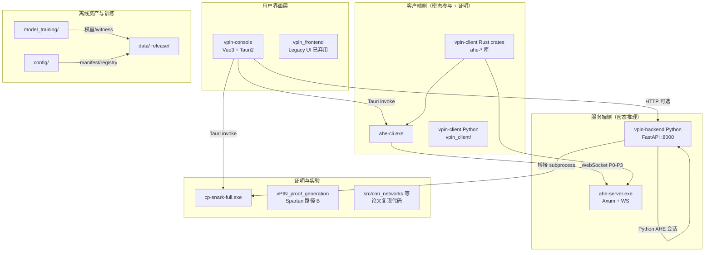
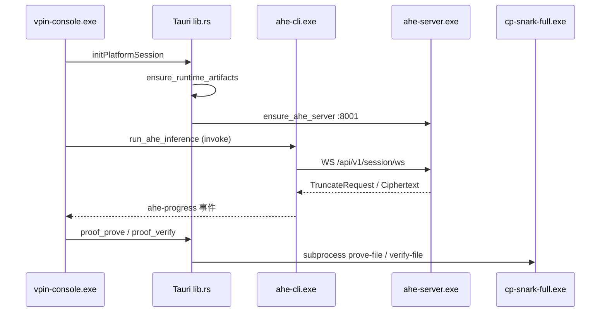
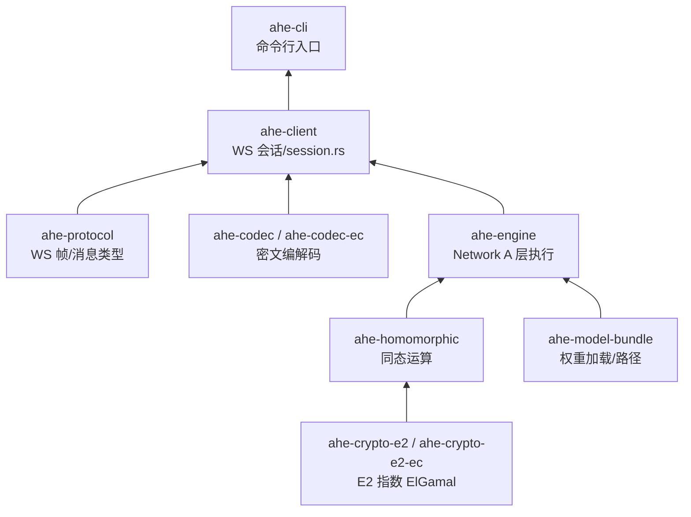
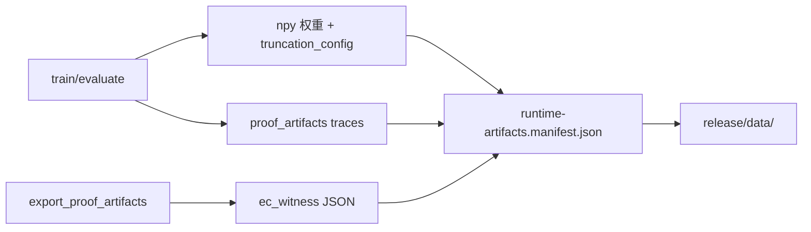

# vPIN 项目代码结构与交互关系

> **文档版本**：2026-07-08  
> **性质**：仓库**实然**代码地图——各目录单元职责、产物、端口协议与调用关系。  
> **关联**：[平台顶层抽象架构](./vpin-平台顶层抽象架构.md)（应然六平面）、[平台数据流图](./vpin-平台数据流图.md)（数据工件）、[通信层冗余与架构问题清单](./vpin-console-通信层冗余与架构问题清单.md)（待治理项）。

---

## 1. 仓库总览



### 1.1 顶层目录职责

| 目录 | 角色 | 主要语言 | 是否发布包核心 |
|------|------|----------|----------------|
| `vpin-console/` | 桌面控制面板（当前主 UI） | TS/Vue + Rust(Tauri) | 是 |
| `vpin-client/` | 独立客户端协议实现 + `ahe-cli` | Rust + Python | 是（cli） |
| `vpin-backend/` | 产品化 HTTP 后端 + `ahe-server` | Python + Rust | 是（server） |
| `src/cp-snark-full/` | CP-SNARK 协议编排（路径 C） | Rust | 是（证明） |
| `src/proof_generation/` | Spartan 点加/点乘证明（路径 B） | Rust | 开发/对照 |
| `src/cnn_networks/` 等 | 论文原始 Server/Client 实验 | Python | 否（只读参考） |
| `model_training/` | Network A 训练、导出权重与 proof witness | Python | 离线产出 |
| `config/` | 运行时 manifest、模型/数据集 registry | JSON | 是 |
| `scripts/` | 构建、启动、校验、环境 | PowerShell | 工具 |
| `docs/` | 架构、API、CP-SNARK 规范 | Markdown | 否（不进 release） |
| `release/` | 便携发布包输出 | 二进制+数据 | 交付物 |
| `data/` | 开发态 BSGS/权重/证明缓存 | 二进制 | 部分 |
| `vendor/` | Rust 依赖 vendoring | — | 构建 |
| `vpin_frontend/` | 旧版前端 | Vue/Tauri | 否（Legacy） |

---

## 2. 运行时拓扑与端口

### 2.1 当前单体发布包（`release/vpin-console_*_win64`）



| 端口 | 进程 | 协议 | 职责 |
|------|------|------|------|
| **—** | `vpin-console.exe` | Tauri IPC | UI、编排、spawn 子进程 |
| **8001** | `ahe-server.exe` (Ark) | HTTP health + **WebSocket** | Network A 同态推理服务端 |
| **8002** | `ahe-server.exe` (EC) | 同上 | EC 曲线后端（可选 `-Both`） |
| **8000** | Python `vpin-backend` | REST | 开发环境：模型目录、证明 HTTP、会话（**发布包不含**） |
| **8003** | ovds-server（规划中） | REST 占位 | 托管健康检查（尚未实现） |
| **1420** | Vite dev | HTTP | 浏览器 Mock 开发 |

### 2.2 三包分拆目标（计划中）

| 包 | 含 | 不含 |
|----|-----|------|
| **vpin-server** | `ahe-server.exe`、权重 | BSGS、UI、cli |
| **vpin-client** | `vpin-console.exe`、`ahe-cli.exe`、BSGS、MNIST、证明 | `ahe-server` |
| **ovds-server** | 占位 HTTP :8003 | 真实 OVDS |

---

## 3. 子系统单元详解

### 3.1 vpin-console（桌面控制面板）

**入口**：`vpin-console/src/main.ts` → Vue Router → 各 View  
**宿主**：`vpin-console/src-tauri/`（Tauri 2，`lib.rs` ~1950 行）

#### 前端分层

```
vpin-console/src/
├── views/              # 页面：Home、RunNew、Verification、LinkMonitor、Settings…
├── components/         # UI 组件
├── composables/        # usePlatformConnect — 启动会话
├── communication/      # ★ 通信层（新）：端点、HTTP、AHE/backend 通道、连接编排
│   ├── runtimeConfig.ts    # loadCommunicationProfile / Tauri invoke
│   ├── endpoints.ts        # URL 解析（host/port/WS）
│   ├── httpClient.ts       # 统一 fetch 超时
│   ├── aheChannel.ts       # AHE 探活、ensure server
│   ├── backendChannel.ts   # Python backend HTTP
│   └── connectionSession.ts # bootstrapCommunication
├── bridge/             # 业务编排层
│   ├── client.ts           # getBridge() → MockBridge（唯一实现）
│   ├── mock/MockBridge.ts  # Run 状态机、custody、推理、证明调度 (~548行)
│   ├── aheDriver.ts        # AHE 进度 → eventBus
│   ├── proofDriver.ts      # P4–P6 UI 状态机
│   └── eventBus.ts         # 推理/证明事件总线
├── services/           # 域 API（部分 deprecated facade）
│   ├── aheClient.ts        # Tauri invoke：预处理/推理/进度
│   ├── backendApi.ts       # @deprecated → communication
│   ├── proofApi.ts         # 证明 HTTP + Tauri fallback
│   ├── proofClient.ts      # 证明文件保存
│   ├── modelCatalogApi.ts  # 模型目录 enriched
│   └── securityApi.ts      # 链路监视 REST
├── config/             # 静态配置与路由策略
│   ├── networkAEngine.ts   # rust-ark :8001 / rust-ec :8002
│   ├── networkAProof.ts    # 证明计划元数据
│   └── inferenceRouting.ts # 推理路径选择
├── custody/            # 本地托管 Shim（TEMP-LOCAL-CUSTODY）
└── demo/               # LLM/TLS 演示（临时标记）
```

#### Tauri 命令（`lib.rs` invoke_handler）

| 命令 | 功能 | 调用方 |
|------|------|--------|
| `get_communication_profile` | 读 env + client-endpoints.json | `communication/runtimeConfig` |
| `ensure_runtime_artifacts` | BSGS CDN 拉取/校验 | 启动流程 |
| `ensure_ahe_server` | 本地拉起 ahe-server | `aheChannel` |
| `ping_ahe_server_health` | TCP 探活 :8001/8002 | `aheChannel` |
| `ahe_preprocess_rust` / `*_batch_rust` | MNIST 预处理 JSON | UI 预览 |
| `run_ahe_inference` / `run_ahe_batch_inference` | spawn `ahe-cli` | `aheClient` → `aheDriver` |
| `read_proof_plan` / `proof_prove` / `proof_verify` | spawn `cp-snark-full` | `proofApi` |
| `read_datasets_catalog` / `read_models_registry` | 读 bundled JSON | 目录页 |
| `write_text_file` | 保存证明 artifact | `proofClient` |

**交互关系**：UI → Bridge(MockBridge) → Services(aheClient/proofApi) → Tauri(lib.rs) → 子进程(ahe-cli / cp-snark-full / ahe-server)

---

### 3.2 vpin-client（Rust 客户端栈）

**Workspace**：`vpin-client/Cargo.toml`

#### Crate 依赖链（自底向上）



| Crate | 职责 |
|-------|------|
| `ahe-protocol` | SessionStart、ModelSelect、CiphertextPayload、TruncateRequest 等 WS JSON 协议 |
| `ahe-crypto-e2` | Arkworks 曲线密钥、加解密 |
| `ahe-crypto-e2-ec` | EC 曲线变体 |
| `ahe-codec` | 密文分块 base64、BSGS 表加载 |
| `ahe-homomorphic` | 点加/点乘、截断 ReLU 客户端侧 |
| `ahe-engine` | 卷积/池化/FC 同态前向（服务端引擎也复用） |
| `ahe-model-bundle` | `VPIN_WEIGHTS_DIR`、npy 权重、truncation_config |
| `ahe-client` | **`session.rs`**：connect_async → 完整 P0–P3 会话；`config.rs`：AHE_SERVER_HOST/PORT |
| `apps/ahe-cli` | infer / eval-mnist-ahe / preprocess / ahe-infer（Python 桥） |

#### Python 包 `vpin_client/`

| 模块 | 职责 |
|------|------|
| `protocol/` | P0–P6 协议类型与序列化 |
| `crypto/ahe/` | Python 侧 AHE（开发/对照） |
| `pipeline/` | 推理流水线编排 |
| `verify/` | M1 标量验证等 |
| `bootstrap/` | StartupOptimizer mock |
| `hdc/` | HDC 数据适配（扩展） |

**与 Rust 边界**：发布路径以 **ahe-cli + ahe-client** 为主；Python 包用于 pytest、历史桥接、`ahe-infer --backend` Python WS。

---

### 3.3 vpin-backend（服务端栈）

#### Rust：`apps/ahe-server`

| 文件 | 职责 |
|------|------|
| `main.rs` | Axum：`GET /api/v1/health`、`GET /api/v1/session/ws` |
| `ws.rs` | WebSocket 会话状态机：ModelSelect → 加载权重 → engine 层推进 → TruncateRequest |

**依赖**：通过 `vpin-backend/Cargo.toml` 引用 `vpin-client/crates/*`（同构密码库，进程间仅 WS 耦合）。

#### Python：`vpin_backend/`

| 模块 | 职责 |
|------|------|
| `api/routes/health.py` | 健康检查 |
| `api/routes/models.py` | 模型 registry CRUD |
| `api/routes/datasets.py` | 数据集 catalog |
| `api/routes/session.py` | Python AHE WebSocket 会话（:8000） |
| `api/routes/proof.py` | 计算量证明 HTTP API |
| `api/routes/crypto.py` | AHE 自检、CP-SNARK 状态 |
| `api/routes/security.py` | 传输层元数据 |
| `crypto/cp_snark/` | subprocess 调 `cp-snark-full` |
| `crypto/ahe/` | Python 同态实现 |
| `inference/` | 推理调度 |
| `storage/` | 上传与模型文件 |

**开发启动**：`scripts/start-ahe-full.ps1` → Python :8000 + 可选 Rust :8001  
**发布路径**：便携包跳过 Python，仅 Rust 栈。

---

### 3.4 CP-SNARK 证明（路径 C）

**位置**：`src/cp-snark-full/`

| 模块 | 职责 |
|------|------|
| `protocol/` | 协议工件、artifacts、coverage |
| `trace/` | 从 conv/fc/pool trace JSON 构建证明输入 |
| `witness/` | EC witness 调度 |
| `prove/` / `verify/` | 证明/验证流水线 |
| `layer_proof/` | 按层 π（FC/Conv/Pool） |
| `commit/` | Merkle/CPS 承诺 |
| `main.rs` | CLI：`prove-file`、`verify-file` 等 |

**输入资产**（来自 `model_training`）：
- `proof_artifacts/ec_witness/`
- `conv_trace.json`、`fc_trace.json`、`pool_trace.json`
- `config/proof-registry.json` 绑定 model_id → run_dir

**调用链**：
- 发布：`vpin-console` Tauri `proof_prove` → `cp-snark-full.exe`
- 开发：`vpin-backend` `crypto.cp_snark.bridge` → 同二进制

---

### 3.5 model_training（离线训练与导出）

```
model_training/
├── network_a/           # ★ 当前主路径：MNIST CNN Network A
│   ├── train.py
│   ├── evaluate.py
│   ├── export_proof_artifacts.py
│   ├── export_rlcr_ec_witness.py
│   └── truncation_config.py
├── network_b/ network_lenet/ network_resnet/  # 其他拓扑
├── outputs/20260622_184254/   # 基准 run：metrics + proof_artifacts
├── data/MNIST/raw/            # 原始 MNIST
└── run.py                     # 统一训练入口
```

**产出物流向**：



---

### 3.6 config/（平台配置中心）

| 文件 | 用途 |
|------|------|
| `runtime-artifacts.manifest.json` | 发布包应捆绑的大文件清单 |
| `release-baseline.manifest.json` | 发布冒烟必需文件 |
| `models-registry.json` | UI 模型 catalog |
| `datasets-catalog.json` | 数据集 catalog |
| `proof-registry.json` | model_id → 证明 run 目录 |
| `client-endpoints.example.json` | 远程 server/client 端点模板 |

---

### 3.7 scripts/（工程脚本）

| 脚本 | 功能 |
|------|------|
| `setup.ps1` / `check-env.ps1` | 环境检查 |
| `build-rust-ahe.ps1` | 编译 ahe-server + ahe-cli |
| `build-release.ps1` | 单体便携包构建 |
| `check-release.ps1` | 发布包清单与健康冒烟 |
| `start-ahe-full.ps1` | 开发：Python backend + Rust server |
| `start-rust-ahe.ps1` | 仅 Rust ahe-server |
| `pull-runtime-artifacts.ps1` | CDN 拉 BSGS 等 |
| `run_ahe_triple_test.ps1` | 三联测试 |

---

### 3.8 论文遗留实验代码（`src/` 非产品路径）

| 路径 | 说明 |
|------|------|
| `src/cnn_networks/` | 图 2 五网络 Server/Client |
| `src/convolution/` | 图 3 卷积实验 |
| `src/LeNet/` | 表 2 LeNet |
| `src/Pre_computed_table/` | BSGS pickle 生成 |
| `src/proof_generation/vPIN_proof_generation/` | Spartan 路径 B |
| `src/accuracy/` | 准确率评估脚本 |

**原则**（见 vpin-backend README）：产品化代码**不修改**上述实验目录，通过桥接复用。

---

## 4. 核心交互流程

### 4.1 Network A 单图推理（发布包主路径）

```
用户点击推理
  → MockBridge.runRustInference()
  → aheDriver.runNetworkAInfer()
  → aheClient.runRustAheInfer()
  → Tauri run_ahe_inference
  → spawn ahe-cli infer --crypto-backend ark
  → ahe-client/session.rs WebSocket 会话
  → ahe-server/ws.rs 同态层推进 + TruncateRequest
  → 客户端 BSGS 截断 ReLU
  → InferenceComplete → NDJSON 进度回 UI
  → proofDriver.scheduleComputationProof()
  → proofApi → Tauri proof_prove → cp-snark-full
```

### 4.2 启动与连接

```
App 启动
  → initPlatformSession()
  → loadCommunicationProfile()     # Tauri: env + client-endpoints.json
  → bootstrapCommunication()
      → ensureRuntimeArtifacts()   # BSGS 就绪
      → ensureLocalAheServer()     # 或 VPIN_SKIP_LOCAL_AHE 远程探活
      → bridgeBootstrapDetect()    # StartupOptimizer mock
      → pingBackend()              # :8000 可选
      → pingAheServerForEngine()   # :8001
  → SessionContextBar 显示链路状态
```

### 4.3 开发环境 vs 发布包

| 能力 | 开发（`start-ahe-full.ps1`） | 发布（`start-vpin-console.ps1`） |
|------|------------------------------|----------------------------------|
| Python :8000 | 有 | 无（UI 显示「便携内置」） |
| ahe-server :8001 | 有 | 有（脚本预启或 Tauri 拉起） |
| 证明 | HTTP `/proof/*` 或 Tauri | 仅 Tauri → cp-snark-full |
| 浏览器 Mock | Vite :1420 timing-demo | 不适用 |

---

## 5. 数据工件与路径约定

| 工件 | 典型路径 | 消费方 |
|------|----------|--------|
| BSGS 表 | `data/bsgs/table.bin` (~208MB) | ahe-cli 客户端截断 |
| Network A 权重 | `data/weights/cnn-mnist-trained/*.npy` | ahe-server |
| MNIST raw | `model_training/data/MNIST/raw/` | 预处理 |
| 证明 trace | `data/proof/.../proof_artifacts/` | cp-snark-full |
| 模型 registry | `config/models-registry.json` | UI catalog |
| 证明 registry | `config/proof-registry.json` | Tauri read_proof_plan |

**环境变量（跨进程）**：

| 变量 | 作用 |
|------|------|
| `VPIN_REPO_ROOT` | 发布包根目录（exe 旁） |
| `VPIN_BSGS_TABLE` | BSGS 路径 |
| `VPIN_WEIGHTS_DIR` | 权重目录 |
| `AHE_SERVER_HOST` / `AHE_SERVER_PORT` | 推理服地址 |
| `VPIN_SKIP_LOCAL_AHE` | 分包 client：不本地起 server |
| `VITE_*` | 前端编译期 API base（dev） |

---

## 6. 技术边界矩阵

| 层次 | 技术 | 边界说明 |
|------|------|----------|
| UI | Vue 3 + Naive UI | 仅 vpin-console；不直接访问 WS |
| 桌面壳 | Tauri 2 | invoke + 子进程 + 事件 `ahe-progress` |
| 客户端协议 | Rust ahe-client | WS JSON；与 server 版本对齐 |
| 服务端推理 | Rust ahe-server | 无 UI；仅 health + WS |
| 产品 API | Python FastAPI | 开发/全栈；发布包可缺 |
| 证明 | Rust cp-snark-full | 重计算；CLI 子进程 |
| 训练 | PyTorch | 离线；产出 npy + witness |

---

## 7. 架构张力与演进方向

当前仓库同时承载 **论文复现**、**产品化三端**、**发布工程** 三条线，形成以下结构张力：

| 张力 | 表现 | 演进 |
|------|------|------|
| 双 UI | vpin-console vs vpin_frontend | 仅维护 console |
| 双 backend | Python :8000 vs Rust :8001 | 发布包 Rust-only；Python 开发可选 |
| 双证明入口 | HTTP proof vs Tauri proof | 统一 Tauri + cp-snark-full |
| Bridge 命名 | MockBridge 为唯一真实 Bridge | 重命名为 ConsoleBridge |
| lib.rs 单体 | ~1950 行 Tauri | 拆模块（见问题清单） |
| 通信 facade | endpoints/backendApi/aheClient 三层 | 收敛到 `communication/` |
| 单体 vs 三包 | 530MB 一体包 | server/client/ovds 分拆（计划中的） |

---

## 8. 快速定位表

| 我想… | 看这里 |
|-------|--------|
| 改 UI 推理流程 | `vpin-console/src/bridge/mock/MockBridge.ts` |
| 改 WS 协议 | `vpin-client/crates/ahe-protocol/` + `ahe-server/ws.rs` |
| 改同态算子 | `vpin-client/crates/ahe-homomorphic/`、`ahe-engine/` |
| 改服务端层推进 | `vpin-backend/apps/ahe-server/src/ws.rs` |
| 改证明算法 | `src/cp-snark-full/src/` |
| 改训练/导出 witness | `model_training/network_a/` |
| 改发布包内容 | `config/runtime-artifacts.manifest.json` + `scripts/build-release.ps1` |
| 改远程 server 地址 | `config/client-endpoints.json` + `AHE_SERVER_HOST` |
| 改 Python API | `vpin-backend/vpin_backend/api/routes/` |
| 查应然架构 | `docs/architecture/vpin-平台顶层抽象架构.md` |
| 查已知技术债 | `docs/architecture/vpin-console-通信层冗余与架构问题清单.md` |

---

## 9. 文档索引

| 文档 | 内容 |
|------|------|
| [vpin-平台顶层抽象架构.md](./vpin-平台顶层抽象架构.md) | 六平面、三角色、OVDS |
| [vpin-平台架构-独立客户端与服务端（协议合规）.md](./vpin-平台架构-独立客户端与服务端（协议合规）.md) | P0–P6 协议 |
| [vpin-console-通信层冗余与架构问题清单.md](./vpin-console-通信层冗余与架构问题清单.md) | 重构 backlog |
| [../api/vpin-client-bridge.md](../api/vpin-client-bridge.md) | Client Bridge API |
| [../model-training/模型训练与测试指南.md](../model-training/模型训练与测试指南.md) | 训练流程 |

---

*本文随仓库结构变更更新；三包分拆落地后应增 §2.2 实测拓扑与 §3 分包目录对照。*
