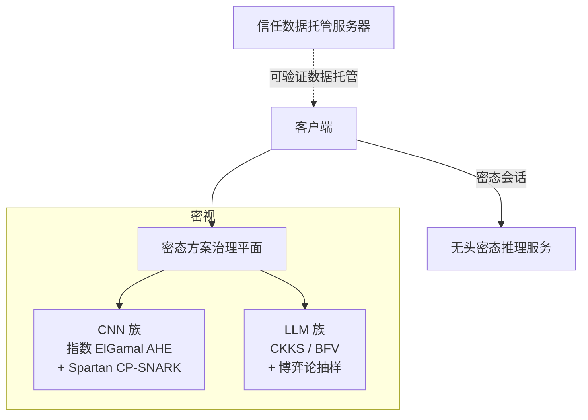

# 密视 · 作品概述

> **文档性质**：竞赛 / 开题 / 对外材料用的作品级概述定稿，固化产品简称、主标题与约 200 字摘要。技术应然结构以 [平台顶层抽象架构](./vpin-平台顶层抽象架构.md) 为准；本文不替代六平面与协议细节。  
> **关联文档**：[平台顶层抽象架构](./vpin-平台顶层抽象架构.md)、[平台数据流图](./vpin-平台数据流图.md)、[平台隐私保护](./vpin-平台隐私保护.md)、[独立客户端与服务端协议合规](./vpin-平台架构-独立客户端与服务端（协议合规）.md)、[指数 ElGamal 同态加密指南](../cryptography/指数ElGamal同态加密-数学推导与实现指南.md)。  
> **命名依据**：2026-07-02 产品命名对话定稿（路线：CNN 落地 → 大模型扩展）。  
> **简写约束**：对外材料中出现的缩写，须为公开文献 / 标准可检索全称；**禁止**把论文内部曲线编号、仓库私有代号当作「算法体制名」。

---

## 1. 命名

| 项 | 定稿 |
|----|------|
| **中文简称** | **密视**（Mìshì） |
| **字义** | **密** — 密态方案治理、同态加密、密文推理；**视** — CNN 视觉模态起点（承接 CipherVision 的 Vision） |
| **英文副标（可选）** | CipherVision（仅作英文副标，不作主名） |
| **仓库 / 工程目录** | 可继续使用 `vPIN` / `vpin-*` 等既有标识；对外产品名统一为 **密视** |

**叙事主线：** 先做视觉 CNN 的可验证密态推理，再沿同一密态方案治理平面扩展至大语言模型可验证计算。

---

## 2. 标题体系

### 2.1 主标题（竞赛 / 开题）

> **密视：面向视觉 CNN 扩展大语言模型的密态方案治理与同态可验证推理系统**

### 2.2 全称（展开版）

> **密视：密态方案治理下的视觉 CNN 与大模型同态可验证推理系统**

### 2.3 二十字内摘要版

> **密视：CNN 视觉密态推理扩展大模型可验证计算**

### 2.4 一句话定位

> 以 CNN 视觉密态推理为基座，经密态治理平面扩展至大语言模型可验证计算。

---

## 3. 作品摘要（约 200 字）

**密视**是一套面向视觉卷积神经网络（Convolutional Neural Network，**CNN**）、并扩展至大语言模型（Large Language Model，**LLM**）的可验证隐私推理系统。系统以**密态方案治理平面**为核心，按模型规模与模态自动选型密态体制：CNN 采用椭圆曲线上的**指数 ElGamal（Exponential ElGamal）加法同态加密**（Additive Homomorphic Encryption，**AHE**），并配合 CP-Spartan 上的**承诺—证明简洁非交互知识论证**严格证明路径；大模型采用 **CKKS**（Cheon–Kim–Kim–Song）/ **BFV**（Brakerski / Fan–Vercauteren）混合同态加密、计算图线性化及博弈论抽样审计。平台以客户端、托管服务器与无头推理服务三角色协同，整合可验证数据托管、双端身份认证与双验证器完整性核验，在密文专属契约下完成端到端密态推理与算力验证，兼顾隐私保护与结果可信。

（首次出现已展开全称；复述栏位可删去括号内英文以压字数。）

---

## 4. 同态加密密码算法体制

### 4.0 关于「E₂」——不可作为对外算法名

| 问法 | 结论 |
|------|------|
| **「E₂ 指数 ElGamal」是公开可检索的密码体制名吗？** | **否。** |
| **公开可检索的体制名是什么？** | **Exponential ElGamal**（指数 ElGamal）/ **Additive ElGamal**（加法同态 ElGamal）。 |
| **仓库里的 E₂ / `E2` / `curveE2Info` 是什么？** | **vPIN 论文双曲线设定中的曲线编号**：同态推理跑在论文记作 **$E_2$** 的 Weierstrass 曲线上；零知识/SNARK 侧另用 **$E_1$**（如 Ristretto / Curve25519 族）。**$E_2$ 不是算法名，是曲线标签。** |
| **对外怎么写？** | 写 **「指数 ElGamal 加法同态加密（Exponential ElGamal，AHE）」**；若需交代实现细节，另注「部署于 vPIN 论文所给的 $E_2$ 曲线参数」，**勿**写成「E₂ 加密算法」。 |

公开检索入口（示例）：Crypto StackExchange「exponential ElGamal」、教材与电子投票文献中的 Additive / Exponential ElGamal；仓库数学对照见 [指数 ElGamal 同态加密指南](../cryptography/指数ElGamal同态加密-数学推导与实现指南.md)。

### 4.1 对外可用的体制总表（仅公开可检索名称）

| 模态族 | 密码算法体制（对外写法） | 同态性质 | 非线性处理 | 状态 |
|--------|--------------------------|----------|------------|------|
| **CNN 视觉** | **指数 ElGamal**（Exponential ElGamal） | **加法同态（AHE）** | 客户端（或推理交互方）卸载 ReLU / 定点截断；线性层密态执行 | **内置 · 已落地** |
| **大语言模型** | **CKKS** 与/或 **BFV**（混合同态加密） | CKKS：近似算术；BFV：整数算术（同属主流 FHE 体制） | 计算图线性化、激活近似后密态执行线性子图 | **内置 · 扩展路径** |
| **LLM / 多模态** | **MPC**（Secure Multi-Party Computation）；参考方案 **PUMA**（arXiv:2307.12533） | 秘密分享，**不是**同态加密 | 协议内安全 GELU / Softmax / LayerNorm 近似 | **待扩展**（不写入主标题） |

工程内部代号（如 `E2ElGamalBackend`、`CKKSHybridBackend`）**仅用于代码/架构文档**，**不得**当作对外「密码算法名」。

### 4.2 CNN 路径 · 指数 ElGamal（AHE）

| 项 | 说明 |
|----|------|
| **对外体制全称** | 指数 ElGamal（**Exponential ElGamal**）；亦称加法同态 ElGamal（**Additive ElGamal**） |
| **公开可检索关键词** | `Exponential ElGamal`、`additive ElGamal`、`ElGamal homomorphic encryption` |
| **数学要点** | 将明文 $m$ 编码为群元素 $g^m$（或曲线上的 $[m]G$）后再做 ElGamal；密文相乘（或点加）对应明文**相加**；解密需在小明文空间上求离散对数（实现常用 Baby-step Giant-step） |
| **能力边界** | **仅加法同态（AHE）**：密态域完成卷积 / 全连接等线性组合；**不**在密态域直接求 ReLU 等非线性 |
| **协作方式** | 线性算子在无头推理服务密态执行 → 非线性在客户端（或指定推理交互方）明文完成 → 重加密回注 |
| **实现曲线说明（可选附录句）** | 本仓库按 vPIN 论文选取专用椭圆曲线参数承载上述 AHE；论文将该曲线记为 $E_2$，以便与 SNARK 侧曲线 $E_1$ 做基域对齐——**此为参数/曲线标签，不是第四种加密算法** |
| **族内覆盖** | SimpleCNN、LeNet、ResNet 等共用该体制 |
| **配套证明** | **Spartan**（公开可检索的透明 zkSNARK）上的 **CP-SNARK**（Commit-and-Prove SNARK）路径 |

### 4.3 LLM 路径 · CKKS / BFV

| 项 | 说明 |
|----|------|
| **对外体制全称** | **CKKS**（Cheon–Kim–Kim–Song，2017）· **BFV**（Brakerski / Fan–Vercauteren） |
| **公开可检索关键词** | `CKKS homomorphic encryption`、`BFV homomorphic encryption`、`Microsoft SEAL CKKS BFV` |
| **选型方式** | 密态方案治理平面在模型约束、设备能力与用户隐私偏好交集内择一或组合 |
| **能力边界** | 支持更丰富的密态线性代数；非线性仍经计算图线性化与激活近似，而非全电路零知识证明 |
| **配套验证** | 博弈论随机抽样审计（非全电路 CP-SNARK） |

### 4.4 对外一句口径（可直接贴材料）

> CNN 基座采用 **指数 ElGamal 加法同态加密（Exponential ElGamal，AHE）**；大模型扩展采用 **CKKS / BFV 混合同态加密**；二者均由密态方案治理平面按模态族自动选型。

---

## 5. 缩写公开可检索清单（本文允许使用的简写）

凡出现在作品封面、摘要、答辩 PPT 的缩写，须能在公开文献或标准资料中检索到全称。下表为**允许清单**；未列入者默认写全称或归入「工程内部代号」。

| 缩写 | 全称（首次须展开） | 公开可检索？ | 备注 |
|------|--------------------|--------------|------|
| **CNN** | Convolutional Neural Network | 是 | 标准术语 |
| **LLM** | Large Language Model | 是 | 标准术语 |
| **HE** | Homomorphic Encryption | 是 | 同态加密总称 |
| **AHE** | Additive Homomorphic Encryption | 是 | 加法同态加密；检索时建议连写 Exponential ElGamal |
| **FHE** | Fully Homomorphic Encryption | 是 | 全同态；CKKS/BFV 属此族常用实现 |
| **ElGamal** | ElGamal encryption | 是 | 标准公钥体制 |
| **Exponential ElGamal** | 指数 ElGamal / Additive ElGamal | 是 | **CNN 路径正式体制名** |
| **CKKS** | Cheon–Kim–Kim–Song | 是 | 近似同态，2017 |
| **BFV** | Brakerski / Fan–Vercauteren | 是 | 整数同态 |
| **MPC** | Secure Multi-Party Computation | 是 | 安全多方计算 |
| **PUMA** | 论文方案名（arXiv:2307.12533） | 是（按论文/arXiv） | 待扩展路径；须带文献号 |
| **SNARK** | Succinct Non-interactive Argument of Knowledge | 是 | 简洁非交互知识论证 |
| **zkSNARK** | Zero-Knowledge SNARK | 是 | 零知识 SNARK |
| **CP-SNARK** | Commit-and-Prove SNARK | 是 | 承诺—证明型 SNARK |
| **Spartan** | Microsoft Research Spartan zkSNARK | 是 | ePrint 2019/550；GitHub microsoft/Spartan |
| **TLS** | Transport Layer Security | 是 | 传输层安全 |
| **ReLU** | Rectified Linear Unit | 是 | 激活函数 |
| **JWT / OIDC** | JSON Web Token / OpenID Connect | 是 | 身份认证（若材料提及） |

**禁止当作「算法体制名」对外单独使用的内部记号：**

| 记号 | 真实含义 | 对外替代 |
|------|----------|----------|
| **E₂ / E2 / $E_2$** | vPIN 论文中的 **AHE 曲线标签** | 写「指数 ElGamal」；必要时脚注「曲线参数见 vPIN 论文 $E_2$」 |
| **E₁ / $E_1$** | 论文中的 **SNARK 侧曲线标签** | 写具体曲线族（如 Ristretto / Curve25519），或省略 |
| `E2ElGamalBackend` 等 | 仓库插件 / 类型名 | 不出现在作品简介 |
| `strict_proof` / `game_sampling` | 架构内部验证路径枚举 | 对外写「CP-SNARK 严格证明」「博弈论抽样审计」 |
| **OVDS / VADS / VDS** | 平台可验证数据流工程栈缩写 | 作品概述可写「可验证数据托管」；深挖文档再展开 |

---

## 6. 与架构的对应关系

| 作品表述 | 架构落点 |
|----------|----------|
| **视**（CNN 起点） | SimpleCNN / LeNet / ResNet；**指数 ElGamal（AHE）** + Spartan **CP-SNARK** |
| **密**（治理选型） | 密态方案治理平面：按模态族选型 HE / MPC 体制 |
| **大模型扩展** | **CKKS / BFV** + 计算图线性化 + 博弈论抽样审计 |
| **三角色** | 客户端 · 信任数据托管服务器 · 无头密态推理服务 |
| **可验证数据托管** | 可验证流式数据协议栈（工程上称 VDS / VADS / OVDS，详见架构专篇） |
| **双验证器** | 数据隐私完整 + 模型推理及算力承诺完整 |
| **密文专属契约** | 无头推理服务数据面不承载用户明文 I/O |

---

## 7. 模态与验证路径（作品口径）

| 模态族 | 同态 / 隐私计算体制（对外） | 完整性验证（对外） | 作品中的说法 |
|--------|-----------------------------|--------------------|--------------|
| **CNN 视觉** | 指数 ElGamal（AHE） | Spartan CP-SNARK | 已落地基座 / MVP |
| **大语言模型** | CKKS / BFV + 计算图线性化 | 博弈论随机抽样审计 | 同一平台扩展路径 |
| **MPC（待扩展）** | PUMA（arXiv:2307.12533）秘密分享 | 多方协议 transcript 审计 | 不写入当前作品主标题 |

**口径约束：**

- 体制名只使用 §5 允许清单；**禁止**对外主写「E₂ 加密 / E₂ ElGamal 算法」。
- 区分：**CNN = 指数 ElGamal（AHE）**；**LLM = CKKS / BFV**；勿笼统只写「同态加密」。
- 不宜将整平台概括为「同态加密 + 零知识可验证计算」——该表述仅贴近 CNN 的 CP-SNARK 路径。
- LLM 侧写「同态可验证推理 / 抽样审计」，勿写成全电路零知识证明。

---

## 8. 命名演进备忘（非对外正文）

| 曾议名称 | 未采用原因（摘要） |
|----------|--------------------|
| vPIN（对外主名） | 需中文产品简称；工程目录可保留 |
| CipherVision（唯一主名） | 偏视觉，不利于讲 LLM 扩展 |
| 密验 / 密治 / 密智 / 密信 | 偏功能缩写，产品感不足 |
| 照隐 / 隐证 / 密言 | 与「CNN→LLM」叙事契合度不如密视 |
| 卷言 / 密阶 / 密图 / 密谱 | 备选；定稿优先「密视」 |

---

## 9. 使用建议

| 场景 | 使用条目 |
|------|----------|
| 封面 / 作品名 | §2.1 主标题 |
| 简介栏 / 摘要 | §3 作品摘要 |
| 答辩开场一句 | §2.4 一句话定位 |
| PPT 短标题 | §2.3 二十字内版本 |
| **同态体制口径** | **§4.4**（指数 ElGamal / CKKS·BFV） |
| **缩写核对** | **§5** |
| 技术深挖 | [顶层抽象架构](./vpin-平台顶层抽象架构.md) §4；[指数 ElGamal 指南](../cryptography/指数ElGamal同态加密-数学推导与实现指南.md) |

UI / 控制台品牌文案与 `PLATFORM_NAME` 应与本文 **「密视」** 保持一致。
