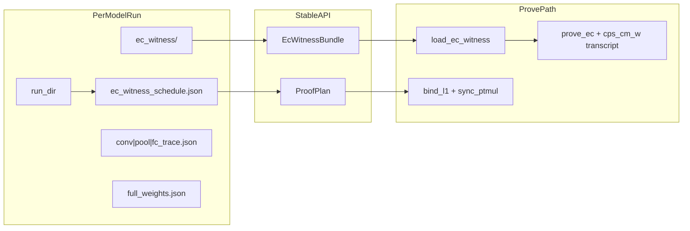

# Network A 各层计算量证明 — 编码计划（B′ + paper_proof）

> **严格算法（唯一正文）：** [`Network-A-CP-SNARK-严格算法规范.md`](Network-A-CP-SNARK-严格算法规范.md)  
> **已合并至唯一计划：** [`.cursor/plans/network_a_cp-snark_442840ea.plan.md`](../../.cursor/plans/network_a_cp-snark_442840ea.plan.md)

> **项目内副本**：2026-06-26 同步  
> **标准 run**：`model_training/outputs/20260622_184254/proof_artifacts/`

---

## 执行状态（2026-06-26）

### Phase 0–5 主路径（已完成）

| ID | 内容 | 状态 |
|----|------|------|
| p0-witness-bundle-api | `EcWitnessBundle` / `ProofPlan`；`load_data` 参数化，legacy 需 `VPIN_ALLOW_LEGACY_WITNESS=1` | ✅ |
| p0-mirror-exports | `export_proof_artifacts.py` → `ec_witness/` + schedule；20260622 为默认 EC 输入 | ✅ |
| p0-curve-ci | `curve.rs`：`n2 == q1` 单测 | ✅ |
| p1-gamma-pr-trace | `sync_ptmul_weights_for_challenge` + L1 全量（无 conv fallback） | ✅ |
| p1-bias-binding | FC bias ↔ `fc_trace` 定点 mod 2³² 绑定 | ✅ |
| p2-m1-verifier | `verifier_pipeline` M1 标量验；`rlc_binding_hex` 空则跳过 | ✅ |
| p2-r4-e2e | `ProveRequest.run_dir` + registry（`test_r4_e2e` 仍依赖 server-crypto） | ✅ |
| p3-cps-comm-ver | `cps_comm_w_star` / `cps_ver_w_star`；verify 不用 aux 非确定性比对 | ✅ |
| p4-m5-layer-pi | 层 π **stub** + `ProtocolArtifacts` v3 + `layer_proofs_plus_cps` | ✅（stub 边界见下） |
| p5-m4-product | `vpin_backend/proof/registry.py` + prove API `run_dir` | ✅ |
| **z8-transcript** | `circuit_prove.rs`：`seed_layer_transcript` + EC prove/verify 传 `cps_cm_w` | ✅ **本次** |

### 验收命令

```powershell
cd src/cp-snark-full
cargo test --lib          # 38 passed, 2 ignored
cargo run --release -- full A   # prove + verify（约 75s）；需关闭占用 protocol.json 的进程
```

**2026-06-26 实测**：`full A` 两次 `verifier_pipeline` 均 **PASSED**；`save_artifacts` 因 Windows 错误 1224（文件被用户映射区占用，多为 IDE/杀毒锁定 `artifacts/A/protocol.json`）panic。**请关闭占用后重跑 `full A` 或单独 `prove`/`verify`。**

旧版 `artifacts/A/protocol.json`（Z.8 前生成）在 verify 时会因 transcript 不含 `cm_W` 而失败，需重新 prove。

### 仍阻塞 / 后续项

| 项 | 说明 |
|----|------|
| 同态 EC witness | `export_proof_artifacts --from-legacy` 仍从 `rust_files/A` 复制 px/py；待 `homomorphic_network_a` 真实轨迹 |
| FC eq10 全量 M1 | 20260622 trace 在 E1 下 FC 不自洽 → prove/verify **fallback 仅 conv+pool** |
| 层 π 真 R1CS | `circuit/layer/*.rs` 仍为 stub；`verify_layer_stack` 只验 stub 标记 |
| M1 trace 密码学绑定 | 标量验无 Merlin transcript；trace 未 digest 进承诺（须叠 EC SNARK + L1 + CPS） |
| `test_r4_e2e.py` | Windows setup 写文件失败；可改用 `cargo run -- full A` 或新建轻量 pytest |

---

## 最终目标（验收标准）

客户端在**仅持有** `cm_W`（CPS 承诺）、`cm_x`、客户端采样的 `γ/γ′`、以及服务端返回的 `π` 与公开 trace 时，能够：

1. **Verify 各层线性运算**：卷积式 (9)、池化式 (7)、FC 式 (10) 在 **γ/γ′** 下成立（M1）。
2. **Verify EC gadget 计算量**：PtMul/PtAdd 次数由**当前模型**的 `ec_witness_schedule.json` 推导（Network A paper_proof 为 178/2144），EC gadget **只读该 run 导出的 witness JSON**。
3. **Verify 模型绑定**：PtMul 槽位数 = schedule 合计；乘数与该 run 的 W* 代数一致（见 [`模型参数绑定计算轨迹-数学推导.md`](模型参数绑定计算轨迹-数学推导.md)）。
4. **防模型替换**：`CPS.Ver(π, (cm_W, cm_aux), t)` 中 **ϕ 显式含** $(F,\hat{W},\hat{b})$ 与式 (9)(7)(10)；EC SNARK transcript 含 Spartan PC `cm_W`（Z.8）。

---

## 硬性约束：模型导出 witness 驱动 EC

| 禁止 | 允许 |
|------|------|
| `load_data("A")` 默认读 `rust_files/A` | 读 `{run_dir}/proof_artifacts/ec_witness/` |
| 代码写死 178/2144/1219 作为 prove 条件 | 从 `EcWitnessSchedule` 运行时读取 |
| legacy toy `model_exports/A` 作生产默认 | registry / `run_dir` 指向自训产物 |

环境变量：`VPIN_RUN_DIR`、`VPIN_EC_WITNESS_ROOT`、`VPIN_TRACE_ROOT`（由 `ProofPlan.activate_witness()` 设置）。

---

## 目标接口（多模型可扩展）



**Rust**：`src/cp-snark-full/src/witness/`  
**Python**：`vpin_backend/proof/proof_plan.py`、`registry.py`

---

## 曲线嵌入（Phase 0 已断言）

论文要求 $n_2 = q_1$。实现：`curve.rs` + `embed_u128_to_scalar`；单测 `curve_e2_base_field_equals_e1_modulus`。

---

## 分阶段计划摘要

### Phase 0 — Witness 接口 + 数据基线 ✅

- `EcWitnessBundle` / `ProofPlan` 跨语言契约
- `export_proof_artifacts.py` 导出目录结构
- legacy 退出主路径

### Phase 1 — M3：轨迹与 paper_proof 对齐 ✅（FC 全量待 homomorphic）

- `RlcChallengeAdapter` / `sync_ptmul_weights_for_challenge`
- L1 槽位 = `schedule.total_pt_mul`

### Phase 2 — M1 + M2 客户端标量层 ✅

- `verify_all_client` + `verify_conv_eq9_rlc_only` / `verify_fc_eq10_rlc_only`
- `rlc_binding_hex` 默认空（不再作伪绑定）

### Phase 3 — M-B′ CPS ✅ + Z.8 transcript ✅

- `cps_comm_w_star` → `ProtocolArtifacts.cps_commitment`
- Transcript 顺序：`cm_W(Spartan PC)` → Pedersen cm_W/cm_x → γ → sub_circuit
- Verify：`cps_ver_w_star` + EC bundle 带同一 `cm_W`

### Phase 4 — M5 层 π ⚠️ stub

- `layer_proofs` 非 None，`proof_coverage: layer_proofs_plus_cps`
- 真 R1CS eq9/7/10 待迁入

### Phase 5 — 多模型注册 ✅

- `registry.py`：`A` → 20260622 run
- prove API 传 `run_dir`

---

## 验收清单（Definition of Done）

- [x] EC prove **主路径**读 `{run_dir}/proof_artifacts/ec_witness/`（legacy 仅 opt-in）
- [x] `cargo test --lib` 绿（38 passed）
- [x] `cargo run --release -- full A` → Client verification PASSED（需可写 artifacts）
- [x] `proof_coverage: layer_proofs_plus_cps`
- [x] 曲线嵌入：`n2 == q1` CI 绿
- [x] Z.8：EC SNARK transcript 绑定 Spartan PC `cm_W`
- [ ] 篡改 W* 或换 run_dir witness → verify **失败**（需负面测试用例）
- [ ] 同态导出 EC witness（非 legacy 复制）
- [ ] FC eq10 全量 M1（无 fc_layers 清空 fallback）
- [ ] 层 π 真 R1CS（非 stub）
- [ ] trace digest 进 `ProtocolArtifacts` / 关系 R

---

## 关键文件

| 文件 | 职责 |
|------|------|
| `src/cp-snark-full/src/witness/` | EcWitnessBundle, ProofPlan |
| `src/cp-snark-full/src/circuit_prove.rs` | EC SNARK + Z.8 transcript |
| `src/cp-snark-full/src/prove/pipeline.rs` | prover 主路径 |
| `src/cp-snark-full/src/verify/pipeline.rs` | verifier 主路径 |
| `model_training/network_a/export_proof_artifacts.py` | witness 导出 |
| `vpin_backend/proof/registry.py` | 模型注册 |

相关文档：[`论文EC-Witness计数规范-NetworkA.md`](论文EC-Witness计数规范-NetworkA.md)、[`新模型接入-ProofPlan.md`](新模型接入-ProofPlan.md)。
