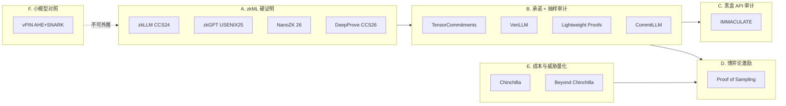

# 大语言模型可验证推理：领域界定与文献调研

> **版本**：2026-06-29  
> **方法**：先界定子领域 → 检索并下载核心论文 → 分域摘录 → 逐步归纳与 vPIN 对照。  
> **本地 PDF**：[`literature/papers/`](./literature/papers/)（12 篇，见 [`literature/README.md`](./literature/README.md)）  
> **关联设计稿**：[博弈论数学设计](./大语言模型博弈论可验证推理-数学设计.md) · [成本模型](./llm-verifiable-inference-cost-model.md) · [方案矩阵](./llm-verification-scheme-matrix.md)

---

## 1. 问题定义

**可验证 LLM 推理**要回答：

> 不可信服务器声称用模型 $M$、策略 $\pi$ 对输入 $x$ 产生输出 $y$ 时，客户端如何以可接受成本相信该声称？

子问题包括：

| 编号 | 问题 | 典型作弊 |
|------|------|----------|
| Q1 | 是否用了声称的模型？ | 70B→7B 替换 |
| Q2 | 是否按声称精度/量化执行？ | FP16 标称、INT4 实跑 |
| Q3 | 输出是否绑定真实 decode 路径？ | 先写答案再伪造 logits |
| Q4 | 计费 token 是否诚实？ | 多报 CoT 内部 token |
| Q5 | 输入隐私下是否仍可信？ | 仅 AHE 不证算力 |

**与 vPIN Network A 的边界**：$N_W\approx 10^3$ 的小 CNN 可 **CP-SNARK 硬 soundness**；LLM 必须在 **成本—安全** 光谱上选点，多数生产方案为 **概率审计 + 经济激励**，而非每 token 全量 zk。

---

## 2. 子领域地图



| 子领域 | 核心问题 | Soundness 类型 | LLM 70B 在线可行？ |
|--------|----------|----------------|-------------------|
| **A. zkML** | 密码学证明 $y=F_M(x)$ | 信息论/计算 soundness | △ 研究/离线 |
| **B. Commit-audit** | Merkle/TC + 局部打开 | 承诺绑定 + 统计/概率 | ✓ 论文 ~1% 开销 |
| **C. API 审计** | 黑盒下检测系统偏差 | 统计 + VC 子集 | ✓ API 场景 |
| **D. 博弈论** | 理性参与者诚实均衡 | 理性安全 | ✓ 需押金/ slash |
| **E. 成本模型** | 作弊收益 $G$、押金 $P$ | 设计输入 | ✓ 必做 |
| **F. vPIN** | 密态小 CNN 硬证明 | 硬 zk + AHE | ✗ 仅小模型 |

---

## 3. 文献总表

### 3.1 已下载 PDF

| ID | 论文 | 会议/预印本 | 本地文件 |
|----|------|-------------|----------|
| P01 | vPIN | ACSAC 2024 / arXiv:2411.07468 | `vPIN-2411.07468.pdf` |
| P02 | zkLLM | CCS 2024 / arXiv:2404.16109 | `zkLLM-2404.16109.pdf` |
| P03 | zkGPT | USENIX Security 2025 | `zkGPT-usenixsecurity25.pdf` |
| P04 | ZKML | EuroSys 2024 | `ZKML-eurosys24.pdf` |
| P05 | NanoZK | VerifAI @ ICLR 2026 / arXiv:2603.18046 | `NanoZK-2603.18046.pdf` |
| P06 | TensorCommitments | arXiv:2602.12630 | `TensorCommitments-2602.12630.pdf` |
| P07 | VeriLLM | arXiv:2509.24257 | `VeriLLM-2509.24257.pdf` |
| P08 | IMMACULATE | arXiv:2602.22700 | `IMMACULATE-2602.22700.pdf` |
| P09 | Lightweight Proofs of Inference | SaTML / arXiv:2603.19025 | `LightweightProofsOfInference-2603.19025.pdf` |
| P10 | Proof of Sampling (spML) | arXiv:2405.00295 | `ProofOfSampling-2405.00295.pdf` |
| P11 | Chinchilla | NeurIPS 2022 | `Chinchilla-2203.15556.pdf` |
| P12 | Beyond Chinchilla-Optimal | arXiv:2401.00448 | `BeyondChinchilla-2401.00448.pdf` |

### 3.2 元数据入库（PDF 未自动下载）

| ID | 论文 | 说明 |
|----|------|------|
| P13 | DeepProve | ePrint 2026/1112 → `DeepProve-2026-1112-metadata.md` |
| P14 | CommitLLM | 工程协议 → `CommitLLM-metadata.md` |

---

## 4. 分领域摘录与分析

### 4.1 子领域 A：zkML 硬证明

#### P02 zkLLM (Sun et al., CCS 2024)

- **问题**：在隐藏权重下证明 LLM 推理正确性（法律/审计场景）。
- **技术**：`tlookup`（张量 lookup，无非对称 overhead）；`zkAttn`（attention 专用，避免巨型 lookup 表）。
- **规模**：**13B**，证明 **<15 min**（CUDA），证明 **<200 KB**，验证 **1–3 s**。
- **局限**：仍属 **离线级** prover；整数/定点电路与 GPU BF16 生产栈不一致。
- **与 vPIN**：同为「专用 gadget」，但 vPIN 走 **EC PtMul**，zkLLM 走 **sumcheck + lookup**；LLM 不能迁入 Network A Spartan 电路。

#### P03 zkGPT (Qu et al., USENIX Security 2025)

- **问题**：证明 GPT-2 类架构推理，防服务商用小模型糊弄。
- **技术**：线性/非线性层高效证明、constraint fusion、circuit squeeze；**GPT-2 证明 <25 s**，证明 **~101 KB**。
- **对比**：相对 Hao et al. USENIX'24 与 ZKML EuroSys'24 约 **279× / 185×** 加速（论文自述）。
- **结论**：小 Transformer **可行**；70B 仍不现实。

#### P04 ZKML (Chen et al., EuroSys 2024)

- **定位**：ML→ZK-SNARK **优化编译器**；支持 LLM、推荐系统等。
- **贡献**：电路布局优化，证明加速最高 **24×**。
- **结论**：基础设施层；prover 仍随电路规模增长，需与 P05/P13 分层/递归结合。

#### P05 NanoZK (Wang, VerifAI @ ICLR 2026)

- **洞察**：Transformer **按层分解** + commitment chain，单层证明 **常数大小 ~6.9 KB**。
- **非线性**：16-bit lookup 近似 softmax/GELU/LayerNorm，论文称 **perplexity 无 measurable 变化**。
- **性能**：GPT-2 级 **43 s** 证明，**23 ms** 验证；相对 EZKL **52×**。
- **选择性验证**：Fisher 信息指导层优先级，**50% 证明成本** 覆盖 **65–86%** 敏感度。
- **结论**：zk 路线中 **工程最可扩展** 的分层范式之一；仍远高于 commit-audit 的 1% 开销。

#### P13 DeepProve (Gailly et al., CCS 2026, ePrint 2026/1112)

- **定位**：**端到端** LLM 推理 zk（GPT-2、Gemma-3；Llama 开发中）。
- **技术**：sumcheck + logup GKR；ONNX/safetensors/GGUF。
- **性能（公开材料）**：GPT-2 ~174 tok/min 证明；验证秒级；称比 SOTA zkML 快一个数量级。
- **结论**：硬证明路线 **最接近生产** 的新系统，但仍不适合 **低延迟 API 每请求全证**。

**子领域 A 小结**：

$$
\text{zkML 适合：高价值离线、监管取证、链上收据；不适合：每 token 在线 70B API。}
$$

---

### 4.2 子领域 B：承诺 + 抽样审计

#### P06 TensorCommitments (Baser et al., 2026)

- **问题**：云端 LLM 推理可被篡改；全量 zk 太慢，全量重算需 verifier GPU。
- **技术**：**multivariate Terkle Trees** 绑定权重与激活；tensor-native opening。
- **性能**：LLaMA2 上 prover **+0.97%**，verifier **+0.12%**（相对裸推理）。
- **安全**：针对 tailored attack 比「需 verifier GPU」的 prior 工作鲁棒性 **+48%**（论文实验）。
- **结论**：与 vPIN 目标（可扩展验证）**最近** 的工业向方案之一；soundness 仍为 **打开 + 检查**，非 SNARK。

#### P07 VeriLLM (Wang et al., 2025)

- **场景**：**去中心化** LLM 推理（permissionless GPU 网络）。
- **协议**：(1) hidden state **Merkle 承诺**上链；(2) **VRF** 抽样位置 off-chain 重算；(3) 争议时 **ZK 升级**。
- **优化**：利用 prefill/decode 不对称——verifier 常只需 **prefill 重算**，总验证成本 **~1%** 全推理。
- **博弈**：**单诚实验证者** 假设；形式化 **诚实推理 + 诚实验证** 为均衡；peer-consistency 防懒验证。
- **与 PoSP/押金模型**：链上 slash + 抽样，与本文档 [博弈论设计 §5](./大语言模型博弈论可验证推理-数学设计.md) 一致。

#### P09 Lightweight Proofs of Inference (Anchuri et al., SaTML 2026)

- **问题**：SNARK 对 13B 仍 **~15 min**（引 zkLLM）；需 **毫秒级** prover。
- **框架**：**Trace separation**——行为不同模型 ⇒ 内部激活轨迹可区分；**other-model soundness**。
- **协议**：Merkle 承诺全 trace → 从输出到输入 **随机路径** 打开少量条目；证明时间 **分钟→毫秒**。
- **实验**：ResNet-18、**Llama-2-7B**；对抗 gradient 重建、logit swap 等 **自然攻击** 仍可检测。
- **扩展**：**Refereed delegation**——两服务器竞争，**对数轮** 分辨正确方（Section D）。
- **与 P14 CommitLLM**：同属 commit-audit；CommitLLM 更工程化（Freivalds 八矩阵族、W8A8 实测）。

#### P14 CommitLLM（工程，见 metadata）

- **实测**：Qwen2.5-7B / Llama-3.1-8B W8A8；tracing **+12–14%**；70B routine **1.3 ms/tok** CPU。
- **开放问题**：**任意 token 的 FlashAttention** 与 f64 replay 不一致（仅 token 0 等受限验证）。
- **结论**：产品级 **保证边界透明** 的范例；vPIN 若做 LLM 应借鉴「exact / statistical / open」三分法。

**子领域 B 小结**：

$$
\text{生产 LLM 验证的主战场：Merkle/TC + commit-then-sample + Freivalds/局部重算。}
$$

---

### 4.3 子领域 C：黑盒 API 审计

#### P08 IMMACULATE (Guo et al., 2026)

- **场景**：OpenAI/Google 类 **黑盒 API**；用户看不到权重与内部态。
- **威胁**：模型替换、激进量化、**token 多计费**（CoT 隐藏仍计费）。
- **核心**：**LDD（Logit Distance Distribution）**——运行时 logits $\ell_i$ 与全精度参考 $\ell_i^\star$ 的距离分布；不要求 bitwise 重现 GPU 非确定性。
- **机制**：随机审计子集 + **VC 证明 LDD 计算**（实现用 TDX enclave）；吞吐 overhead **<1%**。
- **威胁模型**：恶意服务器至少 **10%** 请求作恶；审计者事后揭示身份。
- **与 B 类区别**：不打开全 trace；用 **统计 footprint** + VC，适合 **无法部署 Merkle trace** 的商业 API。

---

### 4.4 子领域 D：博弈论与抽样激励

#### P10 Proof of Sampling / spML (Zhang et al., 2024)

- **问题**：乐观 rollup 等常为 **混合策略均衡**（验证者有时偷懒）；需 **纯策略纳什均衡**。
- **PoSP**：断言者出结果；以概率 $p$ 触发挑战，抽 $n$ 个验证者重算；不一致则 **仲裁 + slash**。
- **定理**：在 Assumption 1–2 下，诚实为 **支配策略**（Theorem 1）。
- **spML**：PoSP 在 **去中心化 AI 推理网络** 的实例；链上只记录必要状态，避免每推理上链。
- **与 VeriLLM**：VeriLLM 偏 **系统 + Merkle + VRF**；PoSP 偏 **一般博弈框架**，可接 restaking/AVS。

**与设计稿衔接**（见 [成本模型 §6](./llm-verifiable-inference-cost-model.md)）：

$$
p(P+L)+C_A > G,\quad P_{\min} \approx G/p
$$

PoSP 用机制设计保证 $p$ 与 $S$ 足够大；VeriLLM/IMMACULATE 用 **~1% 密码学开销** 降低 $C_A$。

---

### 4.5 子领域 E：成本与作弊收益（支撑博弈参数）

#### P11 Chinchilla (Hoffmann et al., 2022)

- $C_{\mathrm{train}} \approx 6ND$；compute-optimal $D \approx 20N$。
- **用途**：校准「训练一次模型有多贵」，**非直接**推理验证，但解释为何 **小模型替换** 是主要经济动机。

#### P12 Beyond Chinchilla-Optimal (Sardana et al., 2024)

- 目标 $\min 6ND_{\mathrm{tr}} + 2N D_{\mathrm{inf}}$：高推理负载 ⇒ 最优 $N$ **更小**。
- **用途**：推理市场若长期运行，**累计 $G$** 更大 ⇒ 需更高押金或更高审计频率。

---

### 4.6 子领域 F：vPIN 对照（P01）

#### P01 vPIN (Riasi et al., ACSAC 2024)

- **栈**：指数 ElGamal（$E_2$）+ **CP-SNARK**（Spartan/Hyrax）；$\mathsf{cm}_W=\mathsf{CPS.Comm}(W^*)$。
- **规模**：Network A $N_W=1219$；178 PtMul + 2144 PtAdd；证明 **数百秒**。
- **保证**：**硬绑定** 权重→MAC→EC 轨迹。
- **不可外推原因**：witness $\Theta(N_W)$；LLM 的 $N_W \sim 10^{10}$。

**可迁移思想**（非代码）：

1. 式 (9)(10) **RLC** → LLM 单层 Freivalds；
2. 模型承诺与轨迹承诺 **分离** → $\mathsf{cm}_W$ vs $\mathsf{cm}_{\mathrm{trace}}$；
3. 非线性 **客户端/audit 侧** → TReLU / softmax 抽样重算。

---

## 5. 技术光谱：逐步总结

### 5.1 按 prover 开销排序（单次推理量级，70B 口语化）

| 档位 | 代表 | Prover | Verifier | Soundness |
|------|------|--------|----------|-----------|
| 1 | 无验证 | 1× | 0 | 无 |
| 2 | 押金/声誉 | 1× | 极低 | 理性 |
| 3 | PoSP / 纯抽样 | 1× | $p \times$ 重算 | 理性+概率 |
| 4 | VeriLLM / TC / LPI / CommitLLM | **~1.01×** | CPU 抽样 | 承诺+概率 |
| 5 | IMMACULATE | ~1× + VC 子集 | VC 验证 LDD | 统计+VC |
| 6 | NanoZK / zkGPT | 10²–10³×（小模型） | ms–s | 硬 zk |
| 7 | zkLLM 13B | ~10³×（15 min） | s | 硬 zk |
| 8 | 全量 70B zk（假想） | 不可部署 | — | — |

### 5.2 按威胁覆盖

| 威胁 | zkML | Commit-audit | IMMACULATE | 纯博弈 |
|------|------|--------------|------------|--------|
| 模型替换 | ✓ | ✓（抽样） | ✓（LDD） | △ |
| 量化作弊 | ✓ | △ | ✓ | △ |
| decode 伪造 | ✓ | ✓（绑定 path） | △ | ✗ |
| token 多计费 | △ | △ | ✓ | ✗ |
| 权重隐私 | ✓ | ✗/△ | ✓（黑盒） | ✗ |

### 5.3 时间线（调研视角）

```text
2022 Chinchilla          — 训练成本标尺
2024 zkLLM, ZKML, PoSP   — zk 与博弈两条线起步
2025 zkGPT, VeriLLM      — 小模型 zk 加速 + 去中心化 1% 验证
2026 TC, IMMACULATE, LPI, NanoZK, DeepProve — 轻量审计与分层 zk 并发爆发
2024 vPIN                — 小 CNN 硬证明（平行对照，非 LLM 线）
```

---

## 6. 对 vPIN 项目的阶段性结论

### 6.1 路线定案（与 prior 设计稿一致）

| 对象 | 路线 |
|------|------|
| Network A 小 CNN | 继续 **CP-SNARK B′ + AHE** |
| LLM | **不** 扩展 EC gadget；采用 **TC/Merkle + VRF 抽样 + 押金**；高价值片段可选 **Freivalds / 分层 zk** |

### 6.2 优先阅读的 5 篇（LLM 验证）

1. **VeriLLM** — 系统协议 + 1% 验证 + 均衡证明  
2. **TensorCommitments** — Terkle + LLaMA2 实测开销  
3. **Lightweight Proofs of Inference** — trace separation 形式化  
4. **IMMACULATE** — 黑盒 API + LDD  
5. **zkLLM** — 理解硬 zk 成本下限  

### 6.3 开放问题（文献共识）

1. **FlashAttention 数值** vs 验证侧 canonical replay（CommitLLM 标为 open）。  
2. **浮点非确定性** 下「精确证明」不可行 ⇒ LDD/容差/统计 footprint。  
3. **MoE 路由诚实** 不能仅打开专家权重（见 [稀疏 Merkle 分析](./llm-sparse-merkle-opening-analysis.md)）。  
4. **懒验证者** 需 slash + verifier 奖励（VeriLLM ReVerification；PoSP 纯策略均衡）。

---

## 7. 后续调研任务（建议顺序）

| 步骤 | 内容 |
|------|------|
| S1 | 手动下载 **DeepProve** PDF，补全 P13 摘录 |
| S2 | 跟踪 **CommitLLM** 正式论文与 Lean 4 定理对照 |
| S3 | 精读 **TensorCommitments §** Terkle 构造，与 MoE/LoRA UsedIndices 对齐 |
| S4 | 用 [成本模型](./llm-verifiable-inference-cost-model.md) 把 VeriLLM 1% 与 $P_{\min}$ 数值联立 |
| S5 | 对比 **TEE（Cai et al. 2025）** 与 IMMACULATE 的假设差异（待补 PDF） |

---

## 8. BibTeX 快捷引用

```bibtex
@inproceedings{sun2024zkllm,
  title={zkLLM: Zero Knowledge Proofs for Large Language Models},
  author={Sun, Haochen and Li, Jason and Zhang, Hongyang},
  booktitle={CCS},
  year={2024}
}
@article{wang2025verillm,
  title={VeriLLM: A Lightweight Framework for Publicly Verifiable Decentralized Inference},
  author={Wang, Ke and others},
  journal={arXiv:2509.24257},
  year={2025}
}
@article{baser2026tensorcommitments,
  title={TensorCommitments: A Lightweight Verifiable Inference for Language Models},
  author={Baser, Oguzhan and others},
  journal={arXiv:2602.12630},
  year={2026}
}
@article{guo2026immaculate,
  title={IMMACULATE: A Practical LLM Auditing Framework via Verifiable Computation},
  author={Guo, Yanpei and others},
  journal={arXiv:2602.22700},
  year={2026}
}
@inproceedings{rias2024vpin,
  title={Privacy-Preserving Verifiable Neural Network Inference Service},
  author={Riasi, Arman and others},
  booktitle={ACSAC},
  year={2024}
}
```

---

## 9. 文档修订记录

| 日期 | 变更 |
|------|------|
| 2026-06-29 | 初版：12 PDF 入库 + 2 元数据 + 六域调研与 vPIN 对照 |
