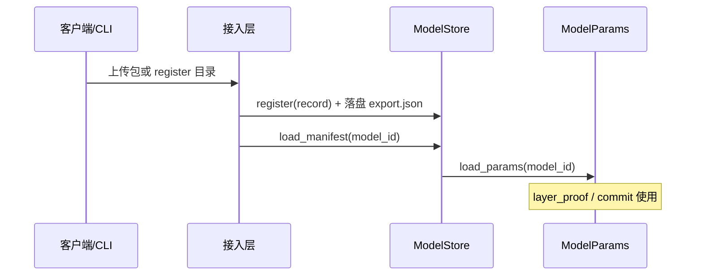

# task3：模型接入、解析与存储方案（设计参考）

> **依据：** [`tasks/task3.txt`](../tasks/task3.txt)、[`综合未来工作路线图.md`](./综合未来工作路线图.md) 阶段 3–5、[`模型参数密码学绑定与客户端验证规范.md`](./模型参数密码学绑定与客户端验证规范.md)  
> **代码落点（M1 已留接口）：** `src/cp-snark-full/src/model/{record,store}.rs`、`model_store/`  
> **状态：** 设计 + JSON 占位；HTTPS/DB/截断算法实现属阶段 5。

---

## 1. 目标拆分（对应 task3）

| task3 条目 | 本方案产出 | 当前实现 |
|------------|------------|----------|
| **§1 模型接入** | 服务端 CLI 注册 + 客户端 HTTPS 上传 | 接口：`ModelStore::register`；传输见 §4 |
| **§2a 解析与存储** | manifest + 权重文件 + 索引 | `model_store/index.json` + `record.json` |
| **§2b 截断时机** | 离线 `truncation_plan` + 会话状态机 | `TruncationPlanSlot` 占位，`status: stub` |
| **§2c 模型承诺** | $\mathsf{cm}_{\mathbf{W}}$ 写入记录 | `ModelCommitmentSlot` + `attach_commitment_to_record` |

与 **cp-snark-full 证明管线** 的关系：存储只负责 **$\mathbf{W}^*$ 与元数据**；同态轨迹仍在 `trace/` + `rust_files/`；承诺计算仍走 `commit::commit_model`（task1），完成后回写 `record.json`。

---

## 2. 存储分层（最简 → 可扩展）

```text
┌─────────────────────────────────────────────────────────────┐
│  ModelStore trait（索引 + 路径解析 + load_params）           │
├─────────────────────────────────────────────────────────────┤
│  M1: JsonFileModelStore  →  model_store/index.json          │
│  M2: SqliteModelStore    →  同一 record 字段映射到表行       │
│  M3: S3 / 对象存储       →  weights_path → s3://…/export.json│
└─────────────────────────────────────────────────────────────┘
```

**原则（task3a「最优最简」）：**

1. **大对象（权重）用文件**：`model_export.json`（或分片 `fc0.json`…），不塞进 DB BLOB。  
2. **DB / index 只存**：`model_id`、展示名、时间、`record_path`、`weights_digest_hex`、承诺摘要、截断计划版本。  
3. **客户端对账**：`weights_digest_hex` + `manifest.topology_hash_hex`（将来与 $\tau$ 绑定，见绑定规范 §0.3）。

---

## 3. 目录与 JSON Schema（M1 已填充示例）

根目录：`src/cp-snark-full/model_store/`

```text
model_store/
  index.json                          # ModelStoreIndex
  models/
    vpin-network-a/
      record.json                     # ModelRecord（索引主文档）
      manifest.json                   # ModelManifest
      model_export.json               # 权重（字符串 u128，与 load.rs 一致）
```

### 3.1 `index.json`

| 字段 | 类型 | 说明 |
|------|------|------|
| `version` | `u32` | 索引格式版本，当前 `1` |
| `models[]` | 数组 | `{ model_id, record_path }` |

### 3.2 `record.json`（[`ModelRecord`](../src/cp-snark-full/src/model/record.rs)）

| 字段 | 说明 |
|------|------|
| `model_id` | 全局唯一 ID（DB 主键） |
| `display_name` | UI / CLI 展示 |
| `created_at_utc` / `updated_at_utc` | ISO-8601 |
| `topology_network` | 关联 EC 轨迹目录 `A`…`E` |
| `manifest_path` / `weights_path` | 相对本模型目录 |
| `source` | `ModelSource`（`vpin_npy` / `exported_json` / `hugging_face`） |
| `commitment` | `pending` → `committed` + `cm_weights_point_hex`、`digest_hex` |
| `truncation_plan` | `stub` → `ready` + `checkpoints[]` |
| `weights_digest_hex` | 可选，客户端 pin |

### 3.3 `model_export.json`

与 [`model/load.rs`](../src/cp-snark-full/src/model/load.rs) 中 `ModelExportJson` 一致：`conv_filter_flat`、`pool`、`fc[]`。  
**输入阶段**：用手写 JSON 或脚本从 `.npy` 填充即可，无需 Rust 解析 npy。

### 3.4 与旧路径 `model_exports/{network}/` 的关系

| 路径 | 用途 |
|------|------|
| `model_exports/A/model_export.json` | 按 **network** 名的快捷加载（`load_model_params("A")`） |
| `model_store/models/{id}/` | 按 **model_id** 注册、多版本、DB 索引 |

二者可并存；注册新模型时推荐只写 `model_store`，`topology_network` 指向 `A` 以复用现有 `rust_files/A/`。

---

## 4. 模型接入（task3 §1）— 传输与组件选型

### 4.1 服务端 CLI（先实现）

```text
vpin-admin register --dir model_store/models/my-model/
vpin-admin commit  --model-id my-model   # 调 commit_model → 更新 record.commitment
```

对应 Rust：`JsonFileModelStore::register` / `save_record` / `attach_commitment_to_record`。

### 4.2 客户端 HTTPS 上传（阶段 5）

| 方案 | 适用 | 说明 |
|------|------|------|
| **multipart/form-data** | 模型包 = manifest + export + 可选签名 | FastAPI/Axum `POST /api/v1/models`；单请求 <100MB 够用 |
| **分块上传** | 大模型 / HF 导出 | `tus` 或自研 `Upload-Offset`；manifest 先传，权重后传 |
| **仅传 manifest + digest** | HF 同源 | 客户端 `snapshot_download` 本地生成 `model_export.json`，只上传 manifest + `weights_digest_hex`（与 vPIN 通用场景一致） |

**不推荐**在 task3 第一阶段引入 gRPC：REST + JSON 与现有 `serde` 栈一致，运维简单。

**后端组件参考：**

- API：FastAPI（Python 与 `Server.py` 同栈）或 Axum（若 Rust 单体）。  
- 存储：PostgreSQL（`models` 表）+ 本地 `data/models/{id}/` 或 MinIO。  
- 索引字段与 `ModelRecord` 1:1 映射，便于日后把 `JsonFileModelStore` 换成 `SqliteModelStore` 而不改业务类型。

---

## 5. 模型解析流程（task3 §2a）



**解析步骤（实现顺序）：**

1. 校验 `index.json` / `record.json` schema（`serde`）。  
2. 可选：校验 `weights_digest_hex` 与文件 SHA-256。  
3. `load_from_export_path` → `ModelParams`。  
4. （将来）HF：`source.kind = hugging_face` → 导出脚本写 `model_export.json`，再 `register`。

---

## 6. 截断时机算法（task3 §2b）— 设计要点

**问题：** 同态密文幅值增长；需在客户端做 TReLU/shift（BSGS 解密前截断），且尽量少损精度。

**建议离线产物：** 写入 `record.truncation_plan`：

```json
{
  "status": "ready",
  "plan_version": 1,
  "checkpoints": [
    {
      "layer_index": 2,
      "trigger": "after_relu_fc0",
      "bits_budget": 42,
      "note": "static budget from §二 位宽表"
    }
  ]
}
```

**算法骨架（待实现，鲁棒性优先）：**

1. **静态预算**（主路径）：按 `vPIN论文与代码对照说明.md` §二，对每层输出定义最大允许 bit 宽 $A_l$；在 **ReLU 后** 插入检查点（与论文「客户端截断」一致）。  
2. **动态监测**（辅路径）：若运行时密文范数估计 $> T_{\mathrm{safe}}$，提前触发额外 `TruncateRequest`（平台架构 §4.3）。  
3. **精度**：截断位数取 $\min(A_l,\ \lceil\log_2(\mathrm{observed})\rceil + \delta)$，$\delta$ 为安全余量（如 2–4 bit），避免一次截太狠。  
4. **推理状态机**：`Setup → LayerHomomorphic → [TruncateRequest?] → … → Prove/Verify`；检查点列表由 `truncation_plan.checkpoints` 驱动。

当前代码：`TruncationPlanStatus::Stub`，不阻塞注册与 JSON 填充。

---

## 7. 模型承诺（task3 §2c）

1. 服务器对 **轨迹权重**（现 178 维）或完整 $\mathbf{W}^*$（目标 1219 维）调用 `commit_model`。  
2. 将 `ModelCommitmentBundle.cm_weights` 写入 `record.commitment`（`attach_commitment_to_record`）。  
3. 客户端验证：读 `record` + `protocol.json`，`verify_model_commitment`（见绑定规范 §3.3）。

**接口预留：** `ModelCommitmentSlot.blind_hex`（Pedersen $r$）、`topology_hash_hex`（manifest）。

---

## 8. Rust API 速查

```rust
use cp_snark_full::model::{
    JsonFileModelStore, ModelStore, attach_commitment_to_record,
};

let store = JsonFileModelStore::open_default();
let record = store.get_record("vpin-network-a")?;
let params = store.load_params("vpin-network-a")?;
let manifest = store.load_manifest("vpin-network-a")?;
```

注册新模型（CLI/脚本调用）：

```rust
let mut record = ModelRecord::vpin_network_a_sample();
record.model_id = "my-hf-lenet".into();
store.register(&record)?;
```

---

## 9. 与路线图 / task3.txt 的对应

| 路线图阶段 | 本文档章节 |
|------------|------------|
| 3.2 模型包格式 | §3 |
| 3.3 传输 | §4 |
| 3.1 截断算法 | §6 |
| 5.1–5.3 实现 | `ModelStore` + DB 后端 |
| 5.5 承诺 | §7 |

**下一步编码建议：**  
1. `vpin-admin register` 薄 CLI 包装 `register`；  
2. FastAPI `POST /models` 写 `model_store` 或 DB；  
3. 实现 §6 静态 $A_l$ 表 → 填充 `checkpoints`；  
4. `setup_and_commit` 成功后自动 `save_record` 更新 commitment。

---

## 10. 相关文档

- [`model/README.md`](../src/cp-snark-full/src/model/README.md)  
- [`model-trace-接口与卷积windows方案.md`](./model-trace-接口与卷积windows方案.md)  
- [`cp-snark-full-架构草案.md`](./cp-snark-full-架构草案.md)  
- [`vpin-平台架构-独立客户端与服务端（协议合规）.md`](./vpin-平台架构-独立客户端与服务端（协议合规）.md)
