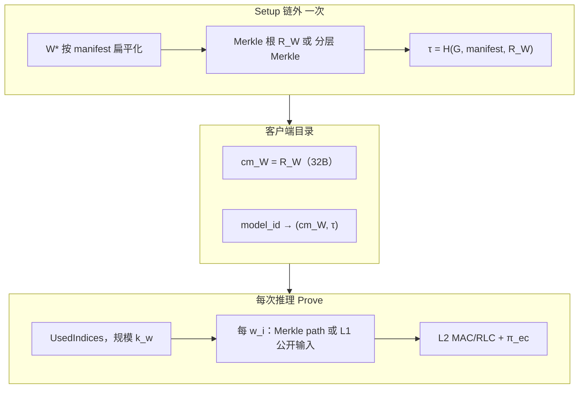

# 大模型（百万参数级）模型承诺优化方案

> **用途：** 当 $|W| \gtrsim 10^6$ 时，如何设计 **Setup 链外承诺** 与 **Prove 期稀疏绑定**，避免 `commit_model` 的线性 Pedersen 循环成为瓶颈，同时与 vPIN 五层绑定架构（见 [`模型参数密码学绑定与客户端验证规范.md`](./模型参数密码学绑定与客户端验证规范.md)）对齐。  
> **读者：** task3 模型平台、`cp-snark-full` 阶段 1（P1a / L1′）、`layer_proof` 接线负责人。  
> **更新：** 2026-06-04  
> **总路线图：** [`综合未来工作路线图.md`](./综合未来工作路线图.md) **§1.4.3**（Merkle 定案）、**§12**（计算量）  
> **依据：** `commitment.rs`；`CP-SNARK自检` §7.2–§7.3。

---

## 1. 问题陈述

### 1.1 三个尺度（勿混）

| 对象 | network A 现状 | 百万参数大模型 |
|------|----------------|----------------|
| **$\mathbf{W}^*$** | $\|W\| \approx 1219$（`.npy` 完整静态参数） | $\|W\| \gtrsim 10^6$ |
| **$\mathbf{w}$**（被 Com 承诺 / 轨迹绑定） | 当前 $N_{\mathrm{cm}} = 178$（`weight.json`） | 随 MAC/PtMul 轨迹增长，通常 $k_w \ll \|W\|$ |
| **R1CS witness** | $\sim 6.5 \times 10^5$ 变量 | 主要由 L2 MAC + EC gadget 决定 |

**易错点：** 不能把「对 178 个轨迹标量做 Pedersen」直接外推到「对 100 万个参数逐元承诺」；也不能在 R1CS 内对全量 $\mathbf{W}^*$ 重算向量 Pedersen。

### 1.2 当前实现的瓶颈

`commit_model`（`src/cp-snark-full/src/commitment.rs`）对每个权重：

1. `SHA256(b"cp-snark-model-gen" ++ le64(i))` 派生生成元标量；
2. 一次标量乘累加到 Pedersen 点。

复杂度 **$\Theta(|W|)$** 群标量乘 + **$\Theta(|W|)$** 哈希，且为**串行**循环。对 $|W| = 10^6$：

- Setup 往往 **>10 s**（未做 MSM 优化）；
- 需一次性分配 `Vec<Scalar>` 与全量 `e2_digest` 扫描，内存压力大；
- `verify_model_commitment` **仅比** `digest_hex`，未验 `point_hex` 打开（P1a 缺口），大模型下弱验证更不可接受。

Spartan 子系统已有更合适的向量承诺形态（一次 MSM）：

```text
GroupElement::vartime_multiscalar_mul(scalars, gens_n.G) + blind * gens_n.h
```

见 `src/proof_generation/Spartan/src/commitments.rs` 中 `Vec<Scalar>::commit`。

---

## 2. 设计原则

1. **Setup 与 Prove 分离**  
   - **Setup（一次）：** 对完整 $\mathbf{W}^*$ 做 **$O(|W|)$** 链外工作，但公开对象保持 **$O(1)$**（32 B 根或 32 B 群点）。  
   - **Prove（每次推理）：** 成本 **$\propto k_w$**（本次 MAC/轨迹实际用到的权重数），而非 $|W|$。

2. **全量承诺、稀疏打开**  
   - 客户端 catalog 存 **完整模型** 的承诺根 $R_W$（或分层子根）与拓扑哈希 $\tau$。  
   - 证明中只对 `UsedIndices` 提供 Merkle 打开或 L1 公开输入，**禁止**每次证明对 $|W|$ 个权重做 L1 等式。

3. **不在 R1CS 内做全量 Pedersen**  
   规范已明确：Pedersen 进 R1CS 代价过高，大模型下不可行（见绑定规范 §4 层 3）。

4. **与 MAC/RLC 对齐**  
   `layer_proof` 的 `filter_flat`、`weights_in_out` 等字段的叶子索引必须与 **manifest 固定 flatten 顺序** 一致；`UsedIndices` 从 PtMul/MAC spec 导出。

5. **诚实披露 `commitment_scope`**  
   catalog / `protocol.json` 须标明：`full \| mac_trace \| layer_merkle`，避免「仅承诺 178 维却宣称绑定 1M 参数」。

---

## 3. 推荐架构

```text
Setup（链外，模型注册一次）
  W* 按 manifest 顺序扁平化
    → 流式 Merkle 建树 → 根 R_W
    → τ = H(G, manifest, R_W)
    → catalog: model_id → (R_W, τ, manifest)

Prove（每次推理）
  从 MAC / PtMul 轨迹导出 UsedIndices（规模 k_w）
    → 对每个 i ∈ UsedIndices：MerkleVerify(R_W, w_i, path_i)  [L1′]
    → L2：MAC/RLC + π_ec
  客户端 Verify：目录 cm_W + transcript + SNARK + Merkle 路径
```



与绑定规范五层对应关系：

| 层 | 百万参数下的做法 |
|----|------------------|
| **层 0 Setup** | Merkle 根 $R_W$ + $\tau$；可选分层子根 |
| **层 1 打开** | 注册时验 $R_W$；Prove 时稀疏 Merkle 打开或 Pedersen opening（仅 $k_w$ 项） |
| **层 2 MAC** | `layer_proof` + 式 (9)(10) RLC；成本 $\propto$ 层规模，非 $|W|$ |
| **层 3 静态 W 进 MAC** | L1′：`UsedIndices` + $\log|W|$ 深度路径 |
| **层 4–5** | 同规范；$\mathsf{cm}_x$、AHE 链另计 |

---

## 4. 方案对比

| 方案 | Setup 成本 | 公开对象 | Prove R1CS 增量 | 适合 vPIN 大模型 |
|------|------------|----------|-----------------|------------------|
| **现实现**：逐元 Pedersen + `digest_hex` | $O(|W|)$ 群乘，慢 | 32 B 点 + digest | 无点打开；与 MAC 未绑 | ❌ 仅千级演示 |
| **Merkle 根 + L1′ 稀疏打开** | $O(|W|)$ 哈希，可并行 | 32 B | $O(k_w \log|W|)$ | ✅ **推荐主路径** |
| **分层 Merkle + $\tau$** | 同上，可增量更新 | 32 B + 少量子根 | 按层打开 | ✅ 多 tensor / 迁移学习 |
| **Spartan `MultiCommitGens` MSM** | $O(|W|)$ 群乘但快 | 32 B | 打开仍要 witness 或 NIZK | ⚠️ Setup 可选补充 |
| **全量 L1 等式** $w_i = w_i^{\mathrm{MAC}}$ | 低 | — | $O(|W|)$ | ❌ 不可行 |
| **R1CS 内 Pedersen($\mathbf{W}^*$)** | — | — | $O(|W|)$ 群约束 | ❌ 禁止 |

---

## 5. Setup 链外工程优化

### 5.1 Merkle（推荐）

- **叶子：** manifest 顺序下每个标量的规范编码（与 `embed_u128_to_scalar` / 定点字节一致）。  
- **建树：** 流式 / 分块读 `.npy`，mmap + 并行哈希；避免全量 `Vec<Scalar>` 驻留内存。  
- **产物：** `ModelCommitmentBundle` 扩展为含 `merkle_root_hex`、`num_weights`、`manifest_hash`；`e2_digest` 可与 Merkle 同源或改为子树 digest 组合，避免二次全扫 $|W|$。  
- **分层：** 每个 tensor（卷积核、FC 权重、bias）先建子 Merkle，再对子根列表建顶层 Merkle——便于增量更新与多 GPU 分片注册。

### 5.2 Pedersen（若保留为辅助承诺）

仅当产品需要 **32 B 群点** 且 Setup 可接受群运算时：

1. 预计算 $G_i$ 或 `MultiCommitGens::new(|W|, label)`；  
2. 用 `vartime_multiscalar_mul` 一次完成 $C_W = rG + \sum_i w_i G_i$；  
3. 实现 **P1a** `VerifyOpen`；`blind` 经安全信道或 $\pi_{\mathrm{open}}$ 传递，**不得**仅留 `digest_hex`。

对 $|W| = 10^6$，MSM 可将 Setup 从「分钟级」压到 **约 0.1–1 s 量级**（视 CPU/GPU 并行而定）；仍建议 **主承诺用 Merkle**，Pedersen 仅作可选叠加。

### 5.3 Catalog 与传输

- 客户端持久化：`model_id → (R_W, τ, manifest)`，**不传** $10^6$ 叶子。  
- 会话 `protocol.json`：仅含根、$k_w$ 条 opening（或证明内嵌 Merkle 见证），体积 **$\propto k_w \log|W|$**，非 $|W|$。

---

## 5.4 Poseidon 与电路内 Merkle（定案）

| 场景 | 哈希 | 说明 |
|------|------|------|
| 链外建树 / catalog | SHA256 或 **统一 Poseidon** | 现 `bind_l1.rs` 为 SHA256；若电路内用 Poseidon，catalog 应一致或证明等价 |
| **电路内 L1′** | **Poseidon**（$\mathbb{F}_{q_1}$） | $\sim 200$–$400$ 约束/次；SHA256 进 R1CS 不可行 |
| 安全性质 | 抗碰撞 | **不**提供「换模型比建树更贵」的 CPU 不对称；伪造不可行（$\mathrm{negl}(\lambda)$） |

详见 [`完整密码学交互与模型绑定-数学过程与复杂度.md`](./完整密码学交互与模型绑定-数学过程与复杂度.md) §7.0、§7.7。

---

## 5.5 P4′：客户端随机 Merkle 审计（可选）

除推理轨迹 `UsedIndices`（规模 $k_w$）外，客户端在 P4 采样：

$$
\mathcal{S}_{\mathrm{ch}} \xleftarrow{\$} [0,|W|) \setminus \mathrm{UsedIndices},\quad |\mathcal{S}_{\mathrm{ch}}| = k_c
$$

建议 $k_c \in [32, 128]$（可配置）。证明包须含 $\mathrm{UsedIndices} \cup \mathcal{S}_{\mathrm{ch}}$ 上全部 Merkle 打开；纳入 transcript。

**检出概率**（$t$ 个坏叶）：$p_{\mathrm{hit}} \approx k_c t / |W|$（$t \ll |W|$）。

**注意：** P4′ 为 **全模型统计审计**（威胁 T3）；**不能**替代 UsedIndices 上的硬绑定（威胁 T1）。T1 仍须 L1 + MerkleVerify + MAC。

**Prove 增量：** $O((k_w + k_c) \log |W|)$ 链外；电路内 $\Delta C \approx (k_w+k_c) \cdot \log_2|W| \cdot C_P$。

---

## 6. Prove 期：L1′ 与 MAC 成本

### 6.1 L1′ 约束增量（外推公式）

来自 `CP-SNARK自检` §7.3：

$$
\Delta C_{L1'} \approx k_w \cdot c_h \cdot \log_2 |W|
$$

其中 $c_h$ 为哈希 gadget 每轮约束成本（Poseidon 约 200–300；SHA256 更高）。

| $|W|$ | $\log_2|W|$ | $k_w = 10^4$，$c_h = 20$ 粗估 |
|------|-------------|------------------------------|
| $1.2 \times 10^3$ | $\approx 10$ | $\approx 2 \times 10^6$（network A 用 $k_w=178$ 则 $\sim 3.5\times10^4$） |
| $10^6$ | $\approx 20$ | $\approx 2 \times 10^6$ |
| $10^7$ | $\approx 23$ | $\approx 2.3 \times 10^6$ |

相对 network A 基线 $C \approx 6.38 \times 10^5$：若 $k_w$ 同为 $10^4$，L1′ 可能到 **数倍基线**，仍常小于 **L2 naive FC**（$\sim 7.6\times$，见自检 §7.4）。

### 6.2 真正的大头往往是 L2

大模型若含宽 FC、且不做论文式 (10) 压缩：

- MAC 约束 $\propto g \cdot h$（naive）或 $\propto g$（RLC 压缩）；  
- 证明时间可 **分钟–小时级**，远超 Setup Merkle 的秒级。

**结论：** 承诺优化必须与 **RLC / 分层 MAC**（`layer_proof`、式 (9)(10)）同步规划；只优化 cm_W 不能解决端到端 prove 时间。

### 6.3 `UsedIndices` 来源

| 来源 | 说明 |
|------|------|
| PtMul JSON / `vars_para` 槽位 | 轨迹乘数对应的 manifest 索引 |
| `ConvLayerProofSpec.filter_flat` | 卷积核在 $\mathbf{W}^*$ 中的叶子区间 |
| `FcLayerProofSpec.weights_in_out` | FC 权重矩阵展平后的索引 |

索引映射表应在 **manifest schema** 中预计算并版本化，避免 prove 时动态猜测。

---

## 7. 数量级速查

| $|W|$ | naive `commit_model` 循环 | Merkle Setup（SHA256，并行） | MSM Pedersen Setup | 单次 L1′（$k_w=10^4$） |
|------|---------------------------|------------------------------|--------------------|-------------------------|
| $\sim 10^3$ | 毫秒级 | 毫秒级 | 毫秒级 | 可忽略（$k_w \sim 10^2$） |
| $10^6$ | 常 **>10 s** | **$\sim 1$–$3$ s** | **$\sim 0.1$–$1$ s** | R1CS **$+10^4 \cdot 20 \cdot c_h$** 量级 |
| $10^7$ | 分钟级 | **$\sim 10$–$30$ s** | **$\sim 1$–$10$ s** | 随 $\log|W|$ 略增 |

*上表为工程粗估，须以目标硬件 benchmark 为准。*

---

## 8. 落地顺序（对齐路线图阶段 1）

| 序 | 工作 | 产出 |
|----|------|------|
| 8.1 | 定稿 $\mathsf{cm}_W$ 语义：`commitment_scope` + 完整 $\|W\|$ Merkle | 产品文档字段 |
| 8.2 | **P1a**：`VerifyOpen` 或 Merkle 根注册一致性；废除「仅 digest」 | `verify_model_commitment` 增强 |
| 8.3 | 流式 `build_merkle_manifest`；扩展 `ModelCommitmentBundle` | `commitment.rs` 或新 `merkle.rs` |
| 8.4 | L1′：`UsedIndices` + Merkle 路径进 R1CS（Poseidon 优先） | 与 `CP-SNARK自检` §7.3 对齐 |
| 8.5 | `layer_proof` / PtMul 索引与 manifest 对齐 | `ServerLinearProofStack` 接线 |
| 8.6 | catalog API：`model_id → (R_W, τ)` | task3(c) |

**不在本阶段：** 全量替换 Spartan prove 管线、TReLU 客户端证明（见 `layer_proof/README.md`）。

---

## 9. 反模式（禁止）

1. 对 $10^6$ 参数运行现版 `commit_model` for 循环作为生产 Setup。  
2. 每次证明对 $|W|$ 个权重做 L1 等式或全量 Merkle 打开。  
3. 在 R1CS 内重算 $|W|$ 维 Pedersen 向量承诺。  
4. 仅比对 `digest_hex` 即宣称「模型已密码学绑定」。  
5. 承诺 178 维 `weight.json` 却在 UI 宣称绑定百万参数 $\mathbf{W}^*$（须 `proof_coverage` / `commitment_scope` 诚实披露）。

---

## 10. 相关文档

| 文档 | 关联 |
|------|------|
| [`模型参数密码学绑定与客户端验证规范.md`](./模型参数密码学绑定与客户端验证规范.md) | 五层架构、L1′、客户端 `Verify` 伪代码 |
| [`CP-SNARK自检与计算量预估.md`](./CP-SNARK自检与计算量预估.md) | §7.2 L1、§7.3 L1′、§7.4 L2、§八总表 |
| [`综合未来工作路线图.md`](./综合未来工作路线图.md) | 阶段 1 P1a / cm_W 范围定稿 |
| [`layer_proof/README.md`](../src/cp-snark-full/src/layer_proof/README.md) | MAC/RLC 与 SNARK 分工 |
| `src/cp-snark-full/src/commitment.rs` | 当前 Pedersen 实现 |

---

## 11. 修订记录

| 日期 | 说明 |
|------|------|
| 2026-06-04 | 初版：百万参数 Setup/Prove 分工、Merkle 主路径、工程优化与落地顺序 |
