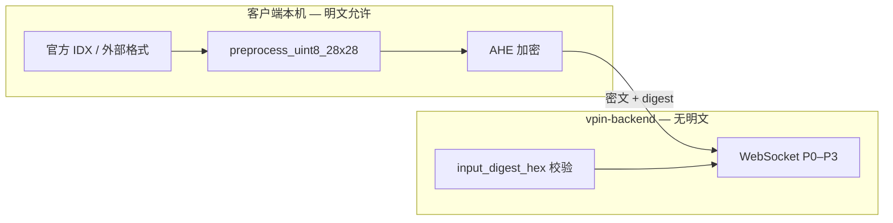

# 数据集格式与上传规范

> **最后更新**：2026-06-30  
> **AHE 全流程**：[ahe-数据与模型预处理流程.md](./ahe-数据与模型预处理流程.md)  
> **实测报告**：`reports/dataset_format_analysis.json`  
> **关联**：预处理流水线见 [预处理与模型格式适配.md](./预处理与模型格式适配.md)；模型权重见 [模型权重格式规范.md](./模型权重格式规范.md)

本文定义 **Network A（cnn-mnist）** 在 AHE 同态推理前的 **MNIST 输入预处理契约**，并收录 Hugging Face、Kaggle、torchvision 等常见来源的**原始格式**与**客户端接入方式**。

> **范围说明**：下列契约针对 **28×28 灰度 MNIST + Network A 拓扑**（输入 `(1,1,32,32)` 定点张量）。Network B–E、LeNet-CIFAR 等家族有各自的 HDC adapter，不在本文展开。

---

## 1. Network A MNIST 输入契约（Canonical）

无论数据来自何处，进入 **Network A** 同态/定点流水线前，必须在**客户端本地**收敛为下列语义（与 legacy `src/cnn_networks/Client.py` 一致）：

| 阶段 | 类型 | 形状 | 值域 / 说明 |
|------|------|------|-------------|
| **原始图** | `uint8` | `(28, 28)` | 灰度手写数字，0–255；MNIST 惯例为**亮笔画、暗背景** |
| **归一化前** | `float32` | `(1, 1, 32, 32)` | 28×28 居中 pad 到 32×32（嵌入 `[2:30, 2:30]`），像素 ÷255 |
| **归一化后** | `float32` | `(1, 1, 32, 32)` | **单图** min-max → clip `[0, 1]`（`constants.py`：`CLIP_MIN`/`CLIP_MAX`） |
| **定点输入** | `int32` | `(1, 1, 32, 32)` | `normalized × 2^16`（`FIXED_POINT_BITS=16`） |
| **会话摘要** | `hex` | 64 字符 | `SHA256(fixed_int32.tobytes())` → `input_digest_hex` |

**关键约束**：

- 每张图 **独立** min-max，禁止 batch 全局归一化。
- 输入空间为 **28×28 灰度 MNIST 风格**；彩色图须先转灰度再 resize。
- 标签 `label` 为 `0–9` 整数；用户上传场景可为 `null`（无监督）。
- **明文像素与原始 IDX 字节不得经 HTTP 上传至服务端**；服务端 WS 仅接收 `InputDigest` + 密文。

**实现 SSOT（均在 `vpin-client`）**：

| 模块 | 路径 | 职责 |
|------|------|------|
| 常量 | `vpin_client/data/constants.py` | `PAD_SIZE=32`, `FIXED_POINT_BITS=16` |
| 核心流水线 | `vpin_client/data/core.py` | `preprocess_uint8_28x28`, `compute_input_digest` |
| 官方 MNIST | `vpin_client/data/official.py` + `mnist_loader.py` | 本地 IDX / torchvision 加载 |
| 用户图片 | `vpin_client/data/upload.py` | PNG/JPEG 等 → 28×28 uint8 → 流水线 |
| 推理入口 | `vpin_client/data/input_loader.py` | `load_inference_input()` |
| Rust 镜像 | `crates/ahe-client/src/preprocess_core.rs` 等 | 与 Python 语义对齐的本地预处理 |

---

## 2. 隐私边界与执行位置



| 数据形态 | 允许持有方 | 禁止 |
|----------|------------|------|
| 官方 MNIST IDX 原始字节、`mnist_index` 对应像素 | **仅客户端** | 服务端 API 按索引返回明文图 |
| 用户上传原图（PNG/JPEG/ZIP 内图片等） | **仅客户端** | 服务端 `multipart` 解码预处理 |
| HF/Kaggle 等外部平台原始文件 | **仅客户端** | 服务端代拉 Hub/CSV 明文 |
| `fixed_int32` + `input_digest_hex` | 客户端生成；摘要经 WS 传递 | 服务端持久化用户 `fixed_int32.npy`（当前未实现） |
| 模型权重 `.zip` / `.npy` bundle | 服务端（公开模型参数） | — |

**回归测试**：`vpin-backend/tests/test_data_api.py` 断言下列路由 **必须 404**（已移除）：

- `GET /api/v1/data/official/test/{index}`
- `GET /api/v1/data/official/batch`
- `POST /api/v1/data/upload/preprocess`

服务端仅保留与数据集**无明文**相关的元数据接口，例如 `GET /api/v1/mnist/index`（读取 `data/mnist/index.json` 条目列表，不含像素）。

---

## 3. 客户端本地处理逻辑

所有 Network A 数据预处理在**用户本机**完成（Tauri 子进程 / CLI / Python 库），明文不离开设备。

### 3.1 标准流水线（逐步）

```
Step 0  原始 uint8 (28, 28)     灰度 0–255
Step 1  x_f = raw / 255.0       float32
Step 2  pad 到 (1,1,32,32)      28×28 嵌入 [2:30, 2:30]
Step 3  min-max（单图）           clip [0, 1]
Step 4  fixed = norm × 2^16      int32
Step 5  digest = SHA256(bytes)   hex 64 字符
```

### 3.2 官方 MNIST 索引（`mnist_index`）

| 项 | 说明 |
|----|------|
| **索引范围** | test：`0..9999`；train：`0..59999`（训练集仅用于 `model_training`，AHE 演示用 test） |
| **磁盘缓存** | `model_training/data/MNIST/raw/*.idx*-ubyte`（torchvision 自动下载） |
| **Python** | `load_official_test(index)` → `official.py` → `mnist_loader.fetch_mnist_test_sample` |
| **Rust** | `mnist_official::load_official_preprocessed(repo, index)` 直接读 IDX |
| **服务端** | ❌ 不提供按索引取图 API |

首次使用需在本机触发下载（任选其一）：

```powershell
.\.venv\Scripts\python.exe -c "from vpin_client.data.official import load_official_test; load_official_test(0)"
```

### 3.3 用户图片上传（本地文件）

| 步骤 | Python (`upload.py`) | Rust (`preprocess_upload.rs`) |
|------|----------------------|-------------------------------|
| 解码 | Pillow 可读：**PNG / JPEG / WebP / BMP / GIF** | `image` crate 同等解码 |
| 灰度化 | `convert("L")` | `to_luma8()` |
| 尺寸 | 非 28×28 则 LANCZOS resize | Lanczos3 resize |
| 极性 | 常见「深字浅底」扫描图 → `255 - pixel` 转为 MNIST 极性 | 同左 |
| 流水线 | `preprocess_uint8_28x28` | `preprocess_core::preprocess_uint8_28x28` |

入口：

- Python：`preprocess_upload_path(path)`、`preprocess_upload_bytes(data, filename=...)`
- Tauri：`preprocess_upload_file` / `preprocess_upload_file_rust`
- CLI：`python -m vpin_client ahe-infer --image path\to\digit.png ...`

### 3.4 Tauri / 前端调用链

| 能力 | 前端 API (`aheClient.js`) | Tauri / 子进程 |
|------|---------------------------|----------------|
| 官方单张 | `pythonPreprocessOfficial` / `rustPreprocessOfficial` | `ahe_preprocess` / `ahe_preprocess_rust` |
| 官方批量 | `pythonPreprocessBatch` / `rustPreprocessBatch` | `ahe_preprocess_batch` / `ahe_preprocess_batch_rust` |
| 本地图片 | `pythonPreprocessUpload` / `rustPreprocessUpload` | `preprocess_upload_file` / `_rust` |
| AHE 推理 | `aheInfer` | `run_ahe_inference` → `vpin_client` 或 `ahe-cli` |

浏览器模式（非 Tauri）**不可**做预处理或推理；`:8000` REST 仅用于模型目录等元数据。

### 3.5 CLI 推理入口（`python -m vpin_client`）

`input_loader.load_inference_input()` 四选一：

| 参数 | 来源 | 预处理位置 |
|------|------|------------|
| `--mnist-index` | `load_official_test` | 客户端本地 |
| `--image` | `preprocess_upload_path` | 客户端本地 |
| `--fixed-npy` | 直接 `np.load` | 跳过（调用方负责合法性） |
| `--upload-id` | — | **未实现**（`NotImplementedError`；勿假设服务端存有上传样本） |

```powershell
.\.venv\Scripts\python.exe -m vpin_client ahe-infer --mnist-index 0 --model cnn-mnist-trained --timing
.\.venv\Scripts\python.exe -m vpin_client ahe-infer --image path\to\digit.png --model cnn-mnist-trained
.\.venv\Scripts\python.exe -m vpin_client eval-mnist-ahe --start 0 --limit 50 --model cnn-mnist-trained
```

---

## 4. 本地数据格式校验 CLI

在**持有 MNIST 缓存或外部样本的机器上**（通常为开发机 / Tauri 客户端本机，而非 vpin-backend 进程内）运行下列工具，验证各来源能否收敛到同一 `input_digest_hex`。

### 4.1 多格式对照脚本（推荐）

```powershell
.\.venv\Scripts\python.exe scripts\analyze_dataset_formats.py
```

- 输出：`reports/dataset_format_analysis.json`
- 对照项：官方 IDX、HF `ylecun/mnist`、Kaggle CSV 布局、PNG 上传路径、本地 AHE npy bundle（模型侧）
- 基准：test `index=0` 的 `load_official_test` digest
- **依赖**：`vpin-client` 在 `PYTHONPATH`；官方 IDX 需 §3.2 下载步骤

### 4.2 单图快速校验

```powershell
.\.venv\Scripts\python.exe -c "
from vpin_client.data.core import compute_input_digest
from vpin_client.data.official import load_official_test
from vpin_client.data.upload import preprocess_upload_path
from pathlib import Path
import sys
ref = load_official_test(0)
cand = preprocess_upload_path(Path(sys.argv[1]))
print('match', compute_input_digest(cand.fixed_int32) == compute_input_digest(ref.fixed_int32))
" path\to\digit.png
```

### 4.3 服务端职责边界（勿混淆）

| 对象 | 服务端校验方式 | 说明 |
|------|----------------|------|
| **用户数据集**（MNIST 像素、上传图、HF/CSV） | ❌ 无服务端校验 | 明文不得进入 backend |
| **模型权重 `.zip` bundle** | ✅ `weights_bundle.install_bundle` | 见 §5 |
| **模型权重目录** | ✅ `validate_npy_bundle` / `validate_lenet_npy_bundle` | 注册模型或加载推理前 |

运维在服务器上若需确认**本机 MNIST 缓存**是否完整，应 SSH 到该机器后运行 §4.1（仍走 `vpin_client`，不经 HTTP API）。

---

## 5. 服务端 ZIP / 文件校验（仅模型权重）

vpin-backend **不对用户数据集 ZIP 做接收或校验**（无对应路由）。ZIP 处理仅出现在**模型注册**路径：

| 项 | 说明 |
|----|------|
| **端点** | `POST /api/v1/models`（`multipart` 字段 `npy_bundle`） |
| **落盘** | `data/models/uploads/{model_id}/bundle.zip` → 解压至 `npy/` |
| **实现** | `vpin_backend/models/weights_bundle.py` → `install_bundle` |
| **ZIP 规则** | `zipfile.ZipFile` 遍历 `namelist()`，按**文件名**匹配 `layout.required_files`（如 `weight_fc1_*.npy` 等） |
| **校验** | 解压后调用 `validate_npy_bundle` 或 `validate_lenet_npy_bundle`（逻辑来自 `vpin_client.models.format_adapter`） |
| **失败** | 缺文件 → `FileNotFoundError`；shape/dtype 不符 → `ValueError` 聚合错误列表 |

数据源 ZIP（如 Kaggle 竞赛包、HF 导出包）须在 **客户端本地** 解压并逐图走 §3.3，**不得** POST 至 backend。

---

## 6. 外部平台格式收录（客户端实现）

下表按 **「客户端原生 / 需本地转换 / 禁止」** 分类。  
「需转换」表示平台格式合法，但须在**客户端**变为 **28×28 uint8** 再调用 `preprocess_uint8_28x28`。

> **隐私要求**：HF Hub、Kaggle API、远程 Parquet/JPEG URL 等**只能由客户端拉取**；禁止在 vpin-backend 代下载、代解码或缓存明文样本。

### 6.1 总览对照表

| 平台 / 数据集 | 常见原始格式 | Network A 原生 | 客户端接入路径 |
|---------------|-------------|----------------|----------------|
| **LeCun 官方 MNIST** | IDX `*-ubyte`（gzip） | ✅ | `official.py` / `mnist_loader.py` / Rust `mnist_official` |
| **torchvision.datasets.MNIST** | 同官方 IDX | ✅ | 与上相同（唯一下载源） |
| **Hugging Face `ylecun/mnist`** | Parquet + `Image` 列 + `label` | ⚠️ 需转换 | 见 §6.2 |
| **Hugging Face 通用图像集** | Parquet / 文件夹 PNG / WebDataset | ⚠️ 需转换 | 见 §6.3 |
| **Kaggle Digit Recognizer** | `train.csv`（label + pixel0…783） | ⚠️ 需转换 | 见 §6.4 |
| **Kaggle MNIST as JPEG** | `train/{0..9}/*.jpg` | ⚠️ 需转换 | 本地 `preprocess_upload_path` |
| **UCI / OpenML** | ARFF / CSV 像素列 | ⚠️ 需转换 | reshape → uint8 → 客户端预处理 |
| **TensorFlow Datasets** | `tf.data` / TFRecord | ⚠️ 需转换 | 客户端导出 PNG 或 numpy |
| **NumPy 单文件** | `.npy` `(N,28,28)` 或 `(N,784)` | ⚠️ 需转换 | 见 §6.5 |
| **ZIP 批量图片** | `*.zip` 内 PNG/JPEG | ⚠️ 需转换 | **客户端**解压后逐图 §3.3；❌ 无服务端 ZIP 上传 API |
| **本仓库废弃缓存** | `vpin-backend/data/mnist/*.npy` | ❌ 禁止 | 勿用于 AHE 验收 |
| **本仓库 legacy** | `src/cnn_networks/image_mnist_32_32.npy` | ❌ 禁止 | 32×32 已 pad，语义不一致 |

### 6.2 Hugging Face — `ylecun/mnist`（Parquet / Image）

**Hub 结构**（2024 起主流）：

- 配置：`ylecun/mnist`
- 特征：`image`（`dtype: image`，解码为 PIL 28×28 L）、`label`（0–9 class）
- 分片：`train` 60000 / `test` 10000

**实测（2026-06-23，`scripts/analyze_dataset_formats.py`，test index=0）**：

| 对比项 | 官方 IDX | HF datasets-server API |
|--------|----------|-------------------------|
| 像素 mean | 23.54 | 24.69 |
| `input_digest_hex` 一致 | 基准 `369c85c3…` | ❌ `847f4006…` |
| 原因 | 原始 uint8 | API 返回 **JPEG 缓存** URL，有损重编码 |

**结论**：HF Hub 可用于集成演示，但 **AHE 验收须用客户端 `load_official_test`**。本地 `datasets` streaming 读 Parquet 无损列时，仍需逐样本核对 digest。

```python
# 客户端示例（pip install datasets pillow）
from datasets import load_dataset
from vpin_client.data.core import preprocess_uint8_28x28
import numpy as np

ds = load_dataset("ylecun/mnist", split="test")
pil_img = ds[0]["image"]  # 28×28 L
raw = np.array(pil_img, dtype=np.uint8)
result = preprocess_uint8_28x28(raw, label=int(ds[0]["label"]), source="upload")
```

### 6.3 Hugging Face — 通用图像数据集

| HF 存储形态 | 说明 | 客户端处理 |
|-------------|------|------------|
| **Parquet `image` 列** | `struct{bytes, path}` 或 `dtype: image` | 解码 → 灰度 → resize 28×28 |
| **仓库内 `*.png` / `*.jpg`** | `imagefolder` | 同 §3.3 |
| **WebDataset**（`.tar` 分片） | 大规模多模态 | 客户端逐条解码 |
| **metadata.csv + 图片路径** | Hub 图像分类常见布局 | 客户端读路径 → Pillow |

非 28×28 数据须先 **灰度 + resize 28×28**，否则与 Network A 拓扑不兼容。

### 6.4 Kaggle

#### Digit Recognizer（`train.csv`）

| 列 | 含义 |
|----|------|
| `label` | 0–9 |
| `pixel0` … `pixel783` | 行优先 28×28，0–255 |

```python
import pandas as pd
import numpy as np
from vpin_client.data.core import preprocess_uint8_28x28

df = pd.read_csv("train.csv")  # 客户端本地路径
row = df.iloc[0]
raw = row.filter(like="pixel").to_numpy(dtype=np.uint8).reshape(28, 28)
preprocess_uint8_28x28(raw, label=int(row["label"]), source="kaggle_csv")
```

#### MNIST as JPEG / 文件夹分类

典型目录：`train/0/00001.jpg` …  
客户端逐文件 `preprocess_upload_path`。

### 6.5 NumPy / CSV 通用

| 文件形态 | 形状 | 客户端转换 |
|----------|------|------------|
| `(28, 28)` uint8 | 单图 | 直接 `preprocess_uint8_28x28` |
| `(784,)` 或 `(1, 784)` | 展平 | `.reshape(28, 28)` |
| `(N, 28, 28)` | 批量 | 循环单图，**禁止** batch min-max |
| `(N, 784)` | Kaggle 型批量 | `reshape(N, 28, 28)` 后逐图 |
| `(1, 28, 28)` float 已 /255 | 误用 | 需还原 uint8，勿与 client 流水线混用 |
| `(1, 1, 32, 32)` 已 pad | legacy | ❌ 与 client pad 语义冲突 |

### 6.6 官方 IDX（LeCun / torchvision）

| 文件 | 内容 |
|------|------|
| `train-images-idx3-ubyte` | 60000×28×28 uint8 |
| `train-labels-idx1-ubyte` | 60000 标签 |
| `t10k-images-idx3-ubyte` | 10000×28×28 uint8 |
| `t10k-labels-idx1-ubyte` | 10000 标签 |

魔数：`0x00000803`（图像）、`0x00000801`（标签）。  
Python 路径经 `torchvision.datasets.MNIST`；Rust 路径在 `mnist_official.rs` 直接解析 IDX。**两种路径均只在客户端执行。**

---

## 7. 预处理结果元数据契约（客户端）

客户端预处理完成后，UI / CLI 使用下列字段（**非**服务端 `data/uploads` 落盘契约——该路径已废弃）：

```json
{
  "source": "official | upload",
  "upload_id": null,
  "filename": "digit.png",
  "label": 7,
  "mnist_index": 0,
  "input_digest_hex": "64位十六进制",
  "preview_png_base64": "原始28×28预览PNG",
  "fixed_shape": [1, 1, 32, 32],
  "preprocess_trace": []
}
```

- `source: "official"`：`mnist_index` / `label` 有值。
- `source: "upload"`：`mnist_index` 为 `null`；`upload_id` 当前为 `null`（无服务端上传 ID）。

进入 AHE 会话时，客户端向 WebSocket 发送 `input_digest_hex` 与加密后的 `fixed_int32`，**不发送** `raw_uint8` 或原始 IDX。

---

## 8. 禁止与废弃数据源

| 路径 / 格式 | 原因 |
|-------------|------|
| `scripts/prepare_mnist_network_a.py` 产物 | 与官方 IDX 流水线不一致 |
| `vpin-backend/data/mnist/*.npy` | 历史缓存，非 SSOT |
| `src/cnn_networks/image_mnist_32_32.npy` | 32×32 预 pad，跳过 client pad |
| 服务端 `POST /data/upload/preprocess` | 已移除；违反明文不出机 |
| 服务端 `GET /data/official/test/*` | 已移除；官方索引仅客户端 |
| Batch 全局 min-max | 违反 per-image 论文语义 |
| 非灰度且不 resize 的原图 | Network A 要求 28×28 灰度 |
| 服务端代拉 HF/Kaggle 明文 | 违反外部平台客户端收录原则 |

---

## 9. 能力边界与路线图

| 能力 | 状态 |
|------|------|
| 客户端官方 MNIST 索引预处理（Python / Rust） | ✅ |
| 客户端单图 PNG/JPEG 本地预处理 | ✅ |
| Tauri 桌面 AHE 推理（digest + 密文） | ✅ |
| 服务端数据集明文 API | ❌ 已删除（隐私） |
| 服务端数据集 ZIP 上传 | ❌ 无计划（客户端解压） |
| HF Parquet 服务端一键导入 | ❌ 无计划（仅客户端脚本） |
| Kaggle CSV 服务端批量导入 | ❌ 无计划 |
| `upload_id` 跨会话绑定 | ❌ 待扩展 |

---

## 10. 相关代码索引

| 模块 | 路径 |
|------|------|
| 常量 / 核心 | `vpin-client/vpin_client/data/constants.py`, `core.py` |
| 官方 MNIST | `vpin-client/vpin_client/data/official.py`, `mnist_loader.py` |
| 上传解码 | `vpin-client/vpin_client/data/upload.py` |
| 推理加载 | `vpin-client/vpin_client/data/input_loader.py` |
| CLI | `vpin-client/vpin_client/cli.py` |
| Rust 预处理 | `vpin-client/crates/ahe-client/src/preprocess_*.rs`, `mnist_official.rs` |
| 格式对照脚本 | `scripts/analyze_dataset_formats.py` |
| 前端服务 | `vpin_frontend/.../services/aheClient.js` |
| 隐私回归测试 | `vpin-backend/tests/test_data_api.py` |
| 模型 ZIP 校验 | `vpin-backend/vpin_backend/models/weights_bundle.py` |
| 模型注册 API | `vpin-backend/vpin_backend/api/routes/models.py` |
| MNIST 元数据索引 | `vpin-backend/vpin_backend/api/routes/mnist.py` |
