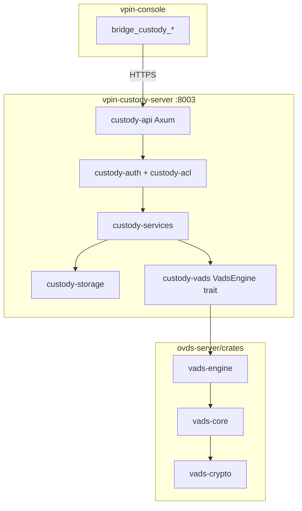
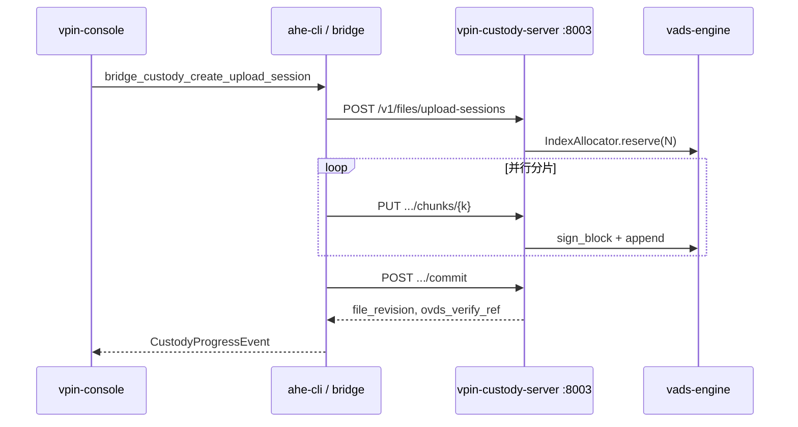

# OVDS Python → Rust 迁移方案

> **版本**：2026-07-12  
> **状态**：待评审  
> **代码根目录**：[`ovds-server/`](../../ovds-server/)  
> **密码学库细节**：[OVDS-密码学库调研](./OVDS-密码学库调研.md)

---

## 1. 背景与目标

### 1.1 背景

vPIN 平台三角色架构中，**信任数据托管服务器**负责可验证数据流存储（平面二：身份与数据绑定）。密码层基于 **OVDS/VADS** 协议：

- **BLS 式签名**（BN254 配对）保证分片 `(i, s)` 完整性与不可伪造；
- **RSA Accumulator**（3072-bit）证明 `tag_i ∉ R`（未被撤销）；
- 工程层支持大文件分片并行上传、批量验证、会话与版本管理。

当前唯一可用的参考实现为 Python（`experiment-reproduction/ovds`），已提取至仓库根目录 **`ovds-server/`**。vPIN 产品化要求：

1. 托管服务独立进程，默认端口 **:8003**；
2. Rust 实现可注入 `vpin-custody-server` 的 `VadsEngine` trait；
3. `vpin-console` 的 `bridge_custody_*` 从 `LocalCustodyShim` 切换为真实 HTTPS。

### 1.2 迁移目标

| 目标 | 说明 |
|------|------|
| **协议等价** | Rust 输出与 Python 参考实现代数等价（配对、模幂、证明结构） |
| **分层清晰** | 密码原语 / 协议核心 / 引擎 trait / HTTP 服务四层分离 |
| **可测试** | Python 测试套件 → Rust 集成测试 + JSON fixtures 双向对照 |
| **可集成** | 通过 `ovds-rust` feature 替换 `UnimplementedVadsEngine` |
| **里程碑聚焦** | 当前仅 **DataOnly**；InferencePeer / ProofVerification / FullProxy 保持占位 |

### 1.3 非目标

- 不迁移 AVDS 子系统（`src/additional/avds_lib.py`、`clvc_aux.py`）；
- 不迁移 RSA-accumulator 的 Solidity 合约与 Node.js 工具链；
- 不在本阶段实现密态推理托管（P3）或证明验证托管（P6）；
- 不替换用户侧密态方案治理（`CiphertextSchemeSelector` 仍在客户端）。

---

## 2. 现状盘点

### 2.1 `ovds-server/` 目录结构

```
ovds-server/
├── src/
│   ├── vads_lib.py          # VADS 主协议（1233 行，21 个公开函数）
│   ├── test/                # 9 个按序集成测试
│   └── additional/          # AVDS 实验代码（不迁移）
├── RSA-accumulator/
│   ├── main.py              # RSA 累加器核心
│   └── helpfunctions.py     # hash_to_prime、模逆、Shamir trick
├── document/                # 协议、托管、工程优化文档
├── database/                # 测试用 pickle 数据
├── requirements.txt         # charm-crypto >= 0.50
├── mmap_design.md           # 2^30 规模 mmap 方案
└── OVDS协议完整流程.md
```

### 2.2 Python 协议函数清单

`vads_lib.py` 公开函数与迁移优先级：

| 函数 | 角色 | 映射 VadsEngine | 优先级 |
|------|------|-----------------|--------|
| `setup` | 初始化 vk/sk/server_state | `setup` | P0 |
| `append_client` | 客户端签名 | `sign_block` | P0 |
| `append_server` | 服务端验签入库 | `append` | P0 |
| `append` | 客户端+服务端合一 | 拆分使用 | P0 |
| `query` | 单次查询 + 证明 | `query` | P0 |
| `verify` | 单次验证 | `verify` | P0 |
| `query_star` | 批量查询 | `query_batch` | P1 |
| `verify_star` | 批量验证 | `verify_batch` | P1 |
| `update` | 单条更新 | `update` | P1 |
| `audit` | 审计证明 | `audit` | P2 |
| `judge` | 审计评判 | `judge` | P2 |
| `WitCreate_star` / `WitVerify_star` | 聚合非成员证明 | 内嵌于 query/verify | P0 |
| `H_G` / `H_prime` / `H_Primes` / `H_2` | 哈希原语 | `vads-crypto` | P0 |
| `update_z_star` | 累加器缓存 | 内嵌状态机 | P1 |

### 2.3 vPIN 侧现状

| 组件 | 状态 |
|------|------|
| `vpin-custody-server/` workspace | **未创建**（架构文档已定义 crate 结构） |
| `UnimplementedVadsEngine` | 规格已写，代码待落地 |
| `vpin-console` `LocalCustodyShim` | 内存占位，标记 `TEMP-LOCAL-CUSTODY` |
| `config/client-endpoints.example.json` | `ovds.http_base` → `:8003` |
| `vpin-console` `ovdsApiBase()` | 已导出，尚无 UI 消费者 |

### 2.4 Python 测试基线

`ovds-server/src/test/` 提供按协议顺序的集成测试：

```
test_setup → test_append → test_query → test_verify
→ test_query_star → test_verify_star → test_audit → test_judge
```

依赖 `charm-crypto`；RSA 密钥生成较慢。测试套件是 Rust 正确性的**权威对照**。

---

## 3. 目标架构

### 3.1 总体分层



### 3.2 Rust Workspace 规划

**推荐**：密码层 crate 置于 `ovds-server/crates/`，托管 HTTP 层为独立 `vpin-custody-server/` workspace，通过 path 依赖连接。

```
ovds-server/
├── Cargo.toml                    # workspace: vads-crypto, vads-core, vads-engine
├── crates/
│   ├── vads-crypto/              # BN254 + RSA + hash（见密码学库调研）
│   ├── vads-core/                # setup/append/query/verify/... 状态机
│   └── vads-engine/              # VadsEngine + IndexAllocator 实现
├── fixtures/                     # Python 导出的 JSON 测试向量（阶段 0）
└── python-reference/             # 当前 src/ + RSA-accumulator/（可重命名整理）

vpin-custody-server/              # 独立 workspace（后续创建）
├── apps/custody-server/
└── crates/
    ├── custody-domain/
    ├── custody-vads/             # trait 定义；feature ovds-rust → path: ovds-server/vads-engine
    ├── custody-services/
    ├── custody-api/
    └── ...
```

**依赖原则**（与 [vpin-custody-server-软件架构](../architecture/vpin-custody-server-软件架构.md) 一致）：

- `custody-domain` 无 IO；
- 密码实现仅经 `custody-vads::VadsEngine` 注入；
- 迁移完成后替换 `UnimplementedVadsEngine`，`custody-services` / `custody-api` 不变。

### 3.3 会话层 vs VADS 层

工程优化文档定义两层状态，迁移须保持边界：

```
┌─────────────────────────────────────────┐
│  会话层（UploadCoordinator / Manifest）   │  ← vpin-custody-server
│  草稿、进度、index_base 预占、commit      │
├─────────────────────────────────────────┤
│  VADS 层（DB / R / Acc_R / cnt）          │  ← vads-core / vads-engine
└─────────────────────────────────────────┘
```

- **Append 不修改 `Acc_R`**；Update 批量累计 `z*`；
- `append_server` 只验签，**不检查** `i == cnt`（支持索引预占并行上传）；
- `IndexAllocator::reserve(count)` 与 UploadCoordinator 配合（工程优化 §4.2）。

---

## 4. 密码学库选型（摘要）

完整对比见 [OVDS-密码学库调研](./OVDS-密码学库调研.md)。

| 原语 | Python | Rust 选型 | 备注 |
|------|--------|-----------|------|
| BN254 配对 | charm-crypto | `ark-bn254` + `ark-ec` 0.5.x | 不用 blstrs（BLS12-381） |
| 自定义 BLS 签名 | `pair(σ,g)==pair(H·u^s,A)` | ark 底层 API 手写 | 不用 rust-bls-bn254 |
| HG: hash→G1 | `group.hash(sha256,G1)` | 移植 + 向量对齐；备选 sylow | **最高风险点** |
| RSA Accumulator | 自研 3072-bit | `num-bigint` 直移植 | 不用 cambrian/accumulator |
| hash-to-prime | helpfunctions.py | 自实现 Miller-Rabin | 与 Python 完全一致 |
| SHA-256 | hashlib | `sha2` | — |

**曲线决策**：建议 **保持 BN254**，避免重导 witness 与破坏 Python 测试对照。若未来统一至 BLS12-381，单独立项并全量重签。

---

## 5. 分阶段迁移计划

> **逐日执行细节**（1 人/天粒度、文件清单、验收命令）见 [OVDS-逐日迭代实施计划](./OVDS-逐日迭代实施计划.md)。

### 阶段 0：基线锁定（1–2 天）

**目标**：建立 Python 正确性基线与 Rust 对照 fixtures。

| 任务 | 产出 |
|------|------|
| 在 `ovds-server` 创建 venv，安装 `charm-crypto` | `requirements.txt` 可复现环境 |
| 跑通 `src/test/test_all.py` | 基线通过日志 |
| 编写 `export_fixtures.py` | 固定种子导出 setup/append/query/verify 中间值 → `fixtures/*.json` |
| 记录 HG 映射行为 | G1 点坐标、配对结果十六进制 |
| 整理 `ovds-server/python-reference/` | 将当前 `src/` 移入，根目录仅保留 Rust workspace |

**验收**：Python 全绿 + fixtures 可人工检视 + 文档记录 charm 版本。

---

### 阶段 1：`vads-crypto`（3–5 天）

**目标**：底层原语与 Python 单函数等价。

| 模块 | 移植来源 | 测试 |
|------|----------|------|
| `hash.rs` | `helpfunctions.py` | hash_to_prime 确定性；H2 |
| `rsa_acc.rs` | `RSA-accumulator/main.py` | setup/add/delete/batch_*；A0 coprime |
| `pairing.rs` | `vads_lib.py` H_G + append 验签 | 配对等式；G1 点序列化 |
| `wit_star.rs` | `WitCreate_star` / `WitVerify_star` | 聚合非成员证明 |

**验收**：`cargo test -p vads-crypto` 全部对照 fixtures 通过。

---

### 阶段 2：`vads-core`（5–7 天）

**目标**：完整 VADS 协议状态机。

| 任务 | 说明 |
|------|------|
| 定义 `Vk` / `Sk` / `ServerState` / `DbEntry` 类型 | 替代 Python dict |
| 实现 `setup` | 返回三元组 |
| 实现 `append_client` + `append_server` | 拆分原 `append` |
| 实现 `query` / `verify` | DataOnly 下载验证最小闭环 |
| 实现 `query_star` / `verify_star` | 批量路径 |
| 实现 `update` | 维护 R、Acc_R、z_star |
| 实现 `audit` / `judge` | 可选审计 |

**验收**：Rust 集成测试镜像 `test_all.py` 流程；状态序列化 roundtrip。

---

### 阶段 3：`vads-engine` + `custody-vads`（2–3 天）

**目标**：对接 vPIN 托管 trait。

实现 [OVDS数据托管服务器技术文档 §10](../../ovds-server/document/OVDS数据托管服务器技术文档.md) 与 [vpin-custody-server-接口规格 §2](../architecture/vpin-custody-server-接口规格.md)：

```rust
pub trait VadsEngine: Send + Sync {
    fn setup(&self, params: SetupParams) -> Result<SetupOutput, VadsError>;
    fn sign_block(&self, index: u64, data: &[u8]) -> Result<SignedBlock, VadsError>;
    fn append(&self, item: AppendItem) -> Result<(), VadsError>;
    fn query(&self, index: u64) -> Result<QueryResult, VadsError>;
    fn verify(&self, index: u64, data: &[u8], proof: &QueryProof) -> Result<bool, VadsError>;
    // batch_*, update, audit, judge
}

pub trait IndexAllocator: Send + Sync {
    fn reserve(&self, count: u64) -> Result<u64, VadsError>;
    fn current(&self) -> Result<u64, VadsError>;
}
```

| 任务 | 说明 |
|------|------|
| `vads-engine` 实现上述 trait | 租户级实例，持有 `ServerState` |
| 创建 `vpin-custody-server/crates/custody-vads` | trait 定义 + `UnimplementedVadsEngine` |
| feature `ovds-rust` | `path = "../../ovds-server/crates/vads-engine"` |
| 单元测试 mock 租户 | reserve → sign → append → query → verify |

**验收**：`cargo test -p vads-engine`；feature 切换编译通过。

---

### 阶段 4：`vpin-custody-server` DataOnly HTTP（5–7 天）

**目标**：可运行的 :8003 托管服务 MVP。

| 服务 | 职责 |
|------|------|
| `UploadCoordinator` | 会话状态机、`index_base` 预占、commit |
| `ManifestService` | `file_revision`、`chunk_map` |
| `VerifyOrchestrator` | 下载批计划、`verify_strategy` |
| `BindingService` | `DataBindingRecord`、`ovds_verify_ref` |
| `custody-api` | Axum 路由（§4.2 DataOnly） |

**HTTP 路由**（当前里程碑）：

| 方法 | 路径 |
|------|------|
| GET | `/api/v1/health` |
| GET | `/api/v1/capabilities` |
| POST | `/v1/files/upload-sessions` |
| PUT | `/v1/upload-sessions/{sid}/chunks/{k}` |
| POST | `/v1/upload-sessions/{sid}/commit` |
| DELETE | `/v1/upload-sessions/{sid}` |
| GET | `/v1/files/{fid}` |
| GET | `/v1/files/{fid}/download` |
| POST | `/v1/bindings` |

**验收**：`vpin-console` 关闭 `TEMP-LOCAL-CUSTODY`，`bridge_custody_*` 走真实 HTTP；E2E 上传 → verify → binding。

---

### 阶段 5：持久化与规模（后续）

| 任务 | 参考 |
|------|------|
| mmap 数据文件 | `mmap_design.md`（72GB @ 2^30 条；记录 72B 定长） |
| 租户状态 PostgreSQL + Redis 锁 | 托管文档 §十二 |
| 性能优化 | `CustodyServerDefaults` 常量；并行 verify |

---

## 6. 测试与正确性策略

### 6.1 三层测试

```
fixtures（Python 导出）
    ↓ 对照
vads-crypto 单元测试
    ↓ 组合
vads-core 集成测试（镜像 test_*.py）
    ↓ 注入
vads-engine + custody-services E2E
```

### 6.2 Fixture 格式（建议）

```json
{
  "seed": 42,
  "setup": {
    "vk_A_hex": "...",
    "vk_n_hex": "...",
    "Acc_0_hex": "..."
  },
  "append": [{
    "index": 0,
    "s": 12345,
    "tag_hex": "...",
    "sigma_hex": "..."
  }],
  "query": { "proof": { ... } },
  "verify": { "accepted": true }
}
```

### 6.3 整数与大数

Python 使用 `sys.set_int_max_str_digits(100000)` 处理 audit 大整数；Rust `num-bigint` 无此限制。审计路径须关注内存峰值。

---

## 7. vPIN 集成路径



| 集成点 | 说明 |
|--------|------|
| `DataBindingRecord.ovds_verify_ref` | BindingService 产出，供 Preflight / 密态流程验证器消费 |
| `capability_mode = data_only` | 当前唯一实现档 |
| `custody_mode = hosted` | 数据写入托管方 VADS |
| 端口 | `:8003`（与 `:8000` Python 后端、`:8001` AHE 分离） |

---

## 8. 风险与缓解

| 风险 | 等级 | 缓解 |
|------|------|------|
| `H_G` hash-to-G1 与 charm 不等价 | **高** | 阶段 0 向量锁定；必要时复现 charm 算法 |
| hash_to_prime 性能瓶颈 | 中 | 先正确性；后引入 `rug`/批量缓存 |
| charm-crypto Windows 构建困难 | 中 | 基线测试可用 WSL/Linux CI；Rust 侧无 charm 依赖 |
| 2^30 规模内存 | 中 | mmap 阶段 5；MVP 用内存 + SQLite |
| 文档写 BLS12-381 vs 代码 BN254 | 低 | 以代码为准，更新架构图注释 |
| `vpin-custody-server` 未创建 | 低 | 阶段 3 起并行搭建 workspace skeleton |

---

## 9. 工作量估算

| 阶段 | 工时（1 人） | 前置 |
|------|-------------|------|
| 0 基线锁定 | 1–2 天 | — |
| 1 vads-crypto | 3–5 天 | 阶段 0 |
| 2 vads-core | 5–7 天 | 阶段 1 |
| 3 vads-engine + trait | 2–3 天 | 阶段 2 |
| 4 custody HTTP MVP | 5–7 天 | 阶段 3 |
| 5 持久化/规模 | 5–10 天 | 阶段 4 |
| **合计（至 DataOnly MVP）** | **约 3–4 周** | |

---

## 10. 待评审决策

| # | 决策 | 建议 | 备选 |
|---|------|------|------|
| 1 | 椭圆曲线 | **保持 BN254** | 迁移 BLS12-381（破坏兼容，需重签） |
| 2 | Rust workspace 位置 | **`ovds-server/crates/`** + 独立 `vpin-custody-server/` | 全部并入 custody-server |
| 3 | 阶段 0 立即执行 | **是**（导出 fixtures） | 边写 Rust 边手工对比 |
| 4 | AVDS 代码 | **归档忽略** | 长期独立实验 |
| 5 | Python 参考保留 | `python-reference/` 只读对照 | 删除（不推荐） |
| 6 | HG 对齐策略 | fixtures 驱动 + 必要时 charm 算法复刻 | FFI charm（不推荐） |

---

## 11. 下一步行动（评审通过后）

1. 整理 `ovds-server/`：`src/` → `python-reference/src/`，创建 `fixtures/`。
2. 搭建 `ovds-server/Cargo.toml` workspace 与 `vads-crypto` 空 crate。
3. 编写 `export_fixtures.py` 并跑通 Python `test_all.py`。
4. 创建 `vpin-custody-server/` workspace skeleton（`custody-domain`、`custody-vads`）。
5. 从 `hash_to_prime` + `rsa_acc::setup` 开始移植 `vads-crypto`。

---

## 12. 文档交叉引用

| 主题 | 文档 |
|------|------|
| 密码协议流程 | [`ovds-server/OVDS协议完整流程.md`](../../ovds-server/OVDS协议完整流程.md) |
| 托管抽象接口 §10 | [`ovds-server/document/OVDS数据托管服务器技术文档.md`](../../ovds-server/document/OVDS数据托管服务器技术文档.md) |
| 并行上传/索引预占 | [`ovds-server/document/OVDS工程优化方案.md`](../../ovds-server/document/OVDS工程优化方案.md) |
| vPIN crate 结构 | [`vpin-custody-server-软件架构.md`](../architecture/vpin-custody-server-软件架构.md) |
| HTTP / trait 字段 | [`vpin-custody-server-接口规格.md`](../architecture/vpin-custody-server-接口规格.md) |
| Console bridge | [`vpin-client-bridge.md`](../api/vpin-client-bridge.md) |
| 密码学库对比 | [`OVDS-密码学库调研.md`](./OVDS-密码学库调研.md) |
