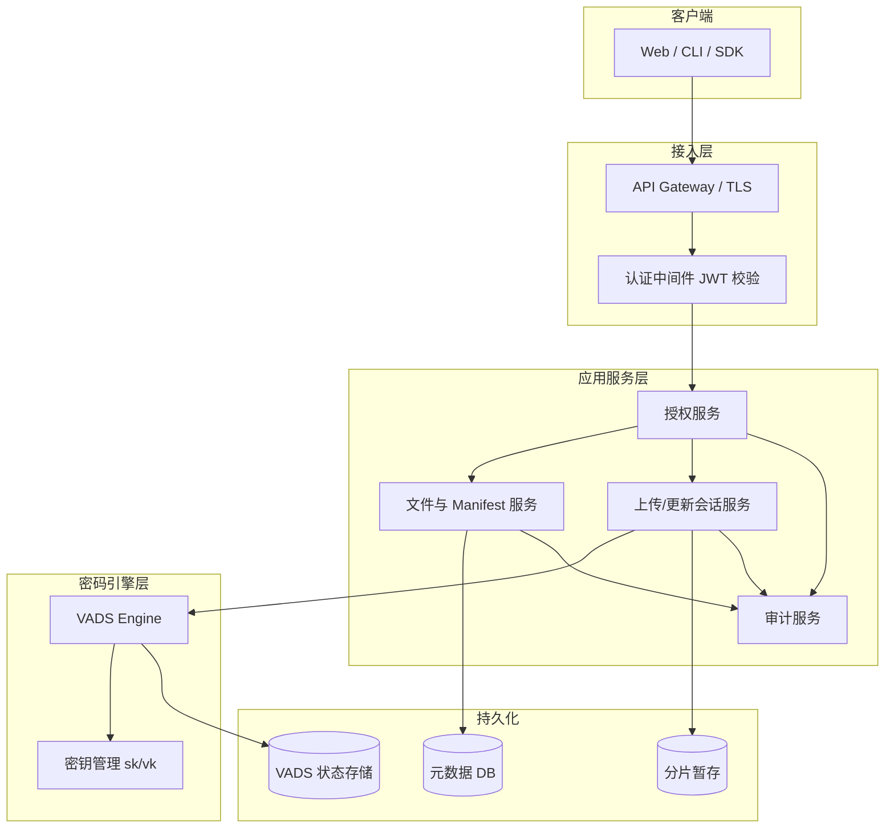

# OVDS 数据托管服务器技术文档

## 一、文档说明

本文档定义基于 OVDS/VADS 的**数据托管服务器**总体架构，涵盖身份认证、ACL 访问控制、多租户隔离、API 设计、密钥管理与审计，并与工程优化方案衔接。本文档**不涉及具体编程语言或实现代码**，仅描述抽象组件、接口与数据契约。

**相关文档**：

| 文档 | 内容 |
|------|------|
| `OVDS协议完整流程.md` | VADS 密码协议 |
| `OVDS实际应用多模态数据方案.md` | 多模态与分块 |
| `OVDS工程优化方案.md` | 并行上传、批量 Update、验证策略 |

**协议边界**：托管服务密码层基于 **VADS 主协议**；独立的 AVDS（q=2 树 + CLVC）子系统不属于本托管服务主路径。

---

## 二、系统定位

### 2.1 托管服务器职责

在**不可信或半可信存储环境**中，为用户提供：

- 多模态文件的可验证托管（完整性、可审计）
- 基于账号/租户的**访问控制**（认证 + 授权）
- 大文件分片上传、下载、版本管理与回退
- 租户级密码学隔离（独立 VADS 实例）

### 2.2 安全边界

```
┌─────────────────────────────────────────────────────────────┐
│  托管服务器负责                                              │
│  · 身份认证（JWT/OIDC）                                      │
│  · ACL / RBAC                                               │
│  · 索引发号、manifest、会话                                   │
│  · 代持密钥、调用 VADS 引擎                                   │
│  · 审计日志                                                  │
├─────────────────────────────────────────────────────────────┤
│  VADS 协议负责                                               │
│  · 分片防篡改（BLS + RSA Accumulator）                        │
│  · 密钥级写入授权（验签）                                     │
├─────────────────────────────────────────────────────────────┤
│  协议不负责                                                  │
│  · 真实身份 ↔ 数据归属（需应用层绑定）                        │
│  · 对服务器隐藏明文（需客户端加密，非当前范围）                 │
└─────────────────────────────────────────────────────────────┘
```

**验签说明**：VADS 写入验签确认的是「签名对当前租户验证密钥合法」，**不等于**识别「哪个自然人提交」；用户归属靠 **JWT `sub` + ACL + 审计** 建立。

---

## 三、总体架构



### 3.1 组件说明

| 组件 | 职责 |
|------|------|
| **API Gateway** | TLS 终结、限流、WAF |
| **认证中间件** | JWT/OIDC 验签、`sub`/`tenant_id` 注入上下文 |
| **授权服务** | RBAC + 资源 ACL，`file_id` 级读写判权 |
| **会话服务** | 上传/更新会话、进度、冲突消解（见工程优化文档） |
| **Manifest 服务** | `file_revision`、`chunk_map`、回退指针 |
| **VADS Engine** | 封装协议操作：Setup / Append / Query / Verify / Update / Audit |
| **KMS** | 租户秘密密钥加密存储、代签、轮换 |
| **元数据 DB** | 用户、租户、文件索引、ACL、会话 |
| **VADS 状态存储** | `DB`、`R`、`Acc_R` 等协议状态持久化 |

---

## 四、多租户与 VADS 实例

### 4.1 隔离模型

**推荐：一租户一 VADS 实例**

```
tenant_id ──→ { verification_key, secret_key_ref, vads_state, index_allocator }
```

| 方案 | 说明 |
|------|------|
| 一租户一实例 | ✅ 推荐：密钥与 `Acc_R` 隔离 |
| 全平台单实例 | 仅 PoC；秘密密钥共享无租户密码学边界 |
| 一用户一实例 | 极强隔离，成本高，合规特殊场景 |

**不需要**每用户一个 Accumulator；Append 不更新 `Acc_R`，租户内共用一个即可。

### 4.2 租户开通

| 步骤 | 操作 |
|------|------|
| 1 | 平台管理员创建租户 |
| 2 | 调用 VADS `Setup`，获得验证密钥与初始协议状态 |
| 3 | 秘密密钥加密写入 KMS；验证密钥写入元数据 |
| 4 | 初始化索引计数器与累加器初始值 |

---

## 五、身份认证

### 5.1 认证方式

| 方式 | 场景 | 说明 |
|------|------|------|
| **OIDC / JWT** | Web、移动端、SaaS | 主推 |
| **mTLS 客户端证书** | 服务间、专线 | 高安全 |
| **API Key + HMAC** | 脚本集成 | 内网或辅助 |

### 5.2 JWT Claims（示例）

```json
{
  "sub": "user-uuid",
  "tenant_id": "tenant-uuid",
  "roles": ["data_owner", "data_reader"],
  "aud": "ovds-hosting-api",
  "exp": 1735689600
}
```

### 5.3 请求上下文

每个受保护 API 在鉴权后注入 **AuthContext**：

| 字段 | 说明 |
|------|------|
| `subject_id` | 主体标识（对应 JWT `sub`） |
| `tenant_id` | 租户标识 |
| `roles` | 角色列表 |
| `session_id` | 可选，关联上传/更新会话 |
| `client_ip` | 客户端 IP |

### 5.4 与 VADS 验签的关系

| 层 | 验证内容 |
|----|----------|
| JWT | 调用者是谁、属哪个租户 |
| ACL | 能否操作该 `file_id` |
| VADS 验签 | 分片密码学是否合法 |

**写入路径**：

```
JWT 通过 → ACL 写权限 → 服务端代签 → VADS Append 验签入库
```

客户端**不持有**租户秘密密钥（推荐）。

---

## 六、访问控制（ACL）

### 6.1 RBAC 角色

| 角色 | Append/上传 | 读/下载 | Update | Delete | Audit |
|------|------------|---------|--------|--------|-------|
| `tenant_admin` | 租户内全部 | 全部 | 全部 | 全部 | 全部 |
| `data_owner` | 自己的文件 | 自己的 | 自己的 | 自己的 | ❌ |
| `data_writer` | 授权写 | 授权读 | 授权写 | ❌ | ❌ |
| `data_reader` | ❌ | 授权读 | ❌ | ❌ | ❌ |
| `auditor` | ❌ | 元数据 | ❌ | ❌ | ✅ |

### 6.2 资源 ACL（`file_id` 级）

```json
{
  "file_id": "f-uuid",
  "tenant_id": "t-uuid",
  "owner_id": "user-uuid",
  "acl": {
    "readers": ["user:a", "role:data_reader"],
    "writers": ["user:a"],
    "auditors": ["role:auditor"]
  }
}
```

### 6.3 授权检查点

| API | 检查 |
|-----|------|
| 创建上传会话 | `writers` 或 `owner` |
| 提交分片 / commit | 会话 `owner == sub` 且写权限 |
| 下载 / query | `readers` 或 `owner` |
| 更新会话 | 写权限 + `base_revision` OCC |
| manifest 回退 | `owner` 或 `tenant_admin` |
| 租户 audit | `auditor` 或 `tenant_admin` |

### 6.4 索引与 ACL

**禁止**客户端任意指定 `vads_index`：

| 操作 | 服务端行为 |
|------|-----------|
| 下载 | `file_id` → 查 manifest → 生成允许的 `vads_index` 列表 → 批量 Query |
| 上传 | 服务端分配 `index_base` + `chunk_index` |

防止越权读他人分片。

---

## 七、数据模型

### 7.1 文件 Manifest

```json
{
  "file_id": "f-uuid",
  "tenant_id": "t-uuid",
  "owner_id": "user-uuid",
  "file_revision": 4,
  "file_hash": "sha256:...",
  "file_size": 1073741824,
  "chunk_size": 1048576,
  "total_chunks": 1024,
  "chunks": [
    {
      "chunk_index": 0,
      "vads_index": 4096,
      "chunk_hash": "sha256:...",
      "chunk_revision": 4
    }
  ],
  "created_at": "2026-01-01T00:00:00Z",
  "supersedes_revision": 3
}
```

### 7.2 上传会话

```json
{
  "session_id": "s-uuid",
  "tenant_id": "t-uuid",
  "owner_id": "user-uuid",
  "file_id": "f-uuid-or-null",
  "op": "create|update",
  "base_file_revision": 3,
  "index_base": 4096,
  "total_chunks": 1024,
  "status": "UPLOADING",
  "commit_seq": null,
  "idempotency_key": "..."
}
```

### 7.3 审计记录

```json
{
  "event_id": "e-uuid",
  "tenant_id": "t-uuid",
  "subject_id": "user-uuid",
  "action": "file.commit|file.read|file.rollback",
  "resource": "file_id",
  "file_revision": 4,
  "result": "success|denied|conflict",
  "timestamp": "ISO8601",
  "client_ip": "..."
}
```

---

## 八、API 设计概要

### 8.1 认证

```
Authorization: Bearer <JWT>
```

### 8.2 文件生命周期

| 方法 | 路径 | 说明 |
|------|------|------|
| POST | `/v1/files/upload-sessions` | 创建上传会话 |
| PUT | `/v1/upload-sessions/{sid}/chunks/{k}` | 上传分片 |
| POST | `/v1/upload-sessions/{sid}/commit` | 提交入库 |
| DELETE | `/v1/upload-sessions/{sid}` | 取消 |
| GET | `/v1/files/{fid}` | 元数据 |
| GET | `/v1/files/{fid}/download` | 下载（分批验证） |
| POST | `/v1/files/{fid}/update-sessions` | 修改会话 |
| POST | `/v1/files/{fid}/rollback` | 回退 revision |
| POST | `/v1/files/{fid}/audit` | 触发审计（auditor） |

### 8.3 下载响应（分批）

```json
{
  "file_id": "f-uuid",
  "file_revision": 4,
  "batches": [
    {
      "batch_id": 0,
      "indices": [4096, 4097],
      "payload_url": "/v1/.../batch/0",
      "verify_mode": "aggregate"
    }
  ],
  "manifest_hash": "sha256:..."
}
```

客户端按批拉取 → 聚合验证（或逐片验证）→ 重组 → 校验 `file_hash`。

| `verify_mode` | 说明 |
|---------------|------|
| `aggregate` | 批量 Query + 批量 Verify（对应协议 Query\* / Verify\*） |
| `single` | 逐片 Query + Verify |

### 8.4 错误码

| HTTP | 含义 |
|------|------|
| 401 | 未认证 |
| 403 | ACL 拒绝 |
| 409 | revision 冲突 / 并发写冲突 |
| 410 | 会话已取消 |
| 422 | 分片校验失败 |

---

## 九、密钥管理

### 9.1 存储

| 密钥 | 存储 | 访问 |
|------|------|------|
| 秘密密钥（含 `α`、索引计数器） | KMS/HSM 加密 | 仅 VADS Engine 代签 |
| 验证密钥 | 元数据 DB，可公开 | 客户端可缓存用于 Verify |

### 9.2 代签流程

| 步骤 | 说明 |
|------|------|
| 1 | VADS Engine 向 KMS 请求解密租户秘密密钥（仅在安全域内） |
| 2 | 对指定 `(vads_index, data_value)` 生成签名与标签 |
| 3 | 返回 `(signature, tag)`，秘密密钥不暴露给 API 层或客户端 |

### 9.3 轮换

| 步骤 | 说明 |
|------|------|
| 1 | 为新密钥对执行 VADS `Setup` |
| 2 | 新写入使用新秘密密钥；旧数据只读验证仍用原验证密钥 |
| 3 | 可选：后台重签迁移 |
| 4 | 索引计数器轮换时须全局衔接，避免索引冲突 |

---

## 十、VADS 引擎抽象接口

### 10.1 租户级引擎（VadsEngine）

每个租户绑定一个引擎实例，对外提供以下抽象操作：

| 操作 | 输入 | 输出 | 说明 |
|------|------|------|------|
| `Setup` | 安全参数 | 验证密钥、初始状态 | 租户开通时一次 |
| `SignBlock` | `index`, `data_value` | `signature`, `tag` | 代签，不暴露秘密密钥 |
| `Append` | `index`, `data_value`, `signature`, `tag` | 成功/失败 | 验签并写入 DB |
| `BatchAppend` | `AppendItem[]` | 成功/失败 | 批量入库 |
| `Query` | `index` | `data_value`, `query_proof` | 单次查询 |
| `QueryBatch` | `index[]` | `data_values[]`, `batch_proof` | 批量查询 |
| `Verify` | `index`, `data_value`, `query_proof` | 通过/拒绝 | 单次验证 |
| `VerifyBatch` | `indices[]`, `data_values[]`, `batch_proof` | 通过/拒绝 | 批量验证 |
| `Update` | `index`, `new_value`, `signature`, `tag` | 成功/失败 | 单条更新 |
| `BatchUpdate` | `UpdateItem[]` | 成功/失败 | 批量更新（累计累加器状态） |
| `Audit` | `index[]` 或全部 | `audit_proof` | 审计证明 |
| `Judge` | `audit_proof` | 通过/拒绝 | 审计评判 |
| `GetAccumulatorState` | — | `Acc_R`, `revoked_tags` | 供验证方使用 |

### 10.2 核心数据结构（抽象）

**AppendItem**

| 字段 | 类型 | 说明 |
|------|------|------|
| `index` | 整数 | VADS 数据项索引 |
| `data_value` | 整数/字节 | 分片编码后的数据项 |
| `signature` | 群元素 | BLS 签名 |
| `tag` | 位串 | 随机标签 |

**UpdateItem**

| 字段 | 类型 | 说明 |
|------|------|------|
| `index` | 整数 | 待更新索引 |
| `new_value` | 整数/字节 | 新数据值 |
| `signature` | 群元素 | 新签名 |
| `tag` | 位串 | 新标签 |

**QueryProof / BatchProof / AuditProof**

协议定义的证明结构，包含签名、标签与 RSA 累加器非成员证明分量；具体字段见 `OVDS协议完整流程.md`。

### 10.3 索引分配服务（IndexAllocator）

与 VADS Engine 配合，租户级原子发号：

| 操作 | 输入 | 输出 |
|------|------|------|
| `Reserve` | `count` | `index_base`（占用 `[base, base+count)`） |
| `Current` | — | 下一可用索引 |

### 10.4 与工程优化衔接

| 能力 | 文档章节 |
|------|----------|
| 索引预占 | 工程优化 §4 |
| 批量 Update 累计 `z*` | 工程优化 §5 |
| 验证策略 | 工程优化 §7 |
| 会话取消/回退 | 工程优化 §6 |

---

## 十一、安全策略

### 11.1 传输与存储

- 全链路 **TLS 1.2+**
- 秘密密钥不出 KMS；日志脱敏
- 分片暂存加密 at-rest（SSE）

### 11.2 限流

| 维度 | 建议 |
|------|------|
| 每 `sub` | 100 req/min |
| 每租户上传 | 并发 session ≤ 10 |
| 单文件 | 并发 chunk 上传 ≤ 16 |

### 11.3 完整性

| 层级 | 机制 |
|------|------|
| 分片 | VADS Verify / VerifyBatch |
| 文件 | manifest `file_hash` |
| 库级 | 定期 Audit + Judge |

### 11.4 数据归属（业务层）

密码学绑定 **租户验证密钥**；文件归属绑定：

| 机制 | 说明 |
|------|------|
| 上传提交 | `owner_id = JWT.sub` |
| 读取 | ACL 检查，仅 owner/readers |
| 审计 | 可追溯谁 commit 了哪一 revision |

---

## 十二、部署参考

### 12.1 最小部署

| 组件 | 数量 |
|------|------|
| API 服务 | 1 |
| VADS Worker | 1 |
| 元数据 DB（如 PostgreSQL） | 1 |
| 缓存/锁（如 Redis） | 1 |
| VADS 状态存储 | 1（本地或 mmap） |

### 12.2 生产部署

| 组件 | 说明 |
|------|------|
| API Gateway | 多实例，无状态 |
| App Service | 多实例 |
| VADS Engine | 按租户分片或共享池 + 租户锁 |
| 元数据 DB | 主从 |
| 缓存/锁 | 集群 |
| KMS | 云 HSM |
| 对象存储 | 可选，分片暂存 |

### 12.3 监控指标

| 指标 | 说明 |
|------|------|
| `append_latency_p99` | 写入延迟 |
| `verify_batch_latency_p99` | 批量验证延迟 |
| `session_commit_success_rate` | 提交成功率 |
| `acl_denied_total` | 越权尝试 |
| `audit_pass_rate` | 审计通过率 |

---

## 十三、典型流程

### 13.1 用户上传 1GB 文件

| 步骤 | 说明 |
|------|------|
| 1 | JWT 登录 |
| 2 | 创建 upload-session（ACL：写） |
| 3 | 服务端预占 `index_base`，返回分片上传地址 |
| 4 | 客户端并行上传分片 |
| 5 | 提交 commit → 并行 Append 入库 → manifest `revision=1` |
| 6 | 审计记录：`file.commit` success |

### 13.2 用户下载并验证

| 步骤 | 说明 |
|------|------|
| 1 | 请求 download（ACL：读） |
| 2 | 服务端返回分批 Query 计划 |
| 3 | 客户端并行拉批 → VerifyBatch（或逐片 Verify） |
| 4 | 重组 → SHA-256 校验 `file_hash` |

### 13.3 并发修改同一文件

| 步骤 | 说明 |
|------|------|
| 1 | 用户 A、B 同时修改同一分片 |
| 2 | 两提交进入 `file_id` 队列 |
| 3 | `commit_seq` 较大者生效（LWW） |
| 4 | 失败者返回 409，附带最新 revision |

---

## 十四、非目标与后续扩展

| 非目标（当前版本） | 后续可扩展 |
|-------------------|-----------|
| 对服务器明文保密 | 客户端加密后 Append |
| 零知识身份 | VC / 可验证凭证 |
| 跨租户联合审计 | 联邦 manifest |
| TEE 远程证明 | 见 vds-vpin 设计方向 |

---

## 十五、文档索引

| 问题 | 查阅 |
|------|------|
| 索引计数器与并行 Append | 工程优化 §4；协议文档 Append 章 |
| `z*` 批量累计 | 工程优化 §5.2 |
| 验签与归属区别 | 本文 §2.2、§5.4 |
| 下载验证策略 | 工程优化 §7 |
| VADS 状态持久化 | `mmap_design.md` |
