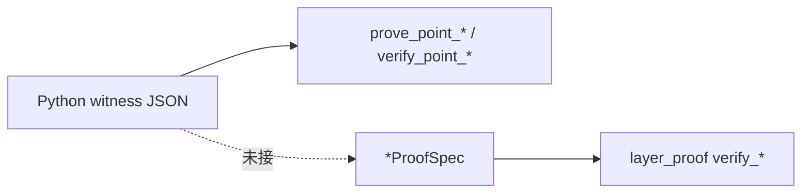

# `layer_proof` 模块说明

> **定稿（优先）：** [`docs/cp-snark-分层证明与RLC设计定稿.md`](../../../../docs/cp-snark-分层证明与RLC设计定稿.md)  
> [C] 路径：标量预检 + gadget 调度草图。**式 (9)(10) 计算**见 [A] `Server.py` `rLCL`/`rLCR`。  
> **关联：** [`各层计算量证明算法-论文对齐.md`](../../../../docs/各层计算量证明算法-论文对齐.md)、[`cp-snark-full-架构草案.md`](../../../../docs/cp-snark-full-架构草案.md)  
> **入口：** `prover_pipeline` · `statement::check`

---

## 1. 本包做什么、不做什么

| 做 | 不做 |
|----|------|
| 标量域 eq7 / eq9 / eq10（**验证侧仅 RLC 式，见设计定稿 §4**） | **不** 生成按层 Spartan π（`mac_proof=None`） |
| 用 `ClientChallenge` 的 **γ / γ′** 做 RLC 预检 | **不** 替代 [A] `Server.py` 推理；**不** 替代 [B] EC gadget verify |
| eq5/eq8 逐格检查 | **仅单测/调试**，非客户端必验 |
| 描述每层应对应的 PtAdd/PtMul **槽位调度** | **不** 从 Python JSON 自动填 Spec（待接） |
| 提供 `ServerLinearProofStack` 整栈代数验证 | **不** 实现 TReLU 服务器证明（论文：客户端） |

**口诀：** `layer_proof` = **witness 是否满足论文 MAC/RLC 等式**；`circuit_prove` + `protocol` = **SNARK 证明生成与验证**。

---

## 2. Verify 与 Proof Generation（勿混）

仓库内存在 **三条管线**，名称都含 verify/proof，职责不同：

```text
[A] Python 同态推理 (cnn_networks/Server.py)
      → rust_files/{network}/pointAdd|pointMult/*.json
      → rLCL/rLCR + assert（服务器自检，pf(sk)，非客户端 SNARK）

[B] layer_proof（本目录）← 你在这里
      → verify_eq5/7/8/9/10：标量 Ok/Err
      → 无 proof_bytes，无 R1CS

[C] circuit_prove + protocol（cp-snark-full 其它模块）
      → prove_point_add / prove_point_mult → SubCircuitProof
      → verifier_run → my_lib_verify（Spartan）
```

| 入口 | 类型 | 输出 |
|------|------|------|
| `layer_proof::verify::*` | 代数预检 | `Result<(), LayerProofError>` |
| `circuit_prove::prove_point_*` | **Proof generation** | `SubCircuitProof { proof_bytes, ... }` |
| `circuit_prove::verify_point_*` | **密码学 Verify** | `Result<(), String>` |
| `protocol::prover_run` | 编排 prove + 承诺 | `ProtocolArtifacts` |
| `protocol::verifier_run` | 编排 verify + digest | `Result<(), String>` |

**当前接线：** `prover_run` / `verifier_run` **未调用** 本模块；`proof_coverage` 默认 `ec_gadget_only`（见 `protocol.rs`）。



---

## 3. 目录与文件职责

| 文件 | 职责 |
|------|------|
| `mod.rs` | 模块导出、总览表 |
| `common.rs` | `LayerProofStage`、`ProofCoverage`、`challenge_for_stage`（γ 分阶段） |
| `rlc.rs` | 验证方 RLC：`fold_rlc`、`conv_rlc_*`、`fc_rlc_*`、`mac_filter_window` |
| `verify.rs` | 各层等式验证函数（核心代数逻辑） |
| `conv.rs` | `ConvLayerProofSpec`、可选 `from_plaintext_conv`、`build_gadget_schedule` |
| `pool.rs` | `PoolLayerProofSpec`、式 (7)、PtAdd 调度 |
| `fc.rs` | `FcLayerProofSpec`、式 (8)(10)、gadget 调度 |
| `gadget.rs` | `PtMulSlot` / `PtAddSlot` / `LayerGadgetSchedule` |
| `stack.rs` | `ServerLinearProofStack::verify_all`（conv → pool → FC[]） |

**无写死 network A：** 无固定 H×W、178/2144、滤波器数值；维数由调用方传入的 `Vec` 长度决定。  
**写死/占位仅见：** 单元测试玩具数据、`build_gadget_schedule` 中 `gamma_placeholder = 1`、`fc` 偏置加的 `augend: 0` 占位。

---

## 4. 形式化：各层参数与输出

模型相关量作为 **各层 `*ProofSpec` 的字段** 由调用方传入；**没有**顶层 `ModelWeights` 自动拆层。层间「上一层输出 = 下一层输入」**不在类型上强制**，需填 Spec 时自行保证一致。

### 4.1 卷积 `ConvLayerProofSpec`

**论文：** 式 (6) MAC；式 (9) 用验证方 **γ** 压缩。

| 字段 | 含义 | 模型参数？ |
|------|------|------------|
| `filter_flat` | 核 $f$，长 $k^2$ | 是（$\mathbf{F}$） |
| `windows` | 每输出格一条窗口，长 $k^2$ | 否（加密输入 witness） |
| `output_flat` | 扁平化 $\hat{a}$，与 `windows` 同序 | 否（服务器声称的同态输出） |

**验证（定稿）：**

- **客户端路径：** 仅 `verify_conv_eq9_rlc`（式 (9)，γ 来自客户端）
- `verify_conv_eq5_per_cell`：**调试/单测**，非必验（eq9 + 随机 γ 已足够）

**挑战：** `ClientChallenge.gamma`（`challenge_for_stage(Convolution, …)`）。

**未包含在 Spec 内：** `stride`、`padding`、通道数；仅 `from_plaintext_conv(padded, filter, stride)` 辅助构造时用到 stride。

### 4.2 平均池化 `PoolLayerProofSpec`

**论文：** 式 (7) 窗口**求和**；$1/\hat{k}^2$ 为公开定点，**在 `verify_eq7` 之外**乘。

| 字段 | 含义 | 模型参数？ |
|------|------|------------|
| `windows` | 池化窗口内上一层 witness | 否 |
| `output_sums` | 同态**求和**结果（缩放前） | 否 |
| `inv_k_squared_fp` | 公开 $1/\hat{k}^2$ 定点 | 否 |

**验证：** `verify_pool_eq7_per_cell`（仅求和，不验缩放）。  
**池化不用 RLC**；`gamma_add` 已映射但 **未参与** 池化 verify。

### 4.3 全连接 `FcLayerProofSpec`

**论文：** 式 (8)；式 (10) 用 **γ′**（`ClientChallenge.gamma_mult`）。

| 字段 | 含义 | 索引 |
|------|------|------|
| `weights_in_out[k][j]` | $W[k,j]$ | 行 = 输入维，列 = 输出维；与 `Server.py` `input @ weight_matrix` 一致 |
| `bias[j]` | $b[j]$ | `len == outputs.len()` |
| `inputs[k]` | $d[k]$ | 上一层激活 |
| `outputs[j]` | $t[j]$（**已含 bias**） | 服务器声称结果 |

**验证：**

- `verify_fc_eq8_per_output`：式 (8)
- `verify_fc_eq10_rlc`：式 (10) + 先过 eq8

**注意：** 未断言 `inputs.len() == weights_in_out.len()`；缺行时按 `0` 处理，可能掩盖填参错误。

### 4.4 整栈 `ServerLinearProofStack`

```rust
pub struct ServerLinearProofStack {
    pub conv: Option<ConvLayerProofSpec>,
    pub pool: Option<PoolLayerProofSpec>,
    pub fc_layers: Vec<FcLayerProofSpec>,  // FC1、FC2 等各一项
}
```

`verify_all(challenge)`：依次调用卷积 eq9、池化 eq7、每层 FC eq10。  
**不含** 激活层；TReLU 在客户端，本包故意无对应类型。

---

## 5. 公开 API 速查

### 5.1 验证（本包唯一的「verify」语义）

```rust
use cp_snark_full::layer_proof::{
    ConvLayerProofSpec, PoolLayerProofSpec, FcLayerProofSpec,
    ServerLinearProofStack, LayerProofError,
};
use cp_snark_full::challenge::ClientChallenge;

// 单层
spec.verify_eq9(&challenge)?;   // 卷积
spec.verify_eq7()?;             // 池化
spec.verify_eq10(&challenge)?;  // FC

// 整栈
stack.verify_all(&challenge)?;
```

等价自由函数：`verify_conv_eq9_rlc`、`verify_pool_eq7_per_cell`、`verify_fc_eq10_rlc`（见 `verify.rs`）。

### 5.2 与 SNARK 的对应关系（目标：按层 π）

| 论文步骤 | 本包现状 | SNARK 侧（定稿） |
|----------|----------|------------------|
| 式 (9) RLC | 标量 `verify_eq9`（预检） | **`π_conv`** in-circuit；**非** `mac_rlc` 桩 |
| 式 (7)(10) | 标量 eq7/eq10 | **`π_pool` / `π_fc`** |
| EC 轨迹 | gadget 调度草图 | 各层 `π_ec` 子块（现仍为 [B] 整批） |

**禁止：** `verify_eq9` 单独当作 SNARK 完成；禁止合并 `mac_rlc`；禁止客户端必验 eq5+eq9 双检。

### 5.3 RLC 与 Python 参考实现的区别

| | 论文 / 本包 | `Server.py` 调试路径 |
|--|-------------|----------------------|
| 随机系数 | $\gamma^i$ from `ClientChallenge` | `pf(secret_key, i)` HMAC |
| 语义 | 验证方随机性（soundness 方向） | 同进程自检 |
| SNARK | 应对应将来的 $\pi_{\mathrm{MAC}}$ | 无，仅 `assert` |

---

## 6. `ProofCoverage` 标签（协议诚实披露）

定义于 `common.rs`，写入 `protocol.json` 的 `proof_coverage` 字段（默认 `ec_gadget_only`）：

| 值 | 含义 |
|----|------|
| `ec_gadget_only` | 仅 PtAdd/PtMul SNARK（当前 `prover_run` 实际行为） |
| `conv_rlc` | + 卷积标量 eq9（算法在本包，未接协议） |
| `pool_add` | + 池化 eq7 |
| `fc_rlc` | + FC eq10 |
| `server_linear_layers` | 上述线性层标量验证全开 |

标签描述**能力声明**；是否真正执行以 `prover_run`/`verifier_run` 代码为准。

---

## 7. 测试

```bash
cd src/cp-snark-full && cargo test layer_proof
```

| 测试 | 覆盖 |
|------|------|
| `conv::tests::conv_eq5_and_eq9_toy` | 卷积 eq5 + eq9 |
| `conv::tests::conv_plaintext_layout_matches_mac` | `from_plaintext_conv` |
| `pool::tests::pool_eq7_toy` | 池化 eq7 + PtAdd 计数 |
| `fc::tests::fc_eq8_eq10_toy` | FC eq8 + eq10 |

---

## 8. 后续接线清单（本包之外）

1. **Witness 填充：** `rust_files/.../pointMult` JSON → `*ProofSpec`（或 u128 标量槽解码）。  
2. **R1CS：** 将 `verify.rs` 中的关系编码为约束，新增 `prove_layer_*`，产出 $\pi_{\mathrm{MAC}}$。  
3. **协议：** `prover_run` 在 `prove_point_*` 前/后调用 `stack.verify_all`；`verifier_run` 验新 π；提升 `proof_coverage`。  
4. **模型绑定（用户曾要求暂缓）：** `cm_W`、L1 等不在本包范围内；百万参数级 Setup/L1′ 见 [`docs/大模型模型承诺优化方案.md`](../../../../docs/大模型模型承诺优化方案.md)。

---

## 9. 修订记录

| 日期 | 说明 |
|------|------|
| 2026-06-04 | 初版：综合参数接口、verify vs prove、模块索引、论文对齐 |
